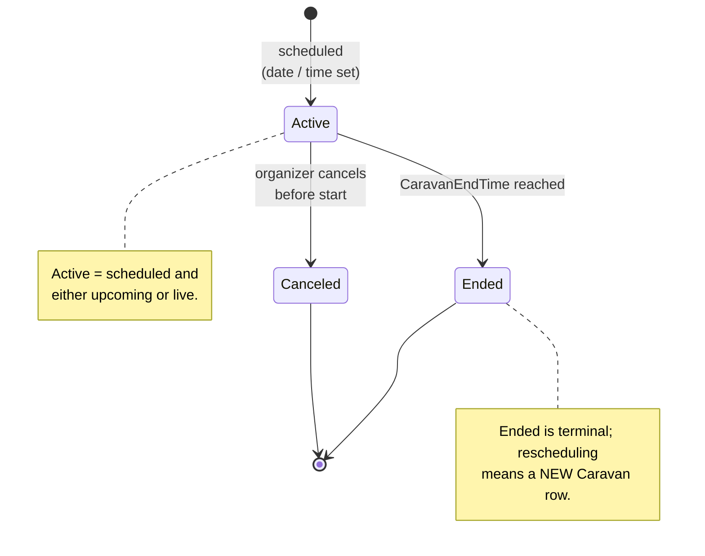
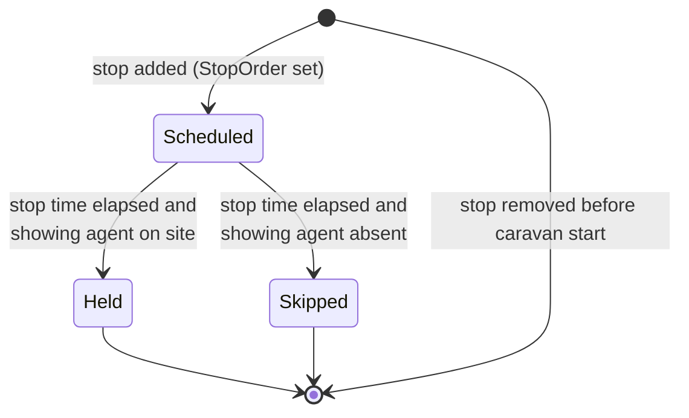

# Caravan lifecycle (canonical, RESO DD 2.0)

How a caravan (a curated tour of multiple listings) is scheduled,
populated with stops, run, and retired, expressed in RESO DD 2.0
vocabulary. Two resources collaborate: `Caravan` (the tour
header) and `CaravanStop` (the per-stop ordered list).

> **Integration links**:
>
> - Source mapping: `Caravan` and `CaravanStop` are not yet in
>   scope of the 6-resource Layer-2 curated set; cross-reference
>   organizing offices via
>   [`../../../data-models/source-mappings/wiki/agent-docs/by_resource/office.md`](../../../data-models/source-mappings/wiki/agent-docs/by_resource/office.md).
> - Sharp-SIR flavour: brokerage caravans appear inside
>   [`../../listing-pipeline.md`](../../listing-pipeline.md) (Active
>   Listing stage marketing tasks).
> - One-stop integrated view (per organizing office):
>   [`../../../integration/wiki/agent-docs/by_resource/office.md`](../../../integration/wiki/agent-docs/by_resource/office.md)

This is the canonical baseline. Project flavours (e.g. lunch,
carpool routing, post-caravan polling) belong in
[`docs/business-processes/`](../../index.md).

## Scope

In scope:

- The `Caravan.CaravanStatus` lifecycle.
- The `Caravan.CaravanType` typology (broker, association, other).
- The `CaravanStop` ordered-list semantics and the relationship
  between a stop and an `OpenHouse` (or a raw `Property`).
- Eligibility gating via `CaravanAllowedStatuses` and
  `CaravanAllowedClassNames`.

Out of scope:

- Open-house mechanics (see [`open-house-lifecycle.md`](open-house-lifecycle.md)).
- Listing status (see [`listing-lifecycle.md`](listing-lifecycle.md)).

## Primary state machine: `Caravan.CaravanStatus`

`CaravanStatus` is a closed RESO lookup with three values:
`Active`, `Canceled`, `Ended`.

`CaravanStatus` lookup values: `Active`, `Canceled`, `Ended`.

### Transition table

| From | To | Trigger | Required field changes |
|---|---|---|---|
| `[*]` | `Active` | Caravan scheduled | `CaravanKey`, `CaravanName`, `CaravanDate`, `CaravanStartTime`, `CaravanEndTime`, `CaravanType`, `CaravanStatus = Active`, `CaravanOrganizerKey`, `CaravanOrganizerResourceName`, `CaravanAllowedStatuses` |
| `Active` | `Canceled` | Cancel before `CaravanStartTime` | `CaravanStatus = Canceled`, `ModificationTimestamp` |
| `Active` | `Ended` | `CaravanEndTime` reached | `CaravanStatus = Ended`, `ModificationTimestamp` |

The canonical baseline does NOT model "reschedule" as a transition;
a rescheduled caravan is a new `Caravan` row with the original
moved to `Canceled`.

## Secondary state: `Caravan.CaravanType`

`CaravanType` partitions audience and organizer.

| Value | Audience | Organizer |
|---|---|---|
| `Broker` | Brokerage members | A brokerage office (`OfficeKey`) |
| `Association` | AOR members | A REALTOR association (`AssociationKey`) |
| `Other` | Custom audience | Anyone (project-encoded) |

`CaravanOrganizerResourceName` declares which RESO resource
`CaravanOrganizerKey` points to (`Office`, `Member`, `Association`,
or other).

## `CaravanStop` (per-stop ordered list)

A `CaravanStop` is one entry on the caravan's route. Each stop is
ordered by `StopOrder`, and may either anchor onto a pre-existing
`OpenHouse` (broker-only / public) or onto a raw `Property` whose
listing is in an `Active` state.

The canonical baseline does NOT publish a closed status lookup on
`CaravanStop` (RESO does not). The "Held" / "Skipped" / "Removed"
distinction is implicit from the presence of a
`StopShowingAgentKey` and the timing of `StopStartTime` /
`StopEndTime` relative to the parent `Caravan.CaravanEndTime`.

| Field | Role |
|---|---|
| `CaravanStopKey`, `StopKey` | PK / human ID |
| `CaravanKey` | FK to parent `Caravan` |
| `StopOrder` | Position in the route (1, 2, 3, ...) |
| `StopId` | Reference to the stop target; semantics from `StopResourceName` |
| `StopResourceName` | What `StopId` points to (`OpenHouse`, `Property`, etc.) |
| `StopClassName` | Property class when `StopResourceName = Property` |
| `StopDate` | Date of the stop |
| `StopStartTime`, `StopEndTime` | Time window |
| `StopShowingAgentKey`, `StopShowingAgentMlsId` | Who hosts the stop |
| `StopAttendedBy` | Free-text attendance roster |
| `StopRefreshments` | Free-text |
| `StopRemarks` | Free-text |

`StopOrder` MUST be unique per `CaravanKey`. Re-ordering is allowed
during the `Active` phase; once `Caravan.CaravanStatus = Ended`,
re-ordering is a hard error in any consumer.

## Eligibility gating

The header carries two filters that constrain which listings may
appear as stops:

- `CaravanAllowedStatuses` (open lookup, multi-value): the set of
  `Property.StandardStatus` values eligible for inclusion. The
  canonical baseline RECOMMENDS `Active` and (for `Broker`-typed
  caravans) `Coming Soon`.
- `CaravanAllowedClassNames` (open lookup, multi-value): the set
  of `Property.ClassName` values eligible. Project-encoded.

A consumer that adds a stop pointing to a listing MUST verify the
listing's `StandardStatus` and class against these two filters
before insert.

## Decision points

| Decision | Inputs | Outputs |
|---|---|---|
| `Broker` / `Association` / `Other` | Audience and organizer | `CaravanType` |
| Recurring caravan? | Weekly / monthly tour | `CaravanDaysRecurring` set |
| Strict input deadline? | Listings frozen N hours before start | `CaravanInputDeadlineTimestamp`, `CaravanInputDeadlineDescription` |
| Cancel vs end early | Was the tour run at all? | `Canceled` if cut before start; `Ended` if it ran (full or partial) |
| Stop on `OpenHouse` vs raw `Property` | Is the listing being shown via a broker open house? | `StopResourceName = OpenHouse` if yes, else `Property` |

## Cross-resource interactions

- A `CaravanStop` whose `StopResourceName = OpenHouse` references
  an `OpenHouse` row that MUST be `OpenHouseStatus = Active`. See
  [`open-house-lifecycle.md`](open-house-lifecycle.md).
- A `CaravanStop` whose `StopResourceName = Property` references a
  listing whose `Property.StandardStatus` is in
  `Caravan.CaravanAllowedStatuses`. See
  [`listing-lifecycle.md`](listing-lifecycle.md).
- `CaravanOrganizerKey` typically resolves to an `Office` or
  `Association`; see
  [`office-onboarding.md`](office-onboarding.md). For
  `Member`-organized caravans the FK points to `Member`; see
  [`member-onboarding.md`](member-onboarding.md).
- Every `CaravanStatus` change emits a `HistoryTransactional` row.
  Per [`transaction-lifecycle.md`](transaction-lifecycle.md), use
  `ResourceName = Office` (the closest enclosing parent) and
  `ResourceRecordKey =` the organizer's office key when the
  organizer is a member or office; for `Association`-organized
  caravans, use `ResourceName = Association`.

## Identifier semantics

- `CaravanKey` is the immutable opaque PK.
- `CaravanStopKey` is the per-stop PK; `StopKey` is the human ID.
- `StopId` is the FK whose target is governed by
  `StopResourceName`; once written, neither field is rewritten in
  place - removing the stop and inserting a new one is the
  canonical change.
- `OriginatingSystemKey` / `SourceSystemKey` carry federation
  identifiers when the row was syndicated.

## Non-goals

- No opinion on lunch logistics (`CaravanStartLocationRefreshments`
  is a free-text field).
- No opinion on carpool / route routing.
- No opinion on post-caravan voting / polling - project flavour.
- No opinion on intra-team caravans - those are project-encoded
  variants of `CaravanType = Broker`.

<!-- reso-citations
Resource: Caravan
Resource: CaravanStop
Resource: OpenHouse
Resource: Property
Field: Caravan.CaravanKey
Field: Caravan.CaravanName
Field: Caravan.CaravanStatus
Field: Caravan.CaravanType
Field: Caravan.CaravanDate
Field: Caravan.CaravanStartTime
Field: Caravan.CaravanEndTime
Field: Caravan.CaravanDaysRecurring
Field: Caravan.CaravanBlackoutDates
Field: Caravan.CaravanInputDeadlineTimestamp
Field: Caravan.CaravanInputDeadlineDescription
Field: Caravan.CaravanOrganizerKey
Field: Caravan.CaravanOrganizerMlsId
Field: Caravan.CaravanOrganizerName
Field: Caravan.CaravanOrganizerResourceName
Field: Caravan.CaravanOrganizerContactInfo
Field: Caravan.CaravanAllowedStatuses
Field: Caravan.CaravanAllowedClassNames
Field: Caravan.CaravanAreaDescription
Field: Caravan.CaravanRemarks
Field: Caravan.CaravanStartLocation
Field: Caravan.CaravanStartLocationGiveaways
Field: Caravan.CaravanStartLocationRefreshments
Field: Caravan.CaravanPolicyUrl
Field: Caravan.CancellationPolicyUrl
Field: Caravan.OriginalEntryTimestamp
Field: Caravan.ModificationTimestamp
Field: Caravan.OriginatingSystemKey
Field: Caravan.SourceSystemKey
Field: CaravanStop.CaravanStopKey
Field: CaravanStop.StopKey
Field: CaravanStop.StopId
Field: CaravanStop.CaravanKey
Field: CaravanStop.StopOrder
Field: CaravanStop.StopResourceName
Field: CaravanStop.StopClassName
Field: CaravanStop.StopDate
Field: CaravanStop.StopStartTime
Field: CaravanStop.StopEndTime
Field: CaravanStop.StopShowingAgentKey
Field: CaravanStop.StopShowingAgentMlsId
Field: CaravanStop.StopShowingAgentFirstName
Field: CaravanStop.StopShowingAgentLastName
Field: CaravanStop.StopAttendedBy
Field: CaravanStop.StopRefreshments
Field: CaravanStop.StopRemarks
Field: CaravanStop.OriginalEntryTimestamp
Field: CaravanStop.ModificationTimestamp
Field: CaravanStop.OriginatingSystemKey
Field: CaravanStop.SourceSystemKey
LookupValue: CaravanStatus.Active
LookupValue: CaravanStatus.Canceled
LookupValue: CaravanStatus.Ended
LookupValue: CaravanType.Broker
LookupValue: CaravanType.Association
LookupValue: CaravanType.Other
-->
