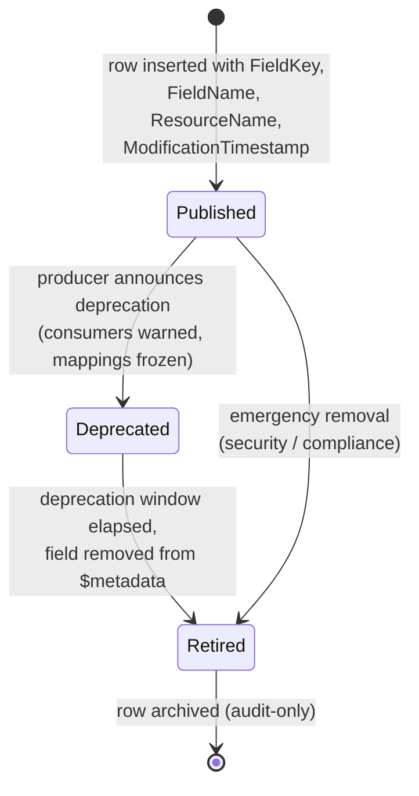
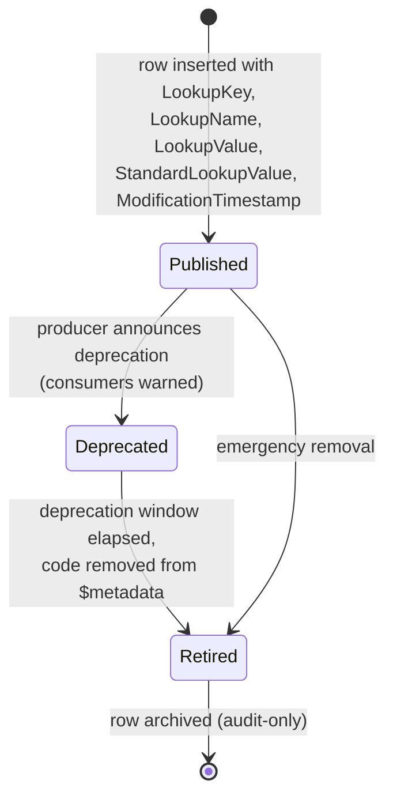

# Field and lookup metadata publication (canonical, RESO DD 2.0)

How a server's RESO `Field` and `Lookup` metadata is published,
versioned, deprecated, and retired. This is the canonical contract
for OData / Web API metadata changes that downstream consumers,
mappers, and audit logs depend on. `Field` and `Lookup` rows are
the runtime catalogue of what columns and code values a server
exposes.

> **Integration links**:
>
> - Source mapping (per resource):
>   [`../../../data-models/source-mappings/wiki/agent-docs/by_resource/field.md`](../../../data-models/source-mappings/wiki/agent-docs/by_resource/field.md),
>   [`../../../data-models/source-mappings/wiki/agent-docs/by_resource/lookup.md`](../../../data-models/source-mappings/wiki/agent-docs/by_resource/lookup.md).
> - Sharp-SIR flavour: no project SOP yet — promote one under
>   `docs/business-processes/` when SIR codifies metadata
>   governance, deprecation windows, and consumer notifications.

This is the canonical baseline. Project flavours (release cadence,
deprecation windows, governance ownership) belong in
[`docs/business-processes/`](../../index.md).

## Scope

In scope:

- The `Field` row lifecycle (publish -> deprecate -> retire).
- The `Lookup` row lifecycle (publish -> deprecate -> retire) for
  individual lookup values (`LookupName` + `LookupValue`).
- The compatibility contract that consumer code MUST honour.
- Cross-references with `HistoryTransactional` (for field-level
  audit) and with the source-mappings catalogue.

Out of scope:

- The OData/Web API endpoint layer (transport-specific).
- Project-flavoured deprecation windows and SLAs.
- Server-side change-management tooling.

## Primary state machine: `Field` row

`Field` does not publish a closed `Status` lookup. The canonical
baseline models the metadata-publication lifecycle explicitly so
that consumers have a single, stable contract. State is encoded in
the producer's release notes and (where present) in custom status
columns; it is NOT encoded in the RESO-standard `Field` row itself.



### Transition table

| From | To | Trigger | Required field changes |
|---|---|---|---|
| `[*]` | `Published` | New column or replacement column ships in $metadata | `FieldKey`, `FieldName`, `ResourceName`, `ModificationTimestamp` |
| `Published` | `Deprecated` | Producer announces removal | `ModificationTimestamp` bumped; release notes updated; consumers informed via the source-mappings catalogue |
| `Deprecated` | `Retired` | Deprecation window elapsed | Row removed from $metadata; `HistoryTransactional` row emitted with `ChangeType = Deleted` and the resource scoped to `Field` |
| `Published` | `Retired` | Emergency removal (security, compliance) | Row removed without a deprecation window; producer publishes an out-of-band advisory |

### Decision points

| Decision | Inputs | Outputs |
|---|---|---|
| Publish | New column shipped | Insert `Field` row with `FieldKey`, `FieldName`, `ResourceName` |
| Deprecate | Replacement field exists OR field is provably unused | Mark row deprecated in producer release notes; freeze mapping in [`source-mappings`](../../../data-models/source-mappings/) |
| Retire | Deprecation window elapsed | Remove row from $metadata; emit audit |
| Reissue | Producer reverses a deprecation | Republish row with the same `FieldKey` (preferred); a new `FieldKey` is permitted only when semantics change |

## Primary state machine: `Lookup` row

`Lookup` rows describe one code value within a named lookup
(`LookupName` + `LookupValue`). The lifecycle mirrors `Field`.



### Transition table

| From | To | Trigger | Required field changes |
|---|---|---|---|
| `[*]` | `Published` | New code value ships | `LookupKey`, `LookupName`, `LookupValue`, `StandardLookupValue`, `ModificationTimestamp` |
| `Published` | `Deprecated` | Producer announces removal | `ModificationTimestamp` bumped; consumer notification path runs |
| `Deprecated` | `Retired` | Deprecation window elapsed | Row removed; `HistoryTransactional` row emitted with `ChangeType = Deleted` and resource scoped to `Lookup` |
| `Published` | `Retired` | Emergency removal | Row removed without a deprecation window |

### Standard vs custom values

`StandardLookupValue` distinguishes RESO-standard codes from
producer-custom extensions. The canonical baseline RECOMMENDS:

- A producer SHOULD prefer a RESO-standard `LookupValue` whenever
  one exists for the desired semantics.
- Custom values MUST carry `LegacyODataValue` (when the producer
  has retired a prior custom value for the same concept) and
  SHOULD NOT collide with RESO-standard names.

## Compatibility contract for consumers

A canonical consumer of RESO metadata MUST:

1. Treat `FieldKey` and `LookupKey` as opaque, stable identifiers
   for as long as the row is `Published` or `Deprecated`.
2. Tolerate unknown fields and lookup values gracefully (forward
   compatibility): a previously-unknown `LookupValue` MUST NOT
   crash a consumer.
3. Surface deprecation warnings to operators when a known field or
   lookup transitions to `Deprecated`.
4. Stop relying on a `Retired` row by the end of the deprecation
   window.
5. Re-resolve `Field.FieldKey` references on every metadata refresh
   — never cache the row body without an associated
   `ModificationTimestamp` check.

## Cross-resource interactions

- Every `HistoryTransactional` field-level row carries `FieldKey`
  or `FieldName`. Per
  [`history-and-audit-log.md`](history-and-audit-log.md), consumers
  resolve `FieldKey -> Field.FieldKey`. A retired `Field` row MUST
  remain resolvable as an audit-only artefact for as long as
  history rows reference it.
- The source-mappings catalogue under
  [`../../../data-models/source-mappings/`](../../../data-models/source-mappings/)
  is the canonical consumer of this lifecycle: every `Published`
  field has at most one mapping per source system; every
  `Deprecated` field has its mapping marked frozen; every
  `Retired` field has its mapping removed.
- `Lookup` deprecations propagate to every canonical process that
  cites the lookup in question — see the per-process
  `<!-- reso-citations -->` blocks.

## Identifier semantics

- `Field.FieldKey` is opaque and stable for the lifetime of a
  field's semantic definition.
- `Field.FieldName` is the OData column name for the field's
  `ResourceName`; it MAY be reused after a field has been
  `Retired` for a full deprecation window, but the canonical
  baseline RECOMMENDS against it.
- `Lookup.LookupKey` is opaque and stable; `LookupName` is the
  RESO-standard lookup name (e.g. `ChangeType`, `RoomType`).
- `Lookup.StandardLookupValue` is non-empty for RESO-standard
  values and SHOULD be empty for producer-custom values.
- `Lookup.LegacyODataValue` carries any prior OData value the
  producer has retired in favour of the current `LookupValue`.

## Non-goals

- No opinion on a producer's release cadence.
- No opinion on the length of the deprecation window.
- No opinion on consumer notification channels.
- No opinion on schema diff tooling.

## Atlas implementation

Implementation contract for builders (human or AI) wiring the
metadata catalogue (`/mls/admin/metadata`) into Atlas.

### Provisioning status

Both resources are unprovisioned in CDL today.

| Resource | Status | CDL table | `mls-sync` resource key | Backend gap |
|---|---|---|---|---|
| `Field` | Gate as Coming Soon | not provisioned | none | matrix-platform-foundation: provision `public.field`; add `field` mapper to `SYNC_RESOURCES` |
| `Lookup` | Gate as Coming Soon | not provisioned | none | matrix-platform-foundation: provision `public.lookup`; add `lookup` mapper |

Ship the `/mls/admin/metadata` route behind a clear "Coming
soon — CDL backend pending" empty state. The catalogue is
operator-visibility only; it does NOT replace any runtime path
described below.

### Existing runtime metadata path (do not displace)

`<ResoFieldLabel>` and `<ResoLookupValue>` already source their
labels and tooltips from the `reso-dd-descriptions` Edge
Function (CDL project). That cache will continue to serve Atlas
labels regardless of whether `public.field` / `public.lookup`
exist:

```ts
import { invokeCdl } from '@/lib/edge-functions';

const result = await invokeCdl('reso-dd-descriptions', {
  // payload shape per src/hooks/useResoDdDescriptions.ts
});
```

When `public.field` / `public.lookup` land, the catalogue page
adds operator visibility and a "Refresh metadata cache" button
that invalidates the in-app cache. It does NOT replace the EF.

### Reads (once provisioned)

For paged catalogue browsing, use `useCdlTablePage` from
`src/hooks/useMlsData.ts` with `table: 'field'` or
`table: 'lookup'`. Group the Lookups tab by `lookup_name` in the
view layer.

### Writes

The catalogue is READ-ONLY in Atlas. The `mls-sync` EF MUST
refuse `upsert-resource` and `delete-resource` for non-
`system_admin` callers on `field` / `lookup` — these are
producer-side governance surfaces, not operator-editable.

### History emission contract

When the producer transitions a `Field` or `Lookup` row from
`Published` -> `Deprecated` -> `Retired`, it MUST write a
`public.history_transactional` row scoped to the metadata
resource:

- `ResourceName = 'Field'` or `'Lookup'`
- `ResourceRecordKey = field_key` or `lookup_key`
- `ChangeType = 'Deleted'` on retirement; field-level rows
  (no `ChangeType`) for any other lifecycle metadata mutations.

Per [`history-and-audit-log.md`](history-and-audit-log.md), the
producer EF emits this row in the same transaction as the
metadata mutation. The Atlas catalogue page does not call the
emit path itself.

<!-- reso-citations
Resource: Field
Resource: Lookup
Resource: HistoryTransactional
Field: Field.FieldKey
Field: Field.FieldName
Field: Field.ResourceName
Field: Field.ModificationTimestamp
Field: Lookup.LookupKey
Field: Lookup.LookupName
Field: Lookup.LookupValue
Field: Lookup.StandardLookupValue
Field: Lookup.LegacyODataValue
Field: Lookup.ModificationTimestamp
Field: HistoryTransactional.FieldKey
Field: HistoryTransactional.FieldName
Field: HistoryTransactional.ResourceName
Field: HistoryTransactional.ChangeType
LookupValue: ChangeType.Deleted
-->
