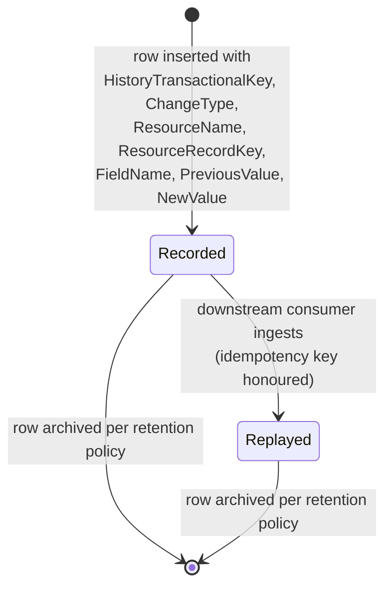

# History and audit log (canonical, RESO DD 2.0)

The append-only `HistoryTransactional` resource is the canonical
audit log for every per-row state change emitted across RESO
resources. It is treated by other processes as a side-effect; this
doc promotes it to a first-class subject and codifies which
transitions MUST emit a history row, what fields the row carries,
and how the audit stream is replayed downstream.

> **Integration links**:
>
> - Source mapping (Dash / Qobrix / SIR -> RESO HistoryTransactional):
>   [`../../../data-models/source-mappings/wiki/agent-docs/by_resource/history_transactional.md`](../../../data-models/source-mappings/wiki/agent-docs/by_resource/history_transactional.md).
> - Sharp-SIR flavour: no project SOP yet — promote one under
>   `docs/business-processes/` when SIR codifies retention,
>   replay tooling, and operator UX for the audit stream.

This is the canonical baseline. Project flavours (retention,
ownership, replay tooling) belong in
[`docs/business-processes/`](../../index.md).

## Scope

In scope:

- `HistoryTransactional` row emission contract (what triggers a
  row, what fields are required, idempotency).
- The `ChangeType` typology — i.e. which canonical transitions map
  to which `ChangeType` values.
- The `ResourceName` scope — which RESO resources MUST emit history
  rows, and the per-resource `ResourceRecordKey` semantics.
- Replay semantics for downstream consumers.

Out of scope:

- Per-event consumer analytics (see
  [`internet-tracking-and-engagement.md`](internet-tracking-and-engagement.md)).
- Field/Lookup metadata changes (see
  [`field-and-lookup-metadata-publication.md`](field-and-lookup-metadata-publication.md)).
- Logical-time sequencing for resource-row writes — that is
  `EntityEvent` (also covered in the tracking doc).

## Primary state machine: `HistoryTransactional` row

`HistoryTransactional` does not publish a closed status lookup. The
audit stream is append-only. The per-row "lifecycle" is the
emission contract from a producer transition to a consumer replay,
not a status field on the row itself.



### Transition table

| From | To | Trigger | Required field changes |
|---|---|---|---|
| `[*]` | `Recorded` | Producer commits a state change on a tracked resource row | `HistoryTransactionalKey`, `ResourceName`, `ResourceRecordKey` (or `ResourceRecordID`), `ChangeType`, `FieldName` (or `FieldKey`), `PreviousValue`, `NewValue`, `ChangedByMemberKey`, `ModificationTimestamp`, originating-system identifiers |
| `Recorded` | `Replayed` | Downstream consumer processes the row | consumer-side checkpoint advances; row is unchanged |
| `Recorded` / `Replayed` | `[*]` | Retention window elapsed | row archived/removed per project policy |

## Producer contract: who emits what

The canonical baseline REQUIRES the following producer-side
emissions. Each row carries `ResourceName` (the parent resource
being audited) and `ResourceRecordKey` (the parent's PK).

| Process | `ResourceName` | `ResourceRecordKey` | Trigger emitting `ChangeType` |
|---|---|---|---|
| [`listing-lifecycle.md`](listing-lifecycle.md) | `Property` | `Property.ListingKey` | Status transitions: `New Listing`, `Active`, `Active Under Contract`, `Pending`, `Closed`, `Coming Soon`, `Hold`, `Withdrawn`, `Canceled`, `Expired`, `Back On Market`; price write -> `Price Change`; `mls_status` set to inactive -> `Deleted` |
| [`transaction-lifecycle.md`](transaction-lifecycle.md) | `Property` | `Property.ListingKey` | Same `ChangeType` typology, scoped to transaction transitions (`Pending`, `Closed`, etc.) |
| [`media-lifecycle.md`](media-lifecycle.md) | `Property` | parent `Property.ListingKey` | Insert / replace / soft-retire on `Media` rows -> `Object Modified` (logged via tracking) and a `Property`-scoped `HistoryTransactional` for the parent timestamp |
| [`open-house-lifecycle.md`](open-house-lifecycle.md) | `Property` | `Property.ListingKey` | Insert / cancel of `OpenHouse` rows |
| [`showing-lifecycle.md`](showing-lifecycle.md) | `Property` | `Property.ListingKey` | Insert / status change of `Showing` rows |
| [`member-lifecycle.md`](member-lifecycle.md) | `Member` | `Member.MemberKey` | License or status changes |
| [`office-lifecycle.md`](office-lifecycle.md) | `Office` | `Office.OfficeKey` | Status changes |
| [`team-lifecycle.md`](team-lifecycle.md) | `Member` (per-team membership tracked under `Member` scope) | `Member.MemberKey` | Team join / leave events (project flavour MAY route them under a custom `ResourceName`; the canonical baseline RECOMMENDS `Member`) |
| [`property-detail-attachment-lifecycle.md`](property-detail-attachment-lifecycle.md) | `Property` | parent `Property.ListingKey` | Insert / update / delete of any `PropertyRooms`, `PropertyUnitTypes`, `PropertyGreenVerification`, `PropertyPowerProduction`, `PropertyPowerStorage` row |
| [`prospecting-and-saved-search-delivery.md`](prospecting-and-saved-search-delivery.md) | `Contacts` | `Contacts.ContactKey` | Insert / update of `Prospecting`, `ContactListings`, `ContactListingNotes` rows |
| [`lead-contact-lifecycle.md`](lead-contact-lifecycle.md) | `Contacts` | `Contacts.ContactKey` | `ContactStatus` transitions |

`ResourceName` lookup values cited by the canonical baseline:
`Property`, `Member`, `Office`, `Contacts`, `Association`. Project
flavours MAY add custom strings, but consumers MUST tolerate
unknown values gracefully.

## `ChangeType` typology

`ChangeType` is a closed RESO lookup. It overloads two axes:
listing-status transitions and generic mutation events. The
canonical baseline cites:

| Group | Values |
|---|---|
| Listing status (per [`listing-lifecycle.md`](listing-lifecycle.md)) | `New Listing`, `Active`, `Active Under Contract`, `Pending`, `Closed`, `Coming Soon`, `Hold`, `Withdrawn`, `Canceled`, `Expired`, `Back On Market` |
| Field-level mutation | `Price Change` |
| Tombstone | `Deleted` |

Producers SHOULD prefer the most specific `ChangeType` available.
For non-listing resources where no status transition applies, the
canonical baseline RECOMMENDS using the field-level path:
`ChangeType` left null (when permitted by the source system)
combined with a precise `FieldName` / `FieldKey`, `PreviousValue`,
and `NewValue` triple.

## Idempotency contract

The canonical baseline REQUIRES that re-processing the same source
event MUST NOT create a duplicate `HistoryTransactional` row. The
recommended uniqueness key is, in order of preference:

1. `(OriginatingSystemName, OriginatingSystemHistoryKey)`
2. `(SourceSystemName, SourceSystemHistoryKey)`
3. `HistoryTransactionalKey`

Producers MUST populate at least one of those tuples on every row.

## Field-level vs row-level rows

| Mode | When to use | Required fields |
|---|---|---|
| Row-level | Status transitions on the parent resource (`ChangeType` is set) | `ResourceName`, `ResourceRecordKey`, `ChangeType`, `ChangedByMemberKey`, `ModificationTimestamp` |
| Field-level | Any other mutation worth auditing | All of the above plus `FieldKey` / `FieldName`, `PreviousValue`, `NewValue` |

Field-level rows MAY use either `FieldKey` (preferred when the
producer publishes a `Field` resource) or `FieldName`. Consumers
SHOULD resolve `FieldKey -> Field.FieldKey` per
[`field-and-lookup-metadata-publication.md`](field-and-lookup-metadata-publication.md).

## Consumer contract: replay

A downstream consumer MUST be able to:

1. Order rows by `ModificationTimestamp` for a wall-clock view.
2. Order rows by `EntityEventSequence` (when populated) for
   logical-time replay; the canonical baseline RECOMMENDS preferring
   `EntityEventSequence` whenever available, since wall clocks may
   skew across producers.
3. Honour the idempotency tuple above on re-ingest.
4. Survive unknown `ChangeType` values (forward compatibility).

## Cross-resource interactions

- Every canonical lifecycle process (listing, transaction, media,
  open house, showing, member, office, team, lead/contact,
  property-detail attachments, prospecting) emits one or more
  `HistoryTransactional` rows on every transition listed in its own
  state machine.
- `HistoryTransactional.EntityEventSequence` is populated when the
  producer supports logical-time sequencing — see
  [`internet-tracking-and-engagement.md`](internet-tracking-and-engagement.md).
- `HistoryTransactional.FieldKey` resolves to a published
  [`Field`](field-and-lookup-metadata-publication.md) row.
- `HistoryTransactional.ChangedByMemberKey` resolves to a
  [`Member`](member-lifecycle.md) row.

## Identifier semantics

- `HistoryTransactionalKey` is the per-row PK.
- `(OriginatingSystemName, OriginatingSystemHistoryKey)` is the
  producer-system identity.
- `ResourceRecordKey` is the parent row's PK; `ResourceRecordID` is
  the parent row's natural ID (e.g. `ListingId`).
- `EntityEventSequence` (when populated) is monotonic per
  `(ResourceName, ResourceRecordKey)`.

## Non-goals

- No opinion on retention windows.
- No opinion on archival storage or compaction.
- No opinion on tooling for replay or backfill.
- No opinion on whether `ChangeType` may be extended with custom
  values — the canonical baseline cites only RESO-published values.

## Atlas implementation

Implementation contract for builders (human or AI) wiring the
audit-log explorer (`/mls/history`) and the embeddable
`RecentActivity` panel into Atlas.

### Provisioning status

| Resource | Status | CDL table | `mls-sync` resource key |
|---|---|---|---|
| `HistoryTransactional` | Ship now (read-only) | `public.history_transactional` | `history` (read via `list-resource`; append-only writes only by `system_admin`) |

### Reads

The viewer is READ-ONLY. There are two read paths:

```ts
// 1. Anonymous tenant-scoped read (preferred for the embeddable
//    RecentActivity panel and most filtered views).
const { data, error } = await cdlAnonClient
  .from('history_transactional')
  .select('*')
  .eq('resource_name', 'Property')
  .eq('resource_record_key', listingKey)
  .order('entity_event_sequence', { ascending: false, nullsFirst: false })
  .order('modification_timestamp', { ascending: false })
  .limit(10);

// 2. Admin-scoped read via the EF (used by the global /mls/history
//    explorer when the operator wants free-text search across the
//    fields below).
await invokeCdl('mls-sync', {
  action: 'list-resource',
  resource: 'history',
  q: searchTerm,                 // searches resource_name,
                                 // resource_record_id, field_name,
                                 // change_type
  page,
  pageSize,
});
```

Sort key per the canonical contract: `entity_event_sequence DESC`
when populated, fallback to `modification_timestamp DESC`. Use
the two-`order` pattern above so PostgREST emits the right SQL.

### Writes

Atlas writes nothing here directly. Every other canonical
process that mutates a tracked resource MUST emit one or more
`history_transactional` rows server-side, in the same
transaction as its `upsert-resource` / `delete-resource` call.
This is a producer-side guarantee, not an audit-viewer
responsibility.

The `mls-sync` EF refuses `upsert-resource` and
`delete-resource` against `resource: 'history'` for non-
`system_admin` callers; the table is `appendOnly: true` in
`SYNC_RESOURCES`.

### Embeddable panel — `RecentActivity` component contract

The same panel used by `/mls/history`'s right inspector is also
embedded into every record-detail page. The component prop
shape (vendor-neutral, so any builder reproduces the same
contract):

```tsx
<RecentActivity
  resourceName="Property"             // RESO ResourceName lookup
  resourceRecordKey={listingKey}      // parent row PK
  limit={10}                           // optional, default 10
/>
```

Rendering rules (hard requirements):

- Sort: `entity_event_sequence DESC`, fallback
  `modification_timestamp DESC`.
- Each row shows `change_type` as a status pill via
  `<ResoLookupValue lookup="ChangeType" value={r.change_type} />`.
  Unknown values render as `Unknown: <raw>` (forward
  compatibility).
- For field-level rows (no `change_type`): show
  `field_name` (resolved through `<ResoFieldLabel>` when
  `field_key` matches a known field), then a side-by-side
  `previous_value` / `new_value` diff.
- `changed_by_member_key` resolves to a Member chip when
  possible; otherwise render the raw key.
- The panel is read-only — no edit/delete actions.

### Tables and columns

`public.history_transactional` (post-Wave-3 strict schema):

- PK: `id`. Tenant scope: `originating_system_name`. The
  legacy `source_id` column was dropped in Wave-3.
- RESO fields: `resource_name`, `resource_record_key`,
  `resource_record_id`, `class_name`, `change_type`,
  `changed_by_member_key`, `changed_by_member_id`, `field_key`,
  `field_name`, `previous_value`, `new_value`,
  `entity_event_sequence`, `modification_timestamp`,
  `originating_system_history_key`, `source_system_history_key`,
  plus the originating-system metadata fields cited.

Hard prohibitions on the data plane (do NOT reintroduce):
`source_id`, `x_*`, `is_visible`, `is_deleted`, `deleted_at`,
`content_hash`, `locked_fields`, `raw`.

### Producer history scopes — quick reference

| Producer process | `ResourceName` | `ResourceRecordKey` |
|---|---|---|
| [`listing-lifecycle.md`](listing-lifecycle.md) | `Property` | `Property.ListingKey` |
| [`transaction-lifecycle.md`](transaction-lifecycle.md) | `Property` | `Property.ListingKey` |
| [`media-lifecycle.md`](media-lifecycle.md) | `Property` | parent `Property.ListingKey` |
| [`open-house-lifecycle.md`](open-house-lifecycle.md) | `Property` | `Property.ListingKey` |
| [`showing-lifecycle.md`](showing-lifecycle.md) | `Property` | `Property.ListingKey` |
| [`member-lifecycle.md`](member-lifecycle.md) | `Member` | `Member.MemberKey` |
| [`office-lifecycle.md`](office-lifecycle.md) | `Office` | `Office.OfficeKey` |
| [`team-lifecycle.md`](team-lifecycle.md) | `Member` | `Member.MemberKey` |
| [`property-detail-attachment-lifecycle.md`](property-detail-attachment-lifecycle.md) | `Property` | parent `Property.ListingKey` |
| [`prospecting-and-saved-search-delivery.md`](prospecting-and-saved-search-delivery.md) | `Contacts` | `Contacts.ContactKey` |
| [`lead-contact-lifecycle.md`](lead-contact-lifecycle.md) | `Contacts` | `Contacts.ContactKey` |

<!-- reso-citations
Resource: HistoryTransactional
Resource: Member
Resource: Office
Resource: Property
Resource: Contacts
Resource: Field
Field: HistoryTransactional.HistoryTransactionalKey
Field: HistoryTransactional.ResourceName
Field: HistoryTransactional.ResourceRecordKey
Field: HistoryTransactional.ResourceRecordID
Field: HistoryTransactional.ClassName
Field: HistoryTransactional.ChangeType
Field: HistoryTransactional.ChangedByMemberKey
Field: HistoryTransactional.ChangedByMemberID
Field: HistoryTransactional.FieldKey
Field: HistoryTransactional.FieldName
Field: HistoryTransactional.PreviousValue
Field: HistoryTransactional.NewValue
Field: HistoryTransactional.EntityEventSequence
Field: HistoryTransactional.OriginatingSystemName
Field: HistoryTransactional.OriginatingSystemID
Field: HistoryTransactional.OriginatingSystemHistoryKey
Field: HistoryTransactional.SourceSystemName
Field: HistoryTransactional.SourceSystemID
Field: HistoryTransactional.SourceSystemHistoryKey
Field: HistoryTransactional.ModificationTimestamp
LookupValue: ChangeType.New Listing
LookupValue: ChangeType.Active
LookupValue: ChangeType.Active Under Contract
LookupValue: ChangeType.Pending
LookupValue: ChangeType.Closed
LookupValue: ChangeType.Coming Soon
LookupValue: ChangeType.Hold
LookupValue: ChangeType.Withdrawn
LookupValue: ChangeType.Canceled
LookupValue: ChangeType.Expired
LookupValue: ChangeType.Back On Market
LookupValue: ChangeType.Price Change
LookupValue: ChangeType.Deleted
LookupValue: ResourceName.Property
LookupValue: ResourceName.Member
LookupValue: ResourceName.Office
LookupValue: ResourceName.Contacts
LookupValue: ResourceName.Association
-->
