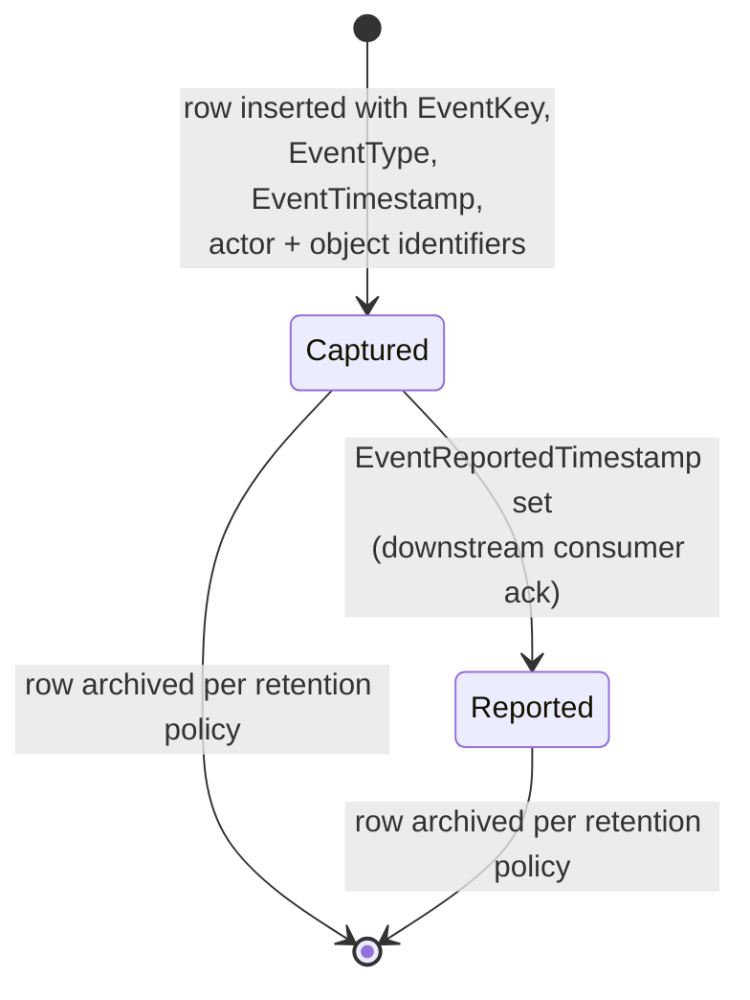
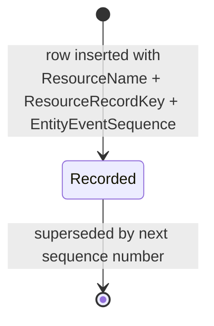
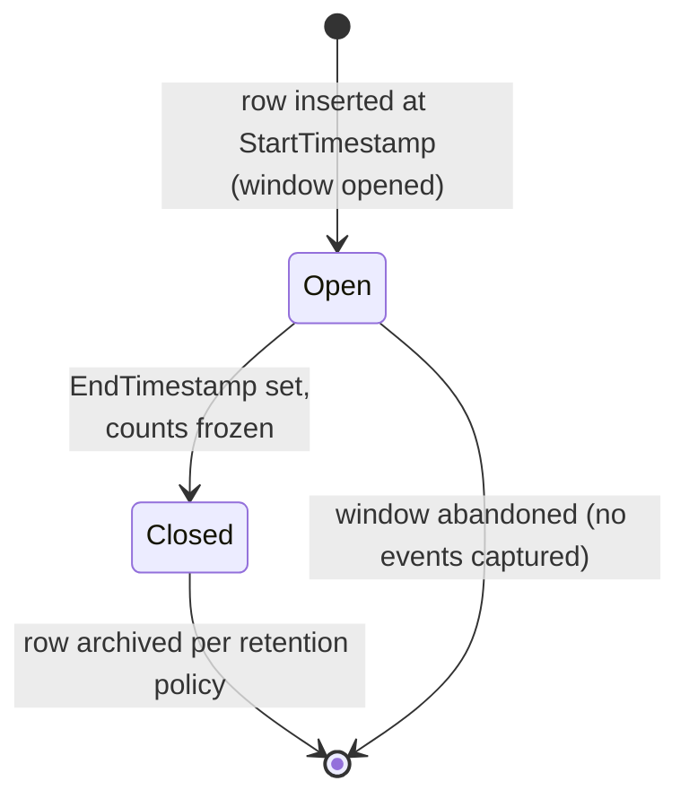

# Internet tracking and engagement (canonical, RESO DD 2.0)

How consumer and member interactions with real-estate objects
(listings, photos, virtual tours, saved searches, open houses,
documents) are captured as events, sequenced, aggregated, and
reported. Three resources collaborate: `InternetTracking` (event
fact rows), `InternetTrackingSummary` (period roll-ups), and
`EntityEvent` (logical-time sequence pointer).

> **Integration links**:
>
> - Source mapping (per resource):
>   [`../../../data-models/source-mappings/wiki/agent-docs/by_resource/internet_tracking.md`](../../../data-models/source-mappings/wiki/agent-docs/by_resource/internet_tracking.md),
>   [`../../../data-models/source-mappings/wiki/agent-docs/by_resource/internet_tracking_summary.md`](../../../data-models/source-mappings/wiki/agent-docs/by_resource/internet_tracking_summary.md),
>   [`../../../data-models/source-mappings/wiki/agent-docs/by_resource/entity_event.md`](../../../data-models/source-mappings/wiki/agent-docs/by_resource/entity_event.md).
> - Sharp-SIR flavour: no project SOP yet — promote one under
>   `docs/business-processes/` when SIR codifies analytics
>   warehousing, retention, and consent semantics.

This is the canonical baseline. Project flavours (analytics
warehouse choice, retention windows, GDPR consent flows) belong in
[`docs/business-processes/`](../../index.md).

## Scope

In scope:

- The `InternetTracking` event capture lifecycle (append-only).
- `EntityEvent` logical-time sequencing as an alternative to wall
  clocks.
- The `InternetTrackingSummary` aggregation lifecycle.
- The `EventType`, `ActorType`, `ObjectType`, `DeviceType`, and
  `TrackingType` typologies.

Out of scope:

- Identity stitching across actors (project flavour).
- Consent management (project flavour, regulator-specific).
- Field-level audit on canonical resources (see
  [`history-and-audit-log.md`](history-and-audit-log.md) — different
  scope: row-state changes, not consumer events).

## Primary state machine: `InternetTracking` event capture

`InternetTracking` does not publish a closed status lookup. The
canonical baseline models it as append-only with an idempotency
contract on `(EventOriginatingSystemName, OriginatingSystemEventKey)`
or, when absent, on `EventKey`.

### Transition table

| From | To | Trigger | Required field changes |
|---|---|---|---|
| `[*]` | `Captured` | Consumer or member action observed | `EventKey`, `EventType`, `EventTimestamp`, `EventDescription`, `ObjectType`, `ObjectKey` (or `ObjectID`), `ActorType`, `ActorKey` (or `ActorID`), `EventSource`, originating-system identifiers |
| `Captured` | `Reported` | Aggregation or downstream consumer acknowledges | `EventReportedTimestamp`, `ModificationTimestamp` (if mirrored locally) |
| `Captured` / `Reported` | `[*]` | Retention window elapsed | row archived/removed per project policy |

### Idempotency contract

The canonical baseline REQUIRES that re-ingesting the same source
event MUST NOT create a duplicate `InternetTracking` row. The
recommended uniqueness key is, in order of preference:

1. `(EventOriginatingSystemName, OriginatingSystemEventKey)`
2. `(EventSourceSystemName, SourceSystemEventKey)`
3. `EventKey`

### `EventType` typology

`EventType` is a closed RESO lookup. Canonical baseline cites the
core engagement events:

| Group | Values |
|---|---|
| Discovery | `Impression`, `Detailed View`, `Exit Detailed View`, `Search` |
| Engagement | `Photo Gallery`, `Virtual Tour`, `Property Videos`, `Driving Directions`, `Scrolled Depth` |
| Conversion | `Submission of Lead Form`, `Clicked on Email Address`, `Clicked on Phone Number`, `Click to Primary Hosted Site` |
| Save / share | `Favorited`, `Discard`, `Maybe`, `Share`, `Comments`, `Printed` |
| System | `Object Modified` |

### `ActorType` and `DeviceType`

`ActorType` (closed): `Agent`, `Client`, `Consumer`, `Bot`, `Unknown`.
`DeviceType` (closed): `Desktop`, `Mobile`, `Tablet`, `Wearable`,
`Unknown`.

`Bot` traffic SHOULD be captured but excluded from
`InternetTrackingSummary` aggregations.

### `ObjectType` typology

`ObjectType` (closed) declares what was acted on:
`Listing`, `Property`, `Photo`, `Virtual Tour`, `Document`,
`Open House`, `Saved Search`.

## `EntityEvent` (logical-time sequence)

`EntityEvent` provides an OData-compliant logical-timestamp
mechanism — a strictly increasing per-resource sequence — used when
wall-clock timestamps cannot be trusted (clock skew, batch import).
Every `EntityEvent` row identifies a target row by
`(ResourceName, ResourceRecordKey)` and carries a monotonic
`EntityEventSequence`.

### Decision points

| Decision | Inputs | Outputs |
|---|---|---|
| Allocate sequence | New change on a resource row | Insert `EntityEvent` row with the next `EntityEventSequence` for that `(ResourceName, ResourceRecordKey)` |
| Resolve order | Two clients contend on the same row | Compare `EntityEventSequence` (logical) before `ModificationTimestamp` (wall clock) |

`ResourceName` lookup values cited by the canonical baseline:
`Property`, `Member`, `Office`, `Contacts`, `Association`.

## `InternetTrackingSummary` (period aggregation)

`InternetTrackingSummary` is the period-bucketed roll-up of
`InternetTracking` facts. Each row covers a `(StartTimestamp,
EndTimestamp)` window for a `TrackingType` key
(typically `ListingId`).

### Aggregation contract

Within a window, increment the count fields as events are observed:

| Counter | Driving `EventType` |
|---|---|
| `ImpressionCount` | `Impression` |
| `ViewCount` | `Detailed View` |
| `MobileAppImpressionCount`, `MobileAppViewCount` | same as above with `DeviceType = Mobile` and a mobile app source |
| `FavoritedCount` | `Favorited` |
| `SharedCount` | `Share` |
| `ListingsEmailedCount` | engagement-driven email out |
| `InquiryCount` | `Submission of Lead Form` |
| `CmaCreatedCount`, `CmaRanCount`, `CmaEmailedCount`, `CmaSharedCount` | CMA workflow events (project-flavoured) |
| `ShowingRequestedCount`, `ShowingCompletedCount` | linked from [`showing-lifecycle.md`](showing-lifecycle.md) |
| `TotalLogins`, `UniqueLogins`, `MobileLogins` | session / authentication events |

`TrackingType` (closed) cited values: `ListingId`,
`ListAgentMlsId`, `ListOfficeMlsId`, `MainOfficeMlsId`, `OUID`.

### Decision points

| Decision | Inputs | Outputs |
|---|---|---|
| Open window | Period boundary (e.g. UTC midnight) | Insert row with `StartTimestamp`, `TrackingType`, `TrackingValues`, `OriginatingSystemName` |
| Close window | Period elapsed | Set `EndTimestamp`, freeze counts; bump `ModificationTimestamp` |
| Reissue | Late-arriving events | Open a corrective window covering the same period and `ResponseType` |

## Cross-resource interactions

- `InternetTracking.ObjectKey` typically resolves to a
  [`Property.ListingKey`](listing-lifecycle.md) when
  `ObjectType = Listing` or `Property`. The canonical baseline
  RECOMMENDS leaving the FK unenforced in the data plane (because
  events can outlive their parent), and instead validating the
  reference in analytics.
- `InternetTrackingSummary` aggregates events scoped to a
  `TrackingType`/`TrackingValues` pair; the canonical baseline
  REQUIRES one row per period per key.
- `EntityEvent` rows MAY be emitted for any RESO resource and are
  the canonical tie-breaker between `ModificationTimestamp` writes
  arriving out of order. Per
  [`history-and-audit-log.md`](history-and-audit-log.md),
  `HistoryTransactional` rows MAY carry `EntityEventSequence` to
  cross-reference the same logical event.
- Showing engagement counters in `InternetTrackingSummary` link
  back to [`showing-lifecycle.md`](showing-lifecycle.md) (each
  `Showing` row drives one tally on `ShowingCompletedCount`).

## Identifier semantics

- `EventKey` is the per-event PK on `InternetTracking`.
- `OriginatingSystemEventKey` / `SourceSystemEventKey` carry the
  originating-system event identity for idempotency.
- `EntityEventSequence` is monotonic only within the
  `(ResourceName, ResourceRecordKey)` scope.
- `InternetTrackingSummaryKey` is the per-window PK.

## Non-goals

- No opinion on consent or PII redaction policy.
- No opinion on warehouse/lakehouse retention windows.
- No opinion on identity stitching between anonymous impressions
  and authenticated `Contacts`/`Member` records.

<!-- reso-citations
Resource: InternetTracking
Resource: InternetTrackingSummary
Resource: EntityEvent
Field: InternetTracking.EventKey
Field: InternetTracking.EventType
Field: InternetTracking.EventDescription
Field: InternetTracking.EventLabel
Field: InternetTracking.EventTimestamp
Field: InternetTracking.EventReportedTimestamp
Field: InternetTracking.EventTarget
Field: InternetTracking.EventSource
Field: InternetTracking.EventOriginatingSystemName
Field: InternetTracking.EventOriginatingSystemID
Field: InternetTracking.EventSourceSystemName
Field: InternetTracking.EventSourceSystemID
Field: InternetTracking.OriginatingSystemEventKey
Field: InternetTracking.SourceSystemEventKey
Field: InternetTracking.ActorKey
Field: InternetTracking.ActorID
Field: InternetTracking.ActorType
Field: InternetTracking.ActorEmail
Field: InternetTracking.ActorPhone
Field: InternetTracking.ActorIP
Field: InternetTracking.ActorOriginatingSystemName
Field: InternetTracking.ActorSourceSystemName
Field: InternetTracking.OriginatingSystemActorKey
Field: InternetTracking.SourceSystemActorKey
Field: InternetTracking.ObjectKey
Field: InternetTracking.ObjectID
Field: InternetTracking.ObjectIdType
Field: InternetTracking.ObjectType
Field: InternetTracking.ObjectURL
Field: InternetTracking.ObjectOriginatingSystemName
Field: InternetTracking.ObjectSourceSystemName
Field: InternetTracking.OriginatingSystemObjectKey
Field: InternetTracking.SourceSystemObjectKey
Field: InternetTracking.SessionID
Field: InternetTracking.UserAgent
Field: InternetTracking.DeviceType
Field: InternetTracking.ReferringURL
Field: InternetTracking.ScreenWidth
Field: InternetTracking.ScreenHeight
Field: InternetTracking.ColorDepth
Field: InternetTracking.TimeZoneOffset
Field: InternetTrackingSummary.InternetTrackingSummaryKey
Field: InternetTrackingSummary.TrackingType
Field: InternetTrackingSummary.TrackingValues
Field: InternetTrackingSummary.TrackingDate
Field: InternetTrackingSummary.StartTimestamp
Field: InternetTrackingSummary.EndTimestamp
Field: InternetTrackingSummary.ListingId
Field: InternetTrackingSummary.ImpressionCount
Field: InternetTrackingSummary.ViewCount
Field: InternetTrackingSummary.MobileAppImpressionCount
Field: InternetTrackingSummary.MobileAppViewCount
Field: InternetTrackingSummary.FavoritedCount
Field: InternetTrackingSummary.SharedCount
Field: InternetTrackingSummary.ListingsEmailedCount
Field: InternetTrackingSummary.InquiryCount
Field: InternetTrackingSummary.CmaCreatedCount
Field: InternetTrackingSummary.CmaRanCount
Field: InternetTrackingSummary.CmaEmailedCount
Field: InternetTrackingSummary.CmaSharedCount
Field: InternetTrackingSummary.ShowingCompletedCount
Field: InternetTrackingSummary.ShowingRequestedCount
Field: InternetTrackingSummary.TotalLogins
Field: InternetTrackingSummary.UniqueLogins
Field: InternetTrackingSummary.MobileLogins
Field: InternetTrackingSummary.ResponseType
Field: InternetTrackingSummary.OriginatingSystemName
Field: InternetTrackingSummary.ModificationTimestamp
Field: EntityEvent.ResourceName
Field: EntityEvent.ResourceRecordKey
Field: EntityEvent.ResourceRecordUrl
Field: EntityEvent.EntityEventSequence
LookupValue: EventType.Impression
LookupValue: EventType.Detailed View
LookupValue: EventType.Exit Detailed View
LookupValue: EventType.Search
LookupValue: EventType.Photo Gallery
LookupValue: EventType.Virtual Tour
LookupValue: EventType.Property Videos
LookupValue: EventType.Driving Directions
LookupValue: EventType.Scrolled Depth
LookupValue: EventType.Submission of Lead Form
LookupValue: EventType.Clicked on Email Address
LookupValue: EventType.Clicked on Phone Number
LookupValue: EventType.Click to Primary Hosted Site
LookupValue: EventType.Favorited
LookupValue: EventType.Discard
LookupValue: EventType.Maybe
LookupValue: EventType.Share
LookupValue: EventType.Comments
LookupValue: EventType.Printed
LookupValue: EventType.Object Modified
LookupValue: ActorType.Agent
LookupValue: ActorType.Client
LookupValue: ActorType.Consumer
LookupValue: ActorType.Bot
LookupValue: ActorType.Unknown
LookupValue: DeviceType.Desktop
LookupValue: DeviceType.Mobile
LookupValue: DeviceType.Tablet
LookupValue: DeviceType.Wearable
LookupValue: DeviceType.Unknown
LookupValue: ObjectType.Listing
LookupValue: ObjectType.Property
LookupValue: ObjectType.Photo
LookupValue: ObjectType.Virtual Tour
LookupValue: ObjectType.Document
LookupValue: ObjectType.Open House
LookupValue: ObjectType.Saved Search
LookupValue: TrackingType.ListingId
LookupValue: TrackingType.ListAgentMlsId
LookupValue: TrackingType.ListOfficeMlsId
LookupValue: TrackingType.MainOfficeMlsId
LookupValue: TrackingType.OUID
LookupValue: ResourceName.Property
LookupValue: ResourceName.Member
LookupValue: ResourceName.Office
LookupValue: ResourceName.Contacts
LookupValue: ResourceName.Association
-->
