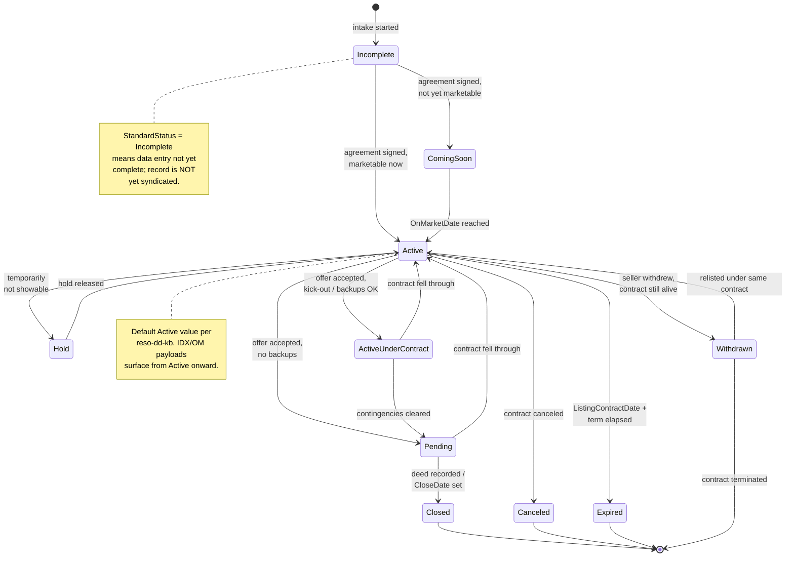

# Listing lifecycle (canonical, RESO DD 2.0)

The end-to-end state machine of a `Property` listing as it moves
from intake to closed (or terminal non-close), expressed entirely in
RESO DD 2.0 vocabulary.

This is the canonical baseline. Project-specific flavours (e.g.
Sharp-SIR exclusive vs. open-listing nuances, agreement-signed
checkpoints, lead-doc emails) belong in
[`docs/business-processes/`](../../index.md);
they MUST map their stages onto the states defined here.

## Scope

In scope:

- The `StandardStatus` and `MlsStatus` state machines on a single
  `Property` record.
- The fields that MUST change at each transition.
- The `HistoryTransactional` rows the transition emits.
- Cross-references to the showing, open-house, lead-contact, media,
  and transaction lifecycles.

Out of scope:

- Pre-listing prospecting (lives in
  [`lead-contact-lifecycle.md`](lead-contact-lifecycle.md)).
- Closing-out money flow (lives in
  [`transaction-lifecycle.md`](transaction-lifecycle.md)).
- Showings/open houses while Active (separate state machines, listed
  as cross-references below).

## Primary state machine: `Property.StandardStatus`

`StandardStatus` is the locked-with-enumerations field every IDX
consumer reads first. It is the canonical state of the listing.

Notes on the diagram:

- `Delete` is a tombstone state for hard-deleted records and is not
  drawn as a node here; it is reached only via system-level
  expungement, never through a normal business transition.
- `Active` has reflexive edits (price changes, photo changes) that
  do not change `StandardStatus` but DO emit `MlsStatus = Price
  Change` and `HistoryTransactional` rows; see "Reflexive Active
  edits" below.

### Transition table

Every row below corresponds to exactly one `HistoryTransactional`
write; the `MajorChangeType` value is the controlled label written
into the audit row's `ChangeType`.

| From | To | Trigger | Required field changes | `Property.MajorChangeType` |
|---|---|---|---|---|
| `[*]` | `Incomplete` | Listing record created, listing agreement not yet signed | `ListingId`, `ListingKey`, `ListAgentKey`, `ListOfficeKey`, `OriginalListPrice`, `ListPrice` set | (no `MajorChangeType` row yet) |
| `Incomplete` | `Coming Soon` | Listing agreement signed; `OnMarketDate` set in the future | `StandardStatus`, `MlsStatus`, `ListingContractDate`, `OnMarketDate`, `StatusChangeTimestamp` | `New Listing` |
| `Incomplete` | `Active` | Listing agreement signed; `OnMarketDate` is today | `StandardStatus`, `MlsStatus`, `ListingContractDate`, `OnMarketDate`, `StatusChangeTimestamp` | `New Listing` |
| `Coming Soon` | `Active` | `OnMarketDate` reached | `StandardStatus`, `MlsStatus`, `StatusChangeTimestamp` | `Active` |
| `Active` | `Hold` | Seller pauses showings | `StandardStatus`, `MlsStatus`, `StatusChangeTimestamp` | `Hold` |
| `Hold` | `Active` | Hold released | `StandardStatus`, `MlsStatus`, `StatusChangeTimestamp` | `Active` |
| `Active` | `Active Under Contract` | Offer accepted, listing still showable to backup buyers | `StandardStatus`, `MlsStatus`, `ContractStatusChangeDate`, `StatusChangeTimestamp` | `Active Under Contract` |
| `Active` / `Active Under Contract` | `Pending` | Contingencies cleared (or none) | `StandardStatus`, `MlsStatus`, `PurchaseContractDate`, `PendingTimestamp`, `ContractStatusChangeDate`, `StatusChangeTimestamp` | `Pending` |
| `Active Under Contract` / `Pending` | `Active` | Contract fell through; relist | `StandardStatus`, `MlsStatus`, `ContractStatusChangeDate`, `StatusChangeTimestamp` | `Back On Market` |
| `Pending` | `Closed` | Title transferred / deed recorded | `StandardStatus`, `MlsStatus`, `CloseDate`, `OffMarketDate`, `StatusChangeTimestamp` | `Closed` |
| `Active` | `Withdrawn` | Seller withdrew, contract still alive | `StandardStatus`, `MlsStatus`, `WithdrawnDate`, `OffMarketDate`, `StatusChangeTimestamp` | `Withdrawn` |
| `Active` | `Canceled` | Listing contract canceled | `StandardStatus`, `MlsStatus`, `CancellationDate`, `OffMarketDate`, `StatusChangeTimestamp` | `Canceled` |
| `Active` | `Expired` | `ListingContractDate + term` reached without close | `StandardStatus`, `MlsStatus`, `ExpirationDate`, `OffMarketDate`, `StatusChangeTimestamp` | `Expired` |

### Reflexive `Active` edits

These are edits that mutate the listing without changing
`StandardStatus`, but MUST still be persisted as a
`HistoryTransactional` row and reflected in `MlsStatus`:

| Trigger | Field changes | `MajorChangeType` |
|---|---|---|
| Price reduced or raised | `PreviousListPrice = old ListPrice`, `ListPrice`, `PriceChangeTimestamp`, `MajorChangeTimestamp` | `Price Change` |
| Media added/removed | `Media`, `ModificationTimestamp`; no `MajorChangeType` row required, but `HistoryTransactional` row emitted | n/a |
| Description / remarks edited | `ModificationTimestamp` | n/a |

## Secondary state: `Property.MlsStatus`

`MlsStatus` is an OPEN lookup (RESO publishes a suggested set but
MLSs may extend). The canonical baseline writes `MlsStatus` lockstep
with `StandardStatus` using the suggested values:

- `Active` while `StandardStatus = Active`
- `Coming Soon` while `StandardStatus = Coming Soon`
- `Pending` while `StandardStatus = Pending`
- `Active Under Contract` while `StandardStatus = Active Under Contract`
- `Hold` while `StandardStatus = Hold`
- `Closed` while `StandardStatus = Closed`
- `Withdrawn`, `Canceled`, `Expired` mirror their `StandardStatus`
  counterparts
- `Price Change` is written transiently on a price reflex; the next
  read should already see `Active`

Project-specific extensions (e.g. `Pending Continue To Show`,
`Pending Taking Backups`) are NOT canonical here; record them in the
project flavour under
[`docs/business-processes/`](../../index.md).

## Decision points

| Decision | Inputs | Outputs |
|---|---|---|
| Coming Soon vs. Active at intake | `OnMarketDate` vs. today | `StandardStatus = Coming Soon` if future, else `Active` |
| Pending vs. Active Under Contract | `ListingAgreement` allows backups? contingencies remaining? | `Active Under Contract` if backups OK, else `Pending` |
| Withdrawn vs. Canceled vs. Expired | Did contract end? Did term expire? | `Canceled` if contract ended; `Withdrawn` if seller stepped back but contract alive; `Expired` if term elapsed |
| Closed vs. fell-through | Deed recorded? | `Closed` (set `CloseDate`) vs. `Back On Market` (set `MlsStatus = Active`) |

## Cross-resource interactions

- `Showing` / `ShowingRequest`: only valid while `StandardStatus IN
  (Active, Coming Soon, Active Under Contract)` and the listing's
  `ShowingStatus = Accepting Requests`. See
  [`showing-lifecycle.md`](showing-lifecycle.md).
- `OpenHouse`: only valid while `StandardStatus = Active`. See
  [`open-house-lifecycle.md`](open-house-lifecycle.md).
- `ContactListings`: a contact's "favourite" survives status
  changes; expiring/closing the listing freezes it in their list.
  See [`lead-contact-lifecycle.md`](lead-contact-lifecycle.md).
- `Media`: media publication state is gated on
  `StandardStatus`; see [`media-lifecycle.md`](media-lifecycle.md).
- `HistoryTransactional`: every transition above writes one row with
  `ResourceName = Property`, `ResourceRecordKey = ListingKey`,
  `FieldName = StandardStatus`, `PreviousValue`, `NewValue`,
  `ChangedByMemberKey`. See
  [`transaction-lifecycle.md`](transaction-lifecycle.md).

## Identifier semantics

- `ListingKey` is the system-of-record opaque PK; never re-used,
  never edited.
- `ListingId` is the human-facing MLS number; may be re-used across
  relists in some jurisdictions but the canonical baseline says do
  NOT re-use.
- `ListAgentKey` / `ListOfficeKey` cite the listing-side `Member`
  and `Office`; co-listing uses `CoListAgentKey`. These are
  immutable while the listing is live; transferring to a new agent
  is modelled by writing a new `Property` record (and a
  `HistoryTransactional` row pointing back to the old key).

## Non-goals

- No opinion on commission terms (those live as `x_sm_commission_pct`
  in the [`source-mappings/`](../../../data-models/source-mappings/README.md) layer).
- No opinion on `ListingAgreement` enumerations beyond the controlled
  RESO list; project flavours pick which subset to allow.
- No opinion on photo-min counts or remark length; those are
  project-flavour rules.

<!-- reso-citations
Resource: Property
Resource: HistoryTransactional
Field: Property.ListingId
Field: Property.ListingKey
Field: Property.StandardStatus
Field: Property.MlsStatus
Field: Property.ListPrice
Field: Property.OriginalListPrice
Field: Property.PreviousListPrice
Field: Property.ListingContractDate
Field: Property.OnMarketDate
Field: Property.OffMarketDate
Field: Property.CloseDate
Field: Property.PendingTimestamp
Field: Property.PurchaseContractDate
Field: Property.ContractStatusChangeDate
Field: Property.StatusChangeTimestamp
Field: Property.WithdrawnDate
Field: Property.CancellationDate
Field: Property.ExpirationDate
Field: Property.MajorChangeType
Field: Property.MajorChangeTimestamp
Field: Property.PriceChangeTimestamp
Field: Property.ModificationTimestamp
Field: Property.ListAgentKey
Field: Property.ListOfficeKey
Field: Property.CoListAgentKey
Field: Property.ListingAgreement
Field: Property.Media
Field: HistoryTransactional.ResourceName
Field: HistoryTransactional.ResourceRecordKey
Field: HistoryTransactional.FieldName
Field: HistoryTransactional.PreviousValue
Field: HistoryTransactional.NewValue
Field: HistoryTransactional.ChangeType
Field: HistoryTransactional.ChangedByMemberKey
LookupValue: StandardStatus.Incomplete
LookupValue: StandardStatus.Coming Soon
LookupValue: StandardStatus.Active
LookupValue: StandardStatus.Active Under Contract
LookupValue: StandardStatus.Pending
LookupValue: StandardStatus.Closed
LookupValue: StandardStatus.Hold
LookupValue: StandardStatus.Withdrawn
LookupValue: StandardStatus.Canceled
LookupValue: StandardStatus.Expired
LookupValue: StandardStatus.Delete
LookupValue: ChangeType.New Listing
LookupValue: ChangeType.Active
LookupValue: ChangeType.Coming Soon
LookupValue: ChangeType.Pending
LookupValue: ChangeType.Active Under Contract
LookupValue: ChangeType.Closed
LookupValue: ChangeType.Hold
LookupValue: ChangeType.Withdrawn
LookupValue: ChangeType.Canceled
LookupValue: ChangeType.Expired
LookupValue: ChangeType.Back On Market
LookupValue: ChangeType.Price Change
-->
