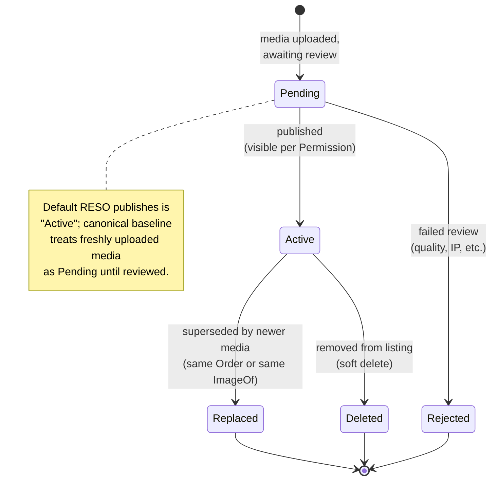

# Media lifecycle (canonical, RESO DD 2.0)

How a piece of media (photo, floor plan, virtual tour, video,
document) is uploaded, ordered, published, altered, and retired,
expressed in RESO DD 2.0 vocabulary. One resource: `Media`. The
`Media` resource is shared - the same row schema describes media
attached to a `Property`, `Member`, `Office`, `OpenHouse`, etc.

This is the canonical baseline. Project flavours (CDN, watermarking
policy, twilight-conversion vendor) belong in
[`docs/business-processes/`](../../index.md).

## Scope

In scope:

- The `Media.MediaStatus` lifecycle (open lookup, canonical
  baseline pins values).
- The `Media.MediaCategory` typology and the way `MediaType`
  refines it.
- The ordering / preferred-photo semantics
  (`Order` and `PreferredPhotoYN`).
- The `MediaAlteration` and `Permission` axes.
- Polymorphism via `ResourceName` / `ResourceRecordKey`.

Out of scope:

- The thing the media depicts (see
  [`listing-lifecycle.md`](listing-lifecycle.md),
  [`open-house-lifecycle.md`](open-house-lifecycle.md),
  [`member-onboarding.md`](member-onboarding.md), or
  [`office-onboarding.md`](office-onboarding.md)).
- The CDN / hosting layer that backs `MediaURL` (project flavour).

## Primary state machine: `Media.MediaStatus`

`MediaStatus` is an OPEN RESO lookup (no published values). The
canonical baseline pins it to a 4-value vocabulary that aligns with
`Property.StandardStatus` semantics:

Canonical `MediaStatus` values (canonical baseline pins; consumers
that ignore the open-lookup nature MUST treat unknown values as
`Active`):

`Pending`, `Active`, `Replaced`, `Deleted`, `Rejected`.

### Transition table

| From | To | Trigger | Required field changes |
|---|---|---|---|
| `[*]` | `Pending` | Media uploaded | `MediaKey`, `MediaObjectID`, `ResourceName`, `ResourceRecordKey`, `MediaCategory`, `MediaType`, `MediaURL`, `Order`, `MediaModificationTimestamp` |
| `Pending` | `Active` | Review passed | `MediaStatus = Active`, `ModificationTimestamp` |
| `Pending` | `Rejected` | Review failed | `MediaStatus = Rejected`, `ShortDescription` (reason), `ModificationTimestamp` |
| `Active` | `Replaced` | Newer media took the same `Order` slot | `MediaStatus = Replaced`, `ModificationTimestamp` |
| `Active` | `Deleted` | Removed from listing | `MediaStatus = Deleted`, `ModificationTimestamp` |

Hard delete (physical row removal) is reserved for GDPR /
right-to-erasure events; the canonical baseline prefers
`MediaStatus = Deleted` for normal lifecycle.

## Secondary state: `Media.MediaCategory`

`MediaCategory` is an open lookup; the canonical baseline pins to
the 9 published values:

| Group | Values |
|---|---|
| Property visuals | `Photo`, `Floor Plan`, `Video` |
| Property tours | `Branded Virtual Tour`, `Unbranded Virtual Tour` |
| Documents | `Document` |
| Member visuals | `Agent Photo` |
| Office visuals | `Office Photo`, `Office Logo` |

`MediaCategory` MUST be consistent with `ResourceName`:

- `MediaCategory IN (Photo, Floor Plan, Video, Branded Virtual
  Tour, Unbranded Virtual Tour, Document)` requires
  `ResourceName = Property` (or `OpenHouse`).
- `MediaCategory = Agent Photo` requires `ResourceName = Member`.
- `MediaCategory IN (Office Photo, Office Logo)` requires
  `ResourceName = Office`.

## `MediaType` (file format)

`MediaType` is an open lookup; the canonical baseline pins to the
17 published values, partitioned by container:

| Group | Values |
|---|---|
| Image | `jpeg`, `png`, `gif`, `tiff` |
| Video | `mp4`, `mov`, `mpeg`, `quicktime`, `wmv` |
| Document | `pdf`, `doc`, `docx`, `xls`, `xlsx`, `rtf`, `txt` |

Pairing constraints (canonical baseline):

- `MediaCategory IN (Photo, Agent Photo, Office Photo, Office Logo,
  Floor Plan)` requires image `MediaType`.
- `MediaCategory = Video` requires video `MediaType`.
- `MediaCategory IN (Branded Virtual Tour, Unbranded Virtual Tour)`
  carries no `MediaType` (the URL points to a hosted experience).
- `MediaCategory = Document` requires document `MediaType`.

## Ordering and preferred photo

`Order` is a 1-based integer that controls the gallery sequence per
`(ResourceName, ResourceRecordKey)`. Values MUST be unique within
that scope.

`PreferredPhotoYN = true` marks the row as the canonical hero
image; exactly one row per `(ResourceName, ResourceRecordKey)` MAY
have `PreferredPhotoYN = true`. Re-assigning the preferred photo is
a single-row update on each side (the new preferred and the old
preferred), each emitting a `HistoryTransactional` row.

## `MediaAlteration` (provenance)

`MediaAlteration` is an open lookup with 10 published values
declaring how the original capture was modified before publication:

| Value | Meaning |
|---|---|
| `None` | Untouched original |
| `Decluttered - Item Removed` | Items photoshopped out |
| `Virtual Staging - Item Addition` | Items added |
| `Twilight Conversion` | Daytime photo converted to twilight |
| `Virtual Enhancements` | Color / sky enhancement |
| `Virtual Renovation` | Re-rendered finishes |
| `Virtual Representation - To Be Built` | New-construction render |
| `Virtual Representation - Under Construction` | In-progress render |
| `Model Home` | Photo of a model home, not the listed unit |
| `Other Media Modification` | Catch-all |

Disclosure of `MediaAlteration != None` is REQUIRED in many
jurisdictions; project flavours encode any additional disclosure
template.

## `Permission` (visibility)

`Permission` is an open lookup with 7 published values controlling
who may view the media:

`Public`, `IDX`, `VOW`, `Firm Only`, `Office Only`, `Agent Only`,
`Private`.

`Permission` is orthogonal to `MediaStatus`; a `MediaStatus =
Active` row with `Permission = Agent Only` is published only to
authenticated MLS members, not to IDX feeds. Project flavours map
their internal channels onto these values.

## Decision points

| Decision | Inputs | Outputs |
|---|---|---|
| Approve / reject newly uploaded media | Review by listing agent / coordinator | `MediaStatus = Active` or `Rejected` |
| Pick the hero photo | Listing agent's choice | Toggle `PreferredPhotoYN` (only one `true` per scope) |
| Re-order the gallery | Listing agent's choice | Update `Order`; canonical baseline keeps values dense (1, 2, 3, ...) |
| Disclose alterations | `MediaAlteration != None` | Set `LongDescription` to the alteration disclosure |
| Restrict visibility | Confidentiality requirement | Set `Permission` |
| Replace vs add | Newer media of the same view | Set old row to `Replaced`, insert new row with same `ImageOf` and same `Order` |

## Polymorphism: `ResourceName` / `ResourceRecordKey`

Every `Media` row points to its parent via:

- `ResourceName` (closed lookup, see
  [`transaction-lifecycle.md`](transaction-lifecycle.md) for the
  canonical 5-value set; `OpenHouse`, `Caravan`, `Showing`,
  `Member`, `Office`, `Teams`, etc. are tracked by writing
  `ResourceName = Property` and pointing `ResourceRecordKey` at the
  enclosing listing for media that belongs to those resources, OR
  by storing the media on the parent resource's nested `Media`
  field).
- `ResourceRecordKey`: the parent's PK on its own resource (e.g.
  `Property.ListingKey`, `Member.MemberKey`, `Office.OfficeKey`).
- `ResourceRecordID`: the parent's human-facing ID where it exists.
- `ClassName`: optional class qualifier when `ResourceName =
  Property`.

The canonical baseline treats `Media` as the source of truth for
URL/order/permission, while the parent resources keep a `Media`
nested-collection field for ergonomics.

## Cross-resource interactions

- A `Media` row on `ResourceName = Property` is gated by the
  parent's `Property.StandardStatus`; see
  [`listing-lifecycle.md`](listing-lifecycle.md). Once
  `StandardStatus = Closed`, media is frozen (`MediaStatus =
  Active` rows are kept for historical accuracy; new uploads
  require an explicit project-policy reason).
- An `Agent Photo` is gated by the linked `Member.MemberStatus`; see
  [`member-onboarding.md`](member-onboarding.md). When the member
  becomes `Inactive`, the canonical baseline keeps `MediaStatus =
  Active` but project flavours often demote `Permission` to
  `Private`.
- Office photos / logos are gated by `Office.OfficeStatus`; see
  [`office-onboarding.md`](office-onboarding.md).
- Every `MediaStatus` change emits a `HistoryTransactional` row.
  Per [`transaction-lifecycle.md`](transaction-lifecycle.md), use
  the parent resource's `ResourceName` and its key (e.g. for a
  Property-attached photo, `ResourceName = Property` and
  `ResourceRecordKey = Property.ListingKey`).

## Identifier semantics

- `MediaKey` is the immutable opaque PK on the `Media` row.
- `MediaObjectID` is the human-facing identifier (often the file
  name).
- `MediaURL` MUST be a stable, fetchable URL; project flavours
  guarantee URL stability via CDN convention.
- `OriginatingSystemMediaKey` / `SourceSystemMediaKey` carry
  federation identifiers when the row was syndicated.

## Non-goals

- No opinion on watermarking, EXIF stripping, or copyright
  notices - project flavour.
- No opinion on minimum photo counts or image-resolution
  requirements - project flavour.
- No opinion on which CDN backs `MediaURL` - project flavour.
- No opinion on AI-detection of `MediaAlteration` claims -
  project flavour.

<!-- reso-citations
Resource: Media
Field: Media.MediaKey
Field: Media.MediaObjectID
Field: Media.MediaStatus
Field: Media.MediaCategory
Field: Media.MediaType
Field: Media.MediaURL
Field: Media.MediaHTML
Field: Media.MediaAlteration
Field: Media.MediaModificationTimestamp
Field: Media.ModificationTimestamp
Field: Media.ResourceName
Field: Media.ResourceRecordKey
Field: Media.ResourceRecordID
Field: Media.ClassName
Field: Media.Order
Field: Media.PreferredPhotoYN
Field: Media.Permission
Field: Media.ImageOf
Field: Media.ImageHeight
Field: Media.ImageWidth
Field: Media.ImageSizeDescription
Field: Media.ShortDescription
Field: Media.LongDescription
Field: Media.ChangedByMember
Field: Media.ChangedByMemberKey
Field: Media.OriginatingSystemMediaKey
Field: Media.SourceSystemMediaKey
LookupValue: MediaCategory.Photo
LookupValue: MediaCategory.Floor Plan
LookupValue: MediaCategory.Video
LookupValue: MediaCategory.Branded Virtual Tour
LookupValue: MediaCategory.Unbranded Virtual Tour
LookupValue: MediaCategory.Document
LookupValue: MediaCategory.Agent Photo
LookupValue: MediaCategory.Office Photo
LookupValue: MediaCategory.Office Logo
LookupValue: MediaType.jpeg
LookupValue: MediaType.png
LookupValue: MediaType.gif
LookupValue: MediaType.tiff
LookupValue: MediaType.mp4
LookupValue: MediaType.mov
LookupValue: MediaType.mpeg
LookupValue: MediaType.quicktime
LookupValue: MediaType.wmv
LookupValue: MediaType.pdf
LookupValue: MediaType.doc
LookupValue: MediaType.docx
LookupValue: MediaType.xls
LookupValue: MediaType.xlsx
LookupValue: MediaType.rtf
LookupValue: MediaType.txt
LookupValue: MediaAlteration.None
LookupValue: MediaAlteration.Decluttered - Item Removed
LookupValue: MediaAlteration.Virtual Staging - Item Addition
LookupValue: MediaAlteration.Twilight Conversion
LookupValue: MediaAlteration.Virtual Enhancements
LookupValue: MediaAlteration.Virtual Renovation
LookupValue: MediaAlteration.Virtual Representation - To Be Built
LookupValue: MediaAlteration.Virtual Representation - Under Construction
LookupValue: MediaAlteration.Model Home
LookupValue: MediaAlteration.Other Media Modification
LookupValue: Permission.Public
LookupValue: Permission.IDX
LookupValue: Permission.VOW
LookupValue: Permission.Firm Only
LookupValue: Permission.Office Only
LookupValue: Permission.Agent Only
LookupValue: Permission.Private
-->
