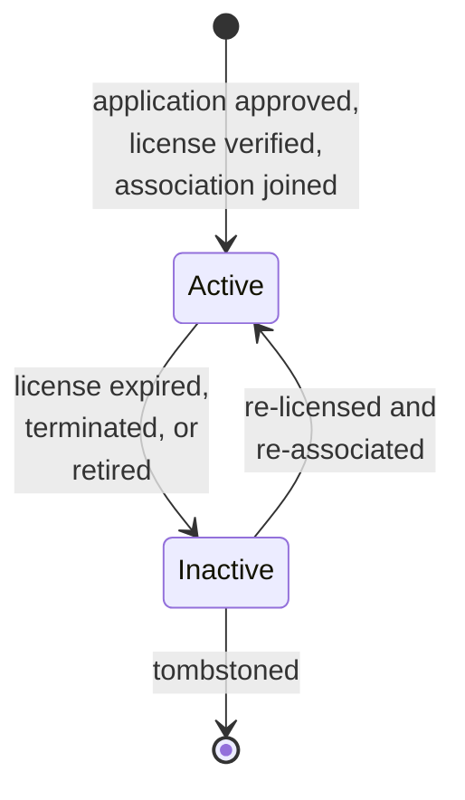
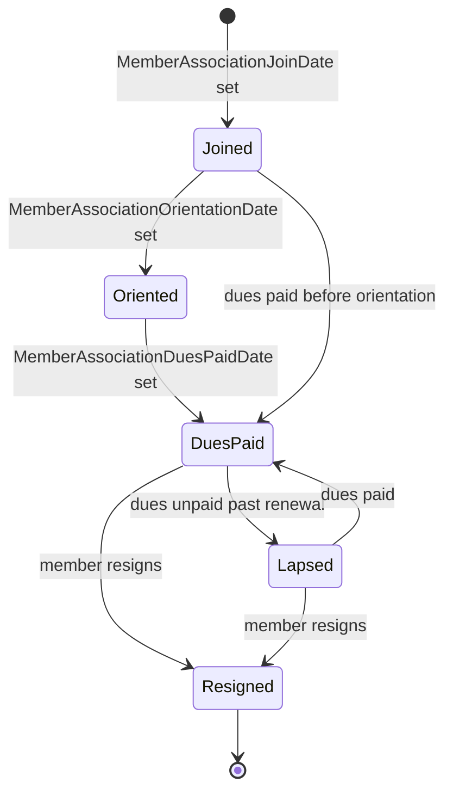
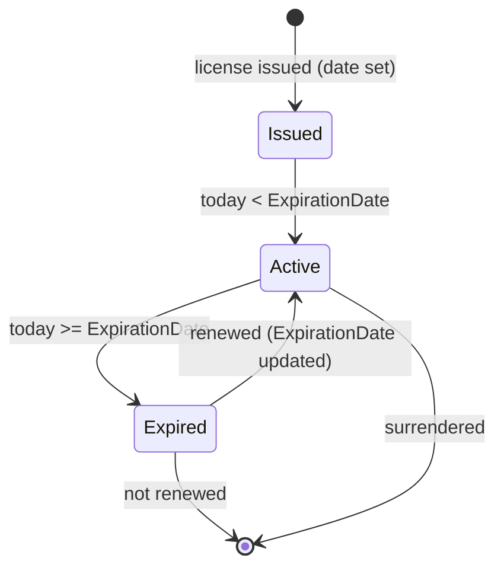

# Member onboarding (canonical, RESO DD 2.0)

How a real-estate professional flows from application to active
member and then into retirement, expressed in RESO DD 2.0
vocabulary. Three resources collaborate: `Member`,
`MemberAssociation`, `MemberStateLicense`.

> **Integration links**:
>
> - Source mapping (Dash / Qobrix / SIR -> RESO `Member`):
>   [`../../../data-models/source-mappings/wiki/agent-docs/by_resource/member.md`](../../../data-models/source-mappings/wiki/agent-docs/by_resource/member.md)
> - Sharp-SIR flavour: no project-flavour SOP yet — promote one
>   under `docs/business-processes/` when Sharp-SIR codifies its
>   onboarding steps; meanwhile the canonical baseline IS the SOP.
> - One-stop integrated view:
>   [`../../../integration/wiki/agent-docs/by_resource/member.md`](../../../integration/wiki/agent-docs/by_resource/member.md)

This is the canonical baseline. Project flavours (e.g. Sharp-SIR's
"sponsorship -> orientation -> first listing" stages) belong in
[`docs/business-processes/`](../../index.md);
they MUST map onto the canonical states defined here.

## Scope

In scope:

- The `Member.MemberStatus` lifecycle.
- The `Member.MemberType` typology (REALTOR, MLS-only, assistant,
  vendor, etc.).
- The `MemberAssociation.MemberAssociationStatus` lifecycle (per-
  association membership).
- The `MemberStateLicense` lifecycle (state-license issuance and
  renewal).

Out of scope:

- Office onboarding (see [`office-onboarding.md`](office-onboarding.md)).
- Team membership (see [`team-lifecycle.md`](team-lifecycle.md)).
- Listing assignment (see [`listing-lifecycle.md`](listing-lifecycle.md)).

## Primary state machine: `Member.MemberStatus`

`MemberStatus` is a closed RESO lookup with two values:
`Active`, `Inactive`. The canonical baseline introduces the
implicit `[*]` start and `[*]` end states for clarity.

`MemberStatus` lookup values: `Active`, `Inactive`.

### Transition table

| From | To | Trigger | Required field changes |
|---|---|---|---|
| `[*]` | `Active` | License verified, association joined, MLS access granted | `MemberKey`, `MemberMlsId`, `MemberFirstName`, `MemberLastName`, `MemberEmail`, `MemberType`, `MemberStatus = Active`, `OfficeKey`, `MemberMlsAccessYN = true`, `OriginalEntryTimestamp`, `MemberPrimaryAorId`, `MemberStateLicense`, `MemberStateLicenseState`, `MemberStateLicenseExpirationDate` |
| `Active` | `Inactive` | License expired / terminated / retired | `MemberStatus = Inactive`, `MemberMlsAccessYN = false`, `ModificationTimestamp`; cascade `MemberAssociationStatus` updates |
| `Inactive` | `Active` | Re-licensed AND re-associated | `MemberStatus = Active`, `MemberMlsAccessYN = true`, refreshed `MemberStateLicenseExpirationDate` |

## Secondary state: `Member.MemberType`

`MemberType` partitions function and licensure. The canonical
baseline does not draw transitions between types - changing type is
a deliberate administrative event and writes a
`HistoryTransactional` row.

| Group | Values |
|---|---|
| REALTOR | `REALTOR Salesperson`, `REALTOR Broker Associate`, `REALTOR Appraiser`, `Designated REALTOR Participant`, `Designated REALTOR Appraiser` |
| MLS-only | `MLS Only Salesperson`, `MLS Only Broker`, `MLS Only Broker Associate`, `MLS Only Appraiser` |
| Support | `Assistant`, `Licensed Assistant`, `Unlicensed Assistant`, `Office Manager`, `Photographer`, `Leasing Agent` |
| Non-licensed | `Affiliate`, `Association Staff`, `MLS Staff`, `Non Member/Vendor` |

`MemberIsAssistantTo` is set to the `Member.MemberKey` they assist
when `MemberType IN (Assistant, Licensed Assistant, Unlicensed
Assistant)`.

## `MemberAssociation` (per-association membership)

A `Member` may belong to multiple associations (local AOR, state
AOR, national NAR). One `MemberAssociation` row per pair. RESO
publishes `MemberAssociationStatus` as an open lookup; the
canonical baseline reserves `MemberStatus.Active` /
`MemberStatus.Inactive` semantics on the parent `Member` row and
treats the per-association status as project-encoded.

`MemberAssociationBillStatus` lookup values:
`Billed`, `Not Billed`, `Paid`.

| Field | Role |
|---|---|
| `MemberAssociationStatus` | Free-form per-association state (see narrative above) |
| `MemberAssociationStatusDate` | Date that status was set |
| `MemberAssociationJoinDate` | Initial join |
| `MemberAssociationOrientationDate` | Orientation completed |
| `MemberAssociationDuesPaidDate` | Latest dues payment |
| `MemberAssociationBillStatus` | `Billed` / `Not Billed` / `Paid` |
| `MemberAssociationBillStatusDescription` | Free-text |
| `MemberAssociationPrimaryIndicator` | `true` if this is the member's primary AOR |
| `MemberLocalDuesWaivedYN`, `MemberStatelDuesWaivedYN`, `MemberNationalDuesWaivedYN` | Waiver flags |
| `AssociationKey`, `AssociationMlsId`, `AssociationNationalAssociationId` | FK to `Association` |

The `MemberAssociation` for the `MemberPrimaryAorId` AOR MUST have
`MemberAssociationPrimaryIndicator = true` and is the source of
truth for licensure jurisdiction.

## `MemberStateLicense` (state-issued license)

A `Member` may hold multiple state licenses (e.g. broker licensed
in two states). One `MemberStateLicense` row per state.

The state machine here is implicit (computed from
`MemberStateLicenseExpirationDate`); RESO does not publish a closed
`Status` lookup for this resource.

| Field | Role |
|---|---|
| `MemberStateLicenseKey` | PK |
| `Member`, `MemberKey`, `MemberMlsId` | FK to `Member` |
| `MemberStateLicense` | License number string |
| `MemberStateLicenseState` | State / province |
| `MemberStateLicenseType` | `Salesperson`, `Broker`, `Appraiser` |
| `MemberStateLicenseExpirationDate` | Renewal deadline |
| `ModificationTimestamp` | Audit |

The same fields appear inline on `Member` for the primary license;
the `MemberStateLicense` resource is the system of record when
multiple licenses exist.

## Decision points

| Decision | Inputs | Outputs |
|---|---|---|
| Activate the member | License verified AND `MemberAssociation.MemberAssociationPrimaryIndicator` row exists AND dues paid | `MemberStatus = Active`, `MemberMlsAccessYN = true` |
| Deactivate the member | Primary AOR resigned OR primary license expired without renewal | `MemberStatus = Inactive`, `MemberMlsAccessYN = false` |
| Promote primary association | New AOR designated as primary | Toggle `MemberAssociationPrimaryIndicator` (only one row may be `true`); update `Member.MemberPrimaryAorId` |
| Add a second state license | Cross-state expansion | Insert `MemberStateLicense`; do NOT overwrite `Member.MemberStateLicense*` if the new license is non-primary |

## Cross-resource interactions

- `Office` / `OfficeKey` is the FK to the member's brokerage; see
  [`office-onboarding.md`](office-onboarding.md). A `Member` MUST
  have a non-null `OfficeKey` to be `Active`.
- `MemberAssociation.AssociationKey` points to an `Association`
  resource, which the canonical baseline does not document with its
  own state machine (it is a slowly-changing reference table).
- Listings created by this member set `Property.ListAgentKey =
  Member.MemberKey`; see [`listing-lifecycle.md`](listing-lifecycle.md).
- The member is the `OwnerMember` on `Contacts`; see
  [`lead-contact-lifecycle.md`](lead-contact-lifecycle.md).
- Every `MemberStatus` / `MemberType` change emits a
  `HistoryTransactional` row with `ResourceName = Member`,
  `ResourceRecordKey = Member.MemberKey`; see
  [`transaction-lifecycle.md`](transaction-lifecycle.md).
- The member appears as `TeamMembers.MemberKey` when they belong to
  a team; see [`team-lifecycle.md`](team-lifecycle.md).

## Identifier semantics

- `MemberKey` is the immutable opaque PK.
- `MemberMlsId` is the human-facing MLS identifier; subject to
  jurisdiction re-use rules but the canonical baseline says do NOT
  re-use.
- `MemberPrimaryAorId` is the member's primary association
  identifier; cross-references the
  `MemberAssociationPrimaryIndicator = true` row.
- `OriginatingSystemMemberKey`, `SourceSystemMemberKey` carry
  federation identifiers when the row was syndicated.

## Non-goals

- No opinion on background checks, fingerprinting, or onboarding
  forms - project flavour.
- No opinion on commission-split agreements - project flavour
  (`x_sm_commission_pct` extension).
- No opinion on continuing-education tracking - the canonical
  baseline only requires `MemberStateLicenseExpirationDate` to be
  current.

<!-- reso-citations
Resource: Member
Resource: MemberAssociation
Resource: MemberStateLicense
Field: Member.MemberKey
Field: Member.MemberMlsId
Field: Member.MemberFirstName
Field: Member.MemberLastName
Field: Member.MemberFullName
Field: Member.MemberEmail
Field: Member.MemberMobilePhone
Field: Member.MemberStatus
Field: Member.MemberType
Field: Member.MemberMlsAccessYN
Field: Member.MemberPrimaryAorId
Field: Member.MemberIsAssistantTo
Field: Member.MemberStateLicense
Field: Member.MemberStateLicenseState
Field: Member.MemberStateLicenseType
Field: Member.MemberStateLicenseExpirationDate
Field: Member.OfficeKey
Field: Member.OfficeMlsId
Field: Member.Office
Field: Member.OriginalEntryTimestamp
Field: Member.ModificationTimestamp
Field: Member.OriginatingSystemMemberKey
Field: Member.SourceSystemMemberKey
Field: MemberAssociation.AssociationKey
Field: MemberAssociation.AssociationMlsId
Field: MemberAssociation.AssociationNationalAssociationId
Field: MemberAssociation.Member
Field: MemberAssociation.MemberKey
Field: MemberAssociation.MemberMlsId
Field: MemberAssociation.MemberAssociationStatus
Field: MemberAssociation.MemberAssociationStatusDate
Field: MemberAssociation.MemberAssociationJoinDate
Field: MemberAssociation.MemberAssociationOrientationDate
Field: MemberAssociation.MemberAssociationDuesPaidDate
Field: MemberAssociation.MemberAssociationBillStatus
Field: MemberAssociation.MemberAssociationBillStatusDescription
Field: MemberAssociation.MemberAssociationPrimaryIndicator
Field: MemberAssociation.MemberLocalDuesWaivedYN
Field: MemberAssociation.MemberStatelDuesWaivedYN
Field: MemberAssociation.MemberNationalDuesWaivedYN
Field: MemberAssociation.ModificationTimestamp
Field: MemberStateLicense.MemberStateLicenseKey
Field: MemberStateLicense.Member
Field: MemberStateLicense.MemberKey
Field: MemberStateLicense.MemberMlsId
Field: MemberStateLicense.MemberStateLicense
Field: MemberStateLicense.MemberStateLicenseState
Field: MemberStateLicense.MemberStateLicenseType
Field: MemberStateLicense.MemberStateLicenseExpirationDate
Field: MemberStateLicense.ModificationTimestamp
LookupValue: MemberStatus.Active
LookupValue: MemberStatus.Inactive
LookupValue: MemberType.REALTOR Salesperson
LookupValue: MemberType.REALTOR Broker Associate
LookupValue: MemberType.REALTOR Appraiser
LookupValue: MemberType.Designated REALTOR Participant
LookupValue: MemberType.Designated REALTOR Appraiser
LookupValue: MemberType.MLS Only Salesperson
LookupValue: MemberType.MLS Only Broker
LookupValue: MemberType.MLS Only Broker Associate
LookupValue: MemberType.MLS Only Appraiser
LookupValue: MemberType.Assistant
LookupValue: MemberType.Licensed Assistant
LookupValue: MemberType.Unlicensed Assistant
LookupValue: MemberType.Office Manager
LookupValue: MemberType.Photographer
LookupValue: MemberType.Leasing Agent
LookupValue: MemberType.Affiliate
LookupValue: MemberType.Association Staff
LookupValue: MemberType.MLS Staff
LookupValue: MemberType.Non Member/Vendor
LookupValue: MemberStateLicenseType.Salesperson
LookupValue: MemberStateLicenseType.Broker
LookupValue: MemberStateLicenseType.Appraiser
LookupValue: MemberAssociationBillStatus.Billed
LookupValue: MemberAssociationBillStatus.Not Billed
LookupValue: MemberAssociationBillStatus.Paid
-->
