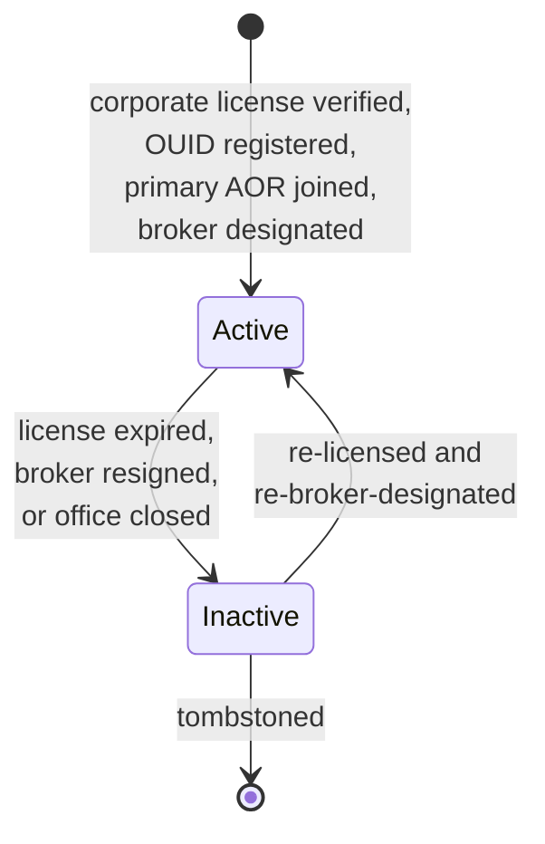
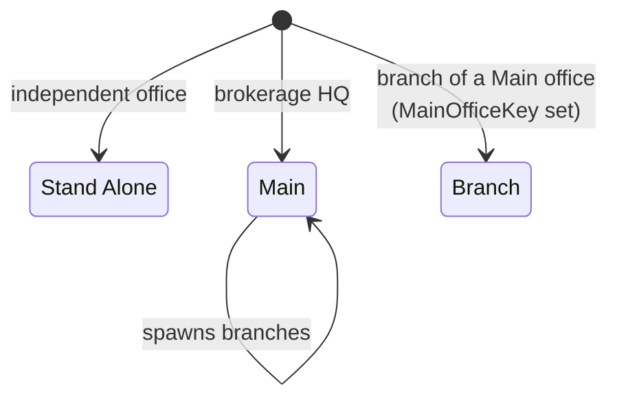
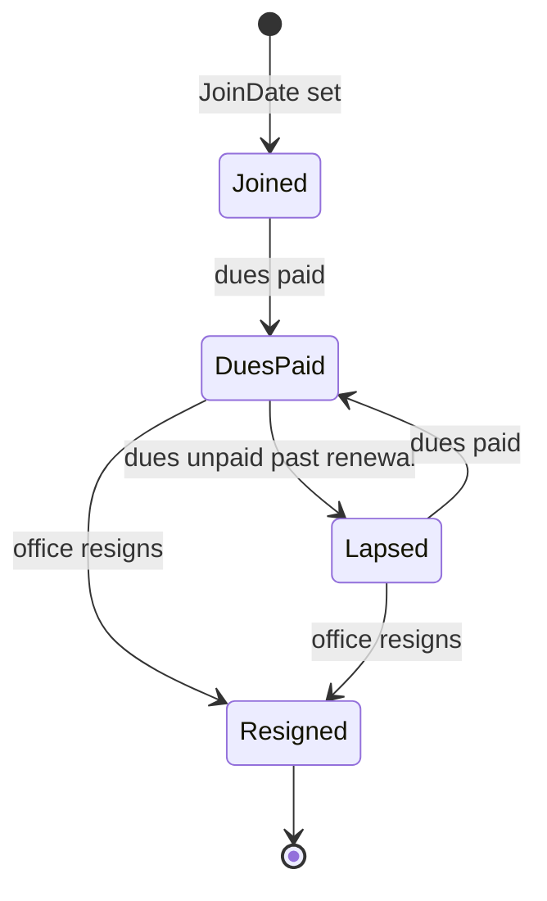
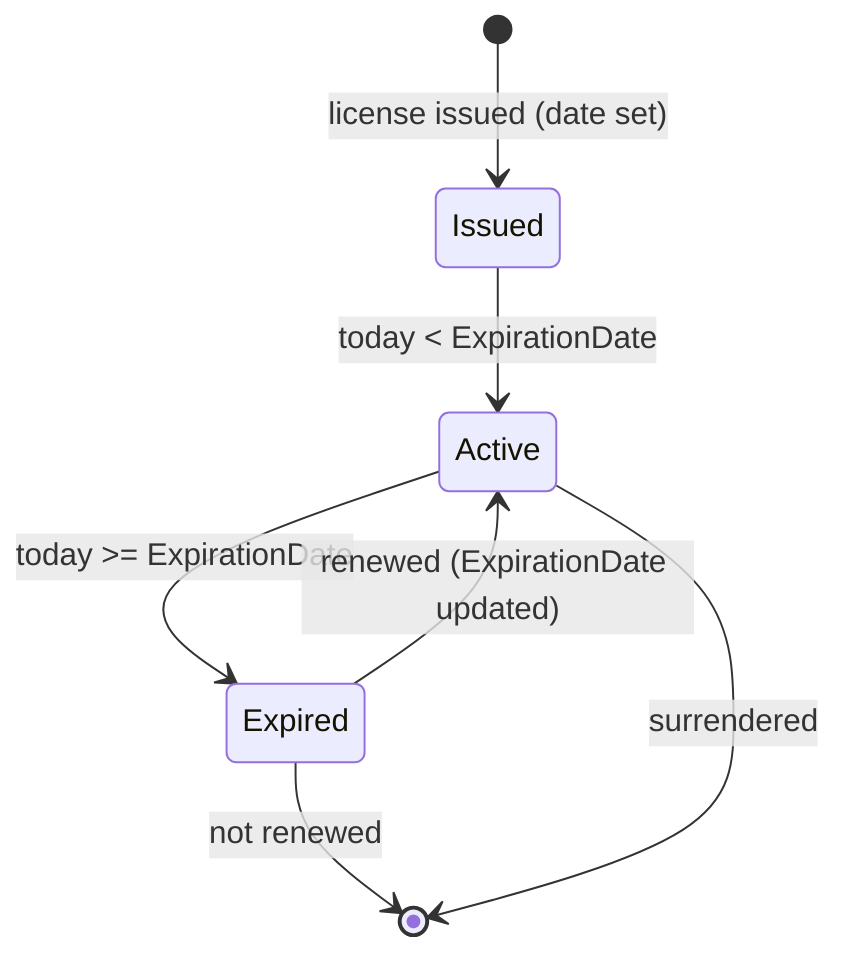

# Office onboarding (canonical, RESO DD 2.0)

How a brokerage office flows from registration to active operations
and beyond, expressed in RESO DD 2.0 vocabulary. Four resources
collaborate: `Office`, `OfficeAssociation`, `OfficeCorporateLicense`,
and `OUID` (the federation-level Organization Unique Identifier).

This is the canonical baseline. Project flavours (e.g. franchise
sponsorship paperwork, branding setup, trust-account opening) belong
in [`docs/business-processes/`](../../index.md);
they MUST map onto the canonical states defined here.

## Scope

In scope:

- The `Office.OfficeStatus` lifecycle.
- The `Office.OfficeBranchType` and `Office.OfficeType` typology.
- The `OfficeAssociation` lifecycle (per-association registration).
- The `OfficeCorporateLicense` lifecycle (corporate-license issuance
  and renewal).
- The `OUID` registration as the federation-level identity.

Out of scope:

- Member onboarding (see [`member-onboarding.md`](member-onboarding.md)).
- Team formation (see [`team-lifecycle.md`](team-lifecycle.md)).
- Listings made under the office (see
  [`listing-lifecycle.md`](listing-lifecycle.md)).

## Primary state machine: `Office.OfficeStatus`

`OfficeStatus` is a closed RESO lookup with two values:
`Active`, `Inactive`.

`OfficeStatus` lookup values: `Active`, `Inactive`.

### Transition table

| From | To | Trigger | Required field changes |
|---|---|---|---|
| `[*]` | `Active` | License verified, OUID registered, AOR joined, broker designated | `OfficeKey`, `OfficeMlsId`, `OfficeName`, `OfficeBrokerKey`, `OfficeBranchType`, `OfficeType`, `OfficePrimaryAorId`, `OfficeStatus = Active`, `OfficeNationalAssociationId`, address block, `OriginalEntryTimestamp`, `OrganizationUniqueId`, `OfficeCorporateLicense`, `OfficeCorporateLicenseState`, `OfficeCorporateLicenseExpirationDate` |
| `Active` | `Inactive` | License expired / broker resigned / office closed | `OfficeStatus = Inactive`, `ModificationTimestamp`; cascade `OfficeAssociationStatus` updates; cascade member-side `MemberStatus` if no other office available |
| `Inactive` | `Active` | Re-licensed AND broker re-designated | `OfficeStatus = Active`, refreshed `OfficeCorporateLicenseExpirationDate` |

## Secondary state: `Office.OfficeBranchType`

`OfficeBranchType` partitions the office relative to its parent.

`OfficeBranchType` lookup values:
`Stand Alone`, `Main`, `Branch`.

| Field | Role |
|---|---|
| `OfficeBranchType` | The trichotomy above |
| `MainOffice`, `MainOfficeKey`, `MainOfficeMlsId` | FK to the `Main` office when `OfficeBranchType = Branch` |
| `NumberOfBranches` | On a `Main`, count of children; computed |

## `Office.OfficeType` (function and licensure)

`OfficeType` is a closed RESO lookup with eleven values, partitioning
the office by function:

| Group | Values |
|---|---|
| REALTOR | `Realtor Firm`, `Realtor Office`, `Realtor Branch Office` |
| MLS-only | `MLS Only Firm`, `MLS Only Office`, `MLS Only Branch` |
| Non-realtor | `Affiliate`, `Appraiser`, `Association`, `MLS`, `Non Member/Vendor` |

The canonical baseline does NOT draw transitions between office
types - it is a deliberate administrative event and writes a
`HistoryTransactional` row.

## `OfficeAssociation` (per-association registration)

An `Office` may belong to multiple associations (local AOR, state
AOR, national NAR). One `OfficeAssociation` row per pair.
`OfficeAssociationStatus` is an open lookup; the canonical baseline
treats it as project-encoded with the same join/dues semantics as
`MemberAssociation`.

| Field | Role |
|---|---|
| `OfficeAssociationStatus` | Per-association state (see narrative) |
| `OfficeAssociationStatusDate` | Date that status was set |
| `JoinDate` | Initial join |
| `BillStatus` | Free-form; canonical baseline mirrors `MemberAssociationBillStatus` semantics |
| `OfficeAssociationPrimaryIndicator` | `true` if this is the office's primary AOR |
| `AssociationKey`, `AssociationMlsId`, `AssociationNationalAssociationId` | FK to `Association` |

The `OfficeAssociation` for the `Office.OfficePrimaryAorId` AOR
MUST have `OfficeAssociationPrimaryIndicator = true`.

## `OfficeCorporateLicense` (corporate license)

An `Office` may hold multiple corporate licenses (e.g. firm
licensed in two states). One `OfficeCorporateLicense` row per
state.

State is implicit (computed from
`OfficeCorporateLicenseExpirationDate`).

| Field | Role |
|---|---|
| `OfficeCorporateLicenseKey` | PK |
| `Office`, `OfficeKey`, `OfficeMlsId` | FK to `Office` |
| `OfficeCorporateLicense` | License number string |
| `OfficeCorporateLicenseState` | State / province |
| `OfficeCorporateLicenseType` | `Broker`, `Appraiser` |
| `OfficeCorporateLicenseExpirationDate` | Renewal deadline |
| `ModificationTimestamp` | Audit |

## `OUID` (federation-level Organization Unique ID)

`OUID` is the cross-MLS, cross-AOR identity for the office. It is
issued by the OUID registry (operated by RESO/CMLS) and is the
federation key that lets the same office be identified across
multiple MLSs.

`OrganizationStatus` is an open lookup on `OUID`; the canonical
baseline treats `OrganizationStatus` lockstep with the parent
`Office.OfficeStatus`.

| Field | Role |
|---|---|
| `OrganizationUniqueId`, `OrganizationUniqueIdKey` | PK / federation key |
| `OrganizationName` | Office's federation-level name |
| `OrganizationType` | Open lookup; mirrors `Office.OfficeType` semantics |
| `OrganizationStatus`, `OrganizationStatusChangeTimestamp` | State (open lookup) |
| `OrganizationStateLicense`, `OrganizationStateLicenseState` | Federation-level corporate license |
| `OrganizationContactFirstName`, `OrganizationContactLastName`, `OrganizationContactEmail`, `OrganizationContactPhone` | Federation-level point of contact |
| `OrganizationMemberCount` | Cached count |
| `OrganizationMlsCode`, `OrganizationMlsVendorOuid` | MLS membership identifiers |

`Office.OrganizationUniqueId` (a string-typed FK on `Office`) is the
canonical pointer; once written, it is immutable.

## Decision points

| Decision | Inputs | Outputs |
|---|---|---|
| Activate the office | Corporate license verified AND `OfficeAssociation.OfficeAssociationPrimaryIndicator` row exists AND broker designated AND `OUID` registered | `OfficeStatus = Active` |
| Deactivate the office | Primary AOR resigned OR primary corporate license expired without renewal OR broker not replaced after resignation | `OfficeStatus = Inactive`, cascade |
| Spawn a branch | New office under existing main | Insert `Office` row with `OfficeBranchType = Branch`, `MainOfficeKey` set; main's `NumberOfBranches` increments |
| Promote primary association | New AOR designated as primary | Toggle `OfficeAssociationPrimaryIndicator` (only one row may be `true`); update `Office.OfficePrimaryAorId` |
| Add a second corporate license | Cross-state expansion | Insert `OfficeCorporateLicense`; do NOT overwrite `Office.OfficeCorporateLicense*` if the new license is non-primary |

## Cross-resource interactions

- `Office.OfficeBrokerKey` points to a `Member` row (the designated
  broker); see [`member-onboarding.md`](member-onboarding.md). The
  designated broker MUST be `MemberStatus = Active`.
- `Office.OfficeManagerKey` is an optional pointer to another
  `Member`.
- A `Member.OfficeKey` is the FK from member to office; an `Active`
  member MUST have a non-null `OfficeKey`.
- `Property.ListOfficeKey` cites this resource on every listing;
  see [`listing-lifecycle.md`](listing-lifecycle.md).
- `Teams.OfficeKey` ties teams to their office; see
  [`team-lifecycle.md`](team-lifecycle.md).
- Every `OfficeStatus` change emits a `HistoryTransactional` row
  with `ResourceName = Office`,
  `ResourceRecordKey = Office.OfficeKey`; see
  [`transaction-lifecycle.md`](transaction-lifecycle.md).

## Identifier semantics

- `OfficeKey` is the immutable opaque PK.
- `OfficeMlsId` is the human-facing MLS identifier; subject to
  jurisdiction re-use rules but the canonical baseline says do NOT
  re-use.
- `OfficePrimaryAorId` is the office's primary association
  identifier; cross-references the
  `OfficeAssociationPrimaryIndicator = true` row.
- `OrganizationUniqueId` is the federation-level identity; once
  written on `Office`, it is immutable. Re-issuance of an OUID is
  modelled as a new `Office` row.
- `OriginatingSystemOfficeKey`, `SourceSystemOfficeKey` carry
  federation identifiers when the row was syndicated.

## Non-goals

- No opinion on franchise sponsorship paperwork - project flavour.
- No opinion on trust-account opening - project flavour.
- No opinion on errors-and-omissions insurance - project flavour.
- No opinion on commission-policy templates - project flavour.

<!-- reso-citations
Resource: Office
Resource: OfficeAssociation
Resource: OfficeCorporateLicense
Resource: OUID
Field: Office.OfficeKey
Field: Office.OfficeMlsId
Field: Office.OfficeName
Field: Office.OfficeStatus
Field: Office.OfficeBranchType
Field: Office.OfficeType
Field: Office.OfficeBrokerKey
Field: Office.OfficeBrokerMlsId
Field: Office.OfficeBroker
Field: Office.OfficeManager
Field: Office.OfficeManagerKey
Field: Office.OfficePrimaryAorId
Field: Office.OfficeNationalAssociationId
Field: Office.MainOffice
Field: Office.MainOfficeKey
Field: Office.MainOfficeMlsId
Field: Office.NumberOfBranches
Field: Office.OfficeCorporateLicense
Field: Office.OriginalEntryTimestamp
Field: Office.ModificationTimestamp
Field: Office.OriginatingSystemOfficeKey
Field: Office.SourceSystemOfficeKey
Field: OfficeAssociation.AssociationKey
Field: OfficeAssociation.AssociationMlsId
Field: OfficeAssociation.AssociationNationalAssociationId
Field: OfficeAssociation.Office
Field: OfficeAssociation.OfficeKey
Field: OfficeAssociation.OfficeMlsId
Field: OfficeAssociation.OfficeAssociationStatus
Field: OfficeAssociation.OfficeAssociationStatusDate
Field: OfficeAssociation.JoinDate
Field: OfficeAssociation.BillStatus
Field: OfficeAssociation.OfficeAssociationPrimaryIndicator
Field: OfficeAssociation.ModificationTimestamp
Field: OfficeCorporateLicense.OfficeCorporateLicenseKey
Field: OfficeCorporateLicense.Office
Field: OfficeCorporateLicense.OfficeKey
Field: OfficeCorporateLicense.OfficeMlsId
Field: OfficeCorporateLicense.OfficeCorporateLicense
Field: OfficeCorporateLicense.OfficeCorporateLicenseState
Field: OfficeCorporateLicense.OfficeCorporateLicenseType
Field: OfficeCorporateLicense.OfficeCorporateLicenseExpirationDate
Field: OfficeCorporateLicense.ModificationTimestamp
Field: OUID.OrganizationUniqueId
Field: OUID.OrganizationUniqueIdKey
Field: OUID.OrganizationName
Field: OUID.OrganizationType
Field: OUID.OrganizationStatus
Field: OUID.OrganizationStatusChangeTimestamp
Field: OUID.OrganizationStateLicense
Field: OUID.OrganizationStateLicenseState
Field: OUID.OrganizationContactFirstName
Field: OUID.OrganizationContactLastName
Field: OUID.OrganizationContactEmail
Field: OUID.OrganizationContactPhone
Field: OUID.OrganizationMemberCount
Field: OUID.OrganizationMlsCode
Field: OUID.OrganizationMlsVendorOuid
LookupValue: OfficeStatus.Active
LookupValue: OfficeStatus.Inactive
LookupValue: OfficeBranchType.Stand Alone
LookupValue: OfficeBranchType.Main
LookupValue: OfficeBranchType.Branch
LookupValue: OfficeType.Realtor Firm
LookupValue: OfficeType.Realtor Office
LookupValue: OfficeType.Realtor Branch Office
LookupValue: OfficeType.MLS Only Firm
LookupValue: OfficeType.MLS Only Office
LookupValue: OfficeType.MLS Only Branch
LookupValue: OfficeType.Affiliate
LookupValue: OfficeType.Appraiser
LookupValue: OfficeType.Association
LookupValue: OfficeType.MLS
LookupValue: OfficeType.Non Member/Vendor
LookupValue: OfficeCorporateLicenseType.Broker
LookupValue: OfficeCorporateLicenseType.Appraiser
-->
