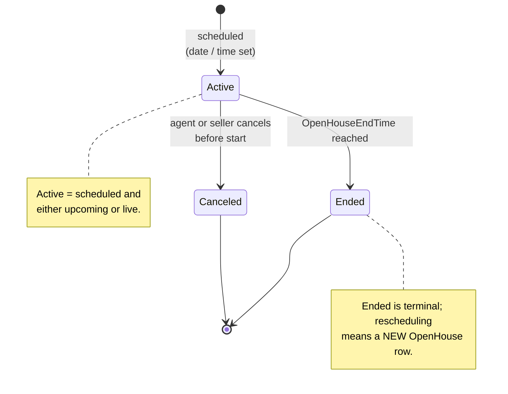

# Open house lifecycle (canonical, RESO DD 2.0)

The state machine of an `OpenHouse` event from scheduling through
the event itself to retirement.

> **Integration links**:
>
> - Source mapping: `OpenHouse` is not yet in scope of the 6-resource
>   Layer-2 curated set; cross-reference the linked listing via
>   [`../../../data-models/source-mappings/wiki/agent-docs/by_resource/property.md`](../../../data-models/source-mappings/wiki/agent-docs/by_resource/property.md).
> - Sharp-SIR flavour: open houses appear inside
>   [`../../listing-pipeline.md`](../../listing-pipeline.md) (Active
>   Listing stage marketing tasks).
> - One-stop integrated view (per linked listing):
>   [`../../../integration/wiki/agent-docs/by_resource/property.md`](../../../integration/wiki/agent-docs/by_resource/property.md)

This is the canonical baseline. Project flavours (e.g. brokerage
caravans, themed twilight tours, agent-only previews) MUST map onto
the canonical states defined here.

## Scope

In scope:

- The `OpenHouse.OpenHouseStatus` state machine.
- The relationship between `OpenHouseType` and the listing's
  `Property.StandardStatus` gating.
- Livestream and physical-presence variants.
- The relationship to `Caravan` (for brokerage caravans).

Out of scope:

- The listing's own status (see [`listing-lifecycle.md`](listing-lifecycle.md)).
- Lead capture during the open house (see
  [`lead-contact-lifecycle.md`](lead-contact-lifecycle.md)).
- The `Caravan` parent process (see
  [`caravan-lifecycle.md`](caravan-lifecycle.md)).
- Showings outside open-house windows (see
  [`showing-lifecycle.md`](showing-lifecycle.md)).

## Primary state machine: `OpenHouse.OpenHouseStatus`

`OpenHouseStatus` is a closed RESO lookup with three values.

`OpenHouseStatus` lookup values: `Active`, `Canceled`, `Ended`.

### Transition table

| From | To | Trigger | Required field changes |
|---|---|---|---|
| `[*]` | `Active` | Open house scheduled | `OpenHouseKey`, `OpenHouseId`, `ListingKey`, `OpenHouseDate`, `OpenHouseStartTime`, `OpenHouseEndTime`, `OpenHouseType`, `OpenHouseStatus = Active`, `ShowingAgentKey` |
| `Active` | `Canceled` | Cancel before `OpenHouseStartTime` | `OpenHouseStatus = Canceled`, `ModificationTimestamp` |
| `Active` | `Ended` | `OpenHouseEndTime` reached | `OpenHouseStatus = Ended`, `ModificationTimestamp` |

The canonical baseline does NOT model "reschedule" as a transition;
a rescheduled open house is a new `OpenHouse` row, with the original
row moved to `Canceled`.

## Secondary state: `OpenHouse.OpenHouseType`

`OpenHouseType` partitions audience and modality.

| Value | Audience | Modality |
|---|---|---|
| `Public` | Anyone | In-person |
| `Broker` | Licensed agents only | In-person |
| `Office` | Same brokerage only | In-person |
| `Livestream Public` | Anyone | Online |
| `Livestream Broker` | Licensed agents only | Online |

`Livestream*` variants MUST also set `LivestreamOpenHouseURL`.
In-person variants MAY set `OpenHouseAttendedBy` (open lookup) and
`Refreshments` (free-text).

## Decision points

| Decision | Inputs | Outputs |
|---|---|---|
| `Public` vs `Broker` vs `Office` | Marketing strategy | `OpenHouseType` |
| Livestream or in-person | Listing access constraints | `OpenHouseType ` (one of `Livestream*` or in-person), `LivestreamOpenHouseURL` if livestream |
| Appointment required? | Seller preference | `AppointmentRequiredYN`; if `true`, attendance flows through `ShowingRequest` |
| `Canceled` vs `Ended` | Was the event held at all? | `Canceled` if cut before start; `Ended` if it ran to completion (or partial) |

## Cross-resource interactions

- An `OpenHouse` is only valid while the linked listing's
  `Property.StandardStatus = Active`. See
  [`listing-lifecycle.md`](listing-lifecycle.md). RESO does NOT
  prevent linking to a non-active listing, but the canonical
  baseline forbids it.
- `OpenHouse` is the child of `Caravan` when the open house was
  scheduled inside a brokerage caravan; see
  [`caravan-lifecycle.md`](caravan-lifecycle.md). The `OpenHouse`
  row exists independently but the caravan stop references its
  `OpenHouseKey`.
- `AppointmentRequiredYN = true` redirects attendance through the
  showing-request machinery; see
  [`showing-lifecycle.md`](showing-lifecycle.md). The
  `ShowingRequestType = Walk-through` is the canonical mapping.
- Lead capture at the open house writes new `Contacts` rows with
  `LeadSource = Open House`; see
  [`lead-contact-lifecycle.md`](lead-contact-lifecycle.md).
- `SocialMedia` and `Media` rows attached to the open house are
  governed by [`media-lifecycle.md`](media-lifecycle.md).
- Every state change emits a `HistoryTransactional` row with
  `ResourceName = Property`,
  `ResourceRecordKey = Property.ListingKey` of the linked listing;
  see [`transaction-lifecycle.md`](transaction-lifecycle.md).

## Identifier semantics

- `OpenHouseKey` is the immutable opaque PK; never re-used, never
  edited.
- `OpenHouseId` is the human-facing identifier.
- `ListingKey` / `ListingId` are FK to `Property`; immutable while
  the open house exists.
- `ShowingAgentKey` is the listing-side `Member` running the open
  house; the canonical baseline allows it to differ from
  `Property.ListAgentKey` (e.g. junior agent runs the OH for the
  listing agent).
- `OriginatingSystemKey` / `SourceSystemKey` carry federation
  identifiers when the open house was syndicated from another
  system.

## Non-goals

- No opinion on RSVP capture mechanism; project flavours choose.
- No opinion on photo/livestream platforms; the canonical baseline
  only requires `LivestreamOpenHouseURL` to be set for livestream
  variants.
- No opinion on broker-caravan logistics (lunch, route order,
  carpool); see [`caravan-lifecycle.md`](caravan-lifecycle.md).

<!-- reso-citations
Resource: OpenHouse
Resource: Property
Field: OpenHouse.OpenHouseKey
Field: OpenHouse.OpenHouseId
Field: OpenHouse.OpenHouseStatus
Field: OpenHouse.OpenHouseType
Field: OpenHouse.OpenHouseDate
Field: OpenHouse.OpenHouseStartTime
Field: OpenHouse.OpenHouseEndTime
Field: OpenHouse.OpenHouseAttendedBy
Field: OpenHouse.OpenHouseRemarks
Field: OpenHouse.AppointmentRequiredYN
Field: OpenHouse.LivestreamOpenHouseURL
Field: OpenHouse.Refreshments
Field: OpenHouse.ListingId
Field: OpenHouse.ListingKey
Field: OpenHouse.Listing
Field: OpenHouse.Media
Field: OpenHouse.SocialMedia
Field: OpenHouse.ShowingAgent
Field: OpenHouse.ShowingAgentKey
Field: OpenHouse.ShowingAgentMlsID
Field: OpenHouse.OriginalEntryTimestamp
Field: OpenHouse.ModificationTimestamp
Field: OpenHouse.OriginatingSystem
Field: OpenHouse.OriginatingSystemKey
Field: OpenHouse.SourceSystem
Field: OpenHouse.SourceSystemKey
LookupValue: OpenHouseStatus.Active
LookupValue: OpenHouseStatus.Canceled
LookupValue: OpenHouseStatus.Ended
LookupValue: OpenHouseType.Public
LookupValue: OpenHouseType.Broker
LookupValue: OpenHouseType.Office
LookupValue: OpenHouseType.Livestream Public
LookupValue: OpenHouseType.Livestream Broker
-->
