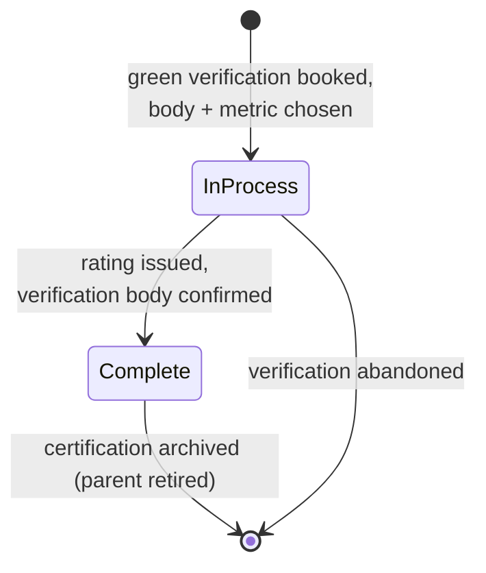
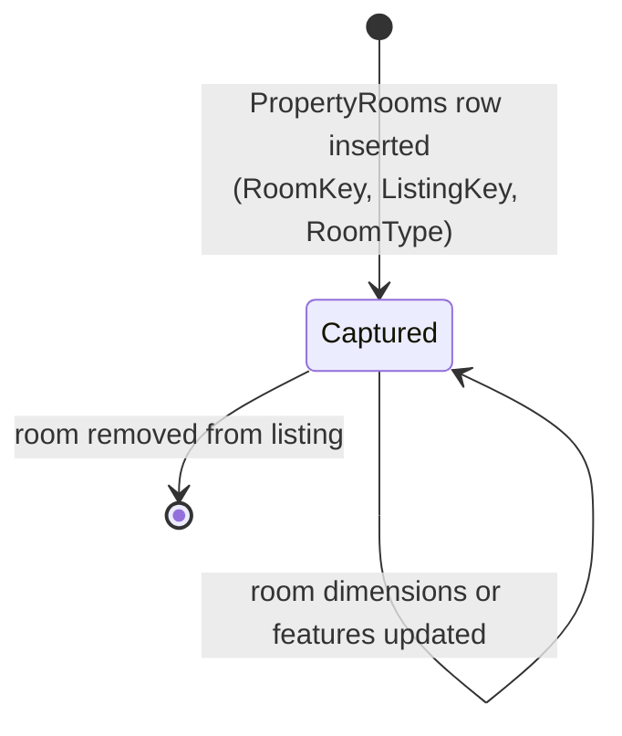
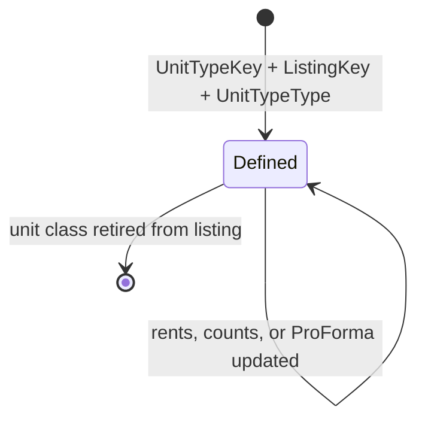
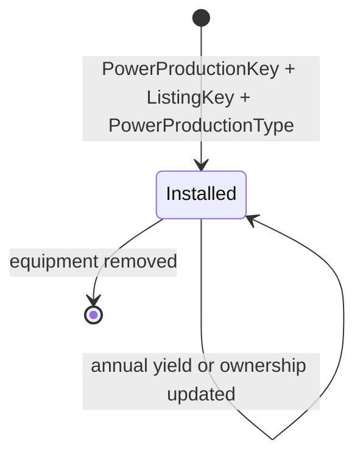
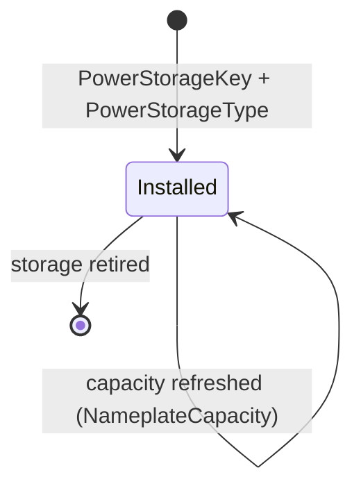

# Property detail attachment lifecycle (canonical, RESO DD 2.0)

How RESO DD 2.0 Property child resources attach to a listing, evolve,
and detach. Five resources collaborate as 1:N children of `Property`:
`PropertyRooms`, `PropertyUnitTypes`, `PropertyGreenVerification`,
`PropertyPowerProduction`, and `PropertyPowerStorage`. Each row is
anchored to a parent listing via `ListingKey`.

> **Integration links**:
>
> - Source mapping (Dash / Qobrix / SIR -> RESO Property children):
>   the canonical mapping is the per-resource page in
>   [`../../../data-models/source-mappings/wiki/agent-docs/by_resource/`](../../../data-models/source-mappings/wiki/agent-docs/by_resource/)
>   (`property_rooms.md`, `property_unit_types.md`,
>   `property_green_verification.md`, `property_power_production.md`,
>   `property_power_storage.md`).
> - Sharp-SIR flavour: no project-flavour SOP yet — promote one
>   under `docs/business-processes/` when Sharp-SIR codifies room
>   capture, EPC ingestion, or PV/storage data entry.

This is the canonical baseline. Project flavours (UI capture order,
EPC document templates, multi-unit billing) belong in
[`docs/business-processes/`](../../index.md).

## Scope

In scope:

- Per-attachment row lifecycle from creation to retirement.
- The `PropertyGreenVerification.GreenVerificationStatus` state
  machine (the only RESO-published lifecycle status across the five
  child resources).
- Detach semantics when the parent `Property` is withdrawn or sold.
- Fan-out of `ModificationTimestamp` updates between parent and
  child rows.

Out of scope:

- Parent listing transitions (see
  [`listing-lifecycle.md`](listing-lifecycle.md)).
- Photo/document attachment (see
  [`media-lifecycle.md`](media-lifecycle.md)).
- Open-house, showing, and transaction events (separate processes).

## Primary state machine: `PropertyGreenVerification.GreenVerificationStatus`

`GreenVerificationStatus` is the only closed RESO lookup with a
documented status surface across the five child resources. It
encodes whether a green-building certification is provisional or
final.



`GreenVerificationStatus` lookup values: `In Process`, `Complete`.

### Transition table

| From | To | Trigger | Required field changes |
|---|---|---|---|
| `[*]` | `In Process` | Verification scheduled with a body and a metric | `GreenBuildingVerificationKey`, `ListingKey`, `GreenVerificationBody`, `GreenVerificationMetric`, `GreenVerificationStatus = In Process`, `ModificationTimestamp` |
| `In Process` | `Complete` | Body issues a rating | `GreenVerificationRating`, `GreenVerificationYear`, `GreenVerificationVersion`, `GreenVerificationURL`, `GreenVerificationStatus = Complete`, `ModificationTimestamp` |
| `In Process` | `[*]` | Verification abandoned (no rating issued) | row deleted; parent listing emits `HistoryTransactional` (`ChangeType` per parent state) |
| `Complete` | `[*]` | Parent listing retired or replaced | row deleted or parent rolled forward |

## `PropertyRooms` (per-room detail rows)

`PropertyRooms` does not publish a closed `Status` lookup. The
attachment lifecycle is modelled as insert / update / delete with
the parent `Property.ListingKey` as the anchor.



### `RoomType` typology

`RoomType` is a closed RESO lookup. Examples cited by the canonical
baseline (vendor-neutral) include the standard living, sleeping,
service, and recreational categories.

| Group | Values |
|---|---|
| Living | `Living Room`, `Family Room`, `Great Room`, `Den`, `Library` |
| Sleeping | `Bedroom`, `Master Bedroom`, `Bedroom 1` |
| Service | `Kitchen`, `Laundry`, `Utility Room`, `Bathroom`, `Master Bathroom` |
| Recreational | `Game Room`, `Media Room`, `Gym`, `Exercise Room`, `Sauna` |
| Workspace | `Office`, `Workshop` |

### Decision points

| Decision | Inputs | Outputs |
|---|---|---|
| Capture room | New room measured | Insert row with `RoomKey`, `ListingKey`, `RoomType` |
| Update measurements | Re-measure / correction | Update `RoomLength`, `RoomWidth`, `RoomArea`, `RoomAreaUnits`, `RoomLengthWidthSource`; bump `ModificationTimestamp` |
| Reclassify | Stager / agent reassigns | Update `RoomType`, `RoomDescription`, `RoomFeatures`; bump `ModificationTimestamp` |
| Remove | Room reclassified out of inventory | Delete row; parent listing emits `HistoryTransactional` |

## `PropertyUnitTypes` (multi-unit roll-up)

Used on income and multi-family `Property` rows. Each row models a
unit class (e.g. `2 Bedroom`, `Studio`, `Penthouse`) — not an
individual unit instance.



### `UnitTypeType` typology

`UnitTypeType` is a closed RESO lookup. Common values:
`Studio`, `1 Bedroom`, `2 Bedroom`, `3 Bedroom`,
`4 Bedroom Or More`, `Penthouse`, `Loft`, `Apartments`,
`Efficiency`, `Manager's Unit`.

### Decision points

| Decision | Inputs | Outputs |
|---|---|---|
| Define class | New unit class published on listing | `UnitTypeKey`, `ListingKey`, `UnitTypeType`, `UnitTypeUnitsTotal`, `UnitTypeBedsTotal`, `UnitTypeBathsTotal` |
| Update economics | Rent roll refresh | `UnitTypeActualRent`, `UnitTypeTotalRent`, `UnitTypeProForma`, `ModificationTimestamp` |
| Retire | Class removed from offering | Delete row |

## `PropertyPowerProduction` (on-site generation)



### `PowerProductionType` typology

Closed RESO lookup. Canonical baseline cites: `Photovoltaics`,
`Wind`.

### Decision points

| Decision | Inputs | Outputs |
|---|---|---|
| Install | New PV/wind installation | `PowerProductionKey`, `ListingKey`, `PowerProductionType`, `PowerProductionSize`, `PowerProductionYearInstall`, `PowerProductionOwnership` |
| Update yield | Annual reading | `PowerProductionAnnual`, `PowerProductionAnnualStatus`, `ModificationTimestamp` |
| Decommission | Equipment removed | Delete row |

## `PropertyPowerStorage` (on-site storage)



### `PowerStorageType` typology

Closed RESO lookup. Canonical baseline cites:
`Lithium Ion Battery`, `Lithium Iron Phosphate`,
`Lead Acid Battery`, `Other`, `Unknown`.

### Decision points

| Decision | Inputs | Outputs |
|---|---|---|
| Install | New storage system | `PowerStorageKey`, `PowerStorageType`, `NameplateCapacity`, `DateOfInstallation`, `InformationSource` |
| Refresh capacity | Replacement / firmware bump | Update `NameplateCapacity`, `ModificationTimestamp` |
| Retire | Storage removed | Delete row |

## Cross-resource interactions

- Every child row carries `ListingKey`. The canonical baseline
  REQUIRES that `ListingKey` resolves to an existing
  [`Property`](listing-lifecycle.md) row. Orphaned children are a
  hard error in any consumer that joins parent and child.
- Any child-row insert, update, or delete emits a
  [`HistoryTransactional`](history-and-audit-log.md) row scoped to
  the parent `Property` (`ResourceName = Property`,
  `ResourceRecordKey = Property.ListingKey`).
- When the parent listing transitions to `StandardStatus = Closed`
  or `Withdrawn` (per
  [`listing-lifecycle.md`](listing-lifecycle.md)), the canonical
  baseline RECOMMENDS retaining child rows as historical evidence
  rather than deleting them; deletion is required only when the
  child datum becomes factually invalid (e.g. equipment physically
  removed).
- `PropertyGreenVerification.GreenVerificationStatus = Complete` is
  a positive marker for downstream consumers (lender energy
  efficiency products, marketing badges); transitions out of
  `Complete` are not modelled in RESO and SHOULD NOT happen — issue
  a new verification row instead.

## Identifier semantics

- Each child resource has its own opaque PK
  (`RoomKey`, `UnitTypeKey`, `GreenBuildingVerificationKey`,
  `PowerProductionKey`, `PowerStorageKey`).
- `ListingKey` is the FK back to `Property`.
- `ModificationTimestamp` on a child row is independent from the
  parent's `ModificationTimestamp`; both must be maintained.

## Non-goals

- No opinion on which child resources a project must populate.
- No opinion on capture UI ordering — project flavour.
- No opinion on retention policy after parent retirement.

## Atlas implementation

This is the implementation contract for builders (human or AI)
wiring this canonical process into Atlas. It does NOT change the
canonical model — every resource and field cited below is already
in the citations block. Atlas filenames are descriptive, not
authoritative; the canonical contract is the resource keys, table
names, and column names. If a file moves, the contract does not.

The "do not build" call-out below applies only to the Atlas UI.
The canonical citations stay; the resource is real in RESO DD 2.0.
Atlas just does not surface it.

### Provisioning status

Three buckets:

| Resource | Status | CDL table | `mls-sync` resource key | Backend gap |
|---|---|---|---|---|
| `PropertyRooms` | Ship now | `public.property_rooms` | `rooms` | none |
| `PropertyUnitTypes` | Ship now | `public.property_unit_types` | `unit_types` | none |
| `PropertyGreenVerification` | Gate as Coming Soon | not provisioned | none | matrix-platform-foundation: provision `public.property_green_verification`; add `green_verification` mapper to `SYNC_RESOURCES` in `mls-sync` |
| `PropertyPowerStorage` | Gate as Coming Soon | not provisioned | none | matrix-platform-foundation: provision `public.property_power_storage`; add `power_storage` mapper to `SYNC_RESOURCES` |
| `PropertyPowerProduction` | Do not build | retired | retired | the table was dropped by `20260504080000_pr1_5_pr1_6_drop_teams_and_power_production.sql` and the mapper was removed from `SYNC_RESOURCES`. Atlas MUST NOT show a tab for this resource. |

For "Coming Soon" resources, ship the UI behind a clear empty
state ("Coming soon — CDL backend pending") and stub the data
hooks; do not call PostgREST or `mls-sync` for them.

### Reads

Use the anonymous CDL client directly — RLS allows anon SELECT on
the provisioned child tables:

```ts
import { cdlAnonClient } from '@/integrations/supabase/cdlClient';

const { data, error } = await cdlAnonClient
  .from('property_rooms')           // or 'property_unit_types'
  .select('*')
  .eq('listing_key', listingKey)
  .order('modification_timestamp', { ascending: false });
```

For paged list views (any explorer-style table), use
`useCdlTablePage` from `src/hooks/useMlsData.ts`.

The `mls-sync` `list-resource` action is also wired for `rooms`
and `unit_types`, but it does NOT accept a parent `listing_key`
filter — it scopes only by tenant `originating_system_name`. For
parent-scoped reads, prefer `cdlAnonClient` with `.eq('listing_key', ...)`.

### Writes

Always through the CDL Edge Function, never through PostgREST
directly. Resource key is the logical key (e.g. `rooms`), not the
table name (e.g. `property_rooms`).

```ts
import { invokeCdl } from '@/lib/edge-functions';

await invokeCdl('mls-sync', {
  action: 'upsert-resource',
  resource: 'rooms',                 // 'unit_types' for the sibling tab
  row: {
    // include `id` to update; omit to insert.
    listing_key: listingKey,
    room_type: 'Bedroom',
    room_level: 'Second',
    room_length: 12,
    room_width: 14,
    room_length_width_units: 'Feet',
    modification_timestamp: new Date().toISOString(),
  },
});

await invokeCdl('mls-sync', {
  action: 'delete-resource',
  resource: 'rooms',
  id: rowId,
  hard: true,                        // tables here have no soft-delete
});
```

The EF strips `created_at`, `updated_at`, `locked_fields`, and
`content_hash` from the payload; mints a synthetic source key on
insert if needed; pins `originating_system_name` to the caller's
tenant; and refuses cross-tenant writes. Hard delete is
permitted only to `system_admin` callers.

### Tables and columns

`public.property_rooms` (post-Wave-1 strict schema):

- PKs / FKs: `id` (uuid), `room_key` (RESO RoomKey),
  `listing_key` (RESO ListingKey, FK to `Property.listing_key`),
  `originating_system_name` + `originating_system_room_key`
  (tenant-scoped uniqueness).
- RESO fields: `room_type`, `room_level`, `room_dimensions`,
  `room_length`, `room_width`, `room_area`, `room_features`,
  `room_description`, `modification_timestamp`,
  `original_entry_timestamp`.

`public.property_unit_types` (post-Wave-1 strict schema):

- PKs / FKs: `id`, `unit_type_key`, `listing_key`,
  `originating_system_name` + `originating_system_unit_type_key`.
- RESO fields: `unit_type_type`, `unit_type_beds_total`,
  `unit_type_baths_total`, `unit_type_units_total`,
  `unit_type_actual_rent`, `unit_type_total_rent`,
  `unit_type_description`, `unit_type_furnished`,
  `unit_type_garage_spaces`, `modification_timestamp`,
  `original_entry_timestamp`.

Hard prohibitions on the data plane (do NOT reintroduce — these
were retired in the Strict-RESO sweep):
`source_id`, `x_*`, `is_visible`, `is_deleted`, `deleted_at`,
`content_hash`, `locked_fields`, `locked_field_names`, `raw`.

### History emission contract

Every successful insert / update / delete on a child row MUST
write a `public.history_transactional` row scoped to the parent
property:

- `ResourceName = 'Property'`
- `ResourceRecordKey = Property.ListingKey`
- `ChangeType` follows the canonical
  [`history-and-audit-log.md`](history-and-audit-log.md)
  contract; for child-row mutations the producer typically uses
  field-level rows (no `ChangeType`, with `FieldName` /
  `FieldKey` / `PreviousValue` / `NewValue`).

This emission is the producer's responsibility (the `mls-sync`
EF, in the same transaction as the upsert/delete). The Atlas
caller does NOT call a separate emit-history RPC.

<!-- reso-citations
Resource: PropertyRooms
Resource: PropertyUnitTypes
Resource: PropertyGreenVerification
Resource: PropertyPowerProduction
Resource: PropertyPowerStorage
Field: PropertyRooms.RoomKey
Field: PropertyRooms.ListingKey
Field: PropertyRooms.ListingId
Field: PropertyRooms.RoomType
Field: PropertyRooms.RoomDescription
Field: PropertyRooms.RoomFeatures
Field: PropertyRooms.RoomLength
Field: PropertyRooms.RoomWidth
Field: PropertyRooms.RoomArea
Field: PropertyRooms.RoomAreaUnits
Field: PropertyRooms.RoomAreaSource
Field: PropertyRooms.RoomLengthWidthSource
Field: PropertyRooms.RoomLengthWidthUnits
Field: PropertyRooms.RoomLevel
Field: PropertyRooms.RoomDimensions
Field: PropertyRooms.BedroomClosetType
Field: PropertyRooms.ModificationTimestamp
Field: PropertyUnitTypes.UnitTypeKey
Field: PropertyUnitTypes.ListingKey
Field: PropertyUnitTypes.ListingId
Field: PropertyUnitTypes.UnitTypeType
Field: PropertyUnitTypes.UnitTypeUnitsTotal
Field: PropertyUnitTypes.UnitTypeBedsTotal
Field: PropertyUnitTypes.UnitTypeBathsTotal
Field: PropertyUnitTypes.UnitTypeActualRent
Field: PropertyUnitTypes.UnitTypeTotalRent
Field: PropertyUnitTypes.UnitTypeProForma
Field: PropertyUnitTypes.UnitTypeFurnished
Field: PropertyUnitTypes.UnitTypeGarageAttachedYN
Field: PropertyUnitTypes.UnitTypeGarageSpaces
Field: PropertyUnitTypes.UnitTypeDescription
Field: PropertyUnitTypes.ModificationTimestamp
Field: PropertyGreenVerification.GreenBuildingVerificationKey
Field: PropertyGreenVerification.ListingKey
Field: PropertyGreenVerification.ListingId
Field: PropertyGreenVerification.GreenBuildingVerificationType
Field: PropertyGreenVerification.GreenVerificationBody
Field: PropertyGreenVerification.GreenVerificationMetric
Field: PropertyGreenVerification.GreenVerificationRating
Field: PropertyGreenVerification.GreenVerificationSource
Field: PropertyGreenVerification.GreenVerificationStatus
Field: PropertyGreenVerification.GreenVerificationURL
Field: PropertyGreenVerification.GreenVerificationVersion
Field: PropertyGreenVerification.GreenVerificationYear
Field: PropertyGreenVerification.ModificationTimestamp
Field: PropertyPowerProduction.PowerProductionKey
Field: PropertyPowerProduction.ListingKey
Field: PropertyPowerProduction.ListingId
Field: PropertyPowerProduction.PowerProductionType
Field: PropertyPowerProduction.PowerProductionSize
Field: PropertyPowerProduction.PowerProductionAnnual
Field: PropertyPowerProduction.PowerProductionAnnualStatus
Field: PropertyPowerProduction.PowerProductionOwnership
Field: PropertyPowerProduction.PowerProductionYearInstall
Field: PropertyPowerProduction.ModificationTimestamp
Field: PropertyPowerStorage.PowerStorageKey
Field: PropertyPowerStorage.PowerStorageType
Field: PropertyPowerStorage.NameplateCapacity
Field: PropertyPowerStorage.DateOfInstallation
Field: PropertyPowerStorage.InformationSource
Field: PropertyPowerStorage.ModificationTimestamp
LookupValue: GreenVerificationStatus.In Process
LookupValue: GreenVerificationStatus.Complete
LookupValue: PowerProductionType.Photovoltaics
LookupValue: PowerProductionType.Wind
LookupValue: PowerStorageType.Lithium Ion Battery
LookupValue: PowerStorageType.Lithium Iron Phosphate
LookupValue: PowerStorageType.Lead Acid Battery
LookupValue: PowerStorageType.Other
LookupValue: PowerStorageType.Unknown
LookupValue: RoomType.Living Room
LookupValue: RoomType.Family Room
LookupValue: RoomType.Great Room
LookupValue: RoomType.Den
LookupValue: RoomType.Library
LookupValue: RoomType.Bedroom
LookupValue: RoomType.Master Bedroom
LookupValue: RoomType.Bedroom 1
LookupValue: RoomType.Kitchen
LookupValue: RoomType.Laundry
LookupValue: RoomType.Utility Room
LookupValue: RoomType.Bathroom
LookupValue: RoomType.Master Bathroom
LookupValue: RoomType.Game Room
LookupValue: RoomType.Media Room
LookupValue: RoomType.Gym
LookupValue: RoomType.Exercise Room
LookupValue: RoomType.Sauna
LookupValue: RoomType.Office
LookupValue: RoomType.Workshop
LookupValue: UnitTypeType.Studio
LookupValue: UnitTypeType.1 Bedroom
LookupValue: UnitTypeType.2 Bedroom
LookupValue: UnitTypeType.3 Bedroom
LookupValue: UnitTypeType.4 Bedroom Or More
LookupValue: UnitTypeType.Penthouse
LookupValue: UnitTypeType.Loft
LookupValue: UnitTypeType.Apartments
LookupValue: UnitTypeType.Efficiency
LookupValue: UnitTypeType.Manager's Unit
-->
