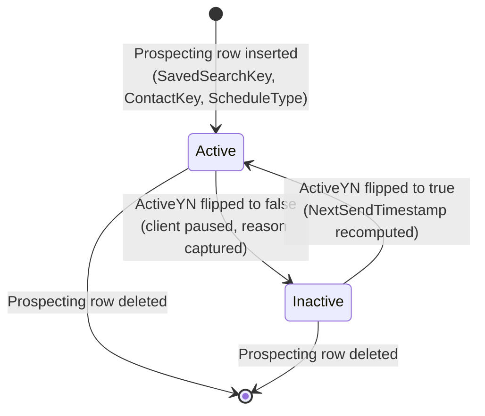
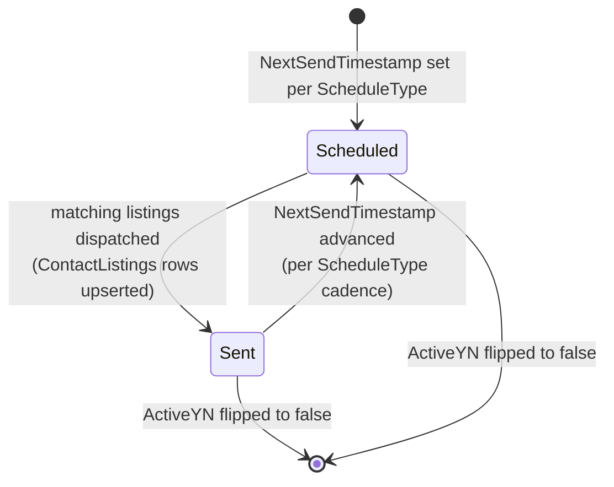
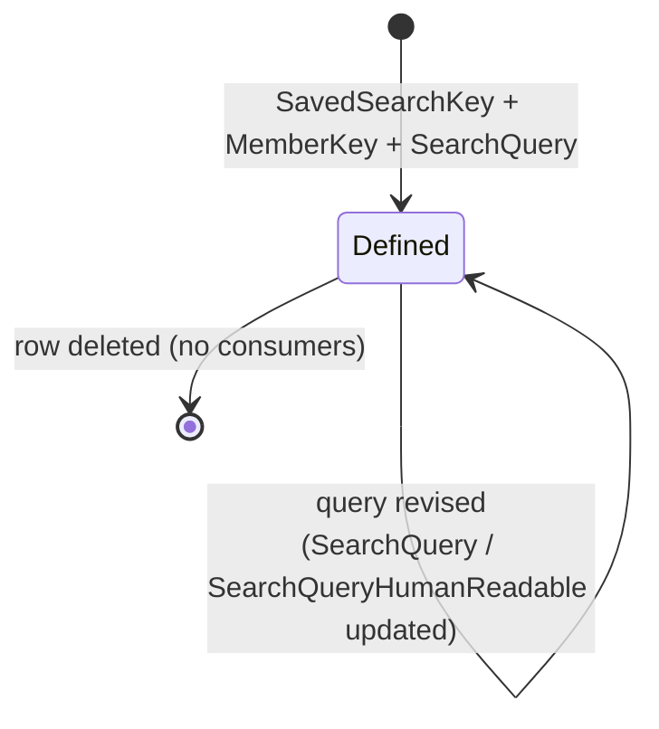
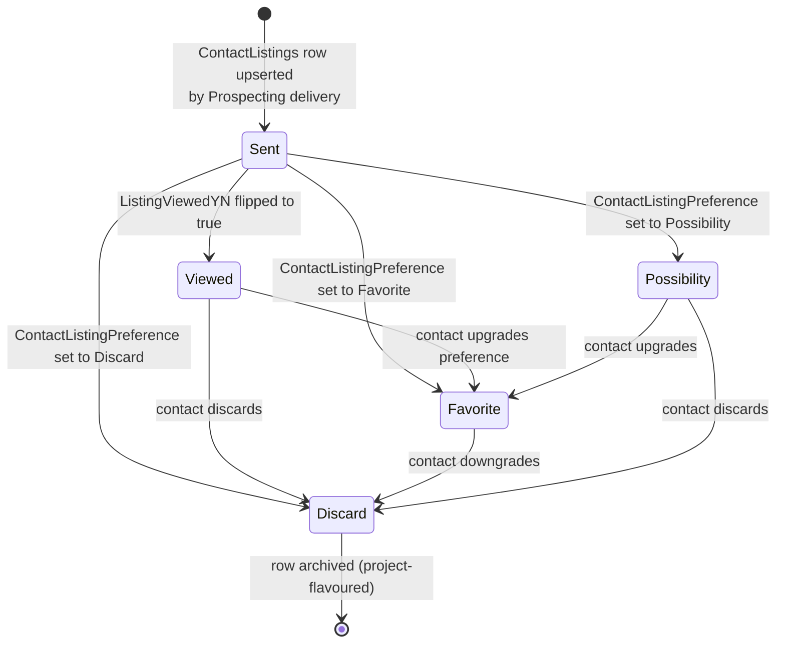
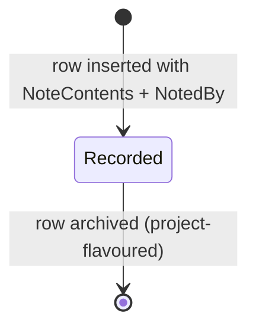

# Prospecting and saved-search delivery (canonical, RESO DD 2.0)

The recurring delivery loop that connects a `Contacts` row to a
`SavedSearch` via `Prospecting`, and surfaces matched listings into
the consumer portal as `ContactListings` rows annotated by
`ContactListingNotes`. Splits the prospecting half out of
[`lead-contact-lifecycle.md`](lead-contact-lifecycle.md) into its
own state machine.

> **Integration links**:
>
> - Source mapping (per resource):
>   [`../../../data-models/source-mappings/wiki/agent-docs/by_resource/saved_search.md`](../../../data-models/source-mappings/wiki/agent-docs/by_resource/saved_search.md),
>   [`../../../data-models/source-mappings/wiki/agent-docs/by_resource/prospecting.md`](../../../data-models/source-mappings/wiki/agent-docs/by_resource/prospecting.md),
>   [`../../../data-models/source-mappings/wiki/agent-docs/by_resource/contact_listings.md`](../../../data-models/source-mappings/wiki/agent-docs/by_resource/contact_listings.md),
>   [`../../../data-models/source-mappings/wiki/agent-docs/by_resource/contact_listing_notes.md`](../../../data-models/source-mappings/wiki/agent-docs/by_resource/contact_listing_notes.md).
> - Sharp-SIR flavour: no project SOP yet — promote one under
>   `docs/business-processes/` when SIR codifies cadence templates,
>   unsubscribe rules, and concierge escalations.

This is the canonical baseline. Project flavours (cadence policy,
template content, deliverability vendor) belong in
[`docs/business-processes/`](../../index.md).

## Scope

In scope:

- The `SavedSearch` lifecycle (create -> revise -> retire).
- The `Prospecting.ActiveYN` state machine and its delivery loop.
- The `ContactListings` portal-state surface (sent / viewed /
  preference) including unread-message flags.
- `ContactListingNotes` add / read.

Out of scope:

- Contact intake and qualification (see
  [`lead-contact-lifecycle.md`](lead-contact-lifecycle.md)).
- Showing requests (see [`showing-lifecycle.md`](showing-lifecycle.md)).
- Tracking analytics (see
  [`internet-tracking-and-engagement.md`](internet-tracking-and-engagement.md)).

## Primary state machine: `Prospecting.ActiveYN`

`Prospecting.ActiveYN` is a boolean activation flag. RESO does not
publish a closed `Status` lookup on `Prospecting`; the canonical
baseline encodes the lifecycle as on/off transitions plus a tombstone.

### Transition table

| From | To | Trigger | Required field changes |
|---|---|---|---|
| `[*]` | `Active` | Member subscribes a contact to a saved search | `ProspectingKey`, `SavedSearchKey`, `ContactKey`, `OwnerMemberKey`, `ScheduleType`, `ActiveYN = true`, `NextSendTimestamp`, `Subject`, `Language` |
| `Active` | `Inactive` | Contact unsubscribed OR member paused OR bounce policy hit | `ActiveYN = false`, `ReasonActiveOrDisabled`, `ModificationTimestamp` |
| `Inactive` | `Active` | Re-subscribed | `ActiveYN = true`, refreshed `NextSendTimestamp`, `ReasonActiveOrDisabled` updated |
| `Active` / `Inactive` | `[*]` | Contact deleted OR saved search retired | row deleted |

### Delivery sub-loop

The delivery loop runs while `ActiveYN = true`:

`ScheduleType` lookup values: `ASAP`, `Daily`, `Monthly`.
`SearchQueryType` lookup values: `$filter`, `DMQL2`.

### Decision points

| Decision | Inputs | Outputs |
|---|---|---|
| Cadence | `ScheduleType` | `ASAP` (immediately on match), `Daily` (digest), `Monthly` (roll-up) |
| Concierge gating | `ConciergeYN`, `ConciergeNotificationsYN`, `ClientActivatedYN` | When `ConciergeYN = true`, hold delivery until member explicitly releases the batch |
| Mailbox composition | `ToEmailList`, `CcEmailList`, `BccEmailList`, `BccMeYN` | Use `MessageNew` / `MessageRevise` / `MessageUpdate` for the three template variants |

## `SavedSearch` lifecycle

`SavedSearch` does not publish a closed RESO status lookup. The
canonical baseline models it as create / revise / retire on the
header row, with semantic state derived from whether any active
`Prospecting` row references it.

| Decision | Inputs | Outputs |
|---|---|---|
| Define | Member crafts a search | `SavedSearchKey`, `MemberKey`, `SavedSearchName`, `SavedSearchDescription`, `SearchQuery`, `SearchQueryType`, `ResourceName`, `ClassName` |
| Revise | Saved-search edits | Update `SearchQuery`, `SearchQueryHumanReadable`, `SearchQueryExceptions`, `SearchQueryExceptionDetails`; bump `ModificationTimestamp` |
| Retire | No active `Prospecting` consumers | Delete row (or leave dormant if portal references exist) |

`SearchQueryType` is closed; the canonical baseline cites `$filter`
and `DMQL2`. `SavedSearchType` is open and project-flavoured.

## `ContactListings` (consumer-portal surface)

A `ContactListings` row is the per-(Contact, Listing) record that a
consumer portal renders. It carries delivery, viewing, and
preference state.

`ContactListingPreference` lookup values: `Discard`, `Favorite`,
`Possibility`.

| Decision | Inputs | Outputs |
|---|---|---|
| Upsert on send | Prospecting batch | Insert row keyed by `(ContactKey, ListingKey)`, set `ListingSentTimestamp`, `ListingModificationTimestamp` |
| Mark viewed | Portal click | `ListingViewedYN = true`, `PortalLastVisitedTimestamp` |
| Express preference | Consumer action | `ContactListingPreference` |
| Direct-email opt-out | Bounce / unsubscribe | `DirectEmailYN = false` |
| Unread agent note | Member adds a note | `AgentNotesUnreadYN = true`; cleared on consumer view |
| Unread contact note | Consumer adds a note | `ContactNotesUnreadYN = true`; cleared on agent view |

## `ContactListingNotes` (per-listing notes)

Append-only notes against a `ContactListings` surface. Each note
carries `NotedBy` (the author), `NoteContents`, and FK references
back to `ContactKey` and `ListingKey`.

| Decision | Inputs | Outputs |
|---|---|---|
| Append note | Member or consumer comment | Insert row with `ContactListingNotesKey`, `ContactKey`, `ListingKey`, `NoteContents`, `NotedBy`, `ModificationTimestamp` |
| Mark unread on parent | Note inserted | Flip `ContactListings.AgentNotesUnreadYN` or `ContactNotesUnreadYN` per `NotedBy` |

## Cross-resource interactions

- `Prospecting.SavedSearchKey -> SavedSearch.SavedSearchKey` is a
  hard FK; deleting a `SavedSearch` with active prospecting rows is
  prohibited by the canonical baseline.
- `Prospecting.ContactKey -> Contacts.ContactKey`: when the parent
  contact transitions out of `ContactStatus = Active` (per
  [`lead-contact-lifecycle.md`](lead-contact-lifecycle.md)), the
  canonical baseline REQUIRES setting `Prospecting.ActiveYN = false`
  in the same transaction.
- Each `Prospecting` send produces one or more
  [`ContactListings`](processes/lead-contact-lifecycle.md) rows.
- Note inserts on `ContactListingNotes` flip the
  `ContactListings.AgentNotesUnreadYN` /
  `ContactNotesUnreadYN` flags.
- All `Prospecting`, `ContactListings`, and `ContactListingNotes`
  inserts/updates emit
  [`HistoryTransactional`](history-and-audit-log.md) rows scoped to
  the parent `Contacts` row
  (`ResourceName = Contacts`,
  `ResourceRecordKey = Contacts.ContactKey`).

## Identifier semantics

- `ProspectingKey` is the per-subscription PK.
- `SavedSearchKey` is the saved-search PK.
- `ContactListingsKey` is the per-(Contact, Listing) PK; the
  canonical baseline RECOMMENDS uniqueness on
  `(ContactKey, ListingKey)`.
- `ContactListingNotesKey` is the per-note PK; notes are
  append-only.

## Non-goals

- No opinion on which deliverability vendor sends emails.
- No opinion on bounce/suppression policy.
- No opinion on the consumer portal UX.

<!-- reso-citations
Resource: SavedSearch
Resource: Prospecting
Resource: ContactListings
Resource: ContactListingNotes
Field: SavedSearch.SavedSearchKey
Field: SavedSearch.SavedSearchName
Field: SavedSearch.SavedSearchDescription
Field: SavedSearch.SavedSearchType
Field: SavedSearch.SearchQuery
Field: SavedSearch.SearchQueryHumanReadable
Field: SavedSearch.SearchQueryExceptions
Field: SavedSearch.SearchQueryExceptionDetails
Field: SavedSearch.SearchQueryType
Field: SavedSearch.ResourceName
Field: SavedSearch.ClassName
Field: SavedSearch.MemberKey
Field: SavedSearch.MemberMlsId
Field: SavedSearch.OriginalEntryTimestamp
Field: SavedSearch.ModificationTimestamp
Field: SavedSearch.OriginatingSystemKey
Field: SavedSearch.OriginatingSystemName
Field: SavedSearch.SourceSystemKey
Field: SavedSearch.SourceSystemName
Field: Prospecting.ProspectingKey
Field: Prospecting.SavedSearchKey
Field: Prospecting.ContactKey
Field: Prospecting.OwnerMemberKey
Field: Prospecting.OwnerMemberID
Field: Prospecting.ActiveYN
Field: Prospecting.ClientActivatedYN
Field: Prospecting.ConciergeYN
Field: Prospecting.ConciergeNotificationsYN
Field: Prospecting.ScheduleType
Field: Prospecting.DailySchedule
Field: Prospecting.NextSendTimestamp
Field: Prospecting.LastNewChangedTimestamp
Field: Prospecting.LastViewedTimestamp
Field: Prospecting.ReasonActiveOrDisabled
Field: Prospecting.Subject
Field: Prospecting.MessageNew
Field: Prospecting.MessageRevise
Field: Prospecting.MessageUpdate
Field: Prospecting.Language
Field: Prospecting.ToEmailList
Field: Prospecting.CcEmailList
Field: Prospecting.BccEmailList
Field: Prospecting.BccMeYN
Field: Prospecting.DisplayTemplateID
Field: Prospecting.ModificationTimestamp
Field: ContactListings.ContactListingsKey
Field: ContactListings.ContactKey
Field: ContactListings.ContactLoginId
Field: ContactListings.ListingKey
Field: ContactListings.ListingId
Field: ContactListings.ResourceName
Field: ContactListings.ClassName
Field: ContactListings.ContactListingPreference
Field: ContactListings.DirectEmailYN
Field: ContactListings.ListingSentTimestamp
Field: ContactListings.ListingViewedYN
Field: ContactListings.ListingModificationTimestamp
Field: ContactListings.PortalLastVisitedTimestamp
Field: ContactListings.LastAgentNoteTimestamp
Field: ContactListings.LastContactNoteTimestamp
Field: ContactListings.AgentNotesUnreadYN
Field: ContactListings.ContactNotesUnreadYN
Field: ContactListings.ListingNotes
Field: ContactListings.ModificationTimestamp
Field: ContactListingNotes.ContactListingNotesKey
Field: ContactListingNotes.ContactKey
Field: ContactListingNotes.ListingKey
Field: ContactListingNotes.ListingId
Field: ContactListingNotes.NoteContents
Field: ContactListingNotes.NotedBy
Field: ContactListingNotes.ModificationTimestamp
LookupValue: ScheduleType.ASAP
LookupValue: ScheduleType.Daily
LookupValue: ScheduleType.Monthly
LookupValue: SearchQueryType.$filter
LookupValue: SearchQueryType.DMQL2
LookupValue: ContactListingPreference.Discard
LookupValue: ContactListingPreference.Favorite
LookupValue: ContactListingPreference.Possibility
-->
