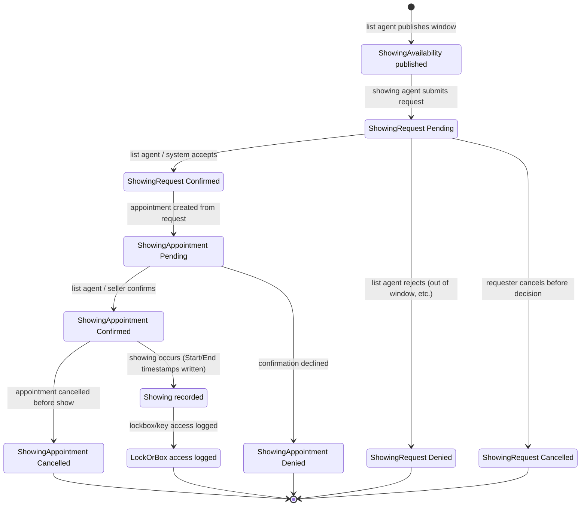
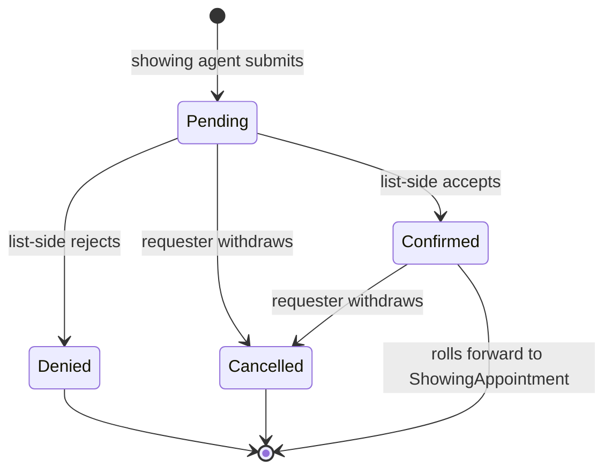
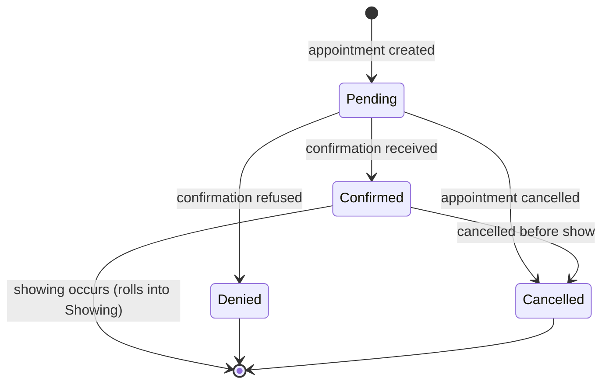

# Showing lifecycle (canonical, RESO DD 2.0)

The end-to-end state machine of a property showing, from a buyer
agent's request through scheduling, the showing event itself, and
the lockbox audit trail. RESO DD models this with five distinct
resources, each with its own state.

> **Integration links**:
>
> - Source mapping: not yet in scope (Showing / ShowingRequest /
>   ShowingAppointment / ShowingAvailability / LockOrBox are not
>   in the 6-resource Layer-2 curated set; promote via
>   [`../../../data-models/source-mappings/`](../../../data-models/source-mappings/USAGE.md)
>   when project scope expands).
> - Sharp-SIR flavour: showings appear inside
>   [`../../sales-pipeline.md`](../../sales-pipeline.md) (Solution /
>   Viewing stage) and
>   [`../../follow-up-vs-active-sales.md`](../../follow-up-vs-active-sales.md)
>   (the first-showing trigger).
> - One-stop integrated view (per linked listing):
>   [`../../../integration/wiki/agent-docs/by_resource/property.md`](../../../integration/wiki/agent-docs/by_resource/property.md)

## Scope

In scope:

- `ShowingAvailability`: the listing-side declaration of when a
  property can be shown.
- `ShowingRequest`: a request raised by a showing agent (or
  consumer/inspector) to view the property.
- `ShowingAppointment`: the scheduled meeting that comes out of an
  accepted request.
- `Showing`: the post-event record of what actually happened.
- `LockOrBox`: the access-credential audit trail tied to the
  showing.

Out of scope:

- The listing's own `StandardStatus` gating (see
  [`listing-lifecycle.md`](listing-lifecycle.md)).
- The buyer-agent's lead pipeline (see
  [`lead-contact-lifecycle.md`](lead-contact-lifecycle.md)).
- Open-house drop-ins (see [`open-house-lifecycle.md`](open-house-lifecycle.md)).

## End-to-end happy path

The diagram describes a happy-path orchestration. RESO DD keeps the
five resources independent, so a Showing can be recorded without a
prior ShowingAppointment (e.g. backup in-person walk-throughs), but
the canonical baseline RECOMMENDS the chain above.

## Resource 1: `ShowingAvailability`

The listing side advertises bookable windows. There is no `Status`
lookup on `ShowingAvailability`; it is implicitly active for any
`ShowingDate` not in the past.

| Field | Role |
|---|---|
| `ShowingAvailabilityKey` | PK |
| `ShowingDate` | The date the window applies to |
| `ShowingAvailableStartTime`, `ShowingAvailableEndTime` | Window bounds |
| `ShowingMinimumDuration`, `ShowingMaximumDuration` | Slot sizing |
| `ShowingMethod` | `In-Person` / `Virtual` / `Other` |
| `UniversalPropertyId`, `UniqueOrganizationIdentifier` | Federation keys |
| `ShowingId`, `ShowingKey` | Listing-side showing handle |

Decision: a request is "in window" iff
`ShowingRequestStartTime >= ShowingAvailableStartTime` AND
`ShowingRequestEndTime <= ShowingAvailableEndTime` AND
`ShowingRequestDuration` in
`[ShowingMinimumDuration, ShowingMaximumDuration]` for some matching
`ShowingDate`.

## Resource 2: `ShowingRequest`

RESO DD does not publish a closed `Status` lookup for
`ShowingRequest`; the canonical baseline reuses the
`ShowingAppointmentStatus` enumeration verbatim because the same
request progresses into an appointment. The four allowed values
(`Pending`, `Confirmed`, `Denied`, `Cancelled`) are written into the
nearest `ShowingAppointmentStatus` once an appointment exists.

| Field | Role |
|---|---|
| `ShowingRequestKey` | PK |
| `ShowingRequestId` | Human-facing identifier |
| `ShowingId`, `ShowingKey` | Foreign key to listing-side showing |
| `ShowingRequestDate` | When the request was filed |
| `ShowingRequestStartTime`, `ShowingRequestEndTime`, `ShowingRequestDuration` | Desired slot |
| `ShowingMethodRequest` | `In-Person` / `Virtual` / `Other` |
| `ShowingRequestType` | `First`, `Second`, `Inspection`, `Walk-through`, `Broker Preview`, `Broker Price Opinion` |
| `ShowingRequestor` | `Agent`, `Consumer`, `Owner`, `Property Manager`, `Home Inspector`, `Home Improvement Specialist`, `Home Security Provider`, `Member Type`, `Moving Storage`, `Occupant`, `Sales Office` |
| `ShowingAgentKey`, `ShowingAgentMlsId` | Who will show |
| `ShowingRequestNotes` | Free-text |

## Resource 3: `ShowingAppointment`

`ShowingAppointmentStatus` lookup values:
`Pending`, `Confirmed`, `Denied`, `Cancelled`.

| Field | Role |
|---|---|
| `ShowingAppointmentKey`, `ShowingAppointmentId` | PK / human ID |
| `ShowingId`, `ShowingKey` | Foreign key to listing-side showing |
| `ShowingAppointmentDate` | Date of the appointment |
| `ShowingAppointmentStartTime`, `ShowingAppointmentEndTime` | Time window |
| `ShowingAppointmentMethod` | `In-Person` / `Virtual` / `Other` |
| `ShowingAppointmentStatus` | State (see above) |
| `ShowingAgentKey`, `ShowingAgentMlsId` | Who will show |

## Resource 4: `Showing`

A `Showing` row is written ONLY after the showing actually happens
(or is recorded as missed). The state is `Property.ShowingStatus`
NOT on this row - listing-side, the `Showing.ShowingStatus` field
exposes the listing's posture toward future requests:

`ShowingStatus` lookup values:
`Accepting Requests`, `On Hold`, `No Showings`, `Restricted Showings`.

| Field | Role |
|---|---|
| `ShowingKey`, `ShowingId` | PK / human ID |
| `ShowingStartTimestamp`, `ShowingEndTimestamp` | Actual times |
| `ShowingRequestedTimestamp` | When the original request landed |
| `OriginalEntryTimestamp` | Audit |
| `ShowingAllowed` | Listing-side toggle |
| `ShowingAgent`, `ShowingAgentKey`, `ShowingAgentMlsID` | Who showed |
| `ShowingTimeZone`, `ShowingUrl` | Logistics |
| `ListingId`, `ListingKey` | Backreference to `Property` |

## Resource 5: `LockOrBox`

The access-credential audit. One row per access event.

| Field | Role |
|---|---|
| `LockOrBoxKey`, `LockOrBoxId` | PK / human ID |
| `KeyOrCredentialId` | The credential that was used |
| `LockOrBoxInstalledTimestamp` | When the box was installed on the listing |
| `LockOrBoxAccessTimestamp` | When the access happened |
| `LockOrBoxAccessType` | `Code`, `Card`, `App` |
| `ListingId`, `ListingKey`, `ListingAddress1`, `ListingCity`, `ListingPostalCode` | Address denormalised for the audit row |
| `ShowingAgent`, `ShowingAgentId`, `ShowingAgentFullName`, `ShowingAgentMlsId`, `ShowingAgentEmail`, `ShowingAgentPhone` | Who accessed |
| `ShowingOffice` | Their office |
| `Notes` | Free-text |

## Decision points

| Decision | Inputs | Outputs |
|---|---|---|
| Accept request? | `ShowingRequest` window vs. `ShowingAvailability`; listing's `ShowingStatus`; `Property.StandardStatus` | `ShowingRequest` -> `Confirmed` and create `ShowingAppointment` (`Pending`); else `Denied` |
| Confirm appointment? | List agent / seller confirmation event | `ShowingAppointment` -> `Confirmed` or `Denied` |
| Record the showing? | `ShowingAppointment` was `Confirmed` AND `ShowingStartTimestamp` is set | Insert `Showing` row; insert `LockOrBox` row if a lockbox was used |
| Cancel late? | `ShowingAppointment` is `Confirmed` and event has not yet started | `ShowingAppointment` -> `Cancelled`; no `Showing` row |

## Cross-resource interactions

- A `ShowingRequest` is only valid while
  `Property.StandardStatus IN (Active, Coming Soon, Active Under
  Contract)` AND the listing's most recent `Showing.ShowingStatus IN
  (Accepting Requests, Restricted Showings)`. See
  [`listing-lifecycle.md`](listing-lifecycle.md).
- The showing agent is a `Member` (the buyer-side agent); see
  [`member-onboarding.md`](member-onboarding.md).
- The showing requestor MAY be a `Contacts` row (consumer-initiated
  request); see [`lead-contact-lifecycle.md`](lead-contact-lifecycle.md).
- Status transitions on any of the five resources MUST emit
  `HistoryTransactional` rows; see
  [`transaction-lifecycle.md`](transaction-lifecycle.md).

## Identifier semantics

- `ShowingKey` is the listing-side opaque PK for the abstract
  "showing slot" - shared across `ShowingAvailability`,
  `ShowingRequest`, `ShowingAppointment`, `Showing`, and `LockOrBox`.
- `ShowingId` is the human-facing identifier on the same chain.
- `ShowingRequestKey`, `ShowingAppointmentKey`,
  `ShowingAvailabilityKey` are per-resource PKs.
- `ShowingAgentKey` is the buyer-side `Member.MemberKey`; immutable
  on the row once written.

## Non-goals

- No opinion on confirmation channels (push, email, SMS, voice
  call). RESO DD does not enumerate them.
- No opinion on showing-fee mechanics; that belongs to the project
  flavour.
- No opinion on appointment-system vendor (ShowingTime, Aligned,
  etc.); the canonical baseline only requires the resource fields
  to be filled.

<!-- reso-citations
Resource: ShowingAvailability
Resource: ShowingRequest
Resource: ShowingAppointment
Resource: Showing
Resource: LockOrBox
Field: ShowingAvailability.ShowingAvailabilityKey
Field: ShowingAvailability.ShowingDate
Field: ShowingAvailability.ShowingAvailableStartTime
Field: ShowingAvailability.ShowingAvailableEndTime
Field: ShowingAvailability.ShowingMinimumDuration
Field: ShowingAvailability.ShowingMaximumDuration
Field: ShowingAvailability.ShowingMethod
Field: ShowingAvailability.UniversalPropertyId
Field: ShowingAvailability.UniqueOrganizationIdentifier
Field: ShowingAvailability.ShowingId
Field: ShowingAvailability.ShowingKey
Field: ShowingRequest.ShowingRequestKey
Field: ShowingRequest.ShowingRequestId
Field: ShowingRequest.ShowingId
Field: ShowingRequest.ShowingKey
Field: ShowingRequest.ShowingRequestDate
Field: ShowingRequest.ShowingRequestStartTime
Field: ShowingRequest.ShowingRequestEndTime
Field: ShowingRequest.ShowingRequestDuration
Field: ShowingRequest.ShowingMethodRequest
Field: ShowingRequest.ShowingRequestType
Field: ShowingRequest.ShowingRequestor
Field: ShowingRequest.ShowingRequestNotes
Field: ShowingRequest.ShowingAgentKey
Field: ShowingRequest.ShowingAgentMlsId
Field: ShowingAppointment.ShowingAppointmentKey
Field: ShowingAppointment.ShowingAppointmentId
Field: ShowingAppointment.ShowingId
Field: ShowingAppointment.ShowingKey
Field: ShowingAppointment.ShowingAppointmentDate
Field: ShowingAppointment.ShowingAppointmentStartTime
Field: ShowingAppointment.ShowingAppointmentEndTime
Field: ShowingAppointment.ShowingAppointmentMethod
Field: ShowingAppointment.ShowingAppointmentStatus
Field: ShowingAppointment.ShowingAgentKey
Field: ShowingAppointment.ShowingAgentMlsId
Field: Showing.ShowingKey
Field: Showing.ShowingId
Field: Showing.ShowingStartTimestamp
Field: Showing.ShowingEndTimestamp
Field: Showing.ShowingRequestedTimestamp
Field: Showing.OriginalEntryTimestamp
Field: Showing.ShowingAllowed
Field: Showing.ShowingAgent
Field: Showing.ShowingAgentKey
Field: Showing.ShowingAgentMlsID
Field: Showing.ShowingTimeZone
Field: Showing.ShowingUrl
Field: Showing.ShowingStatus
Field: Showing.ListingId
Field: Showing.ListingKey
Field: LockOrBox.LockOrBoxKey
Field: LockOrBox.LockOrBoxId
Field: LockOrBox.KeyOrCredentialId
Field: LockOrBox.LockOrBoxInstalledTimestamp
Field: LockOrBox.LockOrBoxAccessTimestamp
Field: LockOrBox.LockOrBoxAccessType
Field: LockOrBox.ListingId
Field: LockOrBox.ListingKey
Field: LockOrBox.ListingAddress1
Field: LockOrBox.ListingCity
Field: LockOrBox.ListingPostalCode
Field: LockOrBox.ShowingAgent
Field: LockOrBox.ShowingAgentId
Field: LockOrBox.ShowingAgentFullName
Field: LockOrBox.ShowingAgentMlsId
Field: LockOrBox.ShowingAgentEmail
Field: LockOrBox.ShowingAgentPhone
Field: LockOrBox.ShowingOffice
Field: LockOrBox.Notes
LookupValue: ShowingAppointmentStatus.Pending
LookupValue: ShowingAppointmentStatus.Confirmed
LookupValue: ShowingAppointmentStatus.Denied
LookupValue: ShowingAppointmentStatus.Cancelled
LookupValue: ShowingMethod.In-Person
LookupValue: ShowingMethod.Virtual
LookupValue: ShowingMethod.Other
LookupValue: ShowingMethodRequest.In-Person
LookupValue: ShowingMethodRequest.Virtual
LookupValue: ShowingMethodRequest.Other
LookupValue: ShowingAppointmentMethod.In-Person
LookupValue: ShowingAppointmentMethod.Virtual
LookupValue: ShowingAppointmentMethod.Other
LookupValue: ShowingRequestType.First
LookupValue: ShowingRequestType.Second
LookupValue: ShowingRequestType.Inspection
LookupValue: ShowingRequestType.Walk-through
LookupValue: ShowingRequestType.Broker Preview
LookupValue: ShowingRequestType.Broker Price Opinion
LookupValue: ShowingRequestor.Agent
LookupValue: ShowingRequestor.Consumer
LookupValue: ShowingRequestor.Owner
LookupValue: ShowingStatus.Accepting Requests
LookupValue: ShowingStatus.On Hold
LookupValue: ShowingStatus.No Showings
LookupValue: ShowingStatus.Restricted Showings
LookupValue: LockOrBoxAccessType.Code
LookupValue: LockOrBoxAccessType.Card
LookupValue: LockOrBoxAccessType.App
-->
