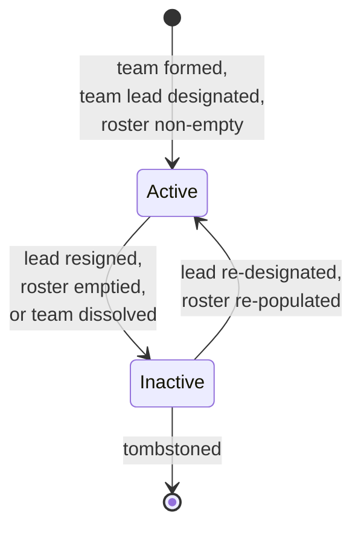
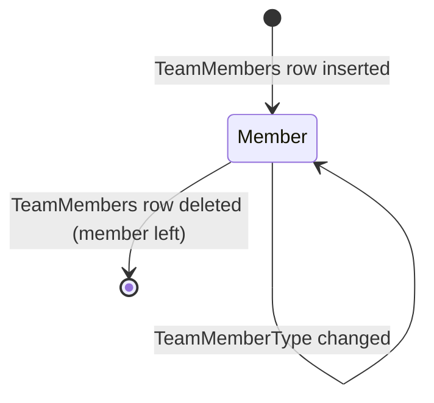

# Team lifecycle (canonical, RESO DD 2.0)

How a real-estate team is formed, populated, and retired, expressed
in RESO DD 2.0 vocabulary. Two resources collaborate: `Teams` (the
team header) and `TeamMembers` (the per-member roster).

This is the canonical baseline. Project flavours (compensation
splits, internal team-policy templates, marketing brand identity)
belong in [`docs/business-processes/`](../../index.md).

## Scope

In scope:

- The `Teams.TeamStatus` lifecycle.
- The `TeamMembers.TeamMemberType` typology.
- Membership add / remove / role-change semantics.
- The relationship between `Teams.TeamLeadKey` and the member
  roster.

Out of scope:

- Member onboarding (see [`member-onboarding.md`](member-onboarding.md)).
- Office membership (see [`office-onboarding.md`](office-onboarding.md)).
- Listings / showings driven by the team (see
  [`listing-lifecycle.md`](listing-lifecycle.md) and
  [`showing-lifecycle.md`](showing-lifecycle.md)).

## Primary state machine: `Teams.TeamStatus`

`TeamStatus` is a closed RESO lookup with two values:
`Active`, `Inactive`.

`TeamStatus` lookup values: `Active`, `Inactive`.

### Transition table

| From | To | Trigger | Required field changes |
|---|---|---|---|
| `[*]` | `Active` | Team header created with non-null lead and at least one `TeamMembers` row | `TeamKey`, `TeamName`, `TeamLeadKey`, `TeamStatus = Active`, `OriginalEntryTimestamp`; insert at least one `TeamMembers` row with `TeamMemberType = Team Lead` |
| `Active` | `Inactive` | Team lead resigned without replacement OR roster emptied OR team dissolved | `TeamStatus = Inactive`, `ModificationTimestamp` |
| `Inactive` | `Active` | New lead designated AND roster non-empty | `TeamStatus = Active`, refreshed `TeamLeadKey` |

## `TeamMembers` (per-member roster)

A `TeamMembers` row exists per `(Member, Team)` pair and carries
the member's role on the team.

The canonical baseline does NOT define a closed status lookup on
`TeamMembers`; departure is modelled by deletion of the row (with a
`HistoryTransactional` row preserving the audit trail).

### `TeamMemberType` typology

`TeamMemberType` is a closed RESO lookup with ten values:

| Group | Values |
|---|---|
| Leadership | `Team Lead`, `Team Member` |
| Sales | `Listing Agent`, `Buyer Agent`, `Showing Agent` |
| Operations | `Operations Manager`, `Transaction Coordinator`, `Lead Manager` |
| Support | `Administration Assistant`, `Marketing Assistant` |

Exactly one `TeamMembers` row per `Teams.TeamKey` MUST have
`TeamMemberType = Team Lead`, and that row's `MemberKey` MUST equal
`Teams.TeamLeadKey`. Mismatches are a hard error in any consumer
that reads both resources.

### `TeamImpersonationLevel`

`TeamImpersonationLevel` is an open lookup. The canonical baseline
recommends a small project-encoded vocabulary (e.g. `None`, `Read`,
`ReadWrite`) but does NOT mandate values. Set this to convey what
non-lead team members may do on behalf of the team lead inside
applications that support delegation.

## Decision points

| Decision | Inputs | Outputs |
|---|---|---|
| Activate the team | Lead designated AND at least one `TeamMembers` row | `TeamStatus = Active` |
| Replace the lead | New designated lead | Update `Teams.TeamLeadKey`; flip `TeamMemberType = Team Lead` on the new row; demote the old row to `Team Member` |
| Add a member | New hire / transfer in | Insert `TeamMembers` row with `MemberKey`, `TeamKey`, `TeamMemberType` |
| Remove a member | Resignation / transfer out | Delete `TeamMembers` row (`HistoryTransactional` row preserves audit) |
| Change a role | Promotion / re-org | Update `TeamMembers.TeamMemberType` |
| Dissolve the team | Business decision | `TeamStatus = Inactive`; do NOT delete `TeamMembers` rows immediately - keep for audit |

## Cross-resource interactions

- `TeamMembers.MemberKey` points to a `Member`; see
  [`member-onboarding.md`](member-onboarding.md). A `TeamMembers`
  row pointing at a `MemberStatus = Inactive` member is permitted
  but the canonical baseline recommends that any `Active` team
  contain at least one `Active` member.
- The team is anchored to its members' offices (RESO does NOT
  publish a `Teams.OfficeKey`); see
  [`office-onboarding.md`](office-onboarding.md). The canonical
  baseline derives the team's office from `Teams.TeamLeadKey ->
  Member.OfficeKey`.
- Listings produced by the team are still individually attributed
  to a single `Property.ListAgentKey`; see
  [`listing-lifecycle.md`](listing-lifecycle.md). Any team-wide
  attribution lives in project-specific `x_sm_*` extensions.
- Every `TeamStatus` change AND every `TeamMembers` insert/delete
  emits a `HistoryTransactional` row. Per
  [`transaction-lifecycle.md`](transaction-lifecycle.md), use
  `ResourceName = Office` (the closest enclosing parent) and
  `ResourceRecordKey =` the team's parent office key derived from
  `TeamLeadKey -> Member.OfficeKey`.

## Identifier semantics

- `TeamKey` is the immutable opaque PK.
- `TeamLeadKey` MUST always equal the `MemberKey` of exactly one
  `TeamMembers` row whose `TeamMemberType = Team Lead`.
- `TeamMemberKey` is the per-row PK on `TeamMembers`.
- `OriginatingSystemKey` / `SourceSystemKey` carry federation
  identifiers when the row was syndicated.

## Non-goals

- No opinion on commission splits inside the team - project
  flavour.
- No opinion on team-vs-individual branding contracts - project
  flavour.
- No opinion on how `TeamImpersonationLevel` values are enforced -
  application-layer concern.

<!-- reso-citations
Resource: Teams
Resource: TeamMembers
Field: Teams.TeamKey
Field: Teams.TeamName
Field: Teams.TeamDescription
Field: Teams.TeamStatus
Field: Teams.TeamLead
Field: Teams.TeamLeadKey
Field: Teams.TeamLeadMlsId
Field: Teams.TeamLeadLoginId
Field: Teams.TeamLeadStateLicense
Field: Teams.TeamLeadStateLicenseState
Field: Teams.TeamLeadNationalAssociationId
Field: Teams.TeamEmail
Field: Teams.TeamMobilePhone
Field: Teams.TeamOfficePhone
Field: Teams.TeamPreferredPhone
Field: Teams.TeamAddress1
Field: Teams.TeamCity
Field: Teams.TeamStateOrProvince
Field: Teams.TeamPostalCode
Field: Teams.OriginalEntryTimestamp
Field: Teams.ModificationTimestamp
Field: Teams.OriginatingSystemKey
Field: Teams.SourceSystemKey
Field: TeamMembers.TeamMemberKey
Field: TeamMembers.TeamKey
Field: TeamMembers.Member
Field: TeamMembers.MemberKey
Field: TeamMembers.MemberMlsId
Field: TeamMembers.MemberLoginId
Field: TeamMembers.TeamMemberType
Field: TeamMembers.TeamMemberStateLicense
Field: TeamMembers.TeamMemberNationalAssociationId
Field: TeamMembers.TeamImpersonationLevel
Field: TeamMembers.OriginalEntryTimestamp
Field: TeamMembers.ModificationTimestamp
Field: TeamMembers.OriginatingSystemKey
Field: TeamMembers.SourceSystemKey
LookupValue: TeamStatus.Active
LookupValue: TeamStatus.Inactive
LookupValue: TeamMemberType.Team Lead
LookupValue: TeamMemberType.Team Member
LookupValue: TeamMemberType.Listing Agent
LookupValue: TeamMemberType.Buyer Agent
LookupValue: TeamMemberType.Showing Agent
LookupValue: TeamMemberType.Operations Manager
LookupValue: TeamMemberType.Transaction Coordinator
LookupValue: TeamMemberType.Lead Manager
LookupValue: TeamMemberType.Administration Assistant
LookupValue: TeamMemberType.Marketing Assistant
-->
