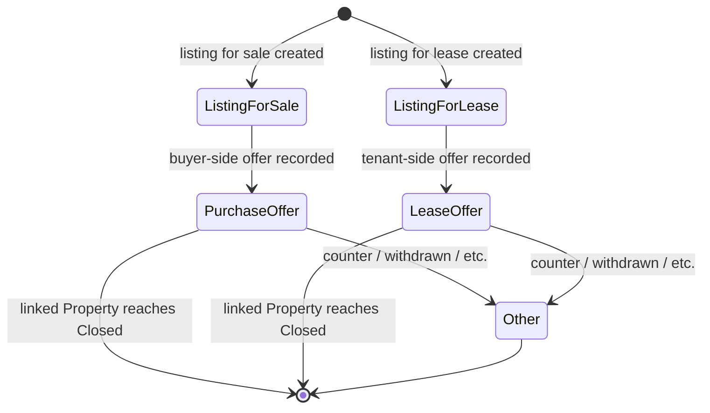
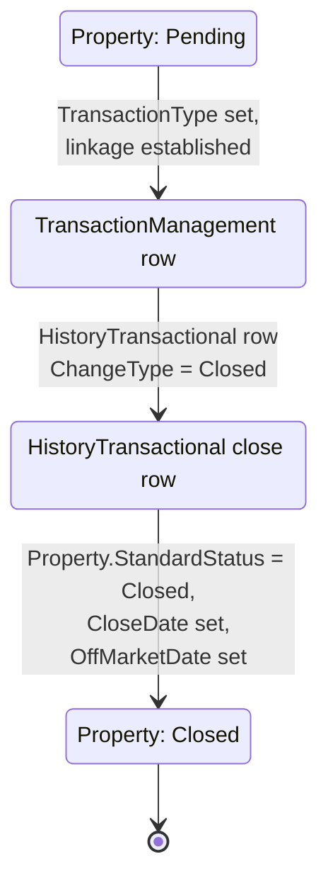
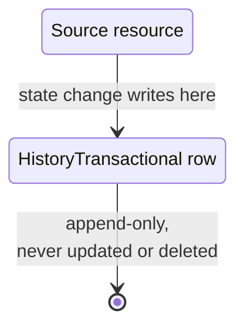

# Transaction lifecycle (canonical, RESO DD 2.0)

How RESO DD 2.0 records the financial transaction associated with a
listing AND the audit trail every other resource emits when its
state changes. Two resources cooperate: `TransactionManagement` (the
lightweight transaction header) and `HistoryTransactional` (the
universal change log).

> **Integration links**:
>
> - Source mapping (close-edge fields land on `Property` -> RESO):
>   [`../../../data-models/source-mappings/wiki/agent-docs/by_resource/property.md`](../../../data-models/source-mappings/wiki/agent-docs/by_resource/property.md)
> - Sharp-SIR flavour:
>   [`../../sales-pipeline.md`](../../sales-pipeline.md) (Deal Signing
>   / Payment / Closed stages) and
>   [`../../listing-pipeline.md`](../../listing-pipeline.md)
>   (SOLD / AGENT COMMISSION / CLOSED stages).
> - One-stop integrated view:
>   [`../../../integration/wiki/agent-docs/by_resource/property.md`](../../../integration/wiki/agent-docs/by_resource/property.md)

The "transaction" in RESO DD is intentionally minimal - it is NOT a
back-office TM/escrow system, it is the record that ties an MLS
listing to a financial event for syndication. Project-flavour
back-office TM (Sharp-SIR commission ledger, escrow milestones,
DA / closing-statement workflow) belongs in
[`docs/business-processes/`](../../index.md).

## Scope

In scope:

- The `TransactionManagement.TransactionType` typology (sale, lease,
  offer).
- The `Property` close-out path (`Pending` -> `Closed`) as it
  intersects `TransactionManagement`.
- The cross-resource semantics of `HistoryTransactional` (every
  state change on every other resource writes here).

Out of scope:

- Commission splits, ledgers, payouts (project flavour).
- Escrow milestones, contingency clearance dates beyond the listing
  close-out (project flavour).
- KYC / AML for the buyer (project flavour).

## Primary state machine: `TransactionManagement.TransactionType`

`TransactionManagement` is a small resource: only `TransactionKey`,
`TransactionId`, `TransactionType`, and `ModificationTimestamp`. The
state machine is therefore on `TransactionType` (a closed RESO
lookup).

`TransactionType` lookup values: `Listing for Sale`,
`Listing for Lease`, `Purchase Offer`, `Lease Offer`, `Other`.

| Field | Role |
|---|---|
| `TransactionKey` | PK, opaque |
| `TransactionId` | Human-facing identifier |
| `TransactionType` | The lookup above |
| `ModificationTimestamp` | Audit |

The canonical baseline does NOT define a closed state for the
transaction record itself - the close-out is observed via the linked
`Property.StandardStatus = Closed` event and the corresponding
`HistoryTransactional` row. Project flavours that need a
"transaction is closed" boolean MUST encode it as an `x_sm_*`
extension under the
[`source-mappings/`](../../../data-models/source-mappings/README.md) layer.

## Property close-out path (`Pending` -> `Closed`)

The close-out is the single most important RESO transition because
every IDX consumer reacts to it.

Required field changes on `Property` at the close edge:

- `StandardStatus = Closed`
- `MlsStatus = Closed`
- `CloseDate` set
- `OffMarketDate` set
- `StatusChangeTimestamp` updated
- `ModificationTimestamp` updated

The `HistoryTransactional` row written at the same instant:

- `ResourceName = Property`
- `ResourceRecordKey = Property.ListingKey`
- `FieldName = StandardStatus`
- `PreviousValue = Pending`
- `NewValue = Closed`
- `ChangeType = Closed`
- `ChangedByMemberKey` = the member who triggered the close
- `OriginatingSystemHistoryKey` set if federated

See [`listing-lifecycle.md`](listing-lifecycle.md) for the full
`Property.StandardStatus` machine and the related
`MajorChangeType / ChangeType` rows for `Active`, `Pending`,
`Withdrawn`, `Canceled`, `Expired`, `Back On Market`, etc.

## `HistoryTransactional` as universal audit

Every status transition documented in any other process page in
this chapter writes ONE `HistoryTransactional` row. The schema is
designed to be a "who changed what, on which resource, when":

| Field | Role |
|---|---|
| `HistoryTransactionalKey` | PK |
| `ResourceName` | Closed lookup (`Property`, `Member`, `Office`, `Contacts`, `Association`); see "Resource coverage" below |
| `ResourceRecordKey` | The system PK on the source resource (e.g. `Property.ListingKey`) |
| `ResourceRecordID` | The human-facing ID (e.g. `Property.ListingId`) |
| `FieldName` | The `StandardName` of the field that changed |
| `FieldKey` | Optional FK into `Field` resource for the canonical field row |
| `ClassName` | Property class when `ResourceName = Property` |
| `PreviousValue` | Stringified old value |
| `NewValue` | Stringified new value |
| `ChangeType` | Closed lookup describing the transition (`New Listing`, `Active`, `Pending`, `Closed`, `Hold`, `Withdrawn`, `Canceled`, `Expired`, `Active Under Contract`, `Back On Market`, `Coming Soon`, `Price Change`, `Deleted`) |
| `ChangedByMember`, `ChangedByMemberID`, `ChangedByMemberKey` | The actor |
| `EntityEventSequence` | Monotonic per-resource sequence number for ordering |
| `ModificationTimestamp` | When the change was committed |
| `OriginatingSystem`, `OriginatingSystemHistoryKey` | Federation identifiers |
| `SourceSystem`, `SourceSystemHistoryKey` | Federation identifiers |

### Resource coverage

`HistoryTransactional.ResourceName` is a closed lookup with five
canonical values: `Property`, `Member`, `Office`, `Contacts`,
`Association`. State transitions on resources OUTSIDE this set
(e.g. `OpenHouse`, `Caravan`, `ShowingAppointment`) DO still emit
`HistoryTransactional` rows in the canonical baseline, but they
must use the closest enclosing parent resource:

- `OpenHouse` / `Caravan` / `ShowingAppointment` / `Showing` /
  `LockOrBox` / `Media` -> `ResourceName = Property`,
  `ResourceRecordKey = Property.ListingKey` of the linked listing.
- `MemberAssociation` / `MemberStateLicense` ->
  `ResourceName = Member`, `ResourceRecordKey = Member.MemberKey`.
- `OfficeAssociation` / `OfficeCorporateLicense` ->
  `ResourceName = Office`, `ResourceRecordKey = Office.OfficeKey`.
- `Teams` / `TeamMembers` -> `ResourceName = Office`,
  `ResourceRecordKey` = the team's parent office key.
- `ContactListings` / `ContactListingNotes` / `Prospecting` /
  `SavedSearch` -> `ResourceName = Contacts`,
  `ResourceRecordKey = Contacts.ContactKey`.

## Decision points

| Decision | Inputs | Outputs |
|---|---|---|
| Open a `TransactionManagement` row | First offer / lease offer / listing intake | Insert with `TransactionType` |
| Mark close edge | Title transferred / lease activated | `Property.StandardStatus = Closed`, `Property.CloseDate` set, `HistoryTransactional` row |
| Mark fell-through | Pending listing relisted | `Property.StandardStatus = Active`, `HistoryTransactional` row with `ChangeType = Back On Market` |
| Use `Other`? | Counter-offer recorded outside the four typed lanes | `TransactionType = Other` with explanatory note in upstream system |

## Cross-resource interactions

- The `Property` close edge in this doc is the same edge described
  in [`listing-lifecycle.md`](listing-lifecycle.md); both pages
  MUST stay consistent.
- Every state change in
  [`showing-lifecycle.md`](showing-lifecycle.md),
  [`lead-contact-lifecycle.md`](lead-contact-lifecycle.md),
  [`open-house-lifecycle.md`](open-house-lifecycle.md), and the
  onboarding flows for `Member` / `Office` / `Teams` writes a
  `HistoryTransactional` row using the resource-coverage table
  above.
- `EntityEventSequence` is the canonical ordering key when replaying
  history; downstream consumers MUST sort by
  `(ResourceName, ResourceRecordKey, EntityEventSequence)` and not
  by `ModificationTimestamp` alone.

## Identifier semantics

- `TransactionKey` and `HistoryTransactionalKey` are immutable
  opaque PKs.
- `OriginatingSystemHistoryKey` is the upstream system's audit row
  identifier; required when the row was federated.
- `EntityEventSequence` MUST be monotonically increasing per
  `(ResourceName, ResourceRecordKey)` pair; gaps are forbidden.

## Non-goals

- No commission ledger; project flavours encode that.
- No escrow milestones; project flavours encode them.
- No buyer-side credit checks or KYC; project flavours encode them.
- No closed enumeration for "transaction status" beyond the linked
  `Property.StandardStatus`.

<!-- reso-citations
Resource: TransactionManagement
Resource: HistoryTransactional
Resource: Property
Field: TransactionManagement.TransactionKey
Field: TransactionManagement.TransactionId
Field: TransactionManagement.TransactionType
Field: TransactionManagement.ModificationTimestamp
Field: HistoryTransactional.HistoryTransactionalKey
Field: HistoryTransactional.ResourceName
Field: HistoryTransactional.ResourceRecordKey
Field: HistoryTransactional.ResourceRecordID
Field: HistoryTransactional.FieldName
Field: HistoryTransactional.FieldKey
Field: HistoryTransactional.ClassName
Field: HistoryTransactional.PreviousValue
Field: HistoryTransactional.NewValue
Field: HistoryTransactional.ChangeType
Field: HistoryTransactional.ChangedByMember
Field: HistoryTransactional.ChangedByMemberID
Field: HistoryTransactional.ChangedByMemberKey
Field: HistoryTransactional.EntityEventSequence
Field: HistoryTransactional.ModificationTimestamp
Field: HistoryTransactional.OriginatingSystem
Field: HistoryTransactional.OriginatingSystemHistoryKey
Field: HistoryTransactional.SourceSystem
Field: HistoryTransactional.SourceSystemHistoryKey
Field: Property.StandardStatus
Field: Property.MlsStatus
Field: Property.CloseDate
Field: Property.OffMarketDate
Field: Property.StatusChangeTimestamp
Field: Property.ModificationTimestamp
Field: Property.ListingId
Field: Property.ListingKey
LookupValue: TransactionType.Listing for Sale
LookupValue: TransactionType.Listing for Lease
LookupValue: TransactionType.Purchase Offer
LookupValue: TransactionType.Lease Offer
LookupValue: TransactionType.Other
LookupValue: ResourceName.Property
LookupValue: ResourceName.Member
LookupValue: ResourceName.Office
LookupValue: ResourceName.Contacts
LookupValue: ResourceName.Association
LookupValue: ChangeType.New Listing
LookupValue: ChangeType.Active
LookupValue: ChangeType.Coming Soon
LookupValue: ChangeType.Pending
LookupValue: ChangeType.Active Under Contract
LookupValue: ChangeType.Closed
LookupValue: ChangeType.Hold
LookupValue: ChangeType.Withdrawn
LookupValue: ChangeType.Canceled
LookupValue: ChangeType.Expired
LookupValue: ChangeType.Back On Market
LookupValue: ChangeType.Price Change
LookupValue: ChangeType.Deleted
LookupValue: StandardStatus.Pending
LookupValue: StandardStatus.Closed
LookupValue: StandardStatus.Active
-->
