# Canonical MLS state machines

Generated by `scripts/02_emit_index.py`. Do NOT hand-edit. This file concatenates the mermaid `stateDiagram-v2` blocks from each process file for at-a-glance review.

## Caravan lifecycle (canonical, RESO DD 2.0)

Source: [`processes/caravan-lifecycle.md`](../../processes/caravan-lifecycle.md)

### Diagram 1

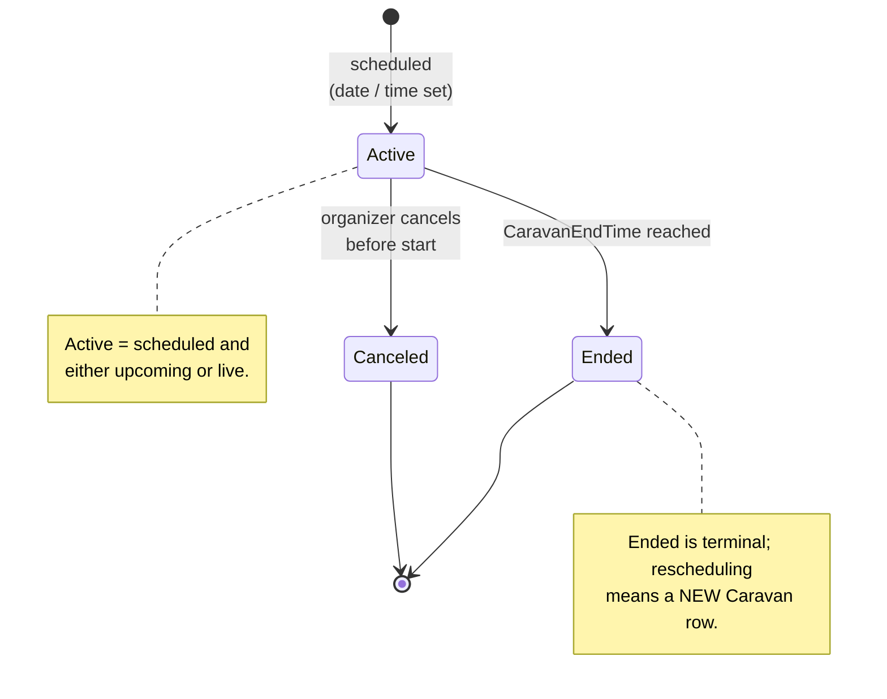
```mermaid
stateDiagram-v2
    [*] --> Active: scheduled<br/>(date / time set)
    Active --> Canceled: organizer cancels<br/>before start
    Active --> Ended: CaravanEndTime reached
    Canceled --> [*]
    Ended --> [*]
    note right of Active
      Active = scheduled and
      either upcoming or live.
    end note
    note right of Ended
      Ended is terminal; rescheduling
      means a NEW Caravan row.
    end note
```

### Diagram 2

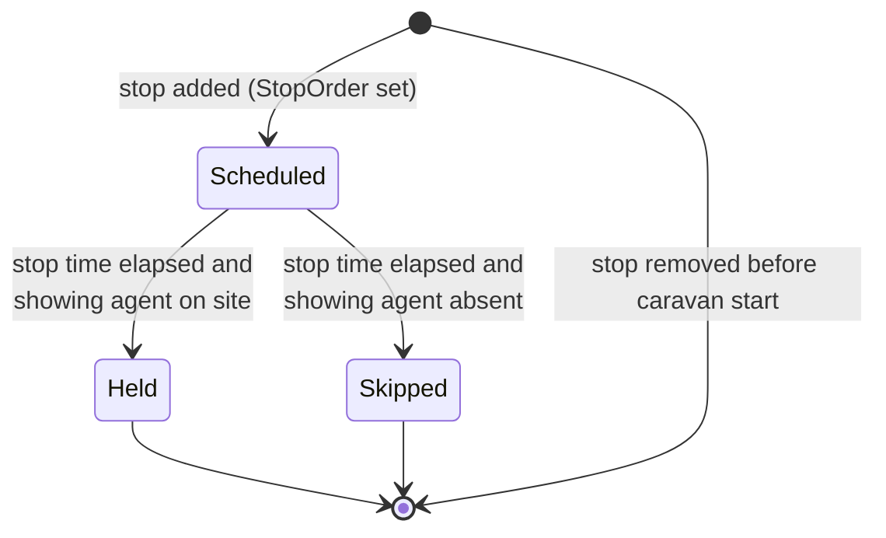
```mermaid
stateDiagram-v2
    state "Scheduled" as S
    state "Held" as H
    state "Skipped" as K
    [*] --> S: stop added (StopOrder set)
    S --> H: stop time elapsed and<br/>showing agent on site
    S --> K: stop time elapsed and<br/>showing agent absent
    H --> [*]
    K --> [*]
    [*] --> [*]: stop removed before caravan start
```

## Lead-Contact lifecycle (canonical, RESO DD 2.0)

Source: [`processes/lead-contact-lifecycle.md`](../../processes/lead-contact-lifecycle.md)

### Diagram 1

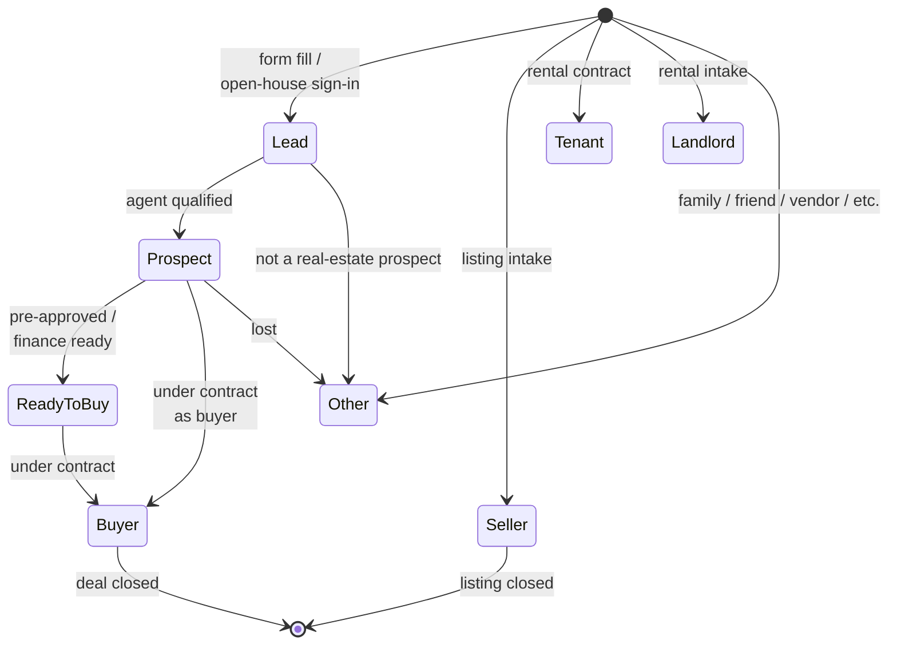
```mermaid
stateDiagram-v2
    [*] --> Lead: form fill /<br/>open-house sign-in
    Lead --> Prospect: agent qualified
    Prospect --> ReadyToBuy: pre-approved /<br/>finance ready
    Prospect --> Buyer: under contract<br/>as buyer
    ReadyToBuy --> Buyer: under contract
    Buyer --> [*]: deal closed
    [*] --> Seller: listing intake
    Seller --> [*]: listing closed
    [*] --> Tenant: rental contract
    [*] --> Landlord: rental intake
    [*] --> Other: family / friend / vendor / etc.
    Lead --> Other: not a real-estate prospect
    Prospect --> Other: lost
```

### Diagram 2

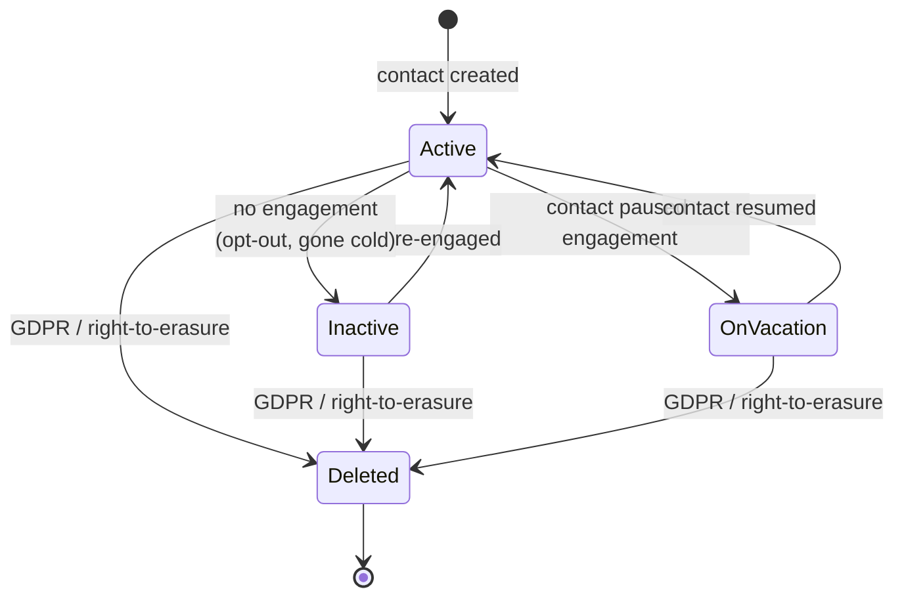
```mermaid
stateDiagram-v2
    [*] --> Active: contact created
    Active --> OnVacation: contact paused engagement
    OnVacation --> Active: contact resumed
    Active --> Inactive: no engagement<br/>(opt-out, gone cold)
    Inactive --> Active: re-engaged
    Active --> Deleted: GDPR / right-to-erasure
    Inactive --> Deleted: GDPR / right-to-erasure
    OnVacation --> Deleted: GDPR / right-to-erasure
    Deleted --> [*]
```

### Diagram 3

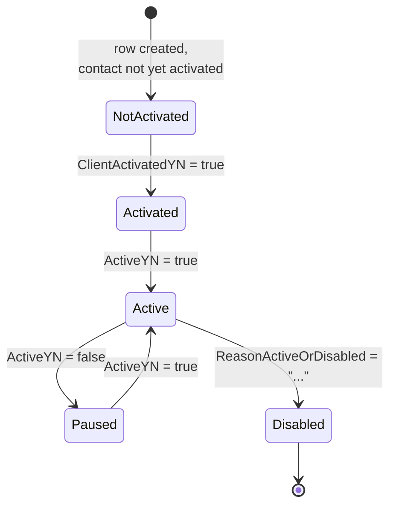
```mermaid
stateDiagram-v2
    [*] --> NotActivated: row created,<br/>contact not yet activated
    NotActivated --> Activated: ClientActivatedYN = true
    Activated --> Active: ActiveYN = true
    Active --> Paused: ActiveYN = false
    Paused --> Active: ActiveYN = true
    Active --> Disabled: ReasonActiveOrDisabled = "..."
    Disabled --> [*]
```

### Diagram 4

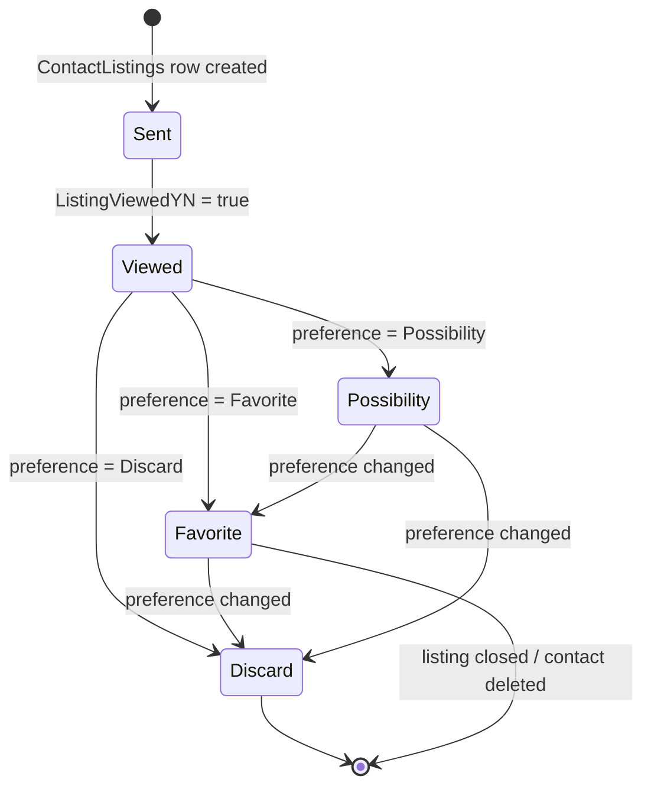
```mermaid
stateDiagram-v2
    [*] --> Sent: ContactListings row created
    Sent --> Viewed: ListingViewedYN = true
    Viewed --> Favorite: preference = Favorite
    Viewed --> Possibility: preference = Possibility
    Viewed --> Discard: preference = Discard
    Favorite --> Discard: preference changed
    Possibility --> Favorite: preference changed
    Possibility --> Discard: preference changed
    Discard --> [*]
    Favorite --> [*]: listing closed / contact deleted
```

## Listing lifecycle (canonical, RESO DD 2.0)

Source: [`processes/listing-lifecycle.md`](../../processes/listing-lifecycle.md)

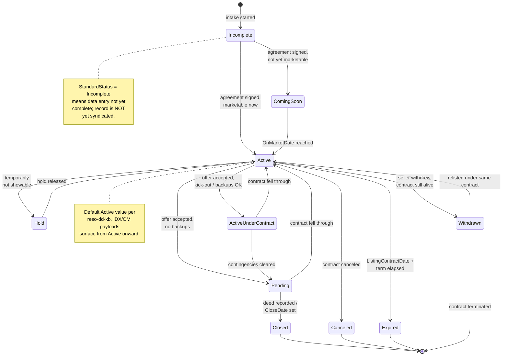
```mermaid
stateDiagram-v2
    [*] --> Incomplete: intake started
    Incomplete --> ComingSoon: agreement signed,<br/>not yet marketable
    Incomplete --> Active: agreement signed,<br/>marketable now
    ComingSoon --> Active: OnMarketDate reached
    Active --> Hold: temporarily<br/>not showable
    Hold --> Active: hold released
    Active --> ActiveUnderContract: offer accepted,<br/>kick-out / backups OK
    Active --> Pending: offer accepted,<br/>no backups
    ActiveUnderContract --> Pending: contingencies cleared
    ActiveUnderContract --> Active: contract fell through
    Pending --> Closed: deed recorded /<br/>CloseDate set
    Pending --> Active: contract fell through
    Active --> Withdrawn: seller withdrew,<br/>contract still alive
    Active --> Canceled: contract canceled
    Active --> Expired: ListingContractDate +<br/>term elapsed
    Withdrawn --> Active: relisted under same contract
    Closed --> [*]
    Canceled --> [*]
    Expired --> [*]
    Withdrawn --> [*]: contract terminated
    note right of Incomplete
      StandardStatus = Incomplete
      means data entry not yet
      complete; record is NOT
      yet syndicated.
    end note
    note right of Active
      Default Active value per
      reso-dd-kb. IDX/OM payloads
      surface from Active onward.
    end note
```

## Media lifecycle (canonical, RESO DD 2.0)

Source: [`processes/media-lifecycle.md`](../../processes/media-lifecycle.md)

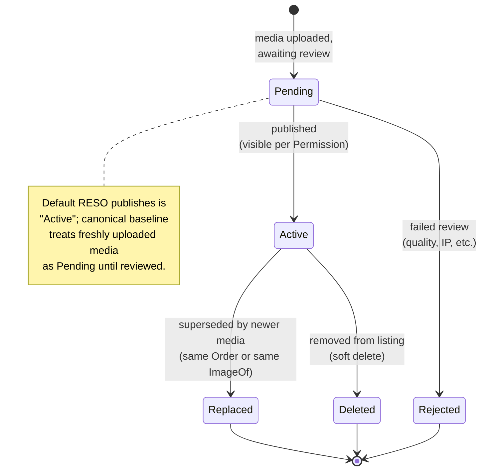
```mermaid
stateDiagram-v2
    [*] --> Pending: media uploaded,<br/>awaiting review
    Pending --> Active: published<br/>(visible per Permission)
    Pending --> Rejected: failed review<br/>(quality, IP, etc.)
    Active --> Replaced: superseded by newer media<br/>(same Order or same ImageOf)
    Active --> Deleted: removed from listing<br/>(soft delete)
    Replaced --> [*]
    Deleted --> [*]
    Rejected --> [*]
    note right of Pending
      Default RESO publishes is
      "Active"; canonical baseline
      treats freshly uploaded media
      as Pending until reviewed.
    end note
```

## Member onboarding (canonical, RESO DD 2.0)

Source: [`processes/member-onboarding.md`](../../processes/member-onboarding.md)

### Diagram 1

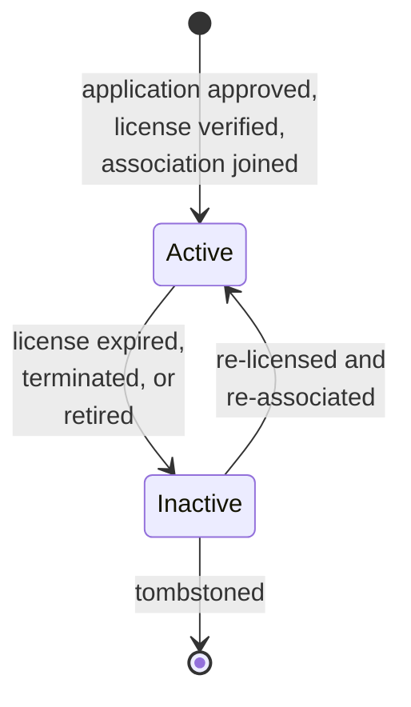
```mermaid
stateDiagram-v2
    [*] --> Active: application approved,<br/>license verified,<br/>association joined
    Active --> Inactive: license expired,<br/>terminated, or<br/>retired
    Inactive --> Active: re-licensed and<br/>re-associated
    Inactive --> [*]: tombstoned
```

### Diagram 2

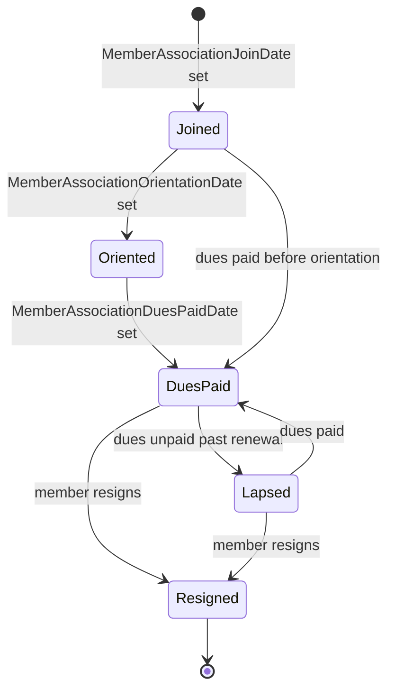
```mermaid
stateDiagram-v2
    [*] --> Joined: MemberAssociationJoinDate set
    Joined --> Oriented: MemberAssociationOrientationDate set
    Oriented --> DuesPaid: MemberAssociationDuesPaidDate set
    Joined --> DuesPaid: dues paid before orientation
    DuesPaid --> Lapsed: dues unpaid past renewal
    Lapsed --> DuesPaid: dues paid
    DuesPaid --> Resigned: member resigns
    Lapsed --> Resigned: member resigns
    Resigned --> [*]
```

### Diagram 3

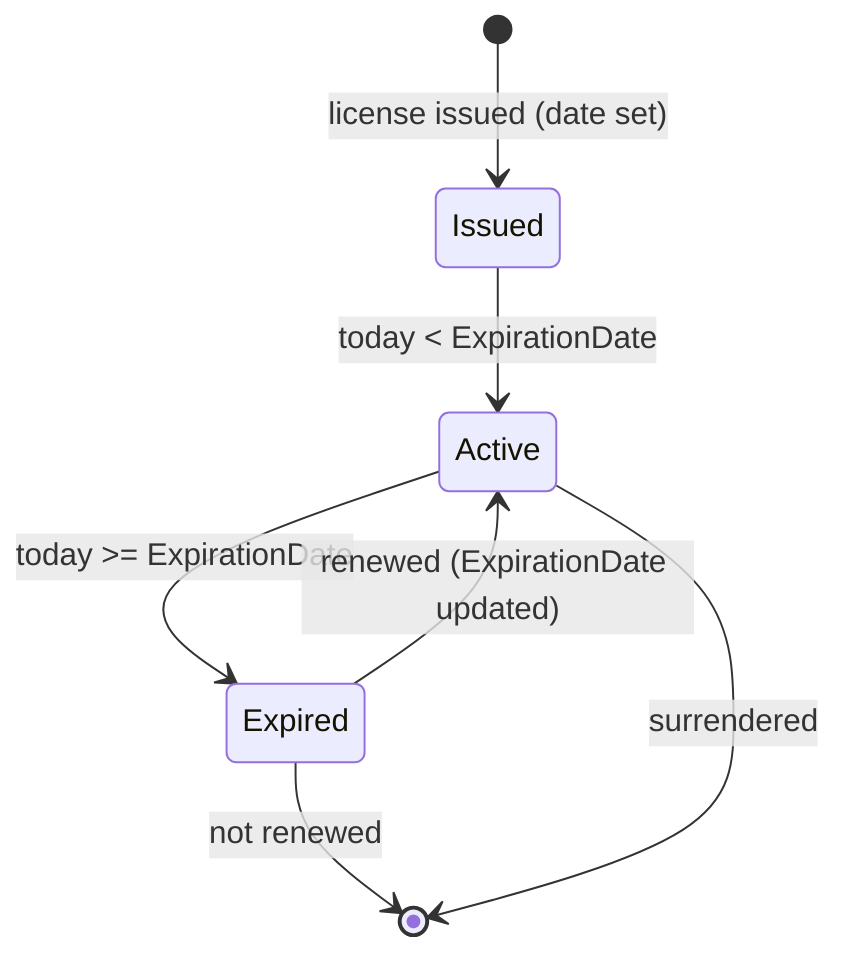
```mermaid
stateDiagram-v2
    [*] --> Issued: license issued (date set)
    Issued --> Active: today < ExpirationDate
    Active --> Expired: today >= ExpirationDate
    Expired --> Active: renewed (ExpirationDate updated)
    Expired --> [*]: not renewed
    Active --> [*]: surrendered
```

## Office onboarding (canonical, RESO DD 2.0)

Source: [`processes/office-onboarding.md`](../../processes/office-onboarding.md)

### Diagram 1

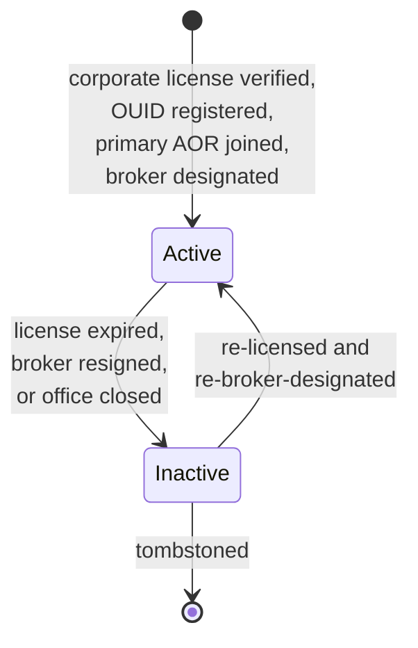
```mermaid
stateDiagram-v2
    [*] --> Active: corporate license verified,<br/>OUID registered,<br/>primary AOR joined,<br/>broker designated
    Active --> Inactive: license expired,<br/>broker resigned,<br/>or office closed
    Inactive --> Active: re-licensed and<br/>re-broker-designated
    Inactive --> [*]: tombstoned
```

### Diagram 2

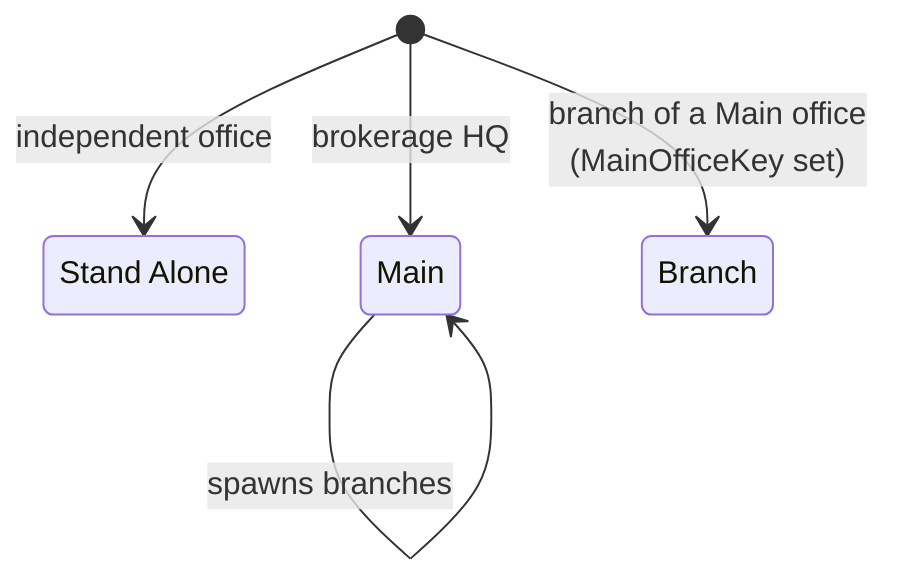
```mermaid
stateDiagram-v2
    state "Stand Alone" as SA
    state "Main" as M
    state "Branch" as B
    [*] --> SA: independent office
    [*] --> M: brokerage HQ
    M --> M: spawns branches
    [*] --> B: branch of a Main office<br/>(MainOfficeKey set)
```

### Diagram 3

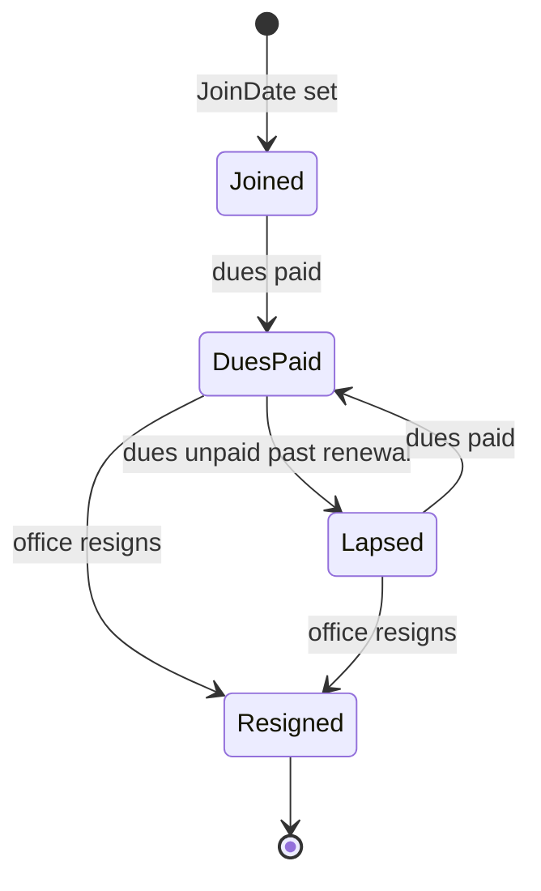
```mermaid
stateDiagram-v2
    [*] --> Joined: JoinDate set
    Joined --> DuesPaid: dues paid
    DuesPaid --> Lapsed: dues unpaid past renewal
    Lapsed --> DuesPaid: dues paid
    DuesPaid --> Resigned: office resigns
    Lapsed --> Resigned: office resigns
    Resigned --> [*]
```

### Diagram 4

```mermaid
stateDiagram-v2
    [*] --> Issued: license issued (date set)
    Issued --> Active: today < ExpirationDate
    Active --> Expired: today >= ExpirationDate
    Expired --> Active: renewed (ExpirationDate updated)
    Expired --> [*]: not renewed
    Active --> [*]: surrendered
```

## Open house lifecycle (canonical, RESO DD 2.0)

Source: [`processes/open-house-lifecycle.md`](../../processes/open-house-lifecycle.md)

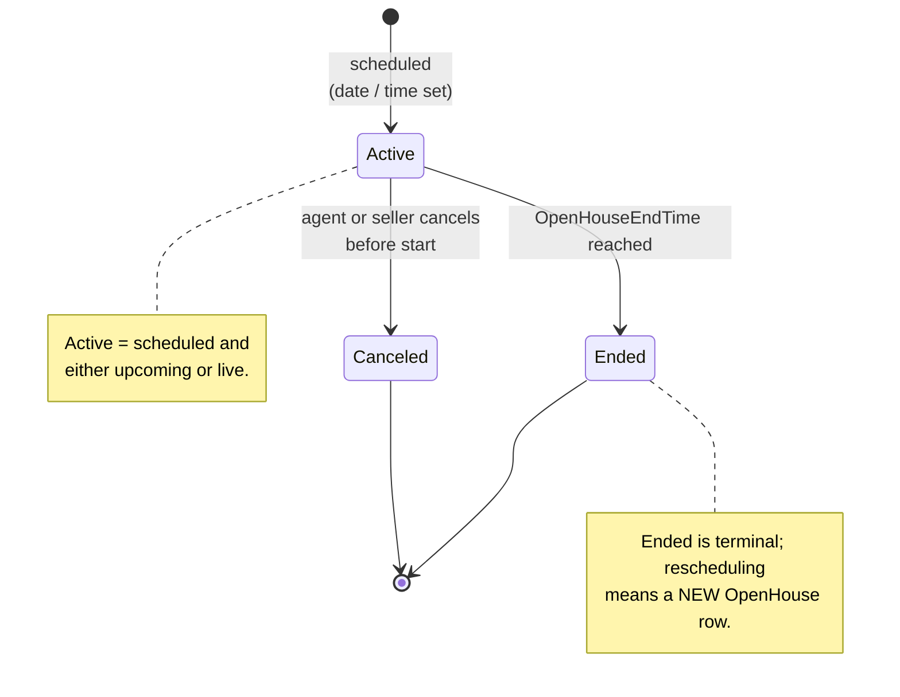
```mermaid
stateDiagram-v2
    [*] --> Active: scheduled<br/>(date / time set)
    Active --> Canceled: agent or seller cancels<br/>before start
    Active --> Ended: OpenHouseEndTime reached
    Canceled --> [*]
    Ended --> [*]
    note right of Active
      Active = scheduled and
      either upcoming or live.
    end note
    note right of Ended
      Ended is terminal; rescheduling
      means a NEW OpenHouse row.
    end note
```

## Showing lifecycle (canonical, RESO DD 2.0)

Source: [`processes/showing-lifecycle.md`](../../processes/showing-lifecycle.md)

### Diagram 1

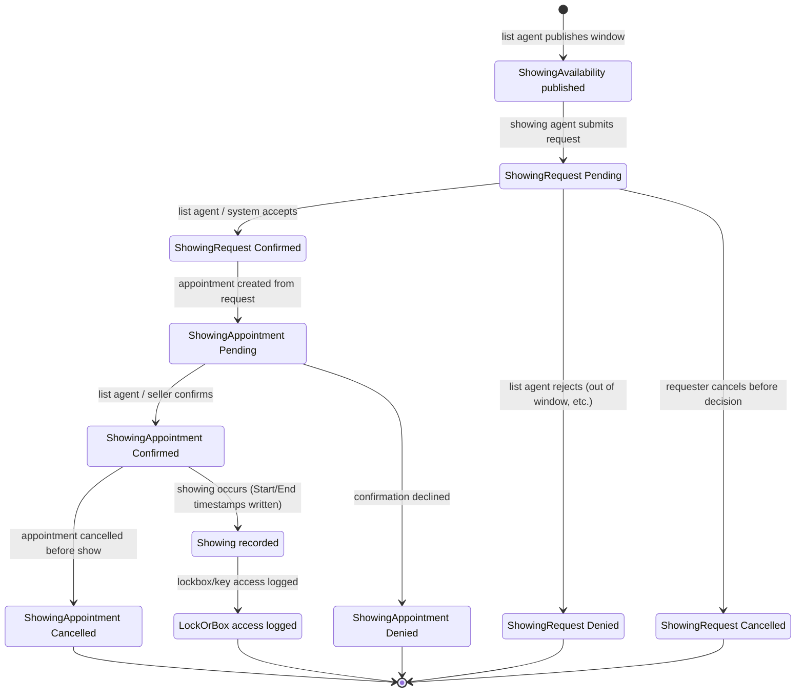
```mermaid
stateDiagram-v2
    state "ShowingAvailability published" as SA
    state "ShowingRequest Pending" as SR_P
    state "ShowingRequest Confirmed" as SR_C
    state "ShowingRequest Denied" as SR_D
    state "ShowingRequest Cancelled" as SR_X
    state "ShowingAppointment Pending" as A_P
    state "ShowingAppointment Confirmed" as A_C
    state "ShowingAppointment Denied" as A_D
    state "ShowingAppointment Cancelled" as A_X
    state "Showing recorded" as S_R
    state "LockOrBox access logged" as LB

    [*] --> SA: list agent publishes window
    SA --> SR_P: showing agent submits request
    SR_P --> SR_C: list agent / system accepts
    SR_P --> SR_D: list agent rejects (out of window, etc.)
    SR_P --> SR_X: requester cancels before decision
    SR_C --> A_P: appointment created from request
    A_P --> A_C: list agent / seller confirms
    A_P --> A_D: confirmation declined
    A_C --> A_X: appointment cancelled before show
    A_C --> S_R: showing occurs (Start/End timestamps written)
    S_R --> LB: lockbox/key access logged
    LB --> [*]
    SR_D --> [*]
    SR_X --> [*]
    A_X --> [*]
    A_D --> [*]
```

### Diagram 2

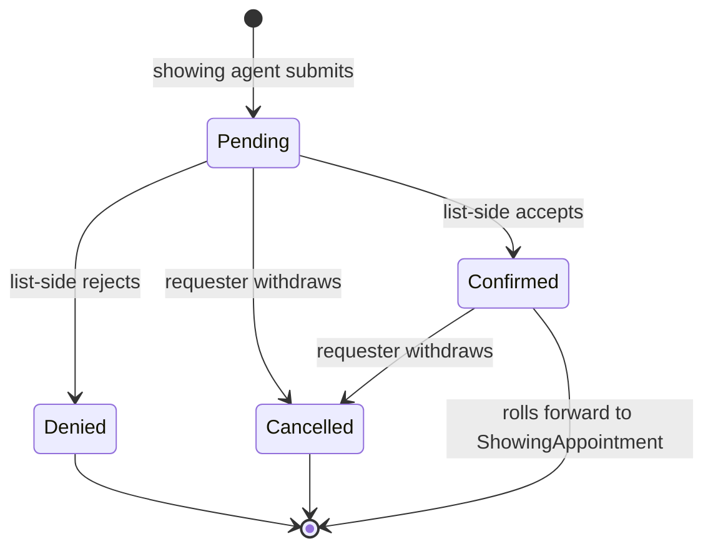
```mermaid
stateDiagram-v2
    [*] --> Pending: showing agent submits
    Pending --> Confirmed: list-side accepts
    Pending --> Denied: list-side rejects
    Pending --> Cancelled: requester withdraws
    Confirmed --> Cancelled: requester withdraws
    Denied --> [*]
    Cancelled --> [*]
    Confirmed --> [*]: rolls forward to ShowingAppointment
```

### Diagram 3

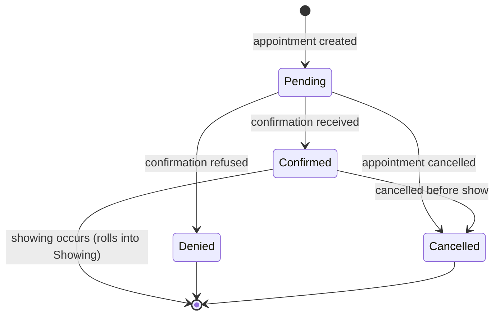
```mermaid
stateDiagram-v2
    [*] --> Pending: appointment created
    Pending --> Confirmed: confirmation received
    Pending --> Denied: confirmation refused
    Pending --> Cancelled: appointment cancelled
    Confirmed --> Cancelled: cancelled before show
    Confirmed --> [*]: showing occurs (rolls into Showing)
    Denied --> [*]
    Cancelled --> [*]
```

## Team lifecycle (canonical, RESO DD 2.0)

Source: [`processes/team-lifecycle.md`](../../processes/team-lifecycle.md)

### Diagram 1

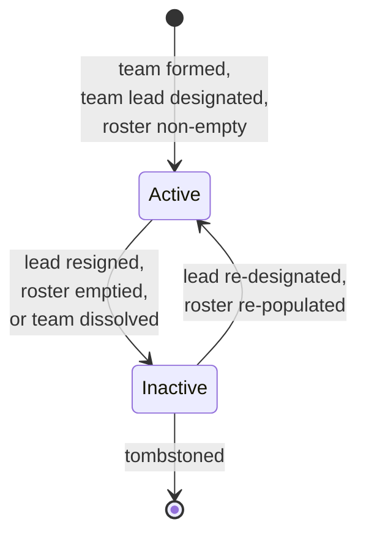
```mermaid
stateDiagram-v2
    [*] --> Active: team formed,<br/>team lead designated,<br/>roster non-empty
    Active --> Inactive: lead resigned,<br/>roster emptied,<br/>or team dissolved
    Inactive --> Active: lead re-designated,<br/>roster re-populated
    Inactive --> [*]: tombstoned
```

### Diagram 2

```mermaid
stateDiagram-v2
    [*] --> Member: TeamMembers row inserted
    Member --> Member: TeamMemberType changed
    Member --> [*]: TeamMembers row deleted (member left)
```

## Transaction lifecycle (canonical, RESO DD 2.0)

Source: [`processes/transaction-lifecycle.md`](../../processes/transaction-lifecycle.md)

### Diagram 1

```mermaid
stateDiagram-v2
    [*] --> ListingForSale: listing for sale created
    [*] --> ListingForLease: listing for lease created
    ListingForSale --> PurchaseOffer: buyer-side offer recorded
    ListingForLease --> LeaseOffer: tenant-side offer recorded
    PurchaseOffer --> Other: counter / withdrawn / etc.
    LeaseOffer --> Other: counter / withdrawn / etc.
    PurchaseOffer --> [*]: linked Property reaches Closed
    LeaseOffer --> [*]: linked Property reaches Closed
    Other --> [*]
```

### Diagram 2

```mermaid
stateDiagram-v2
    state "Property: Pending" as P
    state "Property: Closed" as C
    state "TransactionManagement row" as TM
    state "HistoryTransactional close row" as HT
    P --> TM: TransactionType set,<br/>linkage established
    TM --> HT: HistoryTransactional row<br/>ChangeType = Closed
    HT --> C: Property.StandardStatus = Closed,<br/>CloseDate set,<br/>OffMarketDate set
    C --> [*]
```

### Diagram 3

```mermaid
stateDiagram-v2
    state "Source resource" as SR
    state "HistoryTransactional row" as HT
    SR --> HT: state change writes here
    HT --> [*]: append-only,<br/>never updated or deleted
```
