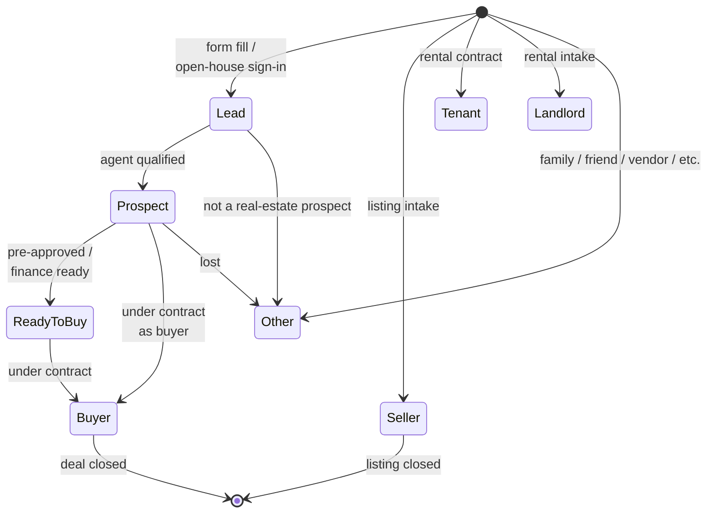
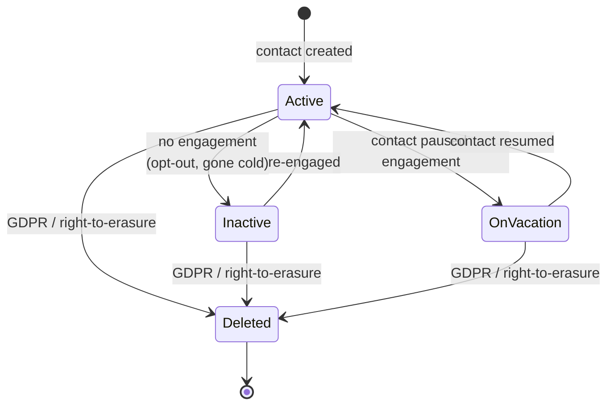
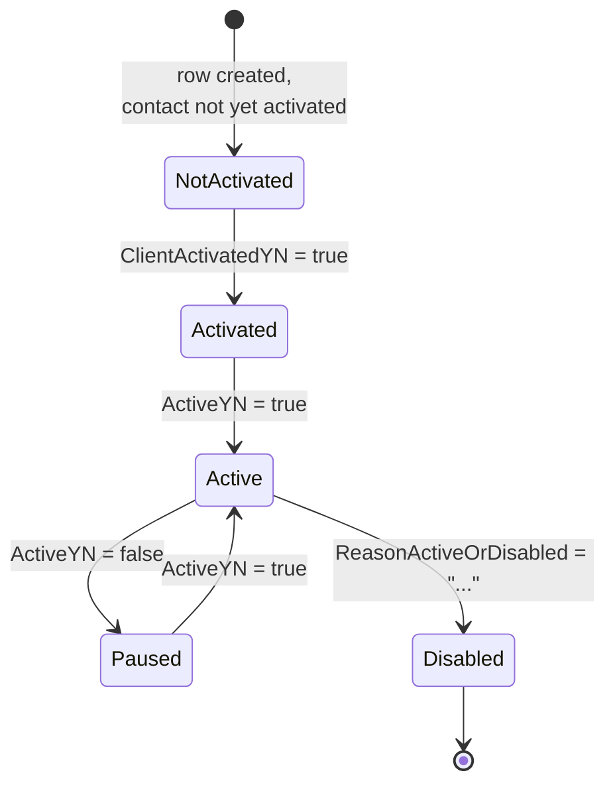
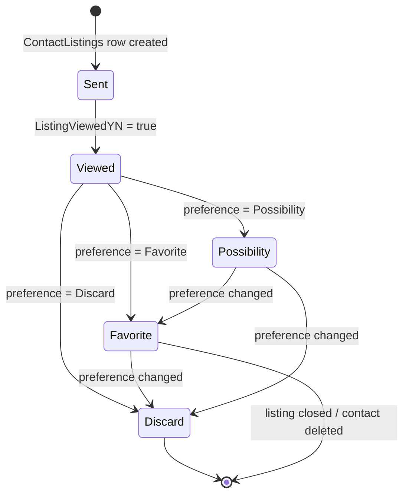

# Lead-Contact lifecycle (canonical, RESO DD 2.0)

How a person flows from lead through prospect to active client to
inactive contact, expressed entirely in RESO DD 2.0 vocabulary.
Five resources collaborate: `Contacts`, `SavedSearch`, `Prospecting`,
`ContactListings`, `ContactListingNotes`.

This is the canonical baseline. Project flavours (e.g. Sharp-SIR's
"prospect / pipeline / closed" stages) belong in
[`docs/business-processes/`](../../../business-processes/index.md);
they MUST map onto the canonical states defined here.

## Scope

In scope:

- The `Contacts.ContactStatus` and `Contacts.ContactType` state
  machines.
- The auto-search machinery (`SavedSearch` + `Prospecting`) that
  drives the relationship.
- The per-listing engagement record (`ContactListings`) and its
  notes (`ContactListingNotes`).
- Reverse-prospecting and concierge variants.

Out of scope:

- The listing the contact engages with (see
  [`listing-lifecycle.md`](listing-lifecycle.md)).
- Showings the contact requests (see
  [`showing-lifecycle.md`](showing-lifecycle.md)).
- The closing / commission flow (see
  [`transaction-lifecycle.md`](transaction-lifecycle.md)).

## Primary state machine: `Contacts.ContactType`

`ContactType` is RESO's controlled answer to "what kind of contact
is this?". The canonical baseline treats it as the lead-to-client
funnel state.

The canonical baseline draws only the value-driven transitions; the
full enumeration set RESO publishes is much larger and is captured
in the citation block.

### Transition table

| From | To | Trigger | Required field changes |
|---|---|---|---|
| `[*]` | `Lead` | New `Contacts` row created | `ContactKey`, `FirstName`, `LastName`, `Email`/`MobilePhone`, `LeadSource`, `OriginalEntryTimestamp`, `ContactStatus = Active`, `ContactType = Lead` |
| `Lead` | `Prospect` | Agent qualifies (criteria captured) | `ContactType`, `ModificationTimestamp`, plus first `SavedSearch` row |
| `Prospect` | `Ready to Buy` | Pre-approval / readiness flag | `ContactType`, `ModificationTimestamp` |
| `Prospect`/`Ready to Buy` | `Buyer` | Contract signed as buyer | `ContactType`, `ModificationTimestamp` |
| `[*]` | `Seller` | Listing intake captures owner identity | `ContactType = Seller` |
| any | `Other` | Determined to be non-prospect (vendor, family, etc.) | `ContactType`, `ModificationTimestamp` |

## Secondary state machine: `Contacts.ContactStatus`

`ContactStatus` is the activity flag, orthogonal to `ContactType`.

| From | To | Trigger | Required field changes |
|---|---|---|---|
| `[*]` | `Active` | Contact created | `ContactStatus = Active`, timestamps |
| `Active` | `On Vacation` | Pause prospecting | `ContactStatus`, `Prospecting.ActiveYN = false` on all that contact's prospecting rows |
| `On Vacation` | `Active` | Resume | `ContactStatus`, `Prospecting.ActiveYN = true` |
| `Active`/`On Vacation` | `Inactive` | No reply / gone cold | `ContactStatus`, `Prospecting.ClientActivatedYN = false` |
| any non-`Deleted` | `Deleted` | Right-to-erasure / spam | `ContactStatus = Deleted`, `ModificationTimestamp` |

## Resource roles

### `Contacts`

The core record. Identifier semantics:

- `ContactKey` is the system-of-record opaque PK; immutable.
- `ContactLoginId` is the consumer-portal login (optional).
- `OwnerMember` / `OwnerMemberKey` is the agent who owns the
  relationship; required for prospecting rights to attach.
- `LeadSource` is the canonical attribution string (open-house,
  Zillow, walk-in, etc.) - free-text per RESO, but project flavours
  SHOULD codify.
- `ReferredBy` records the introducer (often another `Contacts`
  row).
- `PreferredAddress`, `PreferredPhone` resolve which of the
  `Home*`/`Work*`/`Other*` blocks to surface.

### `SavedSearch`

The contact's stated criteria (or the agent's saved view on the
contact's behalf). One contact may have many `SavedSearch` rows.

| Field | Role |
|---|---|
| `SavedSearchKey` | PK |
| `SavedSearchName`, `SavedSearchDescription` | Human label |
| `SearchQuery`, `SearchQueryType`, `SearchQueryHumanReadable` | The query (`$filter`, `DMQL2`, or human-readable form) |
| `Member`, `MemberKey`, `MemberMlsId` | Agent who owns the search |
| `SavedSearchType` | Project label for the search bucket |
| `ResourceName` | What resource the query runs against (`Property`, `Member`, etc.) |
| `ClassName` | Property class (residential / commercial) when `ResourceName = Property` |

### `Prospecting`

The auto-email-out machinery. One row per `(SavedSearch, Contact)`
pairing.

| Field | Role |
|---|---|
| `ProspectingKey` | PK |
| `Contact`, `ContactKey` | Receiver of the auto-emails |
| `OwnerMember`, `OwnerMemberKey` | Agent on the loop |
| `SavedSearch`, `SavedSearchKey` | The search powering it |
| `ActiveYN` | Currently sending? |
| `ClientActivatedYN` | Has the client opted in? |
| `ScheduleType`, `DailySchedule`, `NextSendTimestamp` | Cadence (`ASAP`, `Daily`, `Monthly`) |
| `Subject`, `MessageNew`, `MessageRevise`, `MessageUpdate` | Email templates |
| `ToEmailList`, `CcEmailList`, `BccEmailList`, `BccMeYN` | Routing |
| `ConciergeYN`, `ConciergeNotificationsYN` | Concierge mode (agent vets each match before send) |
| `LastNewChangedTimestamp`, `LastViewedTimestamp` | Audit |
| `ReasonActiveOrDisabled` | Free-text disable reason |

### `ContactListings`

Per-listing relationship state. One row per
`(Contact, Property)`. RESO does not publish a closed `Status`
lookup here; `ContactListingPreference` carries the trichotomy.

`ContactListingPreference` lookup values:
`Favorite`, `Possibility`, `Discard`.

| Field | Role |
|---|---|
| `ContactListingsKey` | PK |
| `Contact`, `ContactKey` | The contact |
| `Listing`, `ListingId`, `ListingKey` | The listing |
| `ContactListingPreference` | The trichotomy above |
| `DirectEmailYN` | Was this match auto-emailed? |
| `ListingSentTimestamp`, `ListingViewedYN` | Engagement timeline |
| `LastAgentNoteTimestamp`, `LastContactNoteTimestamp` | Last notes |
| `AgentNotesUnreadYN`, `ContactNotesUnreadYN` | Inbox state |
| `PortalLastVisitedTimestamp` | When the consumer last opened the portal |
| `ListingNotes` | Free-text from the consumer or agent |
| `ListingModificationTimestamp` | Cached snapshot from `Property.ModificationTimestamp` |
| `ResourceName`, `ClassName` | Disambiguators when joining heterogeneous `Property` payloads |

### `ContactListingNotes`

The audit trail of notes attached to a `ContactListings` row.
Append-only.

| Field | Role |
|---|---|
| `ContactListingNotesKey` | PK |
| `Contact`, `ContactKey` | Who the note is about |
| `Listing`, `ListingId`, `ListingKey` | Which listing |
| `NoteContents` | Free-text |
| `NotedBy` | Author (agent or contact) |
| `ModificationTimestamp` | Audit |

## Decision points

| Decision | Inputs | Outputs |
|---|---|---|
| `Lead` -> `Prospect`? | Agent qualification call complete | `ContactType = Prospect` + first `SavedSearch` |
| `Prospect` -> `Ready to Buy`? | Pre-approval letter / cash position confirmed | `ContactType = Ready to Buy` |
| Concierge vs. direct send | Agent preference | `Prospecting.ConciergeYN` |
| `Active` -> `Inactive` | Time since last engagement, opt-out events | `ContactStatus = Inactive`, freeze prospecting |
| Reverse prospecting visibility | `Contacts.ReverseProspectingEnabledYN` and listing's RP setting | Whether listing agents can see this contact's interest |

## Cross-resource interactions

- A `Contacts` row's `OwnerMember` is a `Member` row; see
  [`member-onboarding.md`](member-onboarding.md).
- A `ContactListings` row points to a live `Property` and inherits
  visibility from its `StandardStatus`; see
  [`listing-lifecycle.md`](listing-lifecycle.md).
- A `ShowingRequest` whose `ShowingRequestor = Consumer` MAY point
  back to a `Contacts` row; see
  [`showing-lifecycle.md`](showing-lifecycle.md).
- Every state change on `Contacts.ContactStatus` /
  `Contacts.ContactType` SHOULD emit a `HistoryTransactional` row;
  see [`transaction-lifecycle.md`](transaction-lifecycle.md).

## Identifier semantics

- `ContactKey` immutable PK, system-of-record. Re-use is forbidden.
- `OwnerMemberKey` is the agent owning the relationship. Re-assigning
  the owner is modelled by writing a new value AND emitting a
  `HistoryTransactional` row; do NOT bulk-rewrite history.
- `OriginatingSystemContactKey` and `SourceSystemContactKey` carry
  the upstream identifiers when the row was federated from another
  system.

## Non-goals

- No opinion on the marketing automation engine that fires
  `Prospecting.MessageNew/Revise/Update`; the canonical baseline
  only requires the resource fields to be set.
- No opinion on consent regimes (TCPA, GDPR, CASL); project
  flavours encode them.
- No opinion on lead-routing round-robin rules; that lives in the
  project flavour.

<!-- reso-citations
Resource: Contacts
Resource: SavedSearch
Resource: Prospecting
Resource: ContactListings
Resource: ContactListingNotes
Field: Contacts.ContactKey
Field: Contacts.ContactLoginId
Field: Contacts.ContactStatus
Field: Contacts.ContactType
Field: Contacts.FirstName
Field: Contacts.LastName
Field: Contacts.Email
Field: Contacts.MobilePhone
Field: Contacts.LeadSource
Field: Contacts.ReferredBy
Field: Contacts.OwnerMember
Field: Contacts.OwnerMemberKey
Field: Contacts.PreferredAddress
Field: Contacts.PreferredPhone
Field: Contacts.OriginalEntryTimestamp
Field: Contacts.ModificationTimestamp
Field: Contacts.OriginatingSystemContactKey
Field: Contacts.SourceSystemContactKey
Field: Contacts.ReverseProspectingEnabledYN
Field: SavedSearch.SavedSearchKey
Field: SavedSearch.SavedSearchName
Field: SavedSearch.SavedSearchDescription
Field: SavedSearch.SearchQuery
Field: SavedSearch.SearchQueryType
Field: SavedSearch.SearchQueryHumanReadable
Field: SavedSearch.Member
Field: SavedSearch.MemberKey
Field: SavedSearch.MemberMlsId
Field: SavedSearch.SavedSearchType
Field: SavedSearch.ResourceName
Field: SavedSearch.ClassName
Field: Prospecting.ProspectingKey
Field: Prospecting.Contact
Field: Prospecting.ContactKey
Field: Prospecting.OwnerMember
Field: Prospecting.OwnerMemberKey
Field: Prospecting.SavedSearch
Field: Prospecting.SavedSearchKey
Field: Prospecting.ActiveYN
Field: Prospecting.ClientActivatedYN
Field: Prospecting.ScheduleType
Field: Prospecting.DailySchedule
Field: Prospecting.NextSendTimestamp
Field: Prospecting.Subject
Field: Prospecting.MessageNew
Field: Prospecting.MessageRevise
Field: Prospecting.MessageUpdate
Field: Prospecting.ToEmailList
Field: Prospecting.CcEmailList
Field: Prospecting.BccEmailList
Field: Prospecting.BccMeYN
Field: Prospecting.ConciergeYN
Field: Prospecting.ConciergeNotificationsYN
Field: Prospecting.LastNewChangedTimestamp
Field: Prospecting.LastViewedTimestamp
Field: Prospecting.ReasonActiveOrDisabled
Field: ContactListings.ContactListingsKey
Field: ContactListings.Contact
Field: ContactListings.ContactKey
Field: ContactListings.Listing
Field: ContactListings.ListingId
Field: ContactListings.ListingKey
Field: ContactListings.ContactListingPreference
Field: ContactListings.DirectEmailYN
Field: ContactListings.ListingSentTimestamp
Field: ContactListings.ListingViewedYN
Field: ContactListings.LastAgentNoteTimestamp
Field: ContactListings.LastContactNoteTimestamp
Field: ContactListings.AgentNotesUnreadYN
Field: ContactListings.ContactNotesUnreadYN
Field: ContactListings.PortalLastVisitedTimestamp
Field: ContactListings.ListingNotes
Field: ContactListings.ListingModificationTimestamp
Field: ContactListings.ResourceName
Field: ContactListings.ClassName
Field: ContactListingNotes.ContactListingNotesKey
Field: ContactListingNotes.Contact
Field: ContactListingNotes.ContactKey
Field: ContactListingNotes.Listing
Field: ContactListingNotes.ListingId
Field: ContactListingNotes.ListingKey
Field: ContactListingNotes.NoteContents
Field: ContactListingNotes.NotedBy
Field: ContactListingNotes.ModificationTimestamp
LookupValue: ContactStatus.Active
LookupValue: ContactStatus.On Vacation
LookupValue: ContactStatus.Inactive
LookupValue: ContactStatus.Deleted
LookupValue: ContactType.Lead
LookupValue: ContactType.Prospect
LookupValue: ContactType.Ready to Buy
LookupValue: ContactType.Buyer
LookupValue: ContactType.Seller
LookupValue: ContactType.Tenant
LookupValue: ContactType.Landlord
LookupValue: ContactType.Other
LookupValue: ContactListingPreference.Favorite
LookupValue: ContactListingPreference.Possibility
LookupValue: ContactListingPreference.Discard
LookupValue: ScheduleType.ASAP
LookupValue: ScheduleType.Daily
LookupValue: ScheduleType.Monthly
LookupValue: SearchQueryType.$filter
LookupValue: SearchQueryType.DMQL2
-->
