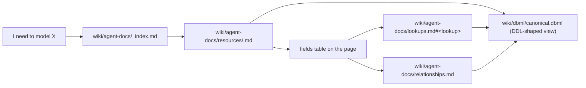

# USAGE.md - guide for coding agents consuming this data model

> **You are a coding agent (Lovable, Cursor, GitHub Copilot, ...) and you have
> been pointed at the `reso-dd-kb/` directory to learn the canonical data
> model used by this project. This document orients you.**

## TL;DR (5 sentences)

1. The canonical model is **RESO Data Dictionary 2.0**, 41 resources, 1,745 fields, 222 lookups.
2. The **DBML schema** lives in [`wiki/dbml/canonical.dbml`](wiki/dbml/canonical.dbml) (270 KB) and [`wiki/dbml/lookups.dbml`](wiki/dbml/lookups.dbml).
3. Per-resource human-readable docs are in [`wiki/agent-docs/resources/<snake>.md`](wiki/agent-docs/resources/) - one file per resource, with fields, FKs in/out, and lookup links.
4. The full **enum-value tables** are in [`wiki/agent-docs/lookups.md`](wiki/agent-docs/lookups.md), one anchor per lookup (e.g. `#property_type`).
5. Identifier style is **snake_case** in the DBML and the agent docs (matches what you should write in code); CamelCase only appears in the source CSVs and on `dd.reso.org`.

## Quick start

**"What table holds listings?"**
-> [`wiki/agent-docs/resources/property.md`](wiki/agent-docs/resources/property.md). PK = `listing_key`.

**"What columns does Property have?"**
-> Same file, "Fields" section. The `flags` column tells you which are PKs, FKs, dropped (Phase-2.5 satellite audit), or `[REVIEW]`.

**"What enum values are valid for `Property.PropertyType`?"**
-> Open [`property.md`](wiki/agent-docs/resources/property.md), find the `property_type` row, follow the link to [`lookups.md#property_type`](wiki/agent-docs/lookups.md#property_type).

**"Show me everything that references a Property."**
-> Top of [`property.md`](wiki/agent-docs/resources/property.md), "Foreign keys IN" section. Or grep `> property\.` in [`relationships.md`](wiki/agent-docs/relationships.md).

**"Generate a SQL DDL from this model."**
-> Parse [`wiki/dbml/canonical.dbml`](wiki/dbml/canonical.dbml) with any DBML library (`dbml-cli`, `@dbml/core`, ...). Map the generic DBML types (`varchar`, `int`, `double`, `bool`, `timestamp`, `date`) to your SQL engine's types. Lookups are real `Enum` blocks in `lookups.dbml`; reference them as a separate file.

**"I am writing tooling, not reading docs."**
-> Go straight to [`raw/*.csv`](raw/). Stable column order, stable sort order, `csv.QUOTE_MINIMAL`, `\n` line endings. CamelCase identifiers (preserved from upstream).

## What this directory is

A single source of truth for the **RESO Data Dictionary 2.0** real-estate
canonical model, derived verbatim from
[`dd.reso.org/DD2.0`](https://dd.reso.org/DD2.0/). It contains:

1. A verbatim HTML mirror of the upstream pages (`mirror/`).
2. Structured CSVs extracted from that mirror (`raw/*.csv`) - resources,
   fields, lookups, lookup values, foreign keys, satellite recommendations.
3. The canonical schema as DBML (`wiki/dbml/canonical.dbml` +
   `wiki/dbml/lookups.dbml`).
4. Agent-facing markdown docs derived from the CSVs and the DBML
   (`wiki/agent-docs/**`) - this is what you will read most of the time.

Everything in this directory is generated from the upstream RESO pages
or from the CSVs - no hand-curated alias maps, no opinions. If you need
behaviour that the spec does not describe, you are extending the model,
not consuming it; do that elsewhere and link back here.

## How to find what you need



Concrete navigation tips:

- **"Which table holds listings?"** -> `wiki/agent-docs/resources/property.md`.
- **"Which table holds agents?"** -> `wiki/agent-docs/resources/member.md`.
- **"Which enum values can I use for `Property.PropertyType`?"** ->
  open `wiki/agent-docs/resources/property.md`, find `property_type` in
  the fields table, follow the link to
  `wiki/agent-docs/lookups.md#property_type`.
- **"What FKs point at Property?"** -> top of `property.md`, "Foreign
  keys IN" section. Or grep `> property\.` in
  `wiki/agent-docs/relationships.md`.
- **"I want the full schema for tooling"** ->
  `wiki/dbml/canonical.dbml` (parses with any DBML library).
- **"I want raw structured data"** -> `raw/*.csv`. Stable column order,
  CamelCase identifiers (the agent docs and DBML use snake_case).

## Naming conventions

| Where                                | Identifier style |
|--------------------------------------|------------------|
| `dd.reso.org` source pages           | CamelCase (e.g. `ListAgentKey`, `PropertyType`) |
| `raw/*.csv` (structured extraction)  | CamelCase (preserved verbatim from source) |
| `wiki/dbml/*.dbml` (canonical schema)| snake_case (e.g. `list_agent_key`, `property_type`) |
| `wiki/agent-docs/**` (this layer)    | snake_case (matches the DBML) |

When you write code that talks to a database backed by this model, use
snake_case. When you cite the upstream spec, use CamelCase.

## FK semantics

FKs come from `raw/relationships.csv` (one row per detected FK, with
explicit evidence). The DBML and the agent docs only emit the high-
and medium-confidence rows.

- **`high`** - two or more independent signals agree (definition prose
  AND source-resource type AND/OR name shape). Trust as a hard FK.
- **`medium`** - exactly one strong signal (an explicit foreign-key
  statement in the upstream Definition prose, or a `Resource`-typed
  column with a non-empty `SourceResource`). Trust unless your domain
  knowledge contradicts it.
- **`low`** - only weak signals (name-shape match alone). NOT emitted
  to the DBML or to per-resource `Refs:` lines. Listed in
  `wiki/agent-docs/relationships.md` for transparency.

Special FK kinds you will see in the docs:

- **`resource_typed`** - the host column declared `SimpleDataType =
  Resource` on `dd.reso.org`. The actual scalar carrier on the host is
  a sibling column whose Definition mentions the target (e.g. the
  Resource-typed `Member.OriginatingSystem` is anchored to the scalar
  `Member.OriginatingSystemId`, not to `Member.OriginatingSystemKey`).
- **`collection_typed`** - the host column declared `SimpleDataType =
  Collection`. This is the inverse of a many-to-one FK already declared
  on the child resource. Not emitted as a Ref; surfaces as an
  `// inverse 1:N` comment above the host table in `canonical.dbml`
  and in the "Inverse 1:N" callout on the host's agent-doc page.
- **`polymorphic`** - the upstream prose explicitly says the FK can
  point at multiple resources (e.g. `CaravanStop.StopKey` "might also
  be another custom/local resource"). Emitted as a `// polymorphic FK`
  comment, not a Ref. Do not assume a single target.

## Lookup semantics

Lookups come from `raw/lookups.csv` + `raw/lookup_values.csv`. Three
flavours in the canonical model:

| Kind             | DBML representation                                       | Example                  |
|------------------|-----------------------------------------------------------|--------------------------|
| **closed-SV**    | `Enum` block in `wiki/dbml/lookups.dbml`. The host column is typed as the enum. | `Property.PropertyType`  |
| **closed-MV**    | Host column is `varchar`. The set of allowed values is in `lookup_values.csv` and listed on the lookups page. The column note in the DBML reads `multi: <LookupName>`. | `Property.AccessibilityFeatures` |
| **open**         | Host column is `varchar`. No closed value set; jurisdiction-defined (AOR, City, ...). The column note reads `open: jurisdiction-defined; no closed value list`. | `Property.City` |

Reach the value list via `wiki/agent-docs/lookups.md#<snake-anchor>` -
each anchor is the snake-cased lookup name (e.g.
`#property_type`, `#accessibility_features`).

## Reading the DBML

`wiki/dbml/canonical.dbml`:

- 41 `Table` blocks (one per RESO Resource).
- Columns in their original page order.
- Per-column note: `<StandardName> | <first sentence of Definition> | type=<SimpleDataType> | max_len=<MaxLength> | lookup=<Lookup>`.
- `pk` marker on the chosen primary key (with 9 `PK_OVERRIDES` for resources whose PK is not `<Resource>Key`).
- `// REVIEW: <reason>` lines above columns that the Phase-2.5 satellite audit flagged for human inspection.
- `// inverse 1:N: <field> -> <target>` comments above tables with collection-typed FKs.
- Bottom of file: `Ref: host.col > target.col` for every committed FK + `// polymorphic FK` comments.

`wiki/dbml/lookups.dbml`:

- 99 `Enum` blocks for closed-SV lookups, alphabetical, deterministic.
- A trailing comment block listing closed-MV-only lookups and open lookups for reference.

## Programmatic access

If you are writing tooling rather than reading docs, go straight to
`raw/*.csv`. Schemas are stable, sort order is stable, all CSVs use
`csv.QUOTE_MINIMAL` and `\n` line endings.

| File                          | Rows  | Use it when                                          |
|-------------------------------|------:|------------------------------------------------------|
| `raw/resources.csv`           |    41 | enumerate tables                                     |
| `raw/fields.csv`              | 1,745 | enumerate columns; learn `SimpleDataType`, `MaxLength`, `Lookup` |
| `raw/field_definitions.csv`   | 1,745 | get full Definition prose for a column               |
| `raw/lookups.csv`             |   222 | enumerate enums                                      |
| `raw/lookup_values.csv`       | 3,683 | enumerate enum values + their definitions            |
| `raw/relationships.csv`       |   ~230 | enumerate FKs with evidence + confidence            |
| `raw/satellites.csv`          |   ~200 | learn which columns the 2NF audit recommended dropping |

## What this directory is NOT

- Not opinionated. There is no "use ListAgentKey for the showing
  agent" rule here - that is project-specific guidance and lives in
  the consuming project's docs, not in `reso-dd-kb/`.
- Not a database. There are no migrations or seed data. The DBML is
  a schema definition; emit your own DDL/migrations from it.
- Not a SQL dialect. RESO `SimpleDataType` is mapped to a generic
  DBML type (`varchar`, `int`, `double`, `bool`, `timestamp`, `date`).
  Pick the right SQL type for your engine.

## When the upstream spec changes

The pipeline is reproducible. To refresh:

```bash
cd reso-dd-kb
bash scripts/01_mirror.sh           # re-mirror dd.reso.org/DD2.0/
python3 scripts/02_parse_mirror.py  # extract raw/*.csv
python3 scripts/03a_extract_definition_signals.py
python3 scripts/03b_extract_type_signals.py
python3 scripts/03c_extract_name_signals.py
python3 scripts/03_merge_signals.py
python3 scripts/04a_prefix_satellites.py
python3 scripts/04b_child_match.py
python3 scripts/04c_definition_similarity.py
python3 scripts/04d_type_match.py
python3 scripts/04_merge_satellites.py
python3 scripts/05_emit_dbml.py
python3 scripts/06_emit_agent_docs.py   # rewrites wiki/agent-docs/**
```

Every script ends with hard-fail verification gates. If any gate
breaks, do not commit - fix the script.

This `USAGE.md` is the only file in `wiki/agent-docs/`'s neighbourhood
that is human-curated and stable across refreshes. Everything under
`wiki/agent-docs/**` is regenerated and overwrites cleanly.
