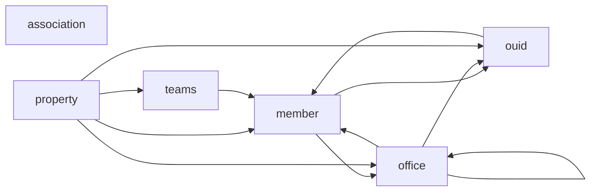

[index](_index.md) | [lookups](lookups.md) | [USAGE.md](../../USAGE.md)

# Relationships (foreign keys)

> The **Committed Refs** section below is the source of truth - it is parsed directly from `wiki/dbml/canonical.dbml`. The **Phase-2 detected signals** section is a wider net derived from `raw/relationships.csv`; some of those rows are folded into a single committed Ref by Phase-3 normalisation (Resource-typed anchoring, per-target dedup) and a few are intentionally not emitted (low-confidence, polymorphic).

## At a glance

| Category | Count | In DBML? |
|---|---:|---|
| Committed Refs (high+medium, scalar) | 64 | yes (`Ref:`) |
| Polymorphic FKs (target resolved at runtime) | 10 | comment only |
| Inverse 1:N (collection_typed) | 48 | comment only |
| Low-confidence (Phase 2 only) | 46 | no |

## Connection backbone

The most-connected resources and the FKs between them. Use this as a mental map before drilling into individual resource pages.

## Committed Refs (in DBML)

64 rows. Source: `wiki/dbml/canonical.dbml`.

| Ref | Confidence |
|---|---|
| `caravan_stop.caravan_key` -> `caravan.caravan_key` | high |
| `caravan_stop.stop_showing_agent_key` -> `member.member_key` | medium |
| `contact_listing_notes.contact_key` -> `contacts.contact_key` | medium |
| `contact_listing_notes.listing_key` -> `property.listing_key` | medium |
| `contact_listings.contact_key` -> `contacts.contact_key` | medium |
| `contact_listings.listing_key` -> `property.listing_key` | medium |
| `contacts.originating_system_id` -> `ouid.organization_unique_id_key` | medium |
| `contacts.owner_member_id` -> `member.member_key` | medium |
| `contacts.owner_member_key` -> `member.member_key` | high |
| `contacts.source_system_id` -> `ouid.organization_unique_id_key` | medium |
| `history_transactional.changed_by_member_key` -> `member.member_key` | high |
| `history_transactional.originating_system_id` -> `ouid.organization_unique_id` | medium |
| `history_transactional.source_system_id` -> `ouid.organization_unique_id` | medium |
| `lock_or_box.showing_office_id` -> `office.office_key` | medium |
| `media.changed_by_member_id` -> `member.member_key` | medium |
| `media.changed_by_member_key` -> `member.member_key` | high |
| `media.source_system_id` -> `ouid.organization_unique_id_key` | medium |
| `member.office_key` -> `office.office_key` | high |
| `member.originating_system_id` -> `ouid.organization_unique_id_key` | medium |
| `member.source_system_id` -> `ouid.organization_unique_id_key` | medium |
| `member_association.association_key` -> `association.association_key` | medium |
| `member_association.member_key` -> `member.member_key` | medium |
| `member_state_license.member_key` -> `member.member_key` | medium |
| `office.main_office_key` -> `office.office_key` | high |
| `office.office_broker_key` -> `member.member_key` | medium |
| `office.office_manager_key` -> `member.member_key` | medium |
| `office.originating_system_id` -> `ouid.organization_unique_id_key` | medium |
| `office.source_system_id` -> `ouid.organization_unique_id_key` | medium |
| `office_association.association_key` -> `association.association_key` | medium |
| `office_association.office_key` -> `office.office_key` | high |
| `office_corporate_license.office_key` -> `office.office_key` | high |
| `open_house.showing_agent_key` -> `member.member_key` | medium |
| `ouid.changed_by_member_id` -> `member.member_key` | medium |
| `ouid.changed_by_member_key` -> `member.member_key` | high |
| `property.buyer_agent_key` -> `member.member_key` | medium |
| `property.buyer_office_key` -> `office.office_key` | high |
| `property.buyer_team_key` -> `teams.team_key` | medium |
| `property.co_buyer_agent_key` -> `member.member_key` | medium |
| `property.co_buyer_office_key` -> `office.office_key` | high |
| `property.co_list_agent_key` -> `member.member_key` | medium |
| `property.co_list_office_key` -> `office.office_key` | high |
| `property.list_agent_key` -> `member.member_key` | medium |
| `property.list_office_key` -> `office.office_key` | high |
| `property.list_team_key` -> `teams.team_key` | medium |
| `property.originating_system_id` -> `ouid.organization_unique_id_key` | medium |
| `property.source_system_id` -> `ouid.organization_unique_id_key` | medium |
| `property_green_verification.listing_id` -> `property.listing_key` | medium |
| `property_green_verification.listing_key` -> `property.listing_key` | medium |
| `property_power_production.listing_id` -> `property.listing_key` | medium |
| `property_power_production.listing_key` -> `property.listing_key` | medium |
| `property_rooms.listing_id` -> `property.listing_key` | medium |
| `property_rooms.listing_key` -> `property.listing_key` | medium |
| `property_unit_types.listing_id` -> `property.listing_key` | medium |
| `property_unit_types.listing_key` -> `property.listing_key` | medium |
| `prospecting.contact_key` -> `contacts.contact_key` | medium |
| `prospecting.owner_member_key` -> `member.member_key` | high |
| `prospecting.saved_search_key` -> `saved_search.saved_search_key` | high |
| `saved_search.member_key` -> `member.member_key` | high |
| `showing.showing_agent_key` -> `member.member_key` | medium |
| `showing_appointment.showing_agent_key` -> `member.member_key` | medium |
| `showing_request.showing_agent_key` -> `member.member_key` | medium |
| `team_members.member_key` -> `member.member_key` | high |
| `team_members.team_key` -> `teams.team_key` | medium |
| `teams.team_lead_key` -> `member.member_key` | medium |

## Phase-2 detected signals (high+medium, pre-normalisation)

125 rows from `raw/relationships.csv`. Some rows (particularly `resource_typed`) are folded into a single committed Ref above by Phase-3 anchoring; some collide on the same target table and were deduped to the target's PK.

| Detected FK | Kind | Confidence | Evidence |
|---|---|---|---|
| `association.association_member` -> `member.member_key` | resource_typed | medium | type:resource_typed:SourceResource=Member |
| `association.originating_system` -> `ouid.organization_unique_id_key` | resource_typed | medium | type:resource_typed:SourceResource=OUID |
| `association.source_system` -> `ouid.organization_unique_id_key` | resource_typed | medium | type:resource_typed:SourceResource=OUID |
| `caravan_stop.caravan_key` -> `caravan.caravan_key` | prose | high | prose:P3b:"foreign key referencing the primary key of the Caravan Resource" \| name:exact_stem:Caravan->Caravan |
| `caravan_stop.stop_showing_agent_key` -> `member.member_key` | prose | medium | prose:P2:"foreign key relating to the MemberKey of the Member Resource" |
| `contact_listing_notes.contact` -> `contacts.contact_key` | resource_typed | medium | type:resource_typed:SourceResource=Contacts |
| `contact_listing_notes.listing` -> `property.listing_key` | resource_typed | medium | type:resource_typed:SourceResource=Property |
| `contact_listings.contact` -> `contacts.contact_key` | resource_typed | medium | type:resource_typed:SourceResource=Contacts |
| `contact_listings.contact_key` -> `contacts.contact_key` | prose | medium | prose:P3:"foreign key relating to the Contacts Resource" |
| `contact_listings.listing` -> `property.listing_key` | resource_typed | medium | type:resource_typed:SourceResource=Property |
| `contacts.originating_system` -> `ouid.organization_unique_id_key` | resource_typed | medium | type:resource_typed:SourceResource=OUID |
| `contacts.originating_system_id` -> `ouid.organization_unique_id` | prose | medium | prose:P6:"OUID Resource's OrganizationUniqueId" |
| `contacts.owner_member` -> `member.member_key` | resource_typed | medium | type:resource_typed:SourceResource=Member |
| `contacts.owner_member_key` -> `member.member_key` | prose | high | prose:P1:"foreign key relating to the Member resource's MemberKey" \| name:tail_stem:OwnerMember->Member |
| `contacts.source_system` -> `ouid.organization_unique_id_key` | resource_typed | medium | type:resource_typed:SourceResource=OUID |
| `contacts.source_system_id` -> `ouid.organization_unique_id` | prose | medium | prose:P6:"OUID Resource's OrganizationUniqueId" |
| `history_transactional.changed_by_member_key` -> `member.member_key` | prose | high | prose:P1:"foreign key relating to the Member resource's MemberKey" \| name:tail_stem:ChangedByMember->Member |
| `history_transactional.originating_system_id` -> `ouid.organization_unique_id` | prose | medium | prose:P6:"OUID Resource's OrganizationUniqueId" |
| `history_transactional.source_system_id` -> `ouid.organization_unique_id` | prose | medium | prose:P6:"OUID Resource's OrganizationUniqueId" |
| `internet_tracking.actor_originating_system` -> `ouid.organization_unique_id_key` | resource_typed | medium | type:resource_typed:SourceResource=OUID |
| `internet_tracking.actor_source_system` -> `ouid.organization_unique_id_key` | resource_typed | medium | type:resource_typed:SourceResource=OUID |
| `internet_tracking.event_originating_system` -> `ouid.organization_unique_id_key` | resource_typed | medium | type:resource_typed:SourceResource=OUID |
| `internet_tracking.event_source_system` -> `ouid.organization_unique_id_key` | resource_typed | medium | type:resource_typed:SourceResource=OUID |
| `internet_tracking.object_originating_system` -> `ouid.organization_unique_id_key` | resource_typed | medium | type:resource_typed:SourceResource=OUID |
| `internet_tracking.object_source_system` -> `ouid.organization_unique_id_key` | resource_typed | medium | type:resource_typed:SourceResource=OUID |
| `lock_or_box.originating_system` -> `ouid.organization_unique_id_key` | resource_typed | medium | type:resource_typed:SourceResource=OUID |
| `lock_or_box.showing_agent` -> `member.member_key` | resource_typed | medium | type:resource_typed:SourceResource=Member |
| `lock_or_box.showing_office` -> `office.office_key` | resource_typed | medium | type:resource_typed:SourceResource=Office |
| `lock_or_box.source_system` -> `ouid.organization_unique_id_key` | resource_typed | medium | type:resource_typed:SourceResource=OUID |
| `media.changed_by_member` -> `member.member_key` | resource_typed | medium | type:resource_typed:SourceResource=Member |
| `media.changed_by_member_key` -> `member.member_key` | prose | high | prose:P1:"foreign key relating to the Member Resource's MemberKey" \| name:tail_stem:ChangedByMember->Member |
| `media.originating_system` -> `ouid.organization_unique_id_key` | resource_typed | medium | type:resource_typed:SourceResource=OUID |
| `media.source_system` -> `ouid.organization_unique_id_key` | resource_typed | medium | type:resource_typed:SourceResource=OUID |
| `media.source_system_id` -> `ouid.organization_unique_id` | prose | medium | prose:P6:"OUID Resource's OrganizationUniqueId" |
| `member.office` -> `office.office_key` | resource_typed | medium | type:resource_typed:SourceResource=Office |
| `member.office_key` -> `office.office_key` | prose | high | prose:P1:"foreign key relating to the Office Resource's OfficeKey" \| name:exact_stem:Office->Office |
| `member.originating_system` -> `ouid.organization_unique_id_key` | resource_typed | medium | type:resource_typed:SourceResource=OUID |
| `member.originating_system_id` -> `ouid.organization_unique_id` | prose | medium | prose:P6:"OUID Resource's OrganizationUniqueId" |
| `member.source_system` -> `ouid.organization_unique_id_key` | resource_typed | medium | type:resource_typed:SourceResource=OUID |
| `member.source_system_id` -> `ouid.organization_unique_id` | prose | medium | prose:P6:"OUID Resource's OrganizationUniqueId" |
| `member_association.association` -> `association.association_key` | resource_typed | medium | type:resource_typed:SourceResource=Association |
| `member_association.member` -> `member.member_key` | resource_typed | medium | type:resource_typed:SourceResource=Member |
| `member_association.originating_system` -> `ouid.organization_unique_id_key` | resource_typed | medium | type:resource_typed:SourceResource=OUID |
| `member_association.source_system` -> `ouid.organization_unique_id_key` | resource_typed | medium | type:resource_typed:SourceResource=OUID |
| `member_state_license.member` -> `member.member_key` | resource_typed | medium | type:resource_typed:SourceResource=Member |
| `ouid.changed_by_member` -> `member.member_key` | resource_typed | medium | type:resource_typed:SourceResource=Member |
| `ouid.changed_by_member_key` -> `member.member_key` | prose | high | prose:P1:"foreign key relating to the Member Resource's MemberKey" \| name:tail_stem:ChangedByMember->Member |
| `office.main_office` -> `office.office_key` | resource_typed | medium | type:resource_typed:SourceResource=Office |
| `office.main_office_key` -> `office.office_key` | prose | high | prose:P4:"self-referencing foreign key relating to this resource's OfficeKey" \| name:tail_stem:MainOffice->Office |
| `office.office_broker` -> `member.member_key` | resource_typed | medium | type:resource_typed:SourceResource=Member |
| `office.office_broker_key` -> `member.member_key` | prose | medium | prose:P1:"foreign key relating to the Member resource's MemberKey" |
| `office.office_manager` -> `member.member_key` | resource_typed | medium | type:resource_typed:SourceResource=Member |
| `office.office_manager_key` -> `member.member_key` | prose | medium | prose:P1:"foreign key relating to the Member Resource's MemberKey" |
| `office.originating_system` -> `ouid.organization_unique_id_key` | resource_typed | medium | type:resource_typed:SourceResource=OUID |
| `office.originating_system_id` -> `ouid.organization_unique_id` | prose | medium | prose:P6:"OUID Resource's OrganizationUniqueId" |
| `office.source_system` -> `ouid.organization_unique_id_key` | resource_typed | medium | type:resource_typed:SourceResource=OUID |
| `office.source_system_id` -> `ouid.organization_unique_id` | prose | medium | prose:P6:"OUID Resource's OrganizationUniqueId" |
| `office_association.association` -> `association.association_key` | resource_typed | medium | type:resource_typed:SourceResource=Association |
| `office_association.office` -> `office.office_key` | resource_typed | medium | type:resource_typed:SourceResource=Office |
| `office_association.office_key` -> `office.office_key` | prose | high | prose:P1:"foreign key relating to the Office Resource's OfficeKey" \| name:exact_stem:Office->Office |
| `office_association.originating_system` -> `ouid.organization_unique_id_key` | resource_typed | medium | type:resource_typed:SourceResource=OUID |
| `office_association.source_system` -> `ouid.organization_unique_id_key` | resource_typed | medium | type:resource_typed:SourceResource=OUID |
| `office_corporate_license.office` -> `office.office_key` | resource_typed | medium | type:resource_typed:SourceResource=Office |
| `office_corporate_license.office_key` -> `office.office_key` | prose | high | prose:P1:"foreign key relating to the Office resource's OfficeKey" \| name:exact_stem:Office->Office |
| `open_house.showing_agent_key` -> `member.member_key` | prose | medium | prose:P1:"foreign key relating to the Member Resource's MemberKey" |
| `property.buyer_agent` -> `member.member_key` | resource_typed | medium | type:resource_typed:SourceResource=Member |
| `property.buyer_agent_key` -> `member.member_key` | prose | medium | prose:P1:"foreign key relating to the Member Resource's MemberKey" |
| `property.buyer_office` -> `office.office_key` | resource_typed | medium | type:resource_typed:SourceResource=Office |
| `property.buyer_office_key` -> `office.office_key` | prose | high | prose:P1:"foreign key relating to the Office Resource's OfficeKey" \| name:tail_stem:BuyerOffice->Office |
| `property.buyer_team` -> `teams.team_key` | resource_typed | medium | type:resource_typed:SourceResource=Teams |
| `property.buyer_team_key` -> `teams.team_key` | prose | medium | prose:P1:"foreign key relating to the Teams Resource's TeamKey" |
| `property.co_buyer_agent` -> `member.member_key` | resource_typed | medium | type:resource_typed:SourceResource=Member |
| `property.co_buyer_agent_key` -> `member.member_key` | prose | medium | prose:P1:"foreign key relating to the Member Resource's MemberKey" |
| `property.co_buyer_office` -> `office.office_key` | resource_typed | medium | type:resource_typed:SourceResource=Office |
| `property.co_buyer_office_key` -> `office.office_key` | prose | high | prose:P1:"foreign key relating to the Office Resource's OfficeKey" \| name:tail_stem:CoBuyerOffice->Office |
| `property.co_list_agent` -> `member.member_key` | resource_typed | medium | type:resource_typed:SourceResource=Member |
| `property.co_list_agent_key` -> `member.member_key` | prose | medium | prose:P1:"foreign key relating to the Member Resource's MemberKey" |
| `property.co_list_office` -> `office.office_key` | resource_typed | medium | type:resource_typed:SourceResource=Office |
| `property.co_list_office_key` -> `office.office_key` | prose | high | prose:P1:"foreign key relating to the Office Resource's OfficeKey" \| name:tail_stem:CoListOffice->Office |
| `property.list_agent` -> `member.member_key` | resource_typed | medium | type:resource_typed:SourceResource=Member |
| `property.list_agent_key` -> `member.member_key` | prose | medium | prose:P1:"foreign key relating to the Member Resource's MemberKey" |
| `property.list_office` -> `office.office_key` | resource_typed | medium | type:resource_typed:SourceResource=Office |
| `property.list_office_key` -> `office.office_key` | prose | high | prose:P1:"foreign key relating to the Office Resource's OfficeKey" \| name:tail_stem:ListOffice->Office |
| `property.list_team` -> `teams.team_key` | resource_typed | medium | type:resource_typed:SourceResource=Teams |
| `property.list_team_key` -> `teams.team_key` | prose | medium | prose:P1:"foreign key relating to the Teams Resource's TeamKey" |
| `property.originating_system` -> `ouid.organization_unique_id_key` | resource_typed | medium | type:resource_typed:SourceResource=OUID |
| `property.originating_system_id` -> `ouid.organization_unique_id` | prose | medium | prose:P6:"OUID Resource's OrganizationUniqueId" |
| `property.source_system` -> `ouid.organization_unique_id_key` | resource_typed | medium | type:resource_typed:SourceResource=OUID |
| `property.source_system_id` -> `ouid.organization_unique_id` | prose | medium | prose:P6:"OUID Resource's OrganizationUniqueId" |
| `property_green_verification.listing` -> `property.listing_key` | resource_typed | medium | type:resource_typed:SourceResource=Property |
| `property_green_verification.listing_key` -> `property.listing_key` | prose | medium | prose:P6:"Property Resource's SourceSystemKey" |
| `property_power_production.listing` -> `property.listing_key` | resource_typed | medium | type:resource_typed:SourceResource=Property |
| `property_power_production.listing_key` -> `property.listing_key` | prose | medium | prose:P6:"Property Resource's SourceSystemKey" \| prose:P3:"foreign key relating to the Property Resource" |
| `property_rooms.listing` -> `property.listing_key` | resource_typed | medium | type:resource_typed:SourceResource=Property |
| `property_rooms.listing_key` -> `property.listing_key` | prose | medium | prose:P6:"Property Resource's SourceSystemKey" \| prose:P3:"foreign key relating to the Property resource" |
| `property_unit_types.listing` -> `property.listing_key` | resource_typed | medium | type:resource_typed:SourceResource=Property |
| `property_unit_types.listing_key` -> `property.listing_key` | prose | medium | prose:P6:"Property Resource's SourceSystemKey" \| prose:P3:"foreign key relating to the Property Resource" |
| `prospecting.contact_key` -> `contacts.contact_key` | prose | medium | prose:P3:"foreign key relating to the Contacts Resource" |
| `prospecting.owner_member_key` -> `member.member_key` | prose | high | prose:P1:"foreign key relating to the Member Resource's MemberKey" \| name:tail_stem:OwnerMember->Member |
| `prospecting.saved_search_key` -> `saved_search.saved_search_key` | prose | high | prose:P3:"foreign key relating to the SavedSearch Resource" \| name:exact_stem:SavedSearch->SavedSearch |
| `rules.originating_system` -> `ouid.organization_unique_id_key` | resource_typed | medium | type:resource_typed:SourceResource=OUID |
| `rules.source_system` -> `ouid.organization_unique_id_key` | resource_typed | medium | type:resource_typed:SourceResource=OUID |
| `saved_search.member` -> `member.member_key` | resource_typed | medium | type:resource_typed:SourceResource=Member |
| `saved_search.member_key` -> `member.member_key` | prose | high | prose:P1:"foreign key relating to the Member Resource's MemberKey" \| name:exact_stem:Member->Member |
| `saved_search.originating_system` -> `ouid.organization_unique_id_key` | resource_typed | medium | type:resource_typed:SourceResource=OUID |
| `saved_search.source_system` -> `ouid.organization_unique_id_key` | resource_typed | medium | type:resource_typed:SourceResource=OUID |
| `showing.agent_originating_system` -> `ouid.organization_unique_id_key` | resource_typed | medium | type:resource_typed:SourceResource=OUID |
| `showing.agent_source_system` -> `ouid.organization_unique_id_key` | resource_typed | medium | type:resource_typed:SourceResource=OUID |
| `showing.listing` -> `property.listing_key` | resource_typed | medium | type:resource_typed:SourceResource=Property |
| `showing.listing_originating_system` -> `ouid.organization_unique_id_key` | resource_typed | medium | type:resource_typed:SourceResource=OUID |
| `showing.listing_source_system` -> `ouid.organization_unique_id_key` | resource_typed | medium | type:resource_typed:SourceResource=OUID |
| `showing.showing_agent` -> `member.member_key` | resource_typed | medium | type:resource_typed:SourceResource=Member |
| `showing.showing_agent_key` -> `member.member_key` | prose | medium | prose:P1:"foreign key relating to the Member Resource's MemberKey" |
| `showing.showing_originating_system` -> `ouid.organization_unique_id_key` | resource_typed | medium | type:resource_typed:SourceResource=OUID |
| `showing.showing_source_system` -> `ouid.organization_unique_id_key` | resource_typed | medium | type:resource_typed:SourceResource=OUID |
| `showing_appointment.showing_agent_key` -> `member.member_key` | prose | medium | prose:P2:"foreign key relating to the Member Key of the Member Resource" |
| `showing_request.showing_agent_key` -> `member.member_key` | prose | medium | prose:P2:"foreign key relating to the MemberKey of the Member Resource" |
| `team_members.member` -> `member.member_key` | resource_typed | medium | type:resource_typed:SourceResource=Member |
| `team_members.member_key` -> `member.member_key` | prose | high | prose:P1:"foreign key relating to the Member Resource's MemberKey" \| name:exact_stem:Member->Member |
| `team_members.originating_system` -> `ouid.organization_unique_id_key` | resource_typed | medium | type:resource_typed:SourceResource=OUID |
| `team_members.source_system` -> `ouid.organization_unique_id_key` | resource_typed | medium | type:resource_typed:SourceResource=OUID |
| `team_members.team_key` -> `teams.team_key` | prose | medium | prose:P7:"foreign key referencing the Teams Resource's primary key" |
| `teams.originating_system` -> `ouid.organization_unique_id_key` | resource_typed | medium | type:resource_typed:SourceResource=OUID |
| `teams.source_system` -> `ouid.organization_unique_id_key` | resource_typed | medium | type:resource_typed:SourceResource=OUID |
| `teams.team_lead` -> `member.member_key` | resource_typed | medium | type:resource_typed:SourceResource=Member |

## Polymorphic FKs (commented in DBML, not Refs)

10 rows.

| Host column | Evidence |
|---|---|
| `caravan_stop.stop_class_name` | prose:P5b:"might also be another custom" |
| `caravan_stop.stop_id` | prose:P5b:"might also be another custom" |
| `caravan_stop.stop_key` | prose:P5b:"might also be another custom" |
| `caravan_stop.stop_resource_name` | prose:P5b:"might also be another custom" |
| `history_transactional.resource_record_key` | prose:P5:"foreign key from the resource selected in the ResourceName field" |
| `media.resource_record_key` | prose:P5:"foreign key from the resource selected in the ResourceName field" |
| `open_house.listing_key` | prose:P5:"foreign key from the resource selected in the ResourceName field" |
| `other_phone.resource_record_key` | prose:P5:"foreign key from the resource selected in the ResourceName field" |
| `queue.resource_record_key` | prose:P5:"foreign key from the resource selected in the ResourceName field" |
| `social_media.resource_record_key` | prose:P5:"foreign key from the resource selected in the ResourceName field" |

## Inverse 1:N (collection-typed; declared on the child)

48 rows.

| Host column | Target |
|---|---|
| `association.association_social_media` | `social_media` |
| `association.history_transactional` | `history_transactional` |
| `contact_listing_notes.history_transactional` | `history_transactional` |
| `contact_listings.history_transactional` | `history_transactional` |
| `contact_listings.listing_notes` | `contact_listing_notes` |
| `contacts.contacts_other_phone` | `other_phone` |
| `contacts.contacts_social_media` | `social_media` |
| `contacts.history_transactional` | `history_transactional` |
| `contacts.media` | `media` |
| `lock_or_box.history_transactional` | `history_transactional` |
| `media.history_transactional` | `history_transactional` |
| `member.history_transactional` | `history_transactional` |
| `member.media` | `media` |
| `member.member_other_phone` | `other_phone` |
| `member.member_social_media` | `social_media` |
| `member_association.history_transactional` | `history_transactional` |
| `member_state_license.history_transactional` | `history_transactional` |
| `ouid.history_transactional` | `history_transactional` |
| `ouid.media` | `media` |
| `ouid.organization_social_media` | `social_media` |
| `office.history_transactional` | `history_transactional` |
| `office.media` | `media` |
| `office.office_social_media` | `social_media` |
| `office_association.history_transactional` | `history_transactional` |
| `office_corporate_license.history_transactional` | `history_transactional` |
| `other_phone.history_transactional` | `history_transactional` |
| `property.green_building_verification` | `property_green_verification` |
| `property.history_transactional` | `history_transactional` |
| `property.media` | `media` |
| `property.open_house` | `open_house` |
| `property.power_production` | `property_power_production` |
| `property.rooms` | `property_rooms` |
| `property.social_media` | `social_media` |
| `property.unit_types` | `property_unit_types` |
| `property_green_verification.history_transactional` | `history_transactional` |
| `property_power_production.history_transactional` | `history_transactional` |
| `property_rooms.history_transactional` | `history_transactional` |
| `property_unit_types.history_transactional` | `history_transactional` |
| `rules.history_transactional` | `history_transactional` |
| `saved_search.history_transactional` | `history_transactional` |
| `showing.history_transactional` | `history_transactional` |
| `showing.media` | `media` |
| `showing.social_media` | `social_media` |
| `social_media.history_transactional` | `history_transactional` |
| `team_members.history_transactional` | `history_transactional` |
| `teams.history_transactional` | `history_transactional` |
| `teams.media` | `media` |
| `teams.teams_social_media` | `social_media` |

## Low-confidence (NOT committed to DBML)

46 rows. These were detected by Phase 2 with only weak signals (typically a name-shape match). They are surfaced here for transparency; do not treat as FKs without verification.

| FK | Evidence |
|---|---|
| `association.association_national_association_id` -> `association.association_key` | name:tail_stem:AssociationNationalAssociation->Association |
| `association.executive_officer_member_key` -> `member.member_key` | name:tail_stem:ExecutiveOfficerMember->Member |
| `contacts.owner_member_id` -> `member.member_key` | name:tail_stem:OwnerMember->Member |
| `history_transactional.changed_by_member_id` -> `member.member_key` | name:tail_stem:ChangedByMember->Member |
| `history_transactional.field_key` -> `field.field_key` | name:exact_stem:Field->Field |
| `lock_or_box.showing_office_id` -> `office.office_key` | name:tail_stem:ShowingOffice->Office |
| `media.changed_by_member_id` -> `member.member_key` | name:tail_stem:ChangedByMember->Member |
| `member.member_national_association_id` -> `association.association_key` | name:tail_stem:MemberNationalAssociation->Association |
| `member.office_national_association_id` -> `association.association_key` | name:tail_stem:OfficeNationalAssociation->Association |
| `member_association.association_key` -> `association.association_key` | name:exact_stem:Association->Association |
| `member_association.association_national_association_id` -> `association.association_national_association_id` | name:tail_stem:AssociationNationalAssociation->Association |
| `member_association.member_key` -> `member.member_key` | name:exact_stem:Member->Member |
| `member_association.originating_system_member_key` -> `member.originating_system_member_key` | name:tail_stem:OriginatingSystemMember->Member |
| `member_association.source_system_member_key` -> `member.source_system_member_key` | name:tail_stem:SourceSystemMember->Member |
| `member_state_license.member_key` -> `member.member_key` | name:exact_stem:Member->Member |
| `ouid.changed_by_member_id` -> `member.member_key` | name:tail_stem:ChangedByMember->Member |
| `ouid.organization_national_association_id` -> `association.association_key` | name:tail_stem:OrganizationNationalAssociation->Association |
| `office.billing_office_key` -> `office.office_key` | name:tail_stem:BillingOffice->Office |
| `office.franchise_national_association_id` -> `association.association_key` | name:tail_stem:FranchiseNationalAssociation->Association |
| `office.office_broker_national_association_id` -> `association.association_key` | name:tail_stem:OfficeBrokerNationalAssociation->Association |
| `office.office_national_association_id` -> `association.association_key` | name:tail_stem:OfficeNationalAssociation->Association |
| `office_association.association_key` -> `association.association_key` | name:exact_stem:Association->Association |
| `office_association.association_national_association_id` -> `association.association_national_association_id` | name:tail_stem:AssociationNationalAssociation->Association |
| `office_association.originating_system_member_key` -> `member.originating_system_member_key` | name:tail_stem:OriginatingSystemMember->Member |
| `office_association.source_system_member_key` -> `member.source_system_member_key` | name:tail_stem:SourceSystemMember->Member |
| `property.buyer_agent_national_association_id` -> `association.association_key` | name:tail_stem:BuyerAgentNationalAssociation->Association |
| `property.buyer_office_national_association_id` -> `association.association_key` | name:tail_stem:BuyerOfficeNationalAssociation->Association |
| `property.co_buyer_agent_national_association_id` -> `association.association_key` | name:tail_stem:CoBuyerAgentNationalAssociation->Association |
| `property.co_buyer_office_national_association_id` -> `association.association_key` | name:tail_stem:CoBuyerOfficeNationalAssociation->Association |
| `property.co_list_agent_national_association_id` -> `association.association_key` | name:tail_stem:CoListAgentNationalAssociation->Association |
| `property.co_list_office_national_association_id` -> `association.association_key` | name:tail_stem:CoListOfficeNationalAssociation->Association |
| `property.list_agent_national_association_id` -> `association.association_key` | name:tail_stem:ListAgentNationalAssociation->Association |
| `property.list_office_national_association_id` -> `association.association_key` | name:tail_stem:ListOfficeNationalAssociation->Association |
| `property.universal_property_id` -> `property.listing_key` | name:tail_stem:UniversalProperty->Property |
| `prospecting.owner_member_id` -> `member.member_key` | name:tail_stem:OwnerMember->Member |
| `rules.field_key` -> `field.field_key` | name:exact_stem:Field->Field |
| `saved_search.originating_system_member_key` -> `member.originating_system_member_key` | name:tail_stem:OriginatingSystemMember->Member |
| `showing_appointment.showing_id` -> `showing.showing_id` | name:exact_stem:Showing->Showing |
| `showing_appointment.showing_key` -> `showing.showing_key` | name:exact_stem:Showing->Showing |
| `showing_availability.showing_id` -> `showing.showing_id` | name:exact_stem:Showing->Showing |
| `showing_availability.showing_key` -> `showing.showing_key` | name:exact_stem:Showing->Showing |
| `showing_availability.universal_property_id` -> `property.universal_property_id` | name:tail_stem:UniversalProperty->Property |
| `showing_request.showing_id` -> `showing.showing_id` | name:exact_stem:Showing->Showing |
| `showing_request.showing_key` -> `showing.showing_key` | name:exact_stem:Showing->Showing |
| `team_members.team_member_national_association_id` -> `association.association_key` | name:tail_stem:TeamMemberNationalAssociation->Association |
| `teams.team_lead_national_association_id` -> `association.association_key` | name:tail_stem:TeamLeadNationalAssociation->Association |

