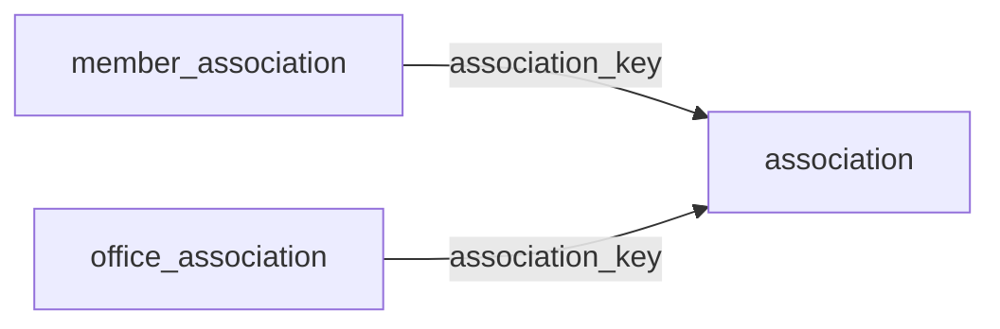

[index](../_index.md) | [lookups](../lookups.md) | [relationships](../relationships.md) | [USAGE.md](../../../USAGE.md)

# `association` (Association)

> Fields pertaining to the local real estate trade association.

## At a glance

| | |
|---|---|
| **Primary key** | `association_key` |
| **Fields on dd.reso.org** | 45 |
| **Columns in canonical DBML** | 40 (omits 0 satellite drops + 3 `Resource`-typed + 2 `Collection`-typed) |
| **Foreign keys OUT / IN** | 0 / 2 |
| **Review markers** | 0 |
| **Source** | [https://dd.reso.org/DD2.0/Association/](https://dd.reso.org/DD2.0/Association/) |
| **Last revised upstream** | 8/5/2024 |

## Relationship diagram

## Fields

Columns in their original `dd.reso.org` page order. **Definition** is the verbatim RESO DD prose (full text, not truncated). **Purpose (when to use)** is auto-derived from the field's role + datatype + lookup + status and tells you, in one sentence, what to write into this column. The `Flags` column shows: `pk`, `fk -> target.col` (committed FK in `canonical.dbml`), `[REVIEW]` (Phase 2.5 satellite audit flagged for review), `[dropped]` (omitted from the canonical DBML; satellite of the named FK), `[Resource]` / `[Collection]` (no scalar column in DBML; FK companion - see Refs / inverse-1:N below).

| Field | DBML name | Type | Lookup | Definition | Purpose (when to use) | Flags |
|---|---|---|---|---|---|---|
| `AssociationAddress1` | `association_address1` | String |  | The street number, direction, name and suffix of the association. | Free-form text, up to 50 characters. |  |
| `AssociationAddress2` | `association_address2` | String |  | The unit/suite number of the association. | Free-form text, up to 50 characters. |  |
| `AssociationCareOf` | `association_care_of` | String |  | The care of (c/o) information for the association's street address. | Free-form text, up to 30 characters. |  |
| `AssociationCharterDate` | `association_charter_date` | Date |  | The charter date for the association. | Date (YYYY-MM-DD). |  |
| `AssociationCity` | `association_city` | String |  | The city where the association is located. | Free-form text, up to 50 characters. |  |
| `AssociationCountry` | `association_country` | enum | [`country`](../lookups.md#country) | The association's country code for the street address. | Pick exactly one of 246 values from the lookup (closed list). |  |
| `AssociationCountyOrParish` | `association_county_or_parish` | enum | [`county_or_parish`](../lookups.md#county_or_parish) | The association's county of the street address. | Free-form string; the lookup is jurisdiction-defined (no closed value list). |  |
| `AssociationFax` | `association_fax` | String |  | The North American 10-digit phone numbers should be in the format of ###-###-#### (separated by hyphens). Other conventions should use the common local standard. International numbers should be preceded by a plus symbol. | Free-form text, up to 16 characters. |  |
| `AssociationKey` | `association_key` | String |  | The unique identifier for the association record. | Unique key for this resource. Use as the FK target whenever another resource references `association`. | `pk` |
| `AssociationMailAddress1` | `association_mail_address1` | String |  | The street number, direction, name and suffix of the association's mailing address. | Free-form text, up to 50 characters. |  |
| `AssociationMailAddress2` | `association_mail_address2` | String |  | The unit/suite number of the association's mailing address. | Free-form text, up to 50 characters. |  |
| `AssociationMailCareOf` | `association_mail_care_of` | String |  | The care of (c/o) information for the association's mailing address. | Free-form text, up to 30 characters. |  |
| `AssociationMailCity` | `association_mail_city` | String |  | The city in which the association's mail is received. | Free-form text, up to 50 characters. |  |
| `AssociationMailCountry` | `association_mail_country` | enum | [`country`](../lookups.md#country) | The country code for the association's mailing address. | Pick exactly one of 246 values from the lookup (closed list). |  |
| `AssociationMailCountyOrParish` | `association_mail_county_or_parish` | enum | [`county_or_parish`](../lookups.md#county_or_parish) | The county in which the association's mailing address is located. | Free-form string; the lookup is jurisdiction-defined (no closed value list). |  |
| `AssociationMailPostalCode` | `association_mail_postal_code` | String |  | The postal code in which the association's mail is received. | Free-form text, up to 10 characters. |  |
| `AssociationMailPostalCodePlus4` | `association_mail_postal_code_plus4` | String |  | The four-digit extension of the U.S. Zip Code for the association's mailing address. | Free-form text, up to 4 characters. |  |
| `AssociationMailStateOfProvince` | `association_mail_state_of_province` | enum | [`state_or_province`](../lookups.md#state_or_province) | The state or province in which the association's mail is received. | Pick exactly one of 65 values from the lookup (closed list). |  |
| `AssociationMember` | `association_member` | Resource |  | The member of the association. | Logical reference to another resource; not stored as a scalar column in DBML. Look at the sibling `*Key` / `*Id` field on this resource for where the actual FK value lives. | `[Resource]` |
| `AssociationMlsId` | `association_mls_id` | String |  | The local, well-known identifier for the association of REALTORS®. This value may not be unique, specifically in the case of aggregation systems, and it should be the identifier from the original system. | Free-form text, up to 25 characters. |  |
| `AssociationName` | `association_name` | String |  | The name of the association. | Free-form text, up to 255 characters. |  |
| `AssociationNationalAssociationId` | `association_national_association_id` | String |  | The national association ID of the association as known by the National Association of REALTORS®. | Free-form text, up to 25 characters. |  |
| `AssociationPhone` | `association_phone` | String |  | The North American 10-digit phone numbers should be in the format of ###-###-#### (separated by hyphens). Other conventions should use the common local standard. International numbers should be preceded by a plus symbol. | Free-form text, up to 16 characters. |  |
| `AssociationPostalCode` | `association_postal_code` | String |  | The postal code of the association. | Free-form text, up to 10 characters. |  |
| `AssociationPostalCodePlus4` | `association_postal_code_plus4` | String |  | The four-digit extension of the U.S. Zip Code. | Free-form text, up to 4 characters. |  |
| `AssociationSocialMedia` | `association_social_media` | Collection |  | A collection of the types of social media fields available for the association, including the type of system and other details pertinent to social media. | Inverse 1:N: read as 'all `social_media` rows that point at this `association` row'. Not stored as a column; the FK lives on the child side. | `[Collection]` |
| `AssociationStateOrProvince` | `association_state_or_province` | enum | [`state_or_province`](../lookups.md#state_or_province) | The state or province in which the association is addressed. | Pick exactly one of 65 values from the lookup (closed list). |  |
| `AssociationStatus` | `association_status` | enum | [`association_status`](../lookups.md#association_status) | The status of the association (i.e., Active, Inactive). | Pick exactly one of 2 values from the lookup (closed list). |  |
| `AssociationType` | `association_type` | enum | [`association_type`](../lookups.md#association_type) | The type of association (MLS, Local, Not Applicable, etc.). | Pick exactly one of 3 values from the lookup (closed list). |  |
| `ExecutiveOfficerMemberKey` | `executive_officer_member_key` | String |  | The executive officer's member key. | Free-form text, up to 255 characters. |  |
| `ExecutiveOfficerMemberMlsId` | `executive_officer_member_mls_id` | String |  | The local, well-known identifier for the executive officer. This value may not be unique, specifically in the case of aggregation systems, and it should be the identifier from the original system. | Free-form text, up to 25 characters. |  |
| `HistoryTransactional` | `history_transactional` | Collection |  | The history of the Association record. | Inverse 1:N: read as 'all `history_transactional` rows that point at this `association` row'. Not stored as a column; the FK lives on the child side. | `[Collection]` |
| `ModificationTimestamp` | `modification_timestamp` | Timestamp |  | The date/time the Association record was last modified. | ISO-8601 timestamp (UTC). |  |
| `MultipleListingServiceId` | `multiple_listing_service_id` | String |  | The ID of the Multiple Listing Service (MLS) used by the association. | Free-form text, up to 25 characters. |  |
| `OriginalEntryTimestamp` | `original_entry_timestamp` | Timestamp |  | Date/time the record was originally input into the source system. | ISO-8601 timestamp (UTC). |  |
| `OriginatingSystem` | `originating_system` | Resource |  | The originating system of the Association record. | Logical reference to another resource; not stored as a scalar column in DBML. Look at the sibling `*Key` / `*Id` field on this resource for where the actual FK value lives. | `[Resource]` |
| `OriginatingSystemAssociationKey` | `originating_system_association_key` | String |  | The system key, a unique record identifier, from the originating system. The originating system is the system with authoritative control over the record (e.g., the MLS where the association was input). There may be cases where the source system (how the record was received) is not the originating system. See Source System Key for more information. | Free-form text, up to 255 characters. |  |
| `OriginatingSystemId` | `originating_system_id` | String |  | The RESO Unique Organization Identifier (UOI) OrganizationUniqueId of the originating record provider. The originating system is the system with authoritative control over the record (e.g., the name of the MLS where the office was input). In cases where the originating system was not where the record originated (the authoritative system), see the originating system fields. | Free-form text, up to 25 characters. |  |
| `OriginatingSystemName` | `originating_system_name` | String |  | The name of the originating record provider, most commonly the name of the MLS. The place where the office is originally input by the association. | Free-form text, up to 255 characters. |  |
| `SocialMediaType` | `social_media_type` | enum | [`social_media_type`](../lookups.md#social_media_type) | A list of types of websites or social media the association Uniform Resource Locator (URL) or ID is referring to (e.g., Website, Blog, Facebook, Twitter, LinkedIn, Instagram). | Pick exactly one of 17 values from the lookup (closed list). |  |
| `SocialMediaUrlOrId` | `social_media_url_or_id` | String |  | The website URL or ID of social media site or account of the Association. | Free-form text, up to 8000 characters. |  |
| `SourceSystem` | `source_system` | Resource |  | The source system of the Association record. | Logical reference to another resource; not stored as a scalar column in DBML. Look at the sibling `*Key` / `*Id` field on this resource for where the actual FK value lives. | `[Resource]` |
| `SourceSystemAssociationKey` | `source_system_association_key` | String |  | The system key, a unique record identifier, from the source system. The source system is the system from which the record was directly received. In cases where the source system was not where the record originated (the authoritative system), see the originating system fields. | Free-form text, up to 255 characters. |  |
| `SourceSystemId` | `source_system_id` | String |  | The RESO Unique Organization Identifier (UOI) OrganizationUniqueId of the source record provider. The source system is the system from which the record was directly received. In cases where the source system was not where the record originated (the authoritative system), see the originating system fields. | Free-form text, up to 25 characters. |  |
| `SourceSystemName` | `source_system_name` | String |  | The name of the immediate record provider. The system from which the record was directly received. The legal name of the company. | Free-form text, up to 255 characters. |  |

## Foreign keys OUT (this resource references)

*(none committed)*

## Foreign keys IN (other resources reference this)

- `member_association.association_key` -> `association.association_key` (medium)
- `office_association.association_key` -> `association.association_key` (medium)

## Inverse 1:N (collection-typed companions)

- `association_social_media` -> `social_media` (many `social_media` per `association`)
- `history_transactional` -> `history_transactional` (many `history_transactional` per `association`)

