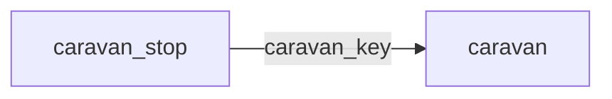

[index](../_index.md) | [lookups](../lookups.md) | [relationships](../relationships.md) | [USAGE.md](../../../USAGE.md)

# `caravan` (Caravan)

> Fields and lookups for the date, time, location and other particulars about caravan events.

## At a glance

| | |
|---|---|
| **Primary key** | `caravan_key` |
| **Fields on dd.reso.org** | 33 |
| **Columns in canonical DBML** | 33 (omits 0 satellite drops + 0 `Resource`-typed + 0 `Collection`-typed) |
| **Foreign keys OUT / IN** | 0 / 1 |
| **Review markers** | 0 |
| **Source** | [https://dd.reso.org/DD2.0/Caravan/](https://dd.reso.org/DD2.0/Caravan/) |
| **Last revised upstream** | 2/3/2021 |

## Relationship diagram

## Fields

Columns in their original `dd.reso.org` page order. **Definition** is the verbatim RESO DD prose (full text, not truncated). **Purpose (when to use)** is auto-derived from the field's role + datatype + lookup + status and tells you, in one sentence, what to write into this column. The `Flags` column shows: `pk`, `fk -> target.col` (committed FK in `canonical.dbml`), `[REVIEW]` (Phase 2.5 satellite audit flagged for review), `[dropped]` (omitted from the canonical DBML; satellite of the named FK), `[Resource]` / `[Collection]` (no scalar column in DBML; FK companion - see Refs / inverse-1:N below).

| Field | DBML name | Type | Lookup | Definition | Purpose (when to use) | Flags |
|---|---|---|---|---|---|---|
| `CancellationPolicyUrl` | `cancellation_policy_url` | String |  | The Uniform Resource Locator (aka, URL or link) to the cancellation policy of the tour organizer. | Free-form text, up to 8000 characters. |  |
| `CaravanAllowedClassNames` | `caravan_allowed_class_names` | varchar (multi) | [`caravan_allowed_class_names`](../lookups.md#caravan_allowed_class_names) | A comma-separated list of the classes allowed by the tour's host. | Pick one or more of 9 values from the lookup (closed list). |  |
| `CaravanAllowedStatuses` | `caravan_allowed_statuses` | varchar (multi) | [`caravan_allowed_statuses`](../lookups.md#caravan_allowed_statuses) | A comma-separated list of the listing statuses allowed by the tour's host. | Pick one or more of 3 values from the lookup (closed list). |  |
| `CaravanAreaDescription` | `caravan_area_description` | String |  | A textual description of the geographic or locally known areas that all properties to be included in the tour must be located. | Free-form text, up to 1024 characters. |  |
| `CaravanBlackoutDates` | `caravan_blackout_dates` | String |  | A comma-separated list of the dates when a reoccurring tour will not take place (e.g., holidays, weekends, etc.). | Free-form text, up to 1024 characters. |  |
| `CaravanDate` | `caravan_date` | Date |  | The date of the organized tour. | Date (YYYY-MM-DD). |  |
| `CaravanDaysRecurring` | `caravan_days_recurring` | String |  | Used with unbound timeframes (e.g., second Tuesday of month). | Free-form text, up to 50 characters. |  |
| `CaravanEndTime` | `caravan_end_time` | Timestamp |  | The end time of the organized tour. | ISO-8601 timestamp (UTC). |  |
| `CaravanInputDeadlineDescription` | `caravan_input_deadline_description` | String |  | A textual description of the deadline to add a stop (property or open house) to the tour. | Free-form text, up to 50 characters. |  |
| `CaravanInputDeadlineTimestamp` | `caravan_input_deadline_timestamp` | Timestamp |  | A date/time of the deadline to add a stop (property or open house) to the tour. | ISO-8601 timestamp (UTC). |  |
| `CaravanKey` | `caravan_key` | String |  | A system unique identifier. Specifically, in aggregation systems, the CaravanKey is the system unique identifier from the system that the record was retrieved. | Unique key for this resource. Use as the FK target whenever another resource references `caravan`. | `pk` |
| `CaravanName` | `caravan_name` | String |  | The name or short description of the tour. | Free-form text, up to 50 characters. |  |
| `CaravanOrganizerContactInfo` | `caravan_organizer_contact_info` | String |  | Contact information for the tour organizer, such as phone or email. | Free-form text, up to 255 characters. |  |
| `CaravanOrganizerKey` | `caravan_organizer_key` | String |  | A system unique identifier for the entity hosting the tour. Specifically, in aggregation systems, the Key is the system unique identifier from the system that the record was just retrieved. This may be identical to the related xxxId identifier, but the key is guaranteed unique for this record set. | Free-form text, up to 255 characters. |  |
| `CaravanOrganizerMlsId` | `caravan_organizer_mls_id` | String |  | The local, well-known identifier for the entity hosting the tour. This value may not be unique, specifically in the case of aggregation systems, this value should be the identifier from the original system. | Free-form text, up to 25 characters. |  |
| `CaravanOrganizerName` | `caravan_organizer_name` | String |  | The name of the entity hosting the tour. | Free-form text, up to 255 characters. |  |
| `CaravanOrganizerResourceName` | `caravan_organizer_resource_name` | enum | [`caravan_resource_name`](../lookups.md#caravan_resource_name) | The resource or table of the record to which the CaravanOrganizerKey or MlsId refers (i.e., Office, Association, etc.). | Pick exactly one of 7 values from the lookup (closed list). |  |
| `CaravanPolicyUrl` | `caravan_policy_url` | String |  | The Uniform Resource Locator (aka, URL or link) to the general tour policies of the tour organizer. | Free-form text, up to 8000 characters. |  |
| `CaravanRemarks` | `caravan_remarks` | String |  | The detailed description, directions, policy or other details about the tour. | Free-form text, up to 500 characters. |  |
| `CaravanStartLocation` | `caravan_start_location` | String |  | A description or address of the location where the tour begins. This is typically not one of the stops but an event where each of the stops are presented, general announcements are made, refreshments and/or prizes are given. | Free-form text, up to 50 characters. |  |
| `CaravanStartLocationGiveaways` | `caravan_start_location_giveaways` | String |  | A description of prizes, drawings, etc., that will be given at the tour start location. | Free-form text, up to 255 characters. |  |
| `CaravanStartLocationRefreshments` | `caravan_start_location_refreshments` | String |  | A description of the refreshments that will be served at the tour start location. | Free-form text, up to 255 characters. |  |
| `CaravanStartTime` | `caravan_start_time` | Timestamp |  | The start time of the organized tour. | ISO-8601 timestamp (UTC). |  |
| `CaravanStatus` | `caravan_status` | enum | [`caravan_status`](../lookups.md#caravan_status) | Status of the organized tour (e.g., Active, Cancelled, Ended, etc.). | Pick exactly one of 3 values from the lookup (closed list). |  |
| `CaravanType` | `caravan_type` | enum | [`caravan_type`](../lookups.md#caravan_type) | The type of organized tour (e.g., AOR, Broker, Other, etc.). | Pick exactly one of 3 values from the lookup (closed list). |  |
| `ModificationTimestamp` | `modification_timestamp` | Timestamp |  | The date/time the Caravan record was last modified. | ISO-8601 timestamp (UTC). |  |
| `OriginalEntryTimestamp` | `original_entry_timestamp` | Timestamp |  | The date/time the Caravan record was originally input into the source system. | ISO-8601 timestamp (UTC). |  |
| `OriginatingSystemId` | `originating_system_id` | String |  | The RESO UOI's OrganizationUniqueId of the originating record provider. The originating system is the system with authoritative control over the record (e.g., the name of the MLS where the CaravanStop was inputted). In cases where the originating system was not where the record originated (the authoritative system), see the Originating System fields. | Free-form text, up to 25 characters. |  |
| `OriginatingSystemKey` | `originating_system_key` | String |  | The system key, a unique record identifier, from the originating system. The originating system is the system with authoritative control over the record (e.g., the MLS where the CaravanStop was inputted). There may be cases where the source system (how you received the record) is not the originating system. See Source System Key for more information. | Free-form text, up to 255 characters. |  |
| `OriginatingSystemName` | `originating_system_name` | String |  | The name of the originating record provider. Most commonly the name of the MLS. The place where the CaravanStop was originally inputted. The legal name of the company. | Free-form text, up to 255 characters. |  |
| `SourceSystemId` | `source_system_id` | String |  | The RESO UOI's OrganizationUniqueId of the source record provider. The source system is the system from which the record was directly received. In cases where the source system was not where the record originated (the authoritative system), see the Originating System fields. | Free-form text, up to 25 characters. |  |
| `SourceSystemKey` | `source_system_key` | String |  | The system key, a unique record identifier, from the source system. The source system is the system from which the record was directly received. In cases where the source system was not where the record originated (the authoritative system), see the Originating System fields. | Free-form text, up to 255 characters. |  |
| `SourceSystemName` | `source_system_name` | String |  | The name of the CaravanStop record provider. The system from which the record was directly received. The legal name of the company. | Free-form text, up to 255 characters. |  |

## Field disambiguation

Sibling field clusters that an LLM agent commonly confuses. Auto-detected from name shape; resolve which is which by reading each row's full Definition above.

- **`OriginatingSystemKey` vs `OriginatingSystemId`**:
  - `OriginatingSystemKey` - The system key, a unique record identifier, from the originating system.
  - `OriginatingSystemId` - The RESO UOI's OrganizationUniqueId of the originating record provider.
- **`SourceSystemKey` vs `SourceSystemId`**:
  - `SourceSystemKey` - The system key, a unique record identifier, from the source system.
  - `SourceSystemId` - The RESO UOI's OrganizationUniqueId of the source record provider.

## Foreign keys OUT (this resource references)

*(none committed)*

## Foreign keys IN (other resources reference this)

- `caravan_stop.caravan_key` -> `caravan.caravan_key` (high)

