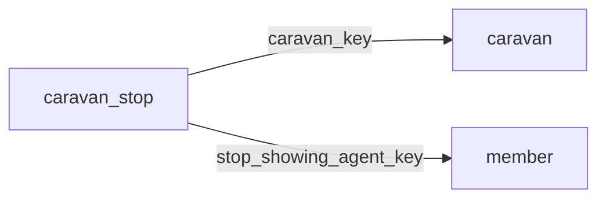

[index](../_index.md) | [lookups](../lookups.md) | [relationships](../relationships.md) | [USAGE.md](../../../USAGE.md)

# `caravan_stop` (CaravanStop)

> Stops along a caravan tour, connecting Caravan records to Open House records.

## At a glance

| | |
|---|---|
| **Primary key** | `caravan_stop_key` |
| **Fields on dd.reso.org** | 25 |
| **Columns in canonical DBML** | 24 (omits 1 satellite drops + 0 `Resource`-typed + 0 `Collection`-typed) |
| **Foreign keys OUT / IN** | 2 / 0 |
| **Review markers** | 2 |
| **Source** | [https://dd.reso.org/DD2.0/CaravanStop/](https://dd.reso.org/DD2.0/CaravanStop/) |
| **Last revised upstream** | 2/3/2021 |

## Relationship diagram

## Fields

Columns in their original `dd.reso.org` page order. **Definition** is the verbatim RESO DD prose (full text, not truncated). **Purpose (when to use)** is auto-derived from the field's role + datatype + lookup + status and tells you, in one sentence, what to write into this column. The `Flags` column shows: `pk`, `fk -> target.col` (committed FK in `canonical.dbml`), `[REVIEW]` (Phase 2.5 satellite audit flagged for review), `[dropped]` (omitted from the canonical DBML; satellite of the named FK), `[Resource]` / `[Collection]` (no scalar column in DBML; FK companion - see Refs / inverse-1:N below).

| Field | DBML name | Type | Lookup | Definition | Purpose (when to use) | Flags |
|---|---|---|---|---|---|---|
| `CaravanKey` | `caravan_key` | String |  | A system unique identifier. Specifically, a foreign key referencing the primary key of the Caravan Resource. | Foreign key -> `caravan.caravan_key`. Set this to the `caravan`'s `caravan_key` to link this row to its parent `caravan`. | `-> caravan.caravan_key` |
| `CaravanStopKey` | `caravan_stop_key` | String |  | A system unique identifier. Specifically, a foreign key referencing the primary key of the CaravanStop Resource. | Unique key for this resource. Use as the FK target whenever another resource references `caravan_stop`. | `pk` |
| `ModificationTimestamp` | `modification_timestamp` | Timestamp |  | The date/time the CaravanStop record was last modified. | ISO-8601 timestamp (UTC). |  |
| `OriginalEntryTimestamp` | `original_entry_timestamp` | Timestamp |  | The date/time the CaravanStop record was originally input into the source system. | ISO-8601 timestamp (UTC). |  |
| `OriginatingSystemId` | `originating_system_id` | String |  | The RESO Unique Organization Identifier (UOI) OrganizationUniqueId of the originating record provider. The originating system is the system with authoritative control over the record (e.g., the name of the MLS where caravan stops were input). In cases where the originating system was not where the record originated (the authoritative system), see the Originating System fields. | Free-form text, up to 25 characters. |  |
| `OriginatingSystemKey` | `originating_system_key` | String |  | The system key, a unique record identifier, from the originating system. The originating system is the system with authoritative control over the record (e.g., the MLS where the caravan stops were input). There may be cases where the source system (how the record was received) is not the originating system. See Source System Key for more information. | Free-form text, up to 255 characters. |  |
| `OriginatingSystemName` | `originating_system_name` | String |  | The name of the originating record provider, most commonly the name of the MLS. The place where the caravan stops are originally input. The legal name of the company. | Free-form text, up to 255 characters. |  |
| `SourceSystemId` | `source_system_id` | String |  | The RESO Unique Organization Identifier (UOI) OrganizationUniqueId of the source record provider. The source system is the system from which the record was directly received. In cases where the source system was not where the record originated (the authoritative system), see the Originating System fields. | Free-form text, up to 25 characters. |  |
| `SourceSystemKey` | `source_system_key` | String |  | The system key, a unique record identifier, from the source system. The source system is the system from which the record was directly received. In cases where the source system was not where the record originated (the authoritative system), see the Originating System fields. | Free-form text, up to 255 characters. |  |
| `SourceSystemName` | `source_system_name` | String |  | The name of the caravan stop's record provider. The system from which the record was directly received. The legal name of the company. | Free-form text, up to 255 characters. |  |
| `StopAttendedBy` | `stop_attended_by` | enum | [`caravan_stop_attended`](../lookups.md#caravan_stop_attended) | This states whether a caravan stop will be attended by a licensed agent (i.e., Attended by Agent, Attended by the Seller or Unattended). | Pick exactly one of 3 values from the lookup (closed list). |  |
| `StopClassName` | `stop_class_name` | enum | [`caravan_stop_class_name`](../lookups.md#caravan_stop_class_name) | The name of the class that applies to this caravan stop record. Typical stops are represented by open house or listing records. A stop might also be another custom/local resource. | Polymorphic key. Resolve the target resource at write time from the row's context (see Definition); store the chosen target's PK in this column. |  |
| `StopDate` | `stop_date` | Date |  | The date the caravan stop will be open. | Date (YYYY-MM-DD). |  |
| `StopEndTime` | `stop_end_time` | Timestamp |  | The time the caravan stop will be closed. | ISO-8601 timestamp (UTC). |  |
| `StopId` | `stop_id` | String |  | The ID of a caravan stop record. Typical stops are represented by an open house or listing record's ID. A stop might also be another custom/local resource. | Polymorphic key. Resolve the target resource at write time from the row's context (see Definition); store the chosen target's PK in this column. |  |
| `StopKey` | `stop_key` | String |  | The key of a caravan stop record. This is a foreign key to the CaravanStop Resource. Typical stops are represented by an open house or listing record's key. A stop might also be another custom/local resource. | Polymorphic key. Resolve the target resource at write time from the row's context (see Definition); store the chosen target's PK in this column. |  |
| `StopOrder` | `stop_order` | Number |  | This is used when the order of stops needs to be communicated. | Numeric (integer). |  |
| `StopRefreshments` | `stop_refreshments` | String |  | A description of the refreshments that will be served at the caravan stop. | Free-form text, up to 255 characters. |  |
| `StopRemarks` | `stop_remarks` | String |  | Comments, instructions or information about the caravan stop. | Free-form text, up to 500 characters. |  |
| `StopResourceName` | `stop_resource_name` | enum | [`caravan_resource_name`](../lookups.md#caravan_resource_name) | The name of the resource that applies to this caravan stop record. Typical stops are represented by open house or listing records. A stop might also be another custom/local resource. | Polymorphic key. Resolve the target resource at write time from the row's context (see Definition); store the chosen target's PK in this column. |  |
| `StopShowingAgentFirstName` | `stop_showing_agent_first_name` | String |  | The first name of the showing agent for the caravan stop. | Free-form text, up to 50 characters. | `[REVIEW]` |
| `StopShowingAgentKey` | `stop_showing_agent_key` | String |  | A system unique identifier for the caravan stop's showing agent. Specifically, in aggregation systems, the key is the system unique identifier from the system that the record was retrieved. This may be identical to the related xxxId. This is a foreign key relating to the MemberKey of the Member Resource. | Foreign key -> `member.member_key`. Set this to the `member`'s `member_key` to link this row to its parent `member`. | `-> member.member_key` |
| `StopShowingAgentLastName` | `stop_showing_agent_last_name` | String |  | The last name of the showing agent for the caravan stop. | Free-form text, up to 50 characters. | `[REVIEW]` |
| `StopShowingAgentMlsId` | `stop_showing_agent_mls_id` | String |  | The local, well-known identifier for the showing agent. This value may not be unique. Specifically, in the case of aggregation systems, this value should be the identifier from the original system. | Do not write. Phase-2.5 satellite of `StopShowingAgentKey`; the same value lives on the parent resource and is reachable via the `StopShowingAgentKey` FK. | `[dropped: satellite of stop_showing_agent_key]` |
| `StopStartTime` | `stop_start_time` | Timestamp |  | The time the caravan stop will be open. | ISO-8601 timestamp (UTC). |  |

## Field disambiguation

Sibling field clusters that an LLM agent commonly confuses. Auto-detected from name shape; resolve which is which by reading each row's full Definition above.

- **`OriginatingSystemKey` vs `OriginatingSystemId`**:
  - `OriginatingSystemKey` - The system key, a unique record identifier, from the originating system.
  - `OriginatingSystemId` - The RESO Unique Organization Identifier (UOI) OrganizationUniqueId of the originating record provider.
- **`SourceSystemKey` vs `SourceSystemId`**:
  - `SourceSystemKey` - The system key, a unique record identifier, from the source system.
  - `SourceSystemId` - The RESO Unique Organization Identifier (UOI) OrganizationUniqueId of the source record provider.
- **`StopKey` vs `StopId`**:
  - `StopKey` - The key of a caravan stop record.
  - `StopId` - The ID of a caravan stop record.

## Foreign keys OUT (this resource references)

- `caravan_stop.caravan_key` -> `caravan.caravan_key` (high)
- `caravan_stop.stop_showing_agent_key` -> `member.member_key` (medium)

## Foreign keys IN (other resources reference this)

*(none committed)*

## Polymorphic FKs

- `stop_class_name` - target resolved at runtime; evidence: prose:P5b:"might also be another custom"
- `stop_id` - target resolved at runtime; evidence: prose:P5b:"might also be another custom"
- `stop_key` - target resolved at runtime; evidence: prose:P5b:"might also be another custom"
- `stop_resource_name` - target resolved at runtime; evidence: prose:P5b:"might also be another custom"

## Phase 2.5 satellite audit

Recommendations from `raw/satellites.csv`. `drop_from_host` rows are not present in the canonical DBML; `review` rows are kept but flagged; `keep_both` rows are silently kept.

| Column | FK | Recommendation | Notes |
|---|---|---|---|
| `caravan_stop_key` | `caravan_key` -> `caravan.?` | `keep_both` | no_child_match |
| `stop_showing_agent_first_name` | `stop_showing_agent_key` -> `member.member_first_name` | `review` | borderline_jaccard |
| `stop_showing_agent_last_name` | `stop_showing_agent_key` -> `member.member_last_name` | `review` | borderline_jaccard |
| `stop_showing_agent_mls_id` | `stop_showing_agent_key` -> `member.member_mls_id` | `drop_from_host` | id_suffix_threshold_0.7 |

