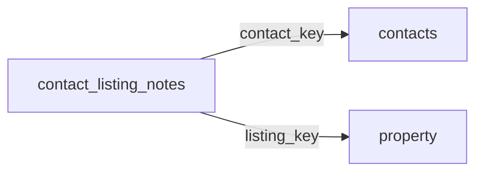

[index](../_index.md) | [lookups](../lookups.md) | [relationships](../relationships.md) | [USAGE.md](../../../USAGE.md)

# `contact_listing_notes` (ContactListingNotes)

> Notes about a given listing from interactions between the contact and member within a consumer portal.

## At a glance

| | |
|---|---|
| **Primary key** | `contact_listing_notes_key` |
| **Fields on dd.reso.org** | 10 |
| **Columns in canonical DBML** | 7 (omits 0 satellite drops + 2 `Resource`-typed + 1 `Collection`-typed) |
| **Foreign keys OUT / IN** | 2 / 0 |
| **Review markers** | 0 |
| **Source** | [https://dd.reso.org/DD2.0/ContactListingNotes/](https://dd.reso.org/DD2.0/ContactListingNotes/) |
| **Last revised upstream** | 5/24/2017 |

## Relationship diagram

## Fields

Columns in their original `dd.reso.org` page order. **Definition** is the verbatim RESO DD prose (full text, not truncated). **Purpose (when to use)** is auto-derived from the field's role + datatype + lookup + status and tells you, in one sentence, what to write into this column. The `Flags` column shows: `pk`, `fk -> target.col` (committed FK in `canonical.dbml`), `[REVIEW]` (Phase 2.5 satellite audit flagged for review), `[dropped]` (omitted from the canonical DBML; satellite of the named FK), `[Resource]` / `[Collection]` (no scalar column in DBML; FK companion - see Refs / inverse-1:N below).

| Field | DBML name | Type | Lookup | Definition | Purpose (when to use) | Flags |
|---|---|---|---|---|---|---|
| `Contact` | `contact` | Resource |  | The contact associated with the ContactListingNotes record. | Logical reference to another resource; not stored as a scalar column in DBML. Look at the sibling `*Key` / `*Id` field on this resource for where the actual FK value lives. | `[Resource]` |
| `ContactKey` | `contact_key` | String |  | The key of the corresponding contact record. ContactKey and the ListingKey are used as a compound key for this record. | Foreign key -> `contacts.contact_key`. Set this to the `contacts`'s `contact_key` to link this row to its parent `contacts`. | `-> contacts.contact_key` |
| `ContactListingNotesKey` | `contact_listing_notes_key` | String |  | A system unique identifier. Specifically, in aggregation systems, the key is the system unique identifier from the system that the record was just retrieved. This may be identical to the related xxxId identifier, but the key is guaranteed unique for this record set. | Unique key for this resource. Use as the FK target whenever another resource references `contact_listing_notes`. | `pk` |
| `HistoryTransactional` | `history_transactional` | Collection |  | The history of the ContactListingNotes record. | Inverse 1:N: read as 'all `history_transactional` rows that point at this `contact_listing_notes` row'. Not stored as a column; the FK lives on the child side. | `[Collection]` |
| `Listing` | `listing` | Resource |  | The listing for the ContactListings record. | Logical reference to another resource; not stored as a scalar column in DBML. Look at the sibling `*Key` / `*Id` field on this resource for where the actual FK value lives. | `[Resource]` |
| `ListingId` | `listing_id` | String |  | The ID for the corresponding listing record. | Free-form text, up to 255 characters. |  |
| `ListingKey` | `listing_key` | String |  | The key of the corresponding listing record. ContactKey and the ListingKey are used as a compound key for this record. | Foreign key -> `property.listing_key`. Set this to the `property`'s `listing_key` to link this row to its parent `property`. | `-> property.listing_key` |
| `ModificationTimestamp` | `modification_timestamp` | Timestamp |  | The date/time a note was written. | ISO-8601 timestamp (UTC). |  |
| `NoteContents` | `note_contents` | String |  | The contents of a note. | Free-form text, up to 500 characters. |  |
| `NotedBy` | `noted_by` | enum | [`noted_by`](../lookups.md#noted_by) | The individual who wrote a note (i.e., Agent or Contact). | Pick exactly one of 2 values from the lookup (closed list). |  |

## Field disambiguation

Sibling field clusters that an LLM agent commonly confuses. Auto-detected from name shape; resolve which is which by reading each row's full Definition above.

- **`ListingKey` vs `ListingId`**:
  - `ListingKey` - The key of the corresponding listing record.
  - `ListingId` - The ID for the corresponding listing record.

## Foreign keys OUT (this resource references)

- `contact_listing_notes.contact_key` -> `contacts.contact_key` (medium)
- `contact_listing_notes.listing_key` -> `property.listing_key` (medium)

## Foreign keys IN (other resources reference this)

*(none committed)*

## Inverse 1:N (collection-typed companions)

- `history_transactional` -> `history_transactional` (many `history_transactional` per `contact_listing_notes`)

