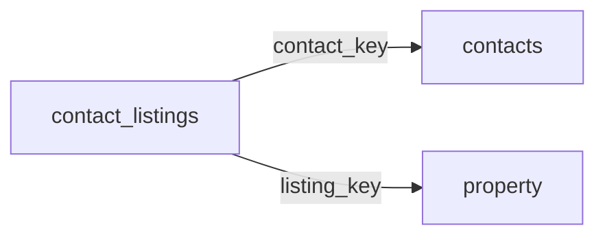

[index](../_index.md) | [lookups](../lookups.md) | [relationships](../relationships.md) | [USAGE.md](../../../USAGE.md)

# `contact_listings` (ContactListings)

> Maintains the relationship between contacts and members around listings in consumer portals.

## At a glance

| | |
|---|---|
| **Primary key** | `contact_listings_key` |
| **Fields on dd.reso.org** | 22 |
| **Columns in canonical DBML** | 17 (omits 1 satellite drops + 2 `Resource`-typed + 2 `Collection`-typed) |
| **Foreign keys OUT / IN** | 2 / 0 |
| **Review markers** | 0 |
| **Source** | [https://dd.reso.org/DD2.0/ContactListings/](https://dd.reso.org/DD2.0/ContactListings/) |
| **Last revised upstream** | 9/26/2017 |

## Relationship diagram

## Fields

Columns in their original `dd.reso.org` page order. **Definition** is the verbatim RESO DD prose (full text, not truncated). **Purpose (when to use)** is auto-derived from the field's role + datatype + lookup + status and tells you, in one sentence, what to write into this column. The `Flags` column shows: `pk`, `fk -> target.col` (committed FK in `canonical.dbml`), `[REVIEW]` (Phase 2.5 satellite audit flagged for review), `[dropped]` (omitted from the canonical DBML; satellite of the named FK), `[Resource]` / `[Collection]` (no scalar column in DBML; FK companion - see Refs / inverse-1:N below).

| Field | DBML name | Type | Lookup | Definition | Purpose (when to use) | Flags |
|---|---|---|---|---|---|---|
| `AgentNotesUnreadYN` | `agent_notes_unread_yn` | Boolean |  | Indicates whether or not agent notes have gone unread. If yes, one or more of the agent notes are unread. | Nullable boolean flag (true / false / null = unknown). |  |
| `ClassName` | `class_name` | enum | [`class_name`](../lookups.md#class_name) | The name of the class where the listing record is located. | Pick exactly one of 17 values from the lookup (closed list). |  |
| `Contact` | `contact` | Resource |  | The contact for the ContactListings record. | Logical reference to another resource; not stored as a scalar column in DBML. Look at the sibling `*Key` / `*Id` field on this resource for where the actual FK value lives. | `[Resource]` |
| `ContactKey` | `contact_key` | String |  | The foreign key relating to the Contacts Resource. A unique identifier for this record from the immediate source. This is a string that can include a Uniform Resource Identifier (URI) or other forms. This is the local key of the system. When records are received from other systems, a local key is commonly applied. If conveying the original keys from the source or originating systems, see Source System Contact Key and Originating System Contact Key in the Contacts Resource. | Foreign key -> `contacts.contact_key`. Set this to the `contacts`'s `contact_key` to link this row to its parent `contacts`. | `-> contacts.contact_key` |
| `ContactListingPreference` | `contact_listing_preference` | enum | [`contact_listing_preference`](../lookups.md#contact_listing_preference) | The contact's preference selection on the given listing (i.e., Favorite, Possibility or Discard). | Pick exactly one of 3 values from the lookup (closed list). |  |
| `ContactListingsKey` | `contact_listings_key` | String |  | A system unique identifier. Specifically, in aggregation systems, the key is the system unique identifier from the system that the record was just retrieved from. This may be identical to the related xxxId identifier, but the key is guaranteed unique for this record set. | Unique key for this resource. Use as the FK target whenever another resource references `contact_listings`. | `pk` |
| `ContactLoginId` | `contact_login_id` | String |  | The foreign key referring to the Contacts Resource's local, well-known identifier for the contact. This value may not be unique, specifically in the case of aggregation systems. This value should be the identifier from the original system and is used by the contact to log on to a client portal in that system. | Do not write. Phase-2.5 satellite of `ContactKey`; the same value lives on the parent resource and is reachable via the `ContactKey` FK. | `[dropped: satellite of contact_key]` |
| `ContactNotesUnreadYN` | `contact_notes_unread_yn` | Boolean |  | A flag indicating whether or not the contact's notes are unread. This flag may be true/false, yes/no or another true, false or unknown indicator. As with all flags, the field may be null. | Nullable boolean flag (true / false / null = unknown). |  |
| `DirectEmailYN` | `direct_email_yn` | Boolean |  | A flag indicating whether or not this is a direct email. If true, the email was a direct email sent to the client by the member. If false, the email was an automated email. | Nullable boolean flag (true / false / null = unknown). |  |
| `HistoryTransactional` | `history_transactional` | Collection |  | The history of the ContactListings record. | Inverse 1:N: read as 'all `history_transactional` rows that point at this `contact_listings` row'. Not stored as a column; the FK lives on the child side. | `[Collection]` |
| `LastAgentNoteTimestamp` | `last_agent_note_timestamp` | Timestamp |  | The date/time the member last added or updated a ListingNote. | ISO-8601 timestamp (UTC). |  |
| `LastContactNoteTimestamp` | `last_contact_note_timestamp` | Timestamp |  | The date/time the contact last added or updated a ListingNote. | ISO-8601 timestamp (UTC). |  |
| `Listing` | `listing` | Resource |  | The listing for the ContactListings record. | Logical reference to another resource; not stored as a scalar column in DBML. Look at the sibling `*Key` / `*Id` field on this resource for where the actual FK value lives. | `[Resource]` |
| `ListingId` | `listing_id` | String |  | The well-known identifier for the listing. The value may be identical to that of the Listing Key, but the Listing ID is intended to be the value used by a human to retrieve the information about a specific listing. In a multiple originating system or a merged system, this value may not be unique and may require the use of the provider system to create a synthetic unique value. | Free-form text, up to 255 characters. |  |
| `ListingKey` | `listing_key` | String |  | The foreign key related to the Property Resource's unique identifier for this record from the immediate source. This is a string that can include a Uniform Resource Identifier (URI) or other forms. This is the local key of the system. When records are received from other systems, a local key is commonly applied. If conveying the original keys from the source or originating systems, see SourceSystemKey and OriginatingSystemKey. | Foreign key -> `property.listing_key`. Set this to the `property`'s `listing_key` to link this row to its parent `property`. | `-> property.listing_key` |
| `ListingModificationTimestamp` | `listing_modification_timestamp` | Timestamp |  | The last time the listing was updated. This does not refer to the ContactListing record but rather changes to the referenced listing. | ISO-8601 timestamp (UTC). |  |
| `ListingNotes` | `listing_notes` | Collection |  | The notes input by the member and/or contact in reference to the given listing. This is a complex data type referencing the separate resource called ContactListingNotes. | Inverse 1:N: read as 'all `contact_listing_notes` rows that point at this `contact_listings` row'. Not stored as a column; the FK lives on the child side. | `[Collection]` |
| `ListingSentTimestamp` | `listing_sent_timestamp` | Timestamp |  | The date/time the listing was sent to the contact. | ISO-8601 timestamp (UTC). |  |
| `ListingViewedYN` | `listing_viewed_yn` | Boolean |  | Indicates whether or not a listing has been viewed. If yes, the client has viewed the listing. This is typically when the client selects a detailed report rather than viewing a one-line or thumbnail display. | Nullable boolean flag (true / false / null = unknown). |  |
| `ModificationTimestamp` | `modification_timestamp` | Timestamp |  | The date/time the ContactListing record was last modified. | ISO-8601 timestamp (UTC). |  |
| `PortalLastVisitedTimestamp` | `portal_last_visited_timestamp` | Timestamp |  | The date/time the listing was last viewed by the contact. | ISO-8601 timestamp (UTC). |  |
| `ResourceName` | `resource_name` | enum | [`resource_name`](../lookups.md#resource_name) | The name of the resource where the listing record is located. | Pick exactly one of 5 values from the lookup (closed list). |  |

## Field disambiguation

Sibling field clusters that an LLM agent commonly confuses. Auto-detected from name shape; resolve which is which by reading each row's full Definition above.

- **`ListingKey` vs `ListingId`**:
  - `ListingKey` - The foreign key related to the Property Resource's unique identifier for this record from the immediate source.
  - `ListingId` - The well-known identifier for the listing.

## Foreign keys OUT (this resource references)

- `contact_listings.contact_key` -> `contacts.contact_key` (medium)
- `contact_listings.listing_key` -> `property.listing_key` (medium)

## Foreign keys IN (other resources reference this)

*(none committed)*

## Inverse 1:N (collection-typed companions)

- `history_transactional` -> `history_transactional` (many `history_transactional` per `contact_listings`)
- `listing_notes` -> `contact_listing_notes` (many `contact_listing_notes` per `contact_listings`)

## Phase 2.5 satellite audit

Recommendations from `raw/satellites.csv`. `drop_from_host` rows are not present in the canonical DBML; `review` rows are kept but flagged; `keep_both` rows are silently kept.

| Column | FK | Recommendation | Notes |
|---|---|---|---|
| `contact_listing_preference` | `contact_key` -> `contacts.?` | `keep_both` | no_child_match |
| `contact_listings_key` | `contact_key` -> `contacts.?` | `keep_both` | no_child_match |
| `contact_login_id` | `contact_key` -> `contacts.contact_login_id` | `drop_from_host` | id_suffix_threshold_0.7 |
| `contact_notes_unread_yn` | `contact_key` -> `contacts.?` | `keep_both` | no_child_match |

