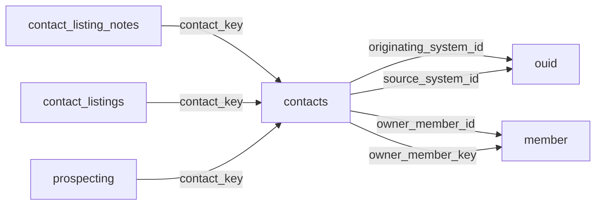

[index](../_index.md) | [lookups](../lookups.md) | [relationships](../relationships.md) | [USAGE.md](../../../USAGE.md)

# `contacts` (Contacts)

> Information on client and other contacts of the member.

## At a glance

| | |
|---|---|
| **Primary key** | `contact_key` |
| **Fields on dd.reso.org** | 91 |
| **Columns in canonical DBML** | 84 (omits 0 satellite drops + 3 `Resource`-typed + 4 `Collection`-typed) |
| **Foreign keys OUT / IN** | 4 / 3 |
| **Review markers** | 0 |
| **Source** | [https://dd.reso.org/DD2.0/Contacts/](https://dd.reso.org/DD2.0/Contacts/) |
| **Last revised upstream** | 9/24/2015 |

## Relationship diagram

## Fields

Columns in their original `dd.reso.org` page order. **Definition** is the verbatim RESO DD prose (full text, not truncated). **Purpose (when to use)** is auto-derived from the field's role + datatype + lookup + status and tells you, in one sentence, what to write into this column. The `Flags` column shows: `pk`, `fk -> target.col` (committed FK in `canonical.dbml`), `[REVIEW]` (Phase 2.5 satellite audit flagged for review), `[dropped]` (omitted from the canonical DBML; satellite of the named FK), `[Resource]` / `[Collection]` (no scalar column in DBML; FK companion - see Refs / inverse-1:N below).

| Field | DBML name | Type | Lookup | Definition | Purpose (when to use) | Flags |
|---|---|---|---|---|---|---|
| `Anniversary` | `anniversary` | Date |  | The month, day and year of the contact's wedding anniversary. | Date (YYYY-MM-DD). |  |
| `AssistantEmail` | `assistant_email` | String |  | The email address of the contact's assistant. | Free-form text, up to 80 characters. |  |
| `AssistantName` | `assistant_name` | String |  | The name of the contact's assistant. | Free-form text, up to 150 characters. |  |
| `AssistantPhone` | `assistant_phone` | String |  | The phone number of the contact's assistant. | Free-form text, up to 16 characters. |  |
| `AssistantPhoneExt` | `assistant_phone_ext` | String |  | The phone number extension of the contact's assistant. | Free-form text, up to 10 characters. |  |
| `Birthdate` | `birthdate` | Date |  | The month, day and year of the contact's birthday. | Date (YYYY-MM-DD). |  |
| `BusinessFax` | `business_fax` | String |  | North American 10-digit phone numbers should be in the format of ###-###-#### (separated by hyphens). Other conventions should use the common local standard. International numbers should be preceded by a plus symbol. | Free-form text, up to 16 characters. |  |
| `Children` | `children` | String |  | A list of the names of the contact's children in a comma-separated list. | Free-form text, up to 150 characters. |  |
| `Company` | `company` | String |  | The contact's company or employer. | Free-form text, up to 50 characters. |  |
| `ContactKey` | `contact_key` | String |  | A system unique identifier. Specifically, in aggregation systems, the ContactKey is the system unique identifier from the system that the record was retrieved. This may be identical to the related xxxId. | Unique key for this resource. Use as the FK target whenever another resource references `contacts`. | `pk` |
| `ContactLoginId` | `contact_login_id` | String |  | The local, well-known identifier for the contact. This value may not be unique, specifically in the case of aggregation systems. This value should be the identifier from the original system and is used by the contact to log on to a client portal in that system. | Free-form text, up to 25 characters. |  |
| `ContactPassword` | `contact_password` | String |  | A client password that the member wishes to share with other systems. Normal security considerations apply and are the responsibility of the entity utilizing this field. | Free-form text, up to 25 characters. |  |
| `ContactStatus` | `contact_status` | enum | [`contact_status`](../lookups.md#contact_status) | The status of the contact (i.e., Active, Inactive, On Vacation, Deleted, etc.). | Pick exactly one of 4 values from the lookup (closed list). |  |
| `ContactType` | `contact_type` | varchar (multi) | [`contact_type`](../lookups.md#contact_type) | The type of contact (i.e., Business, Friend, Family, Prospect, Ready to Buy, etc.). | Pick one or more of 22 values from the lookup (closed list). |  |
| `ContactsOtherPhone` | `contacts_other_phone` | Collection |  | A collection of the types of other phone fields available for Contacts. The collection includes the type of system and other details pertinent about other phone numbers | Inverse 1:N: read as 'all `other_phone` rows that point at this `contacts` row'. Not stored as a column; the FK lives on the child side. | `[Collection]` |
| `ContactsSocialMedia` | `contacts_social_media` | Collection |  | A collection of the types of social media fields available for Contacts. The collection includes the type of system and other details relating to social media. | Inverse 1:N: read as 'all `social_media` rows that point at this `contacts` row'. Not stored as a column; the FK lives on the child side. | `[Collection]` |
| `Department` | `department` | String |  | The department in which the contact works. | Free-form text, up to 50 characters. |  |
| `DirectPhone` | `direct_phone` | String |  | North American 10-digit phone numbers should be in the format of ###-###-#### (separated by hyphens). Other conventions should use the common local standard. International numbers should be preceded by a plus symbol. | Free-form text, up to 16 characters. |  |
| `Email` | `email` | String |  | The preferred email address of the contact. | Free-form text, up to 80 characters. |  |
| `Email2` | `email2` | String |  | The secondary email address of the contact. | Free-form text, up to 80 characters. |  |
| `Email3` | `email3` | String |  | The tertiary email address of the contact. | Free-form text, up to 80 characters. |  |
| `FirstName` | `first_name` | String |  | The first name of the contact. | Free-form text, up to 50 characters. |  |
| `FullName` | `full_name` | String |  | The first, middle and last name of the contact or an alternate full name. | Free-form text, up to 150 characters. |  |
| `HistoryTransactional` | `history_transactional` | Collection |  | The history of the contact's record. | Inverse 1:N: read as 'all `history_transactional` rows that point at this `contacts` row'. Not stored as a column; the FK lives on the child side. | `[Collection]` |
| `HomeAddress1` | `home_address1` | String |  | The street number, direction, name and suffix of the contact's home. | Free-form text, up to 50 characters. |  |
| `HomeAddress2` | `home_address2` | String |  | The unit/suite number of the contact's home. | Free-form text, up to 50 characters. |  |
| `HomeCarrierRoute` | `home_carrier_route` | String |  | The group of addresses to which the U.S. Postal Service (USPS) assigns the same code to aid in mail delivery. For the USPS, these codes are nine digits: five numbers for the ZIP Code, one letter for the carrier route type, and 3 numbers for the carrier route number. | Free-form text, up to 9 characters. |  |
| `HomeCity` | `home_city` | String |  | The city of the contact's home. | Free-form text, up to 50 characters. |  |
| `HomeCountry` | `home_country` | enum | [`country`](../lookups.md#country) | The country abbreviation in a postal address. | Pick exactly one of 246 values from the lookup (closed list). |  |
| `HomeCountyOrParish` | `home_county_or_parish` | enum | [`county_or_parish`](../lookups.md#county_or_parish) | The county or parish in which the contact's home is addressed. | Free-form string; the lookup is jurisdiction-defined (no closed value list). |  |
| `HomeFax` | `home_fax` | String |  | North American 10-digit phone numbers should be in the format of ###-###-#### (separated by hyphens). Other conventions should use the common local standard. International numbers should be preceded by a plus symbol. | Free-form text, up to 16 characters. |  |
| `HomePhone` | `home_phone` | String |  | North American 10-digit phone numbers should be in the format of ###-###-#### (separated by hyphens). Other conventions should use the common local standard. International numbers should be preceded by a plus symbol. | Free-form text, up to 16 characters. |  |
| `HomePostalCode` | `home_postal_code` | String |  | The postal code of the contact's home. | Free-form text, up to 10 characters. |  |
| `HomePostalCodePlus4` | `home_postal_code_plus4` | String |  | The four-digit extension of the U.S. Zip Code. | Free-form text, up to 4 characters. |  |
| `HomeStateOrProvince` | `home_state_or_province` | enum | [`state_or_province`](../lookups.md#state_or_province) | The state or province in which the contact's home is addressed. | Pick exactly one of 65 values from the lookup (closed list). |  |
| `JobTitle` | `job_title` | String |  | The title or position of the contact within their organization. | Free-form text, up to 50 characters. |  |
| `Language` | `language` | varchar (multi) | [`languages`](../lookups.md#languages) | The languages spoken by the contact. | Pick exactly one of 190 values from the lookup (closed list). |  |
| `LastName` | `last_name` | String |  | The last name of the contact. | Free-form text, up to 50 characters. |  |
| `LeadSource` | `lead_source` | String |  | The source or person that provided the contact. | Free-form text, up to 150 characters. |  |
| `Media` | `media` | Collection |  | The media for the contact's record. | Inverse 1:N: read as 'all `media` rows that point at this `contacts` row'. Not stored as a column; the FK lives on the child side. | `[Collection]` |
| `MiddleName` | `middle_name` | String |  | The middle name of the contact. | Free-form text, up to 50 characters. |  |
| `MobilePhone` | `mobile_phone` | String |  | North American 10-digit phone numbers should be in the format of ###-###-#### (separated by hyphens). Other conventions should use the common local standard. International numbers should be preceded by a plus symbol. | Free-form text, up to 16 characters. |  |
| `ModificationTimestamp` | `modification_timestamp` | Timestamp |  | The date/time the Contact record was last modified. | ISO-8601 timestamp (UTC). |  |
| `NamePrefix` | `name_prefix` | String |  | The prefix to the name (e.g., Dr., Mr., Ms.). | Free-form text, up to 10 characters. |  |
| `NameSuffix` | `name_suffix` | String |  | The suffix to the surname (e.g., Esq., Jr., III). | Free-form text, up to 10 characters. |  |
| `Nickname` | `nickname` | String |  | An alternate name used by the contact, usually as a substitute for the first name. | Free-form text, up to 50 characters. |  |
| `Notes` | `notes` | String |  | The recorded notes about the client. | Free-form text, up to 1024 characters. |  |
| `OfficePhone` | `office_phone` | String |  | North American 10-digit phone numbers should be in the format of ###-###-#### (separated by hyphens). Other conventions should use the common local standard. International numbers should be preceded by a plus symbol. | Free-form text, up to 16 characters. |  |
| `OfficePhoneExt` | `office_phone_ext` | String |  | The extension of the given phone number (if applicable). | Free-form text, up to 10 characters. |  |
| `OriginalEntryTimestamp` | `original_entry_timestamp` | Timestamp |  | The date/time the contact record was originally input into the source system. | ISO-8601 timestamp (UTC). |  |
| `OriginatingSystem` | `originating_system` | Resource |  | The originating system of the contact's record. | Logical reference to another resource; not stored as a scalar column in DBML. Look at the sibling `*Key` / `*Id` field on this resource for where the actual FK value lives. | `[Resource]` |
| `OriginatingSystemContactKey` | `originating_system_contact_key` | String |  | The system key, a unique record identifier, from the originating system. The originating system is the system with authoritative control over the record (e.g., the MLS where the contact was input). There may be cases where the source system (how the record was received) is not the originating system. See Source System Key for more information. | Free-form text, up to 255 characters. |  |
| `OriginatingSystemID` | `originating_system_id` | String |  | The OUID Resource's OrganizationUniqueId of the originating record provider. The originating system is the system with authoritative control over the record (e.g., the MLS where the contact was input). In cases where the originating system was not where the record originated (the authoritative system), see the Originating System fields. | Foreign key -> `ouid.organization_unique_id_key`. Set this to the `ouid`'s `organization_unique_id_key` to link this row to its parent `ouid`. | `-> ouid.organization_unique_id_key` |
| `OriginatingSystemName` | `originating_system_name` | String |  | The name of the originating record provider, most commonly the name of the MLS. The place where the contact is originally input by the member. The legal name of the company. | Free-form text, up to 255 characters. |  |
| `OtherAddress1` | `other_address1` | String |  | The other street number, direction, name and suffix of the contact. | Free-form text, up to 50 characters. |  |
| `OtherAddress2` | `other_address2` | String |  | The other unit/suite number of the contact. | Free-form text, up to 50 characters. |  |
| `OtherCarrierRoute` | `other_carrier_route` | String |  | The group of addresses to which the U.S. Postal Service (USPS) assigns the same code to aid in mail delivery. For the USPS, these codes are 9 digits: 5 numbers for the ZIP Code, one letter for the carrier route type and 3 numbers for the carrier route number. | Free-form text, up to 9 characters. |  |
| `OtherCity` | `other_city` | String |  | The other city of the contact. | Free-form text, up to 50 characters. |  |
| `OtherCountry` | `other_country` | enum | [`country`](../lookups.md#country) | The other country abbreviation in a postal address. | Pick exactly one of 246 values from the lookup (closed list). |  |
| `OtherCountyOrParish` | `other_county_or_parish` | enum | [`county_or_parish`](../lookups.md#county_or_parish) | The other county or parish in which the contact is addressed. | Free-form string; the lookup is jurisdiction-defined (no closed value list). |  |
| `OtherPhoneType` | `other_phone_type` | enum | [`other_phone_type`](../lookups.md#other_phone_type) | A list of phone types (e.g., Home, Mobile, Second) that do not already exist in the given phone fields or if a second type of phone field is needed. | Pick exactly one of 14 values from the lookup (closed list). |  |
| `OtherPostalCode` | `other_postal_code` | String |  | The other postal code of the contact. | Free-form text, up to 10 characters. |  |
| `OtherPostalCodePlus4` | `other_postal_code_plus4` | String |  | The other four-digit extension of the U.S. Zip Code. | Free-form text, up to 4 characters. |  |
| `OtherStateOrProvince` | `other_state_or_province` | enum | [`state_or_province`](../lookups.md#state_or_province) | The other state or province in which the contact is addressed. | Pick exactly one of 65 values from the lookup (closed list). |  |
| `OwnerMember` | `owner_member` | Resource |  | The member who owns the contact's record. | Logical reference to another resource; not stored as a scalar column in DBML. Look at the sibling `*Key` / `*Id` field on this resource for where the actual FK value lives. | `[Resource]` |
| `OwnerMemberID` | `owner_member_id` | String |  | The local, well-known identifier for the member in charge of the contact. | Foreign key -> `member.member_key`. Set this to the `member`'s `member_key` to link this row to its parent `member`. | `-> member.member_key` |
| `OwnerMemberKey` | `owner_member_key` | String |  | The unique identifier (key) of the member owning the contact. This is a foreign key relating to the Member resource's MemberKey. | Foreign key -> `member.member_key`. Set this to the `member`'s `member_key` to link this row to its parent `member`. | `-> member.member_key` |
| `Pager` | `pager` | String |  | North American 10-digit phone numbers should be in the format of ###-###-#### (separated by hyphens). Other conventions should use the common local standard. International numbers should be preceded by a plus symbol. | Free-form text, up to 16 characters. |  |
| `PhoneTTYTDD` | `phone_ttytdd` | String |  | North American 10-digit phone numbers should be in the format of ###-###-#### (separated by hyphens). Other conventions should use the common local standard. International numbers should be preceded by a plus symbol. | Free-form text, up to 16 characters. |  |
| `PreferredAddress` | `preferred_address` | enum | [`preferred_address`](../lookups.md#preferred_address) | A list of the address options (i.e., Home, Work and Other) used to determine the address preferred by the client. | Pick exactly one of 3 values from the lookup (closed list). |  |
| `PreferredPhone` | `preferred_phone` | enum | [`preferred_phone`](../lookups.md#preferred_phone) | A list of the phone options (e.g., Office, Mobile, Direct, Voicemail) used to determine the phone preferred by the client. | Pick exactly one of 7 values from the lookup (closed list). |  |
| `ReferredBy` | `referred_by` | String |  | The name of the person who referred the contact. | Free-form text, up to 150 characters. |  |
| `ReverseProspectingEnabledYN` | `reverse_prospecting_enabled_yn` | Boolean |  | Reverse prospecting, a system that allows listing agents to see the agent/member whose client has a search criteria that found the agent's listing, has been enabled for the given client's saved searches. | Nullable boolean flag (true / false / null = unknown). |  |
| `SocialMediaType` | `social_media_type` | enum | [`social_media_type`](../lookups.md#social_media_type) | A list of social media platforms (e.g., Facebook, LinkedIn, Instagram) associated with the ContactsSocialMedia field. | Pick exactly one of 17 values from the lookup (closed list). |  |
| `SourceSystem` | `source_system` | Resource |  | The source system of the contact's record. | Logical reference to another resource; not stored as a scalar column in DBML. Look at the sibling `*Key` / `*Id` field on this resource for where the actual FK value lives. | `[Resource]` |
| `SourceSystemContactKey` | `source_system_contact_key` | String |  | The system key, a unique record identifier, from the source system. The source system is the system from which the record was directly received. In cases where the source system was not where the record originated (the authoritative system), see the Originating System fields. | Free-form text, up to 255 characters. |  |
| `SourceSystemID` | `source_system_id` | String |  | The OUID Resource's OrganizationUniqueId of the source record provider. The source system is the system from which the record was directly received. In cases where the source system was not where the record originated (the authoritative system), see the Originating System fields. | Foreign key -> `ouid.organization_unique_id_key`. Set this to the `ouid`'s `organization_unique_id_key` to link this row to its parent `ouid`. | `-> ouid.organization_unique_id_key` |
| `SourceSystemName` | `source_system_name` | String |  | The name of the immediate record provider. The system from which the record was directly received. The legal name of the company. | Free-form text, up to 255 characters. |  |
| `SpousePartnerName` | `spouse_partner_name` | String |  | The contact's spouse or partner. | Free-form text, up to 150 characters. |  |
| `TollFreePhone` | `toll_free_phone` | String |  | North American 10-digit phone numbers should be in the format of ###-###-#### (separated by hyphens). Other conventions should use the common local standard. International numbers should be preceded by a plus symbol. | Free-form text, up to 16 characters. |  |
| `VoiceMail` | `voice_mail` | String |  | North American 10-digit phone numbers should be in the format of ###-###-#### (separated by hyphens). Other conventions should use the common local standard. International numbers should be preceded by a plus symbol. | Free-form text, up to 16 characters. |  |
| `VoiceMailExt` | `voice_mail_ext` | String |  | The extension of the given phone number (if applicable). | Free-form text, up to 10 characters. |  |
| `WorkAddress1` | `work_address1` | String |  | The street number, direction, name and suffix of the contact's work. | Free-form text, up to 50 characters. |  |
| `WorkAddress2` | `work_address2` | String |  | The unit/suite number of the contact's work. | Free-form text, up to 50 characters. |  |
| `WorkCarrierRoute` | `work_carrier_route` | String |  | The group of addresses to which the U.S. Postal Service (USPS) assigns the same code to aid in mail delivery. For the USPS, these codes are nine digits: five numbers for the ZIP Code, one letter for the carrier route type and three numbers for the carrier route number. | Free-form text, up to 9 characters. |  |
| `WorkCity` | `work_city` | String |  | The city of the contact's work. | Free-form text, up to 50 characters. |  |
| `WorkCountry` | `work_country` | enum | [`country`](../lookups.md#country) | The country abbreviation in a postal address. | Pick exactly one of 246 values from the lookup (closed list). |  |
| `WorkCountyOrParish` | `work_county_or_parish` | enum | [`county_or_parish`](../lookups.md#county_or_parish) | The county or parish in which the contact's work is addressed. | Free-form string; the lookup is jurisdiction-defined (no closed value list). |  |
| `WorkPostalCode` | `work_postal_code` | String |  | The postal code of the contact's work. | Free-form text, up to 10 characters. |  |
| `WorkPostalCodePlus4` | `work_postal_code_plus4` | String |  | The four-digit extension of a U.S. Zip Code. | Free-form text, up to 4 characters. |  |
| `WorkStateOrProvince` | `work_state_or_province` | enum | [`state_or_province`](../lookups.md#state_or_province) | The state or province in which the contact's work is addressed. | Pick exactly one of 65 values from the lookup (closed list). |  |

## Foreign keys OUT (this resource references)

- `contacts.originating_system_id` -> `ouid.organization_unique_id_key` (medium)
- `contacts.owner_member_id` -> `member.member_key` (medium)
- `contacts.owner_member_key` -> `member.member_key` (high)
- `contacts.source_system_id` -> `ouid.organization_unique_id_key` (medium)

## Foreign keys IN (other resources reference this)

- `contact_listing_notes.contact_key` -> `contacts.contact_key` (medium)
- `contact_listings.contact_key` -> `contacts.contact_key` (medium)
- `prospecting.contact_key` -> `contacts.contact_key` (medium)

## Inverse 1:N (collection-typed companions)

- `contacts_other_phone` -> `other_phone` (many `other_phone` per `contacts`)
- `contacts_social_media` -> `social_media` (many `social_media` per `contacts`)
- `history_transactional` -> `history_transactional` (many `history_transactional` per `contacts`)
- `media` -> `media` (many `media` per `contacts`)

## Phase 2.5 satellite audit

Recommendations from `raw/satellites.csv`. `drop_from_host` rows are not present in the canonical DBML; `review` rows are kept but flagged; `keep_both` rows are silently kept.

| Column | FK | Recommendation | Notes |
|---|---|---|---|
| `originating_system_contact_key` | `originating_system_id` -> `ouid.?` | `keep_both` | no_child_match |
| `originating_system_name` | `originating_system_id` -> `ouid.?` | `keep_both` | no_child_match |
| `source_system_contact_key` | `source_system_id` -> `ouid.?` | `keep_both` | no_child_match |
| `source_system_name` | `source_system_id` -> `ouid.?` | `keep_both` | no_child_match |

