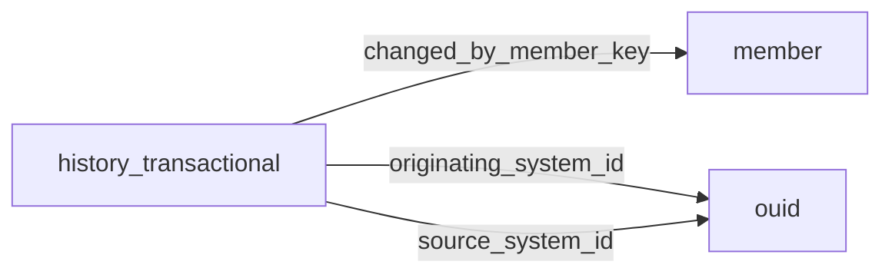

[index](../_index.md) | [lookups](../lookups.md) | [relationships](../relationships.md) | [USAGE.md](../../../USAGE.md)

# `history_transactional` (HistoryTransactional)

> A transactional history of the listing, showing before and after values of field changes.

## At a glance

| | |
|---|---|
| **Primary key** | `history_transactional_key` |
| **Fields on dd.reso.org** | 23 |
| **Columns in canonical DBML** | 20 (omits 0 satellite drops + 3 `Resource`-typed + 0 `Collection`-typed) |
| **Foreign keys OUT / IN** | 3 / 0 |
| **Review markers** | 0 |
| **Source** | [https://dd.reso.org/DD2.0/HistoryTransactional/](https://dd.reso.org/DD2.0/HistoryTransactional/) |
| **Last revised upstream** | 9/24/2015 |

## Relationship diagram

## Fields

Columns in their original `dd.reso.org` page order. **Definition** is the verbatim RESO DD prose (full text, not truncated). **Purpose (when to use)** is auto-derived from the field's role + datatype + lookup + status and tells you, in one sentence, what to write into this column. The `Flags` column shows: `pk`, `fk -> target.col` (committed FK in `canonical.dbml`), `[REVIEW]` (Phase 2.5 satellite audit flagged for review), `[dropped]` (omitted from the canonical DBML; satellite of the named FK), `[Resource]` / `[Collection]` (no scalar column in DBML; FK companion - see Refs / inverse-1:N below).

| Field | DBML name | Type | Lookup | Definition | Purpose (when to use) | Flags |
|---|---|---|---|---|---|---|
| `ChangeType` | `change_type` | enum | [`change_type`](../lookups.md#change_type) | A description of the last major change on the listing (i.e., Price Reduction, Back on Market, etc.). May be used to display on a summary view of listing results to quickly identify listings that have had major changes recently. | Pick exactly one of 13 values from the lookup (closed list). |  |
| `ChangedByMember` | `changed_by_member` | Resource |  | The member who changed the historical item. | Logical reference to another resource; not stored as a scalar column in DBML. Look at the sibling `*Key` / `*Id` field on this resource for where the actual FK value lives. | `[Resource]` |
| `ChangedByMemberID` | `changed_by_member_id` | String |  | The local, well-know identifier of the member (user) who made the change. | Free-form text, up to 25 characters. |  |
| `ChangedByMemberKey` | `changed_by_member_key` | String |  | The unique identifier of the member (user) who made the change. This is a foreign key relating to the Member resource's MemberKey. | Foreign key -> `member.member_key`. Set this to the `member`'s `member_key` to link this row to its parent `member`. | `-> member.member_key` |
| `ClassName` | `class_name` | String | [`class_name`](../lookups.md#class_name) | The name of the class in which this history record applies. | Pick exactly one of 17 values from the lookup (closed list). |  |
| `EntityEventSequence` | `entity_event_sequence` | Number |  | A unique, system-wide ID that can be used to represent the sequence in which an EntityEvent occurred in a given system. This field serves as a logical timestamp, meaning that its values may be used to provide a total ordering of all Events that occurred in the Events Resource. As Event records are immutable, this value can grow fairly large over time, and therefore it's represented by the Int64 data type. This sequence number is not expected to be unique across different organizations. This number must be a positive integer. | Numeric (integer). |  |
| `FieldKey` | `field_key` | String |  | The unique identifier of the field with data being changed. This is a foreign key relating to the field found in the resource per the ResourceName field. | Free-form text, up to 255 characters. |  |
| `FieldName` | `field_name` | String |  | The name of the field where data is being changed. | Free-form text, up to 255 characters. |  |
| `HistoryTransactionalKey` | `history_transactional_key` | String |  | A unique identifier for this record from the immediate source. This may be a number or string that can include a Uniform Resource Identifier (URI) or other forms. This is the system being connected to and not necessarily the original source of the record. | Unique key for this resource. Use as the FK target whenever another resource references `history_transactional`. | `pk` |
| `ModificationTimestamp` | `modification_timestamp` | Timestamp |  | The timestamp of the last major change on the listing (see also MajorChangeType). | ISO-8601 timestamp (UTC). |  |
| `NewValue` | `new_value` | String |  | The new value applied to the named field. | Free-form text, up to 8000 characters. |  |
| `OriginatingSystem` | `originating_system` | Resource |  | The originating system of the HistoryTransactional record. | Logical reference to another resource; not stored as a scalar column in DBML. Look at the sibling `*Key` / `*Id` field on this resource for where the actual FK value lives. | `[Resource]` |
| `OriginatingSystemHistoryKey` | `originating_system_history_key` | String |  | The system key, a unique record identifier, from the originating system. The originating system is the system with authoritative control over the record (e.g., the MLS where the history was input). There may be cases where the source system (how the record was received) is not the originating system. See Source System History Key for more information. | Free-form text, up to 255 characters. |  |
| `OriginatingSystemID` | `originating_system_id` | String |  | The OUID Resource's OrganizationUniqueId of the originating record provider. The originating system is the system with authoritative control over the record (e.g., the MLS where the history was input). In cases where the originating system was not where the record originated (the authoritative system), see the Originating System fields. | Foreign key -> `ouid.organization_unique_id`. Set this to the `ouid`'s `organization_unique_id` to link this row to its parent `ouid`. | `-> ouid.organization_unique_id` |
| `OriginatingSystemName` | `originating_system_name` | String |  | The name of the originating record provider, most commonly the name of the MLS. The place where the history is originally input. The legal name of the company. | Free-form text, up to 255 characters. |  |
| `PreviousValue` | `previous_value` | String |  | The value found in the named field prior to the change represented by this record. | Free-form text, up to 8000 characters. |  |
| `ResourceName` | `resource_name` | String |  | The name of the resource in which this history record applies. | Free-form text, up to 255 characters. |  |
| `ResourceRecordID` | `resource_record_id` | String |  | The well-known identifier of the related record from the source resource. The value may be identical to that of the listing key, but the listing ID is intended to be the value used by a human to retrieve the information about a specific listing. In a multiple-originating or merged system, this value may not be unique and may require the use of the provider system to create a synthetic unique value. | Free-form text, up to 255 characters. |  |
| `ResourceRecordKey` | `resource_record_key` | String |  | The primary key of the related record from the source resource (e.g., ListingKey, AgentKey, OfficeKey). This is the system being connected to and not necessarily the original source of the record. This is a foreign key from the resource selected in the ResourceName field. | Polymorphic key. Resolve the target resource at write time from the row's context (see Definition); store the chosen target's PK in this column. |  |
| `SourceSystem` | `source_system` | Resource |  | The source system of the HistoryTransactional record. | Logical reference to another resource; not stored as a scalar column in DBML. Look at the sibling `*Key` / `*Id` field on this resource for where the actual FK value lives. | `[Resource]` |
| `SourceSystemHistoryKey` | `source_system_history_key` | String |  | The system key, a unique record identifier, from the source system. The source system is the system from which the record was directly received. In cases where the source system was not where the record originated (the authoritative system), see the Originating System fields. | Free-form text, up to 255 characters. |  |
| `SourceSystemID` | `source_system_id` | String |  | The OUID Resource's OrganizationUniqueId of the source record provider. The source system is the system from which the record was directly received. In cases where the source system was not where the record originated (the authoritative system), see the Originating System fields. | Foreign key -> `ouid.organization_unique_id`. Set this to the `ouid`'s `organization_unique_id` to link this row to its parent `ouid`. | `-> ouid.organization_unique_id` |
| `SourceSystemName` | `source_system_name` | String |  | The name of the historical record provider. The system from which the record was directly received. The legal name of the company. | Free-form text, up to 255 characters. |  |

## Foreign keys OUT (this resource references)

- `history_transactional.changed_by_member_key` -> `member.member_key` (high)
- `history_transactional.originating_system_id` -> `ouid.organization_unique_id` (medium)
- `history_transactional.source_system_id` -> `ouid.organization_unique_id` (medium)

## Foreign keys IN (other resources reference this)

*(none committed)*

## Polymorphic FKs

- `resource_record_key` - target resolved at runtime; evidence: prose:P5:"foreign key from the resource selected in the ResourceName field"

## Phase 2.5 satellite audit

Recommendations from `raw/satellites.csv`. `drop_from_host` rows are not present in the canonical DBML; `review` rows are kept but flagged; `keep_both` rows are silently kept.

| Column | FK | Recommendation | Notes |
|---|---|---|---|
| `originating_system_history_key` | `originating_system_id` -> `ouid.?` | `keep_both` | no_child_match |
| `originating_system_name` | `originating_system_id` -> `ouid.?` | `keep_both` | no_child_match |
| `source_system_history_key` | `source_system_id` -> `ouid.?` | `keep_both` | no_child_match |
| `source_system_name` | `source_system_id` -> `ouid.?` | `keep_both` | no_child_match |

