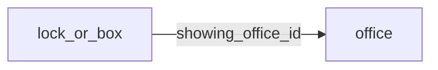

[index](../_index.md) | [lookups](../lookups.md) | [relationships](../relationships.md) | [USAGE.md](../../../USAGE.md)

# `lock_or_box` (LockOrBox)

> Lockbox, smart lock and showing agent information.

## At a glance

| | |
|---|---|
| **Primary key** | `lock_or_box_key` |
| **Fields on dd.reso.org** | 44 |
| **Columns in canonical DBML** | 39 (omits 0 satellite drops + 4 `Resource`-typed + 1 `Collection`-typed) |
| **Foreign keys OUT / IN** | 1 / 0 |
| **Review markers** | 0 |
| **Source** | [https://dd.reso.org/DD2.0/LockOrBox/](https://dd.reso.org/DD2.0/LockOrBox/) |
| **Last revised upstream** | 7/25/2019 |

## Relationship diagram

## Fields

Columns in their original `dd.reso.org` page order. **Definition** is the verbatim RESO DD prose (full text, not truncated). **Purpose (when to use)** is auto-derived from the field's role + datatype + lookup + status and tells you, in one sentence, what to write into this column. The `Flags` column shows: `pk`, `fk -> target.col` (committed FK in `canonical.dbml`), `[REVIEW]` (Phase 2.5 satellite audit flagged for review), `[dropped]` (omitted from the canonical DBML; satellite of the named FK), `[Resource]` / `[Collection]` (no scalar column in DBML; FK companion - see Refs / inverse-1:N below).

| Field | DBML name | Type | Lookup | Definition | Purpose (when to use) | Flags |
|---|---|---|---|---|---|---|
| `HistoryTransactional` | `history_transactional` | Collection |  | This history for the LockOrBox record. | Inverse 1:N: read as 'all `history_transactional` rows that point at this `lock_or_box` row'. Not stored as a column; the FK lives on the child side. | `[Collection]` |
| `KeyOrCredentialId` | `key_or_credential_id` | String |  | The local, well-known identifier for a given lockbox/smartlock system key or credential. This value may not be unique, specifically in the case of aggregation systems, and it should be the identifier from the original system. | Free-form text, up to 25 characters. |  |
| `ListAgentFullName` | `list_agent_full_name` | String |  | The first, middle and last name of the listing agent. | Free-form text, up to 150 characters. |  |
| `ListingAddress1` | `listing_address1` | String |  | The street number, direction, name and suffix of the property where the lockbox/smart lock is located. | Free-form text, up to 50 characters. |  |
| `ListingAddress2` | `listing_address2` | String |  | The unit/suite number of the property where the lockbox/smart lock is located. | Free-form text, up to 50 characters. |  |
| `ListingCity` | `listing_city` | String |  | The city of the property where the lockbox/smart lock is located. | Free-form text, up to 50 characters. |  |
| `ListingCountry` | `listing_country` | enum | [`country`](../lookups.md#country) | The country of the property where the lockbox/smart lock is located. | Pick exactly one of 246 values from the lookup (closed list). |  |
| `ListingId` | `listing_id` | String |  | The well-known identifier for the listing where the lockbox/smart lock is located. The value may be identical to that of the Listing Key, but the Listing ID is intended to be the value used by a human to retrieve the information about a specific listing. In a multiple originating system or a merged system, this value may not be unique and may require the use of the provider system to create a synthetic unique value. | Free-form text, up to 255 characters. |  |
| `ListingKey` | `listing_key` | String |  | A unique identifier for this record from the immediate source. This is a string that can include a Uniform Resource Identifier (URI) or other forms. This is the local key of the system. When records are received from other systems, a local key is commonly applied. If conveying the original keys from the source or originating systems, see SourceSystemLockOrBoxKey and OriginatingSystemLockOrBoxKey. | Free-form text, up to 255 characters. |  |
| `ListingLatitude` | `listing_latitude` | Number |  | The latitude of the property where the lockbox/smart lock is located. | Numeric, up to 8 decimal place(s). |  |
| `ListingLongitude` | `listing_longitude` | Number |  | The longitude of the property where the lockbox/smart lock is located. | Numeric, up to 8 decimal place(s). |  |
| `ListingPostalCode` | `listing_postal_code` | String |  | The postal code of the property where the lockbox/smart lock is located. | Free-form text, up to 10 characters. |  |
| `ListingPostalCodePlus4` | `listing_postal_code_plus4` | String |  | The four-digit U.S. ZIP Code extension of the property where the lockbox/smart lock is located. | Free-form text, up to 4 characters. |  |
| `ListingStateOrProvince` | `listing_state_or_province` | enum | [`state_or_province`](../lookups.md#state_or_province) | The state or province of the property where the lockbox/smart lock is located. | Pick exactly one of 65 values from the lookup (closed list). |  |
| `ListingTimeZone` | `listing_time_zone` | enum | [`iana_time_zone_values`](../lookups.md#iana_time_zone_values) | The standard name of the time zone of the property where the lockbox/smart lock is located, as provided by the IANA tz database. | Pick exactly one of 482 values from the lookup (closed list). |  |
| `LockOrBoxAccessTimestamp` | `lock_or_box_access_timestamp` | Timestamp |  | The transactional timestamp automatically recorded by the lockbox/smart lock system representing the date/time the lockbox or lock was last accessed. | ISO-8601 timestamp (UTC). |  |
| `LockOrBoxAccessType` | `lock_or_box_access_type` | varchar (multi) | [`lock_or_box_access_type`](../lookups.md#lock_or_box_access_type) | The method of access for the lockbox or smart lock. | Pick one or more of 3 values from the lookup (closed list). |  |
| `LockOrBoxId` | `lock_or_box_id` | String |  | The local, well-known identifier for a given lockbox/smartlock system. This value may not be unique, specifically in the case of aggregation systems, and it should be the identifier from the original system. | Free-form text, up to 25 characters. |  |
| `LockOrBoxInstalledTimestamp` | `lock_or_box_installed_timestamp` | Timestamp |  | The transactional timestamp automatically recorded by the lockbox/smart lock system representing the date/time the lockbox or lock was last installed at a property. | ISO-8601 timestamp (UTC). |  |
| `LockOrBoxKey` | `lock_or_box_key` | String |  | A unique identifier for this record from the immediate source. This is a string that can include a Uniform Resource Identifier (URI) or other forms. This is the local key of the system. When records are received from other systems, a local key is commonly applied. If conveying the original keys from the source or originating systems, see SourceSystemKey and OriginatingSystemKey. | Unique key for this resource. Use as the FK target whenever another resource references `lock_or_box`. | `pk` |
| `LockOrBoxOriginatingSystemId` | `lock_or_box_originating_system_id` | String |  | The RESO Unique Organization Identifier (UOI) OrganizationUniqueId of the originating record provider. The originating system is the system with authoritative control over the record (e.g., the name of the MLS where the listing was input). In cases where the originating system was not where the record originated (the authoritative system), see the Originating System fields. | Free-form text, up to 25 characters. |  |
| `LockOrBoxOriginatingSystemKey` | `lock_or_box_originating_system_key` | String |  | The name of the originating record provider. Most commonly the name of the MLS. The place where the listing is originally input by the member. The legal name of the company. | Free-form text, up to 255 characters. |  |
| `LockOrBoxOriginatingSystemName` | `lock_or_box_originating_system_name` | String |  | The system key, a unique record identifier, from the originating system. The originating system is the system with authoritative control over the record. For example, the Multiple Listing Service where the listing was input. There may be cases where the Source System (how you received the record) is not the Originating System. See Source System Key for more information. | Free-form text, up to 255 characters. |  |
| `LockOrBoxSourceSystemId` | `lock_or_box_source_system_id` | String |  | The RESO Unique Organization Identifier (UOI) OrganizationUniqueId of the source record provider. The source system is the system from which the record was directly received. In cases where the source system was not where the record originated (the authoritative system), see the Originating System fields. | Free-form text, up to 25 characters. |  |
| `LockOrBoxSourceSystemKey` | `lock_or_box_source_system_key` | String |  | The name of the immediate record provider. The system from which the record was directly received. The legal name of the company. | Free-form text, up to 255 characters. |  |
| `LockOrBoxSourceSystemName` | `lock_or_box_source_system_name` | String |  | The system key, a unique record identifier, from the source system. The source system is the system from which the record was directly received. In cases where the source system was not where the record originated (the authoritative system), see the Originating System fields. | Free-form text, up to 255 characters. |  |
| `ModificationTimestamp` | `modification_timestamp` | Timestamp |  | The date/time the LockOrBox record was last modified. | ISO-8601 timestamp (UTC). |  |
| `Notes` | `notes` | String |  | Notes or feedback about the property or showing. | Free-form text, up to 1024 characters. |  |
| `OriginatingSystem` | `originating_system` | Resource |  | The originating system of the LockOrBox record. | Logical reference to another resource; not stored as a scalar column in DBML. Look at the sibling `*Key` / `*Id` field on this resource for where the actual FK value lives. | `[Resource]` |
| `ShowingAgent` | `showing_agent` | Resource |  | The office contact for showings of the property. | Logical reference to another resource; not stored as a scalar column in DBML. Look at the sibling `*Key` / `*Id` field on this resource for where the actual FK value lives. | `[Resource]` |
| `ShowingAgentAOR` | `showing_agent_aor` | enum | [`aor`](../lookups.md#aor) | The showing contact's board or association of REALTORS®. | Free-form string; the lookup is jurisdiction-defined (no closed value list). |  |
| `ShowingAgentEmail` | `showing_agent_email` | String |  | The email address of the contact for showings of the property. | Free-form text, up to 80 characters. |  |
| `ShowingAgentFirstName` | `showing_agent_first_name` | String |  | The first name of the contact for showings of the property. | Free-form text, up to 50 characters. |  |
| `ShowingAgentFullName` | `showing_agent_full_name` | String |  | The first, middle and last name of the contact for showings of the property. | Free-form text, up to 150 characters. |  |
| `ShowingAgentId` | `showing_agent_id` | String |  | The local, well-known lockbox/smartlock system identifier of the showing contact. This value may not be unique, specifically in the case of aggregation systems, and it should be the identifier from the original system. | Free-form text, up to 25 characters. |  |
| `ShowingAgentLastName` | `showing_agent_last_name` | String |  | The last name of the contact for showings of the property. | Free-form text, up to 50 characters. |  |
| `ShowingAgentMlsId` | `showing_agent_mls_id` | String |  | The local, well-known MLS identifier of the showing contact. This value may not be unique, specifically in the case of aggregation systems, and it should be the identifier from the original system. | Free-form text, up to 25 characters. |  |
| `ShowingAgentPhone` | `showing_agent_phone` | String |  | The North American 10-digit phone numbers should be in the format of ###-###-#### (separated by hyphens). Other conventions should use the common local standard. International numbers should be preceded by a plus symbol. | Free-form text, up to 16 characters. |  |
| `ShowingAgentPhoneExt` | `showing_agent_phone_ext` | String |  | The phone number extension of the contact for showings of the property. | Free-form text, up to 10 characters. |  |
| `ShowingOffice` | `showing_office` | Resource |  | The agent contact for showings of the property. | Logical reference to another resource; not stored as a scalar column in DBML. Look at the sibling `*Key` / `*Id` field on this resource for where the actual FK value lives. | `[Resource]` |
| `ShowingOfficeId` | `showing_office_id` | String |  | The local, well-known lockbox/smart lock system identifier of the showing office. This value may not be unique, specifically in the case of aggregation systems, and it should be the identifier from the original system. | Foreign key -> `office.office_key`. Set this to the `office`'s `office_key` to link this row to its parent `office`. | `-> office.office_key` |
| `ShowingOfficeName` | `showing_office_name` | String |  | The legal name of the brokerage/company showing the property. | Free-form text, up to 255 characters. |  |
| `ShowingOfficePhone` | `showing_office_phone` | String |  | The North American 10-digit phone numbers should be in the format of ###-###-#### (separated by hyphens). Other conventions should use the common local standard. International numbers should be preceded by a plus symbol. | Free-form text, up to 16 characters. |  |
| `SourceSystem` | `source_system` | Resource |  | The source system of the LockOrBox record. | Logical reference to another resource; not stored as a scalar column in DBML. Look at the sibling `*Key` / `*Id` field on this resource for where the actual FK value lives. | `[Resource]` |

## Field disambiguation

Sibling field clusters that an LLM agent commonly confuses. Auto-detected from name shape; resolve which is which by reading each row's full Definition above.

- **`ListingKey` vs `ListingId`**:
  - `ListingKey` - A unique identifier for this record from the immediate source.
  - `ListingId` - The well-known identifier for the listing where the lockbox/smart lock is located.
- **`LockOrBoxKey` vs `LockOrBoxId`**:
  - `LockOrBoxKey` - A unique identifier for this record from the immediate source.
  - `LockOrBoxId` - The local, well-known identifier for a given lockbox/smartlock system.
- **`LockOrBoxOriginatingSystemKey` vs `LockOrBoxOriginatingSystemId`**:
  - `LockOrBoxOriginatingSystemKey` - The name of the originating record provider.
  - `LockOrBoxOriginatingSystemId` - The RESO Unique Organization Identifier (UOI) OrganizationUniqueId of the originating record provider.
- **`LockOrBoxSourceSystemKey` vs `LockOrBoxSourceSystemId`**:
  - `LockOrBoxSourceSystemKey` - The name of the immediate record provider.
  - `LockOrBoxSourceSystemId` - The RESO Unique Organization Identifier (UOI) OrganizationUniqueId of the source record provider.

## Foreign keys OUT (this resource references)

- `lock_or_box.showing_office_id` -> `office.office_key` (medium)

## Foreign keys IN (other resources reference this)

*(none committed)*

## Inverse 1:N (collection-typed companions)

- `history_transactional` -> `history_transactional` (many `history_transactional` per `lock_or_box`)

