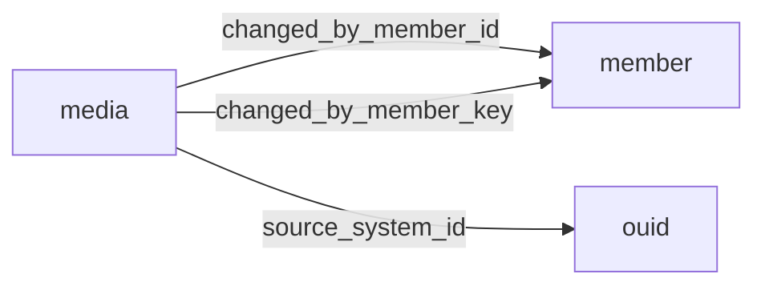

[index](../_index.md) | [lookups](../lookups.md) | [relationships](../relationships.md) | [USAGE.md](../../../USAGE.md)

# `media` (Media)

> Photos, virtual tours, documents, supplements and other media related to listings.

## At a glance

| | |
|---|---|
| **Primary key** | `media_key` |
| **Fields on dd.reso.org** | 41 |
| **Columns in canonical DBML** | 37 (omits 0 satellite drops + 3 `Resource`-typed + 1 `Collection`-typed) |
| **Foreign keys OUT / IN** | 3 / 0 |
| **Review markers** | 0 |
| **Source** | [https://dd.reso.org/DD2.0/Media/](https://dd.reso.org/DD2.0/Media/) |
| **Last revised upstream** | 8/27/2015 |

## Relationship diagram

## Fields

Columns in their original `dd.reso.org` page order. **Definition** is the verbatim RESO DD prose (full text, not truncated). **Purpose (when to use)** is auto-derived from the field's role + datatype + lookup + status and tells you, in one sentence, what to write into this column. The `Flags` column shows: `pk`, `fk -> target.col` (committed FK in `canonical.dbml`), `[REVIEW]` (Phase 2.5 satellite audit flagged for review), `[dropped]` (omitted from the canonical DBML; satellite of the named FK), `[Resource]` / `[Collection]` (no scalar column in DBML; FK companion - see Refs / inverse-1:N below).

| Field | DBML name | Type | Lookup | Definition | Purpose (when to use) | Flags |
|---|---|---|---|---|---|---|
| `ChangedByMember` | `changed_by_member` | Resource |  | The member who changed the Media record. | Logical reference to another resource; not stored as a scalar column in DBML. Look at the sibling `*Key` / `*Id` field on this resource for where the actual FK value lives. | `[Resource]` |
| `ChangedByMemberID` | `changed_by_member_id` | String |  | The ID of the user, agent, member, etc., that uploaded the media this record refers to. | Foreign key -> `member.member_key`. Set this to the `member`'s `member_key` to link this row to its parent `member`. | `-> member.member_key` |
| `ChangedByMemberKey` | `changed_by_member_key` | String |  | The primary key of the member who uploaded the media this record refers to. This is a foreign key relating to the Member Resource's MemberKey. | Foreign key -> `member.member_key`. Set this to the `member`'s `member_key` to link this row to its parent `member`. | `-> member.member_key` |
| `ClassName` | `class_name` | enum | [`class_name`](../lookups.md#class_name) | The class or table of the listing or other record of the media (e.g., Residential, Lease, Agent, Office, Contact). | Pick exactly one of 17 values from the lookup (closed list). |  |
| `HistoryTransactional` | `history_transactional` | Collection |  | The history of the Media record. | Inverse 1:N: read as 'all `history_transactional` rows that point at this `media` row'. Not stored as a column; the FK lives on the child side. | `[Collection]` |
| `ImageHeight` | `image_height` | Number |  | The height of the image expressed in pixels. | Numeric (integer). |  |
| `ImageOf` | `image_of` | enum | [`image_of`](../lookups.md#image_of) | When the media is an image, a list of possible matches such as kitchen, bathroom, front of structure, etc. This field may be used to identify a required image under association or MLS rules. | Pick exactly one of 86 values from the lookup (closed list). |  |
| `ImageSizeDescription` | `image_size_description` | enum | [`image_size_description`](../lookups.md#image_size_description) | A text description of the size of the image (i.e., Small, Thumbnail, Medium, Large, X-Large). The largest image must be described as "Largest," and the thumbnail must also be included. A pick list will remain open/extendable. | Free-form string; the lookup is jurisdiction-defined (no closed value list). |  |
| `ImageWidth` | `image_width` | Number |  | The width of the image expressed in pixels. | Numeric (integer). |  |
| `LongDescription` | `long_description` | String |  | The full robust description of the object. | Free-form text, up to 1024 characters. |  |
| `MediaAlteration` | `media_alteration` | varchar (multi) | [`media_alteration`](../lookups.md#media_alteration) | Photos may be enhanced, altered or even created by manual or computer drafting. This list of lookup values is used to identify when any such alteration or fabrication of the photo has occurred. It is recommended that you check with your local laws and policies on the allowed alterations. | Pick one or more of 10 values from the lookup (closed list). |  |
| `MediaCategory` | `media_category` | enum | [`media_category`](../lookups.md#media_category) | A category describing photos, documents, videos, unbranded virtual tours, branded virtual tours, floor plans, logos and other forms of media. | Pick exactly one of 9 values from the lookup (closed list). |  |
| `MediaHTML` | `media_html` | String |  | The JavaScript or other method to embed a video, image, virtual tour or other media. | Free-form text, up to 8500 characters. |  |
| `MediaKey` | `media_key` | String |  | A unique identifier for this record from the immediate source. This may be a number or a string that can include a Uniform Resource Identifier (URI) or other forms. This is the system you are connecting to and not necessarily the original source of the record. | Unique key for this resource. Use as the FK target whenever another resource references `media`. | `pk` |
| `MediaModificationTimestamp` | `media_modification_timestamp` | Timestamp |  | A timestamp that is updated when a change to the object has been made, which may differ from a change to the Media Resource. | ISO-8601 timestamp (UTC). |  |
| `MediaObjectID` | `media_object_id` | String |  | The ID of the image, supplement or other object specified by the given media record. | Free-form text, up to 255 characters. |  |
| `MediaStatus` | `media_status` | enum | [`media_status`](../lookups.md#media_status) | The status of the media item referenced by this record (i.e., updated, deleted, etc.). | Free-form string; the lookup is jurisdiction-defined (no closed value list). |  |
| `MediaType` | `media_type` | enum | [`media_type`](../lookups.md#media_type) | Media types as defined by the Internet Assigned Numbers Authority (IANA), http://www.iana.org/assignments/media-types/index.html. Note that the former name of MimeType, used by both IANA and RESO, may still be in use by some systems/entities. | Pick exactly one of 16 values from the lookup (closed list). |  |
| `MediaURL` | `media_url` | String |  | The Uniform Resource Identifier (URI) to the media file referenced by this record. | Free-form text, up to 8000 characters. |  |
| `ModificationTimestamp` | `modification_timestamp` | Timestamp |  | The transactional timestamp automatically recorded by the MLS system representing the date/time the Media record was last modified. | ISO-8601 timestamp (UTC). |  |
| `Order` | `order` | Number |  | Only a positive integer, including zero. Element zero is the primary photo per RESO convention. | Numeric (integer). |  |
| `OriginatingSystem` | `originating_system` | Resource |  | The originating system of the Media record. | Logical reference to another resource; not stored as a scalar column in DBML. Look at the sibling `*Key` / `*Id` field on this resource for where the actual FK value lives. | `[Resource]` |
| `OriginatingSystemID` | `originating_system_id` | String |  | The RESO Unique Organization Identifier's OrganizationUniqueId of the originating record provider. The originating system is the system with authoritative control over the record (e.g., the MLS where the media was input). In cases where the originating system was not where the record originated (the authoritative system), see the Originating System fields. | Free-form text, up to 25 characters. |  |
| `OriginatingSystemMediaKey` | `originating_system_media_key` | String |  | The system key, a unique record identifier, from the originating system. The originating system is the system with authoritative control over the record (e.g., the MLS where the media was input). There may be cases where the source system (how the record is received) is not the originating system. See Source System Media Key for more information. | Free-form text, up to 255 characters. |  |
| `OriginatingSystemName` | `originating_system_name` | String |  | The name of the originating record provider, most commonly the name of the MLS. The place where the media is originally input by the member. The legal name of the company. | Free-form text, up to 255 characters. |  |
| `OriginatingSystemResourceRecordId` | `originating_system_resource_record_id` | String |  | The originating system's well-known identifier of the related record from the source resource. The value may be identical to that of the key, but the ID is intended to be the value used by a human to retrieve the information about a specific listing. With multiple originating systems or a merged system, this value may not be unique and may require the use of the provider system to create a synthetic unique value. This most commonly would be the ListingId as it exists in the originating system. | Free-form text, up to 255 characters. |  |
| `OriginatingSystemResourceRecordKey` | `originating_system_resource_record_key` | String |  | The originating system's primary key of the related record from the source resource (e.g., ListingKey, AgentKey, OfficeKey, TeamKey). The ResourceName identifies the resource being referenced. OriginatingSystemName or OriginatingSystemId are used to identify the originating system. | Free-form text, up to 255 characters. |  |
| `OriginatingSystemResourceRecordSystemId` | `originating_system_resource_record_system_id` | String |  | The system ID of the resource record from the originating system is used when the resource record is originated from a different system than the media. This is the system ID of the OriginatingSystemResourceRecordID and/or the OriginatingSystemResourceRecordKey when they are from a different system than the OriginatingSystemID and/or OriginatingSystemName. | Free-form text, up to 25 characters. |  |
| `Permission` | `permission` | varchar (multi) | [`permission`](../lookups.md#permission) | The permission-level of the media (i.e., Public, Private, IDX, VOW, Office Only, Firm Only, Agent Only). | Pick one or more of 7 values from the lookup (closed list). |  |
| `PreferredPhotoYN` | `preferred_photo_yn` | Boolean |  | A flag indicating whether or not the media record in question is the preferred photo. This will typically mean the photo shown when only one of the photos is displayed. This flag may be true/false, yes/no or another true, false or unknown indicator. As with all flags, the field may be null. | Nullable boolean flag (true / false / null = unknown). |  |
| `ResourceName` | `resource_name` | enum | [`resource_name`](../lookups.md#resource_name) | The resource or table of the listing or other record the media relates to (i.e., Property, Member, Office, etc.). | Pick exactly one of 5 values from the lookup (closed list). |  |
| `ResourceRecordID` | `resource_record_id` | String |  | The well-known identifier of the related record from the source resource. The value may be identical to that of the listing key, but the listing ID is intended to be the value used by a human to retrieve the information about a specific listing. In a multiple-originating system or a merged system, this value may not be unique and may require the use of the provider system to create a synthetic unique value. | Free-form text, up to 255 characters. |  |
| `ResourceRecordKey` | `resource_record_key` | String |  | The primary key of the related record from the source resource (e.g., ListingKey, AgentKey, OfficeKey, TeamKey). This is the system being connected to and not necessarily the original source of the record. This is a foreign key from the resource selected in the ResourceName field. | Polymorphic key. Resolve the target resource at write time from the row's context (see Definition); store the chosen target's PK in this column. |  |
| `ShortDescription` | `short_description` | String |  | The short text given to summarize the object, commonly used as the short description displayed under a photo. | Free-form text, up to 50 characters. |  |
| `SourceSystem` | `source_system` | Resource |  | The source system of the Media record. | Logical reference to another resource; not stored as a scalar column in DBML. Look at the sibling `*Key` / `*Id` field on this resource for where the actual FK value lives. | `[Resource]` |
| `SourceSystemID` | `source_system_id` | String |  | The OUID Resource's OrganizationUniqueId of the source record provider. The source system is the system from which the record was directly received. In cases where the source system was not where the record originated (the authoritative system), see the Originating System fields. | Foreign key -> `ouid.organization_unique_id_key`. Set this to the `ouid`'s `organization_unique_id_key` to link this row to its parent `ouid`. | `-> ouid.organization_unique_id_key` |
| `SourceSystemMediaKey` | `source_system_media_key` | String |  | The system key, a unique record identifier, from the source system. The source system is the system from which the record was directly received. In cases where the source system was not where the record originated (the authoritative system), see the Originating System fields. | Free-form text, up to 255 characters. |  |
| `SourceSystemName` | `source_system_name` | String |  | The name of the immediate record provider. The system from which the record was directly received. The legal name of the company. | Free-form text, up to 255 characters. |  |
| `SourceSystemResourceRecordId` | `source_system_resource_record_id` | String |  | The source system's well-known identifier of the related record from the source resource. The value may be identical to that of the key, but the ID is intended to be the value used by a human to retrieve the information about a specific listing. With multiple originating systems or a merged system, this value may not be unique and may require the use of the provider system to create a synthetic unique value. This most commonly would be the ListingId as it exists in the source system. | Free-form text, up to 255 characters. |  |
| `SourceSystemResourceRecordKey` | `source_system_resource_record_key` | String |  | The source system's primary key of the related record from the source resource (e.g., ListingKey, AgentKey, OfficeKey, TeamKey). The ResourceName identifies the resource being referenced. SourceSystemName or SourceSystemId are used to identify the originating system. | Free-form text, up to 255 characters. |  |
| `SourceSystemResourceRecordSystemId` | `source_system_resource_record_system_id` | String |  | The system ID of the resource record from the source system is used when the resource record is sourced from a different system than the media. This is the system ID of the SourceSystemResourceRecordID and/or the SourceSystemResourceRecordKey when they are from a different system than the SourceSystemID and/or SourceSystemName. | Free-form text, up to 25 characters. |  |

## Field disambiguation

Sibling field clusters that an LLM agent commonly confuses. Auto-detected from name shape; resolve which is which by reading each row's full Definition above.

- **`OriginatingSystemResourceRecordKey` vs `OriginatingSystemResourceRecordId`**:
  - `OriginatingSystemResourceRecordKey` - The originating system's primary key of the related record from the source resource (e.g., ListingKey, AgentKey, OfficeKey, TeamKey).
  - `OriginatingSystemResourceRecordId` - The originating system's well-known identifier of the related record from the source resource.
- **`SourceSystemResourceRecordKey` vs `SourceSystemResourceRecordId`**:
  - `SourceSystemResourceRecordKey` - The source system's primary key of the related record from the source resource (e.g., ListingKey, AgentKey, OfficeKey, TeamKey).
  - `SourceSystemResourceRecordId` - The source system's well-known identifier of the related record from the source resource.

## Foreign keys OUT (this resource references)

- `media.changed_by_member_id` -> `member.member_key` (medium)
- `media.changed_by_member_key` -> `member.member_key` (high)
- `media.source_system_id` -> `ouid.organization_unique_id_key` (medium)

## Foreign keys IN (other resources reference this)

*(none committed)*

## Inverse 1:N (collection-typed companions)

- `history_transactional` -> `history_transactional` (many `history_transactional` per `media`)

## Polymorphic FKs

- `resource_record_key` - target resolved at runtime; evidence: prose:P5:"foreign key from the resource selected in the ResourceName field"

## Phase 2.5 satellite audit

Recommendations from `raw/satellites.csv`. `drop_from_host` rows are not present in the canonical DBML; `review` rows are kept but flagged; `keep_both` rows are silently kept.

| Column | FK | Recommendation | Notes |
|---|---|---|---|
| `source_system_media_key` | `source_system_id` -> `ouid.?` | `keep_both` | no_child_match |
| `source_system_name` | `source_system_id` -> `ouid.?` | `keep_both` | no_child_match |
| `source_system_resource_record_id` | `source_system_id` -> `ouid.?` | `keep_both` | no_child_match |
| `source_system_resource_record_key` | `source_system_id` -> `ouid.?` | `keep_both` | no_child_match |
| `source_system_resource_record_system_id` | `source_system_id` -> `ouid.?` | `keep_both` | no_child_match |

