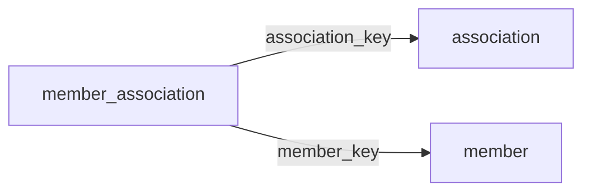

[index](../_index.md) | [lookups](../lookups.md) | [relationships](../relationships.md) | [USAGE.md](../../../USAGE.md)

# `member_association` (MemberAssociation)

> Joining information relating Member and Association records to each other.

## At a glance

| | |
|---|---|
| **Primary key** | `association_key` *(override; RESO uses `AssociationKey`)* |
| **Fields on dd.reso.org** | 31 |
| **Columns in canonical DBML** | 26 (omits 0 satellite drops + 4 `Resource`-typed + 1 `Collection`-typed) |
| **Foreign keys OUT / IN** | 2 / 0 |
| **Review markers** | 0 |
| **Source** | [https://dd.reso.org/DD2.0/MemberAssociation/](https://dd.reso.org/DD2.0/MemberAssociation/) |
| **Last revised upstream** | 9/7/2023 |

## Relationship diagram

## Fields

Columns in their original `dd.reso.org` page order. **Definition** is the verbatim RESO DD prose (full text, not truncated). **Purpose (when to use)** is auto-derived from the field's role + datatype + lookup + status and tells you, in one sentence, what to write into this column. The `Flags` column shows: `pk`, `fk -> target.col` (committed FK in `canonical.dbml`), `[REVIEW]` (Phase 2.5 satellite audit flagged for review), `[dropped]` (omitted from the canonical DBML; satellite of the named FK), `[Resource]` / `[Collection]` (no scalar column in DBML; FK companion - see Refs / inverse-1:N below).

| Field | DBML name | Type | Lookup | Definition | Purpose (when to use) | Flags |
|---|---|---|---|---|---|---|
| `Association` | `association` | Resource |  | The Association of the MemberAssociation record. | Logical reference to another resource; not stored as a scalar column in DBML. Look at the sibling `*Key` / `*Id` field on this resource for where the actual FK value lives. | `[Resource]` |
| `AssociationKey` | `association_key` | String |  | The unique identifier for the association record. | Unique key for this resource. Use as the FK target whenever another resource references `member_association`. | `pk` `-> association.association_key` |
| `AssociationMlsId` | `association_mls_id` | String |  | The local, well-known identifier for the association of REALTORS®. This value may not be unique, specifically in the case of aggregation systems, and it should be the identifier from the original system. | Free-form text, up to 25 characters. |  |
| `AssociationNationalAssociationId` | `association_national_association_id` | String |  | The national association ID of the association as known by the national association. | Free-form text, up to 25 characters. |  |
| `AssociationStaffYN` | `association_staff_yn` | Boolean |  | Determines whether or not the record is associated with an association employee. | Nullable boolean flag (true / false / null = unknown). |  |
| `HistoryTransactional` | `history_transactional` | Collection |  | A collection of history items related to the MemberAssociation record. | Inverse 1:N: read as 'all `history_transactional` rows that point at this `member_association` row'. Not stored as a column; the FK lives on the child side. | `[Collection]` |
| `Member` | `member` | Resource |  | The member of the MemberAssociation record. | Logical reference to another resource; not stored as a scalar column in DBML. Look at the sibling `*Key` / `*Id` field on this resource for where the actual FK value lives. | `[Resource]` |
| `MemberAssociationBillStatus` | `member_association_bill_status` | enum | [`member_association_bill_status`](../lookups.md#member_association_bill_status) | The billing status of the member. | Pick exactly one of 3 values from the lookup (closed list). |  |
| `MemberAssociationBillStatusDescription` | `member_association_bill_status_description` | String |  | The description of the billing status of the member. | Free-form text, up to 100 characters. |  |
| `MemberAssociationDuesPaidDate` | `member_association_dues_paid_date` | Date |  | The last date the member paid dues. | Date (YYYY-MM-DD). |  |
| `MemberAssociationJoinDate` | `member_association_join_date` | Date |  | The date the member joined the association. | Date (YYYY-MM-DD). |  |
| `MemberAssociationModificationDateTime` | `member_association_modification_date_time` | Timestamp |  | The modification date for the record. | ISO-8601 timestamp (UTC). |  |
| `MemberAssociationOrientationDate` | `member_association_orientation_date` | Date |  | The date the member underwent orientation with the association. | Date (YYYY-MM-DD). |  |
| `MemberAssociationPrimaryIndicator` | `member_association_primary_indicator` | String |  | An indicator showing whether the member's association membership status is primary, secondary, or not applicable (i.e., P, S, X). | Free-form text, up to 20 characters. |  |
| `MemberAssociationStatus` | `member_association_status` | enum | [`member_status`](../lookups.md#member_status) | States if the account is active, inactive or under disciplinary action. | Pick exactly one of 2 values from the lookup (closed list). |  |
| `MemberAssociationStatusDate` | `member_association_status_date` | Date |  | The date of change of the member's status in relation to the association. | Date (YYYY-MM-DD). |  |
| `MemberKey` | `member_key` | String |  | A unique identifier for this record from the immediate source. This is the string key and the local key of the system. When records are received from other systems, a local key is commonly applied. If conveying the original keys from the source or originating systems, see SourceSystemMemberKey and OriginatingSystemMemberKey. | Foreign key -> `member.member_key`. Set this to the `member`'s `member_key` to link this row to its parent `member`. | `-> member.member_key` |
| `MemberLocalDuesWaivedYN` | `member_local_dues_waived_yn` | Boolean |  | Determines whether or not the member's association dues are waived at the local level. | Nullable boolean flag (true / false / null = unknown). |  |
| `MemberMlsId` | `member_mls_id` | String |  | The local, well-known identifier for the member. This value may not be unique, specifically in the case of aggregation systems, and it should be the identifier from the original system. | Free-form text, up to 25 characters. |  |
| `MemberNationalDuesWaivedYN` | `member_national_dues_waived_yn` | Boolean |  | Determines whether or not the member's association dues are waived at the national level. | Nullable boolean flag (true / false / null = unknown). |  |
| `MemberStatelDuesWaivedYN` | `member_statel_dues_waived_yn` | Boolean |  | Determines whether or not the member's association dues are waived at the state level. | Nullable boolean flag (true / false / null = unknown). |  |
| `ModificationTimestamp` | `modification_timestamp` | Timestamp |  | The date/time the MemberAssociation record was last modified. | ISO-8601 timestamp (UTC). |  |
| `OriginalEntryTimestamp` | `original_entry_timestamp` | Timestamp |  | The date/time the record was originally input into the source system. | ISO-8601 timestamp (UTC). |  |
| `OriginatingSystem` | `originating_system` | Resource |  | The originating system of the MemberAssociation record. | Logical reference to another resource; not stored as a scalar column in DBML. Look at the sibling `*Key` / `*Id` field on this resource for where the actual FK value lives. | `[Resource]` |
| `OriginatingSystemId` | `originating_system_id` | String |  | The RESO Unique Organization Identifier (UOI) OrganizationUniqueId of the originating record provider. The originating system is the system with authoritative control over the record (e.g., the name of the MLS where the member was input). In cases where the originating system was not where the record originated (the authoritative system), see the Originating System fields. | Free-form text, up to 25 characters. |  |
| `OriginatingSystemMemberKey` | `originating_system_member_key` | String |  | The system key, a unique record identifier, from the originating system. The originating system is the system with authoritative control over the record (e.g., the MLS where the member was input). There may be cases where the source system (how the record is received) is not the originating system. See Source System Key for more information. | Free-form text, up to 255 characters. |  |
| `OriginatingSystemName` | `originating_system_name` | String |  | The name of the originating record provider, most commonly the name of the MLS. The place where the member is originally input by the member. The legal name of the company. | Free-form text, up to 255 characters. |  |
| `SourceSystem` | `source_system` | Resource |  | The source system of the MemberAssociation record. | Logical reference to another resource; not stored as a scalar column in DBML. Look at the sibling `*Key` / `*Id` field on this resource for where the actual FK value lives. | `[Resource]` |
| `SourceSystemId` | `source_system_id` | String |  | The RESO Unique Organization Identifier (UOI) OrganizationUniqueId of the source record provider. The source system is the system from which the record was directly received. In cases where the source system was not where the record originated (the authoritative system), see the Originating System fields. | Free-form text, up to 25 characters. |  |
| `SourceSystemMemberKey` | `source_system_member_key` | String |  | The system key, a unique record identifier, from the source system. The source system is the system from which the record was directly received. In cases where the source system was not where the record originated (the authoritative system), see the Originating System fields. | Free-form text, up to 255 characters. |  |
| `SourceSystemName` | `source_system_name` | String |  | The name of the immediate record provider. The system from which the record was directly received. The legal name of the company. | Free-form text, up to 255 characters. |  |

## Foreign keys OUT (this resource references)

- `member_association.association_key` -> `association.association_key` (medium)
- `member_association.member_key` -> `member.member_key` (medium)

## Foreign keys IN (other resources reference this)

*(none committed)*

## Inverse 1:N (collection-typed companions)

- `history_transactional` -> `history_transactional` (many `history_transactional` per `member_association`)

