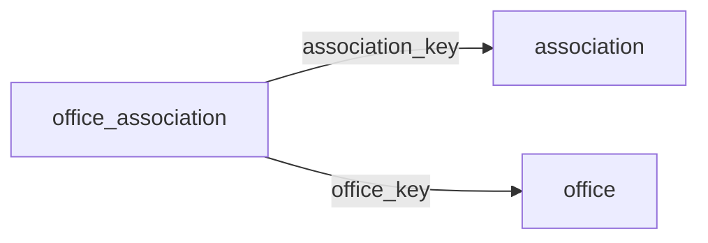

[index](../_index.md) | [lookups](../lookups.md) | [relationships](../relationships.md) | [USAGE.md](../../../USAGE.md)

# `office_association` (OfficeAssociation)

> Joining information relating Office and Association records to each other.

## At a glance

| | |
|---|---|
| **Primary key** | `association_key` *(override; RESO uses `AssociationKey`)* |
| **Fields on dd.reso.org** | 23 |
| **Columns in canonical DBML** | 17 (omits 1 satellite drops + 4 `Resource`-typed + 1 `Collection`-typed) |
| **Foreign keys OUT / IN** | 2 / 0 |
| **Review markers** | 0 |
| **Source** | [https://dd.reso.org/DD2.0/OfficeAssociation/](https://dd.reso.org/DD2.0/OfficeAssociation/) |
| **Last revised upstream** | 7/25/2019 |

## Relationship diagram

## Fields

Columns in their original `dd.reso.org` page order. **Definition** is the verbatim RESO DD prose (full text, not truncated). **Purpose (when to use)** is auto-derived from the field's role + datatype + lookup + status and tells you, in one sentence, what to write into this column. The `Flags` column shows: `pk`, `fk -> target.col` (committed FK in `canonical.dbml`), `[REVIEW]` (Phase 2.5 satellite audit flagged for review), `[dropped]` (omitted from the canonical DBML; satellite of the named FK), `[Resource]` / `[Collection]` (no scalar column in DBML; FK companion - see Refs / inverse-1:N below).

| Field | DBML name | Type | Lookup | Definition | Purpose (when to use) | Flags |
|---|---|---|---|---|---|---|
| `Association` | `association` | Resource |  | The Association of the OfficeAssociation record. | Logical reference to another resource; not stored as a scalar column in DBML. Look at the sibling `*Key` / `*Id` field on this resource for where the actual FK value lives. | `[Resource]` |
| `AssociationKey` | `association_key` | String |  | The unique identifier for the association record. | Unique key for this resource. Use as the FK target whenever another resource references `office_association`. | `pk` `-> association.association_key` |
| `AssociationMlsId` | `association_mls_id` | String |  | The local, well-known identifier for the association of REALTORS®. This value may not be unique, specifically in the case of aggregation systems, and it should be the identifier from the original system. | Free-form text, up to 25 characters. |  |
| `AssociationNationalAssociationId` | `association_national_association_id` | String |  | The national association ID of the association as known by the National Association of REALTORS®. | Free-form text, up to 25 characters. |  |
| `BillStatus` | `bill_status` | String |  | The status of the bill (i.e., Not Billed, Billed, Paid or N, B, P). | Free-form text, up to 25 characters. |  |
| `HistoryTransactional` | `history_transactional` | Collection |  | A collection of history items related to the OfficeAssociation record. | Inverse 1:N: read as 'all `history_transactional` rows that point at this `office_association` row'. Not stored as a column; the FK lives on the child side. | `[Collection]` |
| `JoinDate` | `join_date` | Date |  | The date the office joined the association. | Date (YYYY-MM-DD). |  |
| `ModificationTimestamp` | `modification_timestamp` | Timestamp |  | The date/time the OfficeAssociation record was last modified. | ISO-8601 timestamp (UTC). |  |
| `Office` | `office` | Resource |  | The office of the OfficeAssociation record. | Logical reference to another resource; not stored as a scalar column in DBML. Look at the sibling `*Key` / `*Id` field on this resource for where the actual FK value lives. | `[Resource]` |
| `OfficeAssociationPrimaryIndicator` | `office_association_primary_indicator` | enum | [`office_association_primary_indicator`](../lookups.md#office_association_primary_indicator) | An indicator showing Primary, Secondary or Not Applicable with the association (i.e., P, S, X). | Pick exactly one of 4 values from the lookup (closed list). |  |
| `OfficeAssociationStatus` | `office_association_status` | enum | [`office_status`](../lookups.md#office_status) | The status of the office (i.e., Active, Inactive or Under Disciplinary Action). | Pick exactly one of 2 values from the lookup (closed list). |  |
| `OfficeAssociationStatusDate` | `office_association_status_date` | Date |  | The last time the status field was updated. Used for actual status. | Date (YYYY-MM-DD). |  |
| `OfficeKey` | `office_key` | String |  | A system unique identifier. Specifically, in aggregation systems, the Key is the system unique identifier from the system that the record was just retrieved. This may be identical to the related xxxId identifier, but the key is guaranteed unique for this record set. This is a foreign key relating to the Office Resource's OfficeKey. | Foreign key -> `office.office_key`. Set this to the `office`'s `office_key` to link this row to its parent `office`. | `-> office.office_key` |
| `OfficeMlsId` | `office_mls_id` | String |  | The local, well-known identifier. This value may not be unique, specifically in the case of aggregation systems, and it should be the identifier from the original system. | Do not write. Phase-2.5 satellite of `OfficeKey`; the same value lives on the parent resource and is reachable via the `OfficeKey` FK. | `[dropped: satellite of office_key]` |
| `OriginalEntryTimestamp` | `original_entry_timestamp` | Timestamp |  | The date/time the record was originally input into the source system. | ISO-8601 timestamp (UTC). |  |
| `OriginatingSystem` | `originating_system` | Resource |  | The originating system of the OfficeAssociation record. | Logical reference to another resource; not stored as a scalar column in DBML. Look at the sibling `*Key` / `*Id` field on this resource for where the actual FK value lives. | `[Resource]` |
| `OriginatingSystemId` | `originating_system_id` | String |  | The RESO Unique Organization Identifier (UOI) OrganizationUniqueId of the originating record provider. The originating system is the system with authoritative control over the record (e.g., the name of the MLS where the member was input). In cases where the originating system was not where the record originated (the authoritative system), see the Originating System fields. | Free-form text, up to 25 characters. |  |
| `OriginatingSystemMemberKey` | `originating_system_member_key` | String |  | The system key, a unique record identifier, from the originating system. The originating system is the system with authoritative control over the record (e.g., the MLS where the member was input). There may be cases where the source system (how the record is received) is not the originating system. See Source System Member Key for more information. | Free-form text, up to 255 characters. |  |
| `OriginatingSystemName` | `originating_system_name` | String |  | The name of the originating record provider, most commonly the name of the MLS. The place where the member is originally input by the member. The legal name of the company. | Free-form text, up to 255 characters. |  |
| `SourceSystem` | `source_system` | Resource |  | The source system of the OfficeAssociation record. | Logical reference to another resource; not stored as a scalar column in DBML. Look at the sibling `*Key` / `*Id` field on this resource for where the actual FK value lives. | `[Resource]` |
| `SourceSystemId` | `source_system_id` | String |  | The RESO Unique Organization Identifier (UOI) OrganizationUniqueId of the source record provider. The source system is the system from which the record was directly received. In cases where the source system was not where the record originated (the authoritative system), see the Originating System fields. | Free-form text, up to 25 characters. |  |
| `SourceSystemMemberKey` | `source_system_member_key` | String |  | The system key, a unique record identifier, from the source system. The source system is the system from which the record was directly received. In cases where the source system was not where the record originated (the authoritative system), see the Originating System fields. | Free-form text, up to 255 characters. |  |
| `SourceSystemName` | `source_system_name` | String |  | The name of the immediate record provider. The system from which the record was directly received. The legal name of the company. | Free-form text, up to 255 characters. |  |

## Foreign keys OUT (this resource references)

- `office_association.association_key` -> `association.association_key` (medium)
- `office_association.office_key` -> `office.office_key` (high)

## Foreign keys IN (other resources reference this)

*(none committed)*

## Inverse 1:N (collection-typed companions)

- `history_transactional` -> `history_transactional` (many `history_transactional` per `office_association`)

## Phase 2.5 satellite audit

Recommendations from `raw/satellites.csv`. `drop_from_host` rows are not present in the canonical DBML; `review` rows are kept but flagged; `keep_both` rows are silently kept.

| Column | FK | Recommendation | Notes |
|---|---|---|---|
| `office_association_primary_indicator` | `office_key` -> `office.?` | `keep_both` | no_child_match |
| `office_association_status` | `office_key` -> `office.?` | `keep_both` | no_child_match |
| `office_association_status_date` | `office_key` -> `office.?` | `keep_both` | no_child_match |
| `office_mls_id` | `office_key` -> `office.office_mls_id` | `drop_from_host` | id_suffix_threshold_0.7 |

