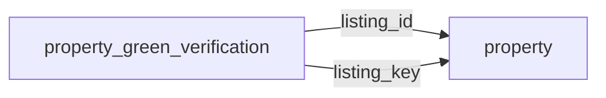

[index](../_index.md) | [lookups](../lookups.md) | [relationships](../relationships.md) | [USAGE.md](../../../USAGE.md)

# `property_green_verification` (PropertyGreenVerification)

> Multiple performance ratings applied to a property listing.

## At a glance

| | |
|---|---|
| **Primary key** | `green_building_verification_key` *(override; RESO uses `GreenBuildingVerificationKey`)* |
| **Fields on dd.reso.org** | 15 |
| **Columns in canonical DBML** | 13 (omits 0 satellite drops + 1 `Resource`-typed + 1 `Collection`-typed) |
| **Foreign keys OUT / IN** | 2 / 0 |
| **Review markers** | 0 |
| **Source** | [https://dd.reso.org/DD2.0/PropertyGreenVerification/](https://dd.reso.org/DD2.0/PropertyGreenVerification/) |
| **Last revised upstream** | 5/24/2017 |

## Relationship diagram

## Fields

Columns in their original `dd.reso.org` page order. **Definition** is the verbatim RESO DD prose (full text, not truncated). **Purpose (when to use)** is auto-derived from the field's role + datatype + lookup + status and tells you, in one sentence, what to write into this column. The `Flags` column shows: `pk`, `fk -> target.col` (committed FK in `canonical.dbml`), `[REVIEW]` (Phase 2.5 satellite audit flagged for review), `[dropped]` (omitted from the canonical DBML; satellite of the named FK), `[Resource]` / `[Collection]` (no scalar column in DBML; FK companion - see Refs / inverse-1:N below).

| Field | DBML name | Type | Lookup | Definition | Purpose (when to use) | Flags |
|---|---|---|---|---|---|---|
| `GreenBuildingVerificationKey` | `green_building_verification_key` | String |  | A unique identifier for this record. This is a string that can include a Uniform Resource Identifier (URI) or other forms. This is the local key of the system. | Unique key for this resource. Use as the FK target whenever another resource references `property_green_verification`. | `pk` |
| `GreenBuildingVerificationType` | `green_building_verification_type` | enum | [`green_building_verification_type`](../lookups.md#green_building_verification_type) | The name of the verification or certification awarded to a new or pre-existing residential or commercial structure (e.g., LEED, ENERGY STAR, ICC-700). | Pick exactly one of 18 values from the lookup (closed list). |  |
| `GreenVerificationBody` | `green_verification_body` | String |  | The name of the body or group providing the verification/certification/rating named in the GreenBuildingVerificationType field. There is almost always a direct correlation between bodies and programs. | Free-form text, up to 50 characters. |  |
| `GreenVerificationMetric` | `green_verification_metric` | Number |  | A final score indicating the performance of energy efficiency design and measures in the home as tested by a third-party rater. Points achieved to earn a certification in the GreenVerificationRating field do not apply to this field. The Home Energy Rating System (HERS) Index is most common with new homes and runs with a lower number being more efficient. A net-zero home uses zero energy and has a HERS score of 0. A home that produces more energy than it uses has a negative score. Home Energy Score is a tool more common for existing homes and runs with a higher number being more efficient. It takes square footage into account and caps with 10 as the highest number of points. | Numeric (integer). |  |
| `GreenVerificationRating` | `green_verification_rating` | String |  | Many verifications or certifications have a rating system that provides an indication of the structure's level of energy efficiency. When expressed in a numeric value, please use the GreenVerificationMetric field. Verifications and certifications can also be a name, such as Gold or Silver, which is the purpose of this field. | Free-form text, up to 50 characters. |  |
| `GreenVerificationSource` | `green_verification_source` | enum | [`green_verification_source`](../lookups.md#green_verification_source) | The source of the green data. It may address photovoltaic characteristics or a verified score, certification, label, etc. This may be a pick list of options showing the source (i.e., Program Sponsor, Program Verifier, Public Record, Assessor, etc.). | Pick exactly one of 10 values from the lookup (closed list). |  |
| `GreenVerificationStatus` | `green_verification_status` | enum | [`green_verification_status`](../lookups.md#green_verification_status) | Many verification programs include a multistep process that may begin with plans and specs, involve testing and/or submission of building specifications along the way, and include a final verification step. When ratings are involved, it is not uncommon for the final rating to be either higher or lower than the target preliminary rating. Sometimes the final approval is not available until after sale and occupancy. Status indicates what the target was at the time of listing and may be updated when verification is complete. To limit liability concerns, this field reflects information that was available at the time of listing or updated later and should be confirmed by the buyer. | Pick exactly one of 2 values from the lookup (closed list). |  |
| `GreenVerificationURL` | `green_verification_url` | String |  | Provides a link to the specific property's high-performance rating or scoring details directly from and hosted by the sponsoring body of the program. It typically provides thorough details, for example, which points were achieved and how, or, in the case of a score, what specifically was tested and the results. | Free-form text, up to 8000 characters. |  |
| `GreenVerificationVersion` | `green_verification_version` | String |  | The version of the green certification or verification that was awarded. Some rating programs have a year, a version or possibly both. | Free-form text, up to 25 characters. |  |
| `GreenVerificationYear` | `green_verification_year` | Number |  | The year the green certification or verification was awarded. | Numeric (integer). |  |
| `HistoryTransactional` | `history_transactional` | Collection |  | The history of the PropertyGreenVerification record. | Inverse 1:N: read as 'all `history_transactional` rows that point at this `property_green_verification` row'. Not stored as a column; the FK lives on the child side. | `[Collection]` |
| `Listing` | `listing` | Resource |  | The listing associated with the PropertyGreenVerification record. | Logical reference to another resource; not stored as a scalar column in DBML. Look at the sibling `*Key` / `*Id` field on this resource for where the actual FK value lives. | `[Resource]` |
| `ListingId` | `listing_id` | String |  | This is the foreign ID relating to the property. The well-known identifier for the listing. The value may be identical to that of the listing key, but the listing ID is intended to be the value used by a human to retrieve the information about a specific listing. In a multiple originating system or a merged system, this value may not be unique and may require the use of the provider system to create a synthetic unique value. | Foreign key -> `property.listing_key`. Set this to the `property`'s `listing_key` to link this row to its parent `property`. | `-> property.listing_key` |
| `ListingKey` | `listing_key` | String |  | This is the foreign key relating to the property. A unique identifier for this record from the immediate source. This is a string that can include a Uniform Resource Identifier (URI) or other forms. This is the local key of the system. When records are received from other systems, a local key is commonly applied. If conveying the original keys from the source or originating systems, see the Property Resource's SourceSystemKey and OriginatingSystemKey. | Foreign key -> `property.listing_key`. Set this to the `property`'s `listing_key` to link this row to its parent `property`. | `-> property.listing_key` |
| `ModificationTimestamp` | `modification_timestamp` | Timestamp |  | The date/time the PropertyGreenVerification record was last modified. | ISO-8601 timestamp (UTC). |  |

## Field disambiguation

Sibling field clusters that an LLM agent commonly confuses. Auto-detected from name shape; resolve which is which by reading each row's full Definition above.

- **`ListingKey` vs `ListingId`**:
  - `ListingKey` - This is the foreign key relating to the property.
  - `ListingId` - This is the foreign ID relating to the property.

## Foreign keys OUT (this resource references)

- `property_green_verification.listing_id` -> `property.listing_key` (medium)
- `property_green_verification.listing_key` -> `property.listing_key` (medium)

## Foreign keys IN (other resources reference this)

*(none committed)*

## Inverse 1:N (collection-typed companions)

- `history_transactional` -> `history_transactional` (many `history_transactional` per `property_green_verification`)

## Phase 2.5 satellite audit

Recommendations from `raw/satellites.csv`. `drop_from_host` rows are not present in the canonical DBML; `review` rows are kept but flagged; `keep_both` rows are silently kept.

| Column | FK | Recommendation | Notes |
|---|---|---|---|
| `listing_id` | `listing_key` -> `property.?` | `keep_both` | no_child_match |

