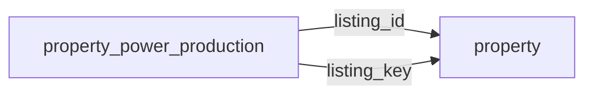

[index](../_index.md) | [lookups](../lookups.md) | [relationships](../relationships.md) | [USAGE.md](../../../USAGE.md)

# `property_power_production` (PropertyPowerProduction)

> Different means of producing power on a property, such as solar and wind systems.

## At a glance

| | |
|---|---|
| **Primary key** | `power_production_key` *(override; RESO uses `PowerProductionKey`)* |
| **Fields on dd.reso.org** | 12 |
| **Columns in canonical DBML** | 10 (omits 0 satellite drops + 1 `Resource`-typed + 1 `Collection`-typed) |
| **Foreign keys OUT / IN** | 2 / 0 |
| **Review markers** | 0 |
| **Source** | [https://dd.reso.org/DD2.0/PropertyPowerProduction/](https://dd.reso.org/DD2.0/PropertyPowerProduction/) |
| **Last revised upstream** | 6/30/2022 |

## Relationship diagram

## Fields

Columns in their original `dd.reso.org` page order. **Definition** is the verbatim RESO DD prose (full text, not truncated). **Purpose (when to use)** is auto-derived from the field's role + datatype + lookup + status and tells you, in one sentence, what to write into this column. The `Flags` column shows: `pk`, `fk -> target.col` (committed FK in `canonical.dbml`), `[REVIEW]` (Phase 2.5 satellite audit flagged for review), `[dropped]` (omitted from the canonical DBML; satellite of the named FK), `[Resource]` / `[Collection]` (no scalar column in DBML; FK companion - see Refs / inverse-1:N below).

| Field | DBML name | Type | Lookup | Definition | Purpose (when to use) | Flags |
|---|---|---|---|---|---|---|
| `HistoryTransactional` | `history_transactional` | Collection |  | The history of the PropertyPowerProduction record. | Inverse 1:N: read as 'all `history_transactional` rows that point at this `property_power_production` row'. Not stored as a column; the FK lives on the child side. | `[Collection]` |
| `Listing` | `listing` | Resource |  | The listing associated with the PropertyPowerProduction record. | Logical reference to another resource; not stored as a scalar column in DBML. Look at the sibling `*Key` / `*Id` field on this resource for where the actual FK value lives. | `[Resource]` |
| `ListingId` | `listing_id` | String |  | This is the foreign ID relating to the Property Resource; the well-known identifier for the listing. The value may be identical to that of the listing key, but the listing ID is intended to be the value used by a human to retrieve the information about a specific listing. In a multiple-originating system or a merged system, this value may not be unique and may require the use of the provider system to create a synthetic unique value. | Foreign key -> `property.listing_key`. Set this to the `property`'s `listing_key` to link this row to its parent `property`. | `-> property.listing_key` |
| `ListingKey` | `listing_key` | String |  | This is the foreign key relating to the Property Resource; the unique identifier for this record from the immediate source. This is a string that can include a Uniform Resource Identifier (URI) or other forms. This is the local key of the system. When records are received from other systems, a local key is commonly applied. If conveying the original keys from the source or originating systems, see the Property Resource's SourceSystemKey and OriginatingSystemKey. | Foreign key -> `property.listing_key`. Set this to the `property`'s `listing_key` to link this row to its parent `property`. | `-> property.listing_key` |
| `ModificationTimestamp` | `modification_timestamp` | Timestamp |  | The date/time the PropertyPowerProduction record was last modified. | ISO-8601 timestamp (UTC). |  |
| `PowerProductionAnnual` | `power_production_annual` | Number |  | The most important metric of a renewables system is the amount of power it produces per year. This number can be actual or estimated. Annual production for systems producing electricity like wind or solar are measured in kilowatt hours (kWh) per year. A kWh is like a measure of the distance traveled per hour for a car - how far did it go over a certain period of time. Annual production is influenced by the size of the system, the conditions (How shady are the trees? How many cloudy days?) and the installation. Sellers typically have access to software that provides historical production totals. | Numeric (integer). |  |
| `PowerProductionAnnualStatus` | `power_production_annual_status` | enum | [`power_production_annual_status`](../lookups.md#power_production_annual_status) | The most important metric of a renewables system is the amount of power it produces per year. This number can be actual, estimated or a combination of each if less than 12 months of actual data is available (any missing months of actual data is extrapolated). This field allows the status of the number shown in the PowerProducationAnnual field to be clarified. | Pick exactly one of 3 values from the lookup (closed list). |  |
| `PowerProductionKey` | `power_production_key` | String |  | A unique identifier for this record. This is a string that can include a Uniform Resource Identifier (URI) or other forms. This is the local key of the system. | Unique key for this resource. Use as the FK target whenever another resource references `property_power_production`. | `pk` |
| `PowerProductionOwnership` | `power_production_ownership` | enum | [`power_production_ownership`](../lookups.md#power_production_ownership) | The ownership of the power production system (e.g., Seller Owned or Third-Party Owned). | Pick exactly one of 2 values from the lookup (closed list). |  |
| `PowerProductionSize` | `power_production_size` | Number |  | The "capacity" of a renewables system. Size is measured in kilowatts (kW) DC (direct current). A kW indicates how much power the system can produce under standard conditions, like the size of a car engine. Renewables systems are sized when they are installed to cover all or a portion of the power needs of the property. Therefore, a system designed to produce 50% of the power needs will be sized smaller than a system on the exact same property designed to produce 100%. Size may be influenced by available space at the property, orientation, landscaping, etc. | Numeric, up to 2 decimal place(s). |  |
| `PowerProductionType` | `power_production_type` | enum | [`power_production_type`](../lookups.md#power_production_type) | A list of the type of power production systems available on the property. | Pick exactly one of 2 values from the lookup (closed list). |  |
| `PowerProductionYearInstall` | `power_production_year_install` | Number |  | The year a renewables system was installed. Ideally, this should be the year the system was interconnected with the grid and began producing power. Renewables systems have a limited lifespan, and recording the year a system was installed helps buyers and appraisers determine the remaining useful life of the system. | Numeric (integer). |  |

## Field disambiguation

Sibling field clusters that an LLM agent commonly confuses. Auto-detected from name shape; resolve which is which by reading each row's full Definition above.

- **`ListingKey` vs `ListingId`**:
  - `ListingKey` - This is the foreign key relating to the Property Resource; the unique identifier for this record from the immediate source.
  - `ListingId` - This is the foreign ID relating to the Property Resource; the well-known identifier for the listing.

## Foreign keys OUT (this resource references)

- `property_power_production.listing_id` -> `property.listing_key` (medium)
- `property_power_production.listing_key` -> `property.listing_key` (medium)

## Foreign keys IN (other resources reference this)

*(none committed)*

## Inverse 1:N (collection-typed companions)

- `history_transactional` -> `history_transactional` (many `history_transactional` per `property_power_production`)

## Phase 2.5 satellite audit

Recommendations from `raw/satellites.csv`. `drop_from_host` rows are not present in the canonical DBML; `review` rows are kept but flagged; `keep_both` rows are silently kept.

| Column | FK | Recommendation | Notes |
|---|---|---|---|
| `listing_id` | `listing_key` -> `property.?` | `keep_both` | no_child_match |

