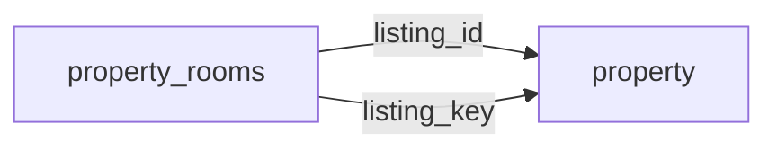

[index](../_index.md) | [lookups](../lookups.md) | [relationships](../relationships.md) | [USAGE.md](../../../USAGE.md)

# `property_rooms` (PropertyRooms)

> Detailed information about separate rooms in a property.

## At a glance

| | |
|---|---|
| **Primary key** | `room_key` *(override; RESO uses `RoomKey`)* |
| **Fields on dd.reso.org** | 19 |
| **Columns in canonical DBML** | 17 (omits 0 satellite drops + 1 `Resource`-typed + 1 `Collection`-typed) |
| **Foreign keys OUT / IN** | 2 / 0 |
| **Review markers** | 0 |
| **Source** | [https://dd.reso.org/DD2.0/PropertyRooms/](https://dd.reso.org/DD2.0/PropertyRooms/) |
| **Last revised upstream** | 8/18/2023 |

## Relationship diagram

## Fields

Columns in their original `dd.reso.org` page order. **Definition** is the verbatim RESO DD prose (full text, not truncated). **Purpose (when to use)** is auto-derived from the field's role + datatype + lookup + status and tells you, in one sentence, what to write into this column. The `Flags` column shows: `pk`, `fk -> target.col` (committed FK in `canonical.dbml`), `[REVIEW]` (Phase 2.5 satellite audit flagged for review), `[dropped]` (omitted from the canonical DBML; satellite of the named FK), `[Resource]` / `[Collection]` (no scalar column in DBML; FK companion - see Refs / inverse-1:N below).

| Field | DBML name | Type | Lookup | Definition | Purpose (when to use) | Flags |
|---|---|---|---|---|---|---|
| `BedroomClosetType` | `bedroom_closet_type` | enum | [`closet_type`](../lookups.md#closet_type) | A list of possible closet types for a bedroom. | Pick exactly one of 3 values from the lookup (closed list). |  |
| `HistoryTransactional` | `history_transactional` | Collection |  | The history of the PropertyRooms record. | Inverse 1:N: read as 'all `history_transactional` rows that point at this `property_rooms` row'. Not stored as a column; the FK lives on the child side. | `[Collection]` |
| `Listing` | `listing` | Resource |  | The listing associated with the PropertyRooms record. | Logical reference to another resource; not stored as a scalar column in DBML. Look at the sibling `*Key` / `*Id` field on this resource for where the actual FK value lives. | `[Resource]` |
| `ListingId` | `listing_id` | String |  | This is the foreign ID relating to the Property Resource. The-well known identifier for the listing. The value may be identical to that of the Listing Key, but the Listing ID is intended to be the value used by a human to retrieve the information about a specific listing. In a multiple-originating or merged system, this value may not be unique and may require the use of the provider system to create a synthetic unique value. | Foreign key -> `property.listing_key`. Set this to the `property`'s `listing_key` to link this row to its parent `property`. | `-> property.listing_key` |
| `ListingKey` | `listing_key` | String |  | This is the foreign key relating to the Property resource. A unique identifier for this record from the immediate source. A string that can include URI or other forms. This is the local key of the system. When records are received from other systems, a local key is commonly applied. If conveying the original keys from the source or originating systems, see the Property Resource's SourceSystemKey and OriginatingSystemKey. | Foreign key -> `property.listing_key`. Set this to the `property`'s `listing_key` to link this row to its parent `property`. | `-> property.listing_key` |
| `ModificationTimestamp` | `modification_timestamp` | Timestamp |  | The date/time the PropertyRooms record was last modified. | ISO-8601 timestamp (UTC). |  |
| `RoomArea` | `room_area` | Number |  | The area of the room being described. Use the RoomAreaUnits field to describe the unit of measurement for the value in this field. | Numeric, up to 2 decimal place(s). |  |
| `RoomAreaSource` | `room_area_source` | enum | [`area_source`](../lookups.md#area_source) | The source of the measurement of the given room's area. | Pick exactly one of 9 values from the lookup (closed list). |  |
| `RoomAreaUnits` | `room_area_units` | enum | [`area_units`](../lookups.md#area_units) | The unit of measurement used for the value in the RoomArea field (e.g., Square Feet, Square Meters). | Pick exactly one of 2 values from the lookup (closed list). |  |
| `RoomDescription` | `room_description` | String |  | A textual description of the given room. | Free-form text, up to 1024 characters. |  |
| `RoomDimensions` | `room_dimensions` | String |  | A textual description of the dimensions of the given room. | Free-form text, up to 50 characters. |  |
| `RoomFeatures` | `room_features` | varchar (multi) | [`interior_or_room_features`](../lookups.md#interior_or_room_features) | A list of features present in the given room. | Pick one or more of 53 values from the lookup (closed list). |  |
| `RoomKey` | `room_key` | String |  | A unique identifier for this record. This is a string that can include a Uniform Resource Identifier (URI) or other forms. This is the local key of the system. | Unique key for this resource. Use as the FK target whenever another resource references `property_rooms`. | `pk` |
| `RoomLength` | `room_length` | Number |  | A numeric representation of the length of the given room. See the RoomLengthWidthUnits field for the unit of measurement used for the length and width. | Numeric, up to 2 decimal place(s). |  |
| `RoomLengthWidthSource` | `room_length_width_source` | enum | [`room_length_width_source`](../lookups.md#room_length_width_source) | The source of the measurement of the given units length and width. | Pick exactly one of 11 values from the lookup (closed list). |  |
| `RoomLengthWidthUnits` | `room_length_width_units` | enum | [`linear_units`](../lookups.md#linear_units) | The unit of measurement used for the value of RoomLength and RoomWidth fields (e.g., Feet, Meters). | Pick exactly one of 2 values from the lookup (closed list). |  |
| `RoomLevel` | `room_level` | enum | [`room_level`](../lookups.md#room_level) | The level within the dwelling on which the given room is located. | Pick exactly one of 7 values from the lookup (closed list). |  |
| `RoomType` | `room_type` | enum | [`room_type`](../lookups.md#room_type) | The type of room being described by the other fields in the PropertyRooms resource. | Pick exactly one of 33 values from the lookup (closed list). |  |
| `RoomWidth` | `room_width` | Number |  | A numeric representation of the width of a given room. See the RoomLengthWidthUnits field for the unit of measurement used for the length and width. | Numeric, up to 2 decimal place(s). |  |

## Field disambiguation

Sibling field clusters that an LLM agent commonly confuses. Auto-detected from name shape; resolve which is which by reading each row's full Definition above.

- **`ListingKey` vs `ListingId`**:
  - `ListingKey` - This is the foreign key relating to the Property resource.
  - `ListingId` - This is the foreign ID relating to the Property Resource.

## Foreign keys OUT (this resource references)

- `property_rooms.listing_id` -> `property.listing_key` (medium)
- `property_rooms.listing_key` -> `property.listing_key` (medium)

## Foreign keys IN (other resources reference this)

*(none committed)*

## Inverse 1:N (collection-typed companions)

- `history_transactional` -> `history_transactional` (many `history_transactional` per `property_rooms`)

## Phase 2.5 satellite audit

Recommendations from `raw/satellites.csv`. `drop_from_host` rows are not present in the canonical DBML; `review` rows are kept but flagged; `keep_both` rows are silently kept.

| Column | FK | Recommendation | Notes |
|---|---|---|---|
| `listing_id` | `listing_key` -> `property.?` | `keep_both` | no_child_match |

