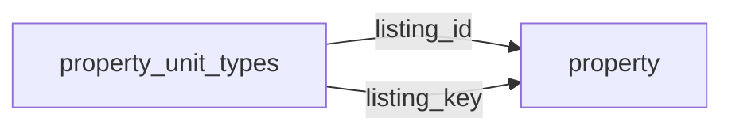

[index](../_index.md) | [lookups](../lookups.md) | [relationships](../relationships.md) | [USAGE.md](../../../USAGE.md)

# `property_unit_types` (PropertyUnitTypes)

> Unit type details for residential income and multifamily properties.

## At a glance

| | |
|---|---|
| **Primary key** | `unit_type_key` *(override; RESO uses `UnitTypeKey`)* |
| **Fields on dd.reso.org** | 17 |
| **Columns in canonical DBML** | 15 (omits 0 satellite drops + 1 `Resource`-typed + 1 `Collection`-typed) |
| **Foreign keys OUT / IN** | 2 / 0 |
| **Review markers** | 0 |
| **Source** | [https://dd.reso.org/DD2.0/PropertyUnitTypes/](https://dd.reso.org/DD2.0/PropertyUnitTypes/) |
| **Last revised upstream** | 5/24/2017 |

## Relationship diagram

## Fields

Columns in their original `dd.reso.org` page order. **Definition** is the verbatim RESO DD prose (full text, not truncated). **Purpose (when to use)** is auto-derived from the field's role + datatype + lookup + status and tells you, in one sentence, what to write into this column. The `Flags` column shows: `pk`, `fk -> target.col` (committed FK in `canonical.dbml`), `[REVIEW]` (Phase 2.5 satellite audit flagged for review), `[dropped]` (omitted from the canonical DBML; satellite of the named FK), `[Resource]` / `[Collection]` (no scalar column in DBML; FK companion - see Refs / inverse-1:N below).

| Field | DBML name | Type | Lookup | Definition | Purpose (when to use) | Flags |
|---|---|---|---|---|---|---|
| `HistoryTransactional` | `history_transactional` | Collection |  | The history of the PropertyUnitTypes record. | Inverse 1:N: read as 'all `history_transactional` rows that point at this `property_unit_types` row'. Not stored as a column; the FK lives on the child side. | `[Collection]` |
| `Listing` | `listing` | Resource |  | The listing associated with the PropertyUnitTypes record. | Logical reference to another resource; not stored as a scalar column in DBML. Look at the sibling `*Key` / `*Id` field on this resource for where the actual FK value lives. | `[Resource]` |
| `ListingId` | `listing_id` | String |  | The foreign ID relating to the Property Resource; the well-known identifier for the listing. The value may be identical to that of the Listing Key, but the Listing ID is intended to be the value used by a human to retrieve the information about a specific listing. In a multiple-originating or merged system, this value may not be unique and may require the use of the provider system to create a synthetic unique value. | Foreign key -> `property.listing_key`. Set this to the `property`'s `listing_key` to link this row to its parent `property`. | `-> property.listing_key` |
| `ListingKey` | `listing_key` | String |  | The foreign key relating to the Property Resource; a unique identifier for this record from the immediate source; a string that can include a Uniform Resource Identifier (URI) or other forms. This is the local key of the system. When records are received from other systems, a local key is commonly applied. If conveying the original keys from the source or originating systems, see the Property Resource's SourceSystemKey and OriginatingSystemKey. | Foreign key -> `property.listing_key`. Set this to the `property`'s `listing_key` to link this row to its parent `property`. | `-> property.listing_key` |
| `ModificationTimestamp` | `modification_timestamp` | Timestamp |  | The date/time the PropertyUnitTypes record was last modified. | ISO-8601 timestamp (UTC). |  |
| `UnitTypeActualRent` | `unit_type_actual_rent` | Number |  | The actual rent per month being collected for a given type of unit. | Numeric, up to 2 decimal place(s). |  |
| `UnitTypeBathsTotal` | `unit_type_baths_total` | Number |  | The total number of baths for a given type of unit. | Numeric (integer). |  |
| `UnitTypeBedsTotal` | `unit_type_beds_total` | Number |  | The total number of bedrooms for a given type of unit. | Numeric (integer). |  |
| `UnitTypeDescription` | `unit_type_description` | String |  | A textual description of a given type of unit. | Free-form text, up to 1024 characters. |  |
| `UnitTypeFurnished` | `unit_type_furnished` | enum | [`furnished`](../lookups.md#furnished) | The level of furnishing for a given type of unit (i.e., Furnished, Partial or Unfurnished). | Pick exactly one of 4 values from the lookup (closed list). |  |
| `UnitTypeGarageAttachedYN` | `unit_type_garage_attached_yn` | Boolean |  | Answers whether or not the given type of unit has an attached garage. | Nullable boolean flag (true / false / null = unknown). |  |
| `UnitTypeGarageSpaces` | `unit_type_garage_spaces` | Number |  | The number of garage spaces included with the given type of unit. | Numeric, up to 2 decimal place(s). |  |
| `UnitTypeKey` | `unit_type_key` | String |  | A unique identifier for this record. This is a string that can include a Uniform Resource Identifier (URI) or other forms. This is the local key of the system. | Unique key for this resource. Use as the FK target whenever another resource references `property_unit_types`. | `pk` |
| `UnitTypeProForma` | `unit_type_pro_forma` | Number |  | The pro forma rent or the expected rental income from the given type of unit. This may vary from actual rent, which can be affected by factors other than current market value. | Numeric (integer). |  |
| `UnitTypeTotalRent` | `unit_type_total_rent` | Number |  | The total actual rent is the sum of all rent being collected for all units of the given type. For example, if you had five units of a particular type, each collecting $1,000, the total actual rent would be $5,000. | Numeric, up to 2 decimal place(s). |  |
| `UnitTypeType` | `unit_type_type` | enum | [`unit_type_type`](../lookups.md#unit_type_type) | A list of possible unit types (e.g., 1 Bedroom, 2 Bedroom, 3 Bedroom, Studio, Loft). | Pick exactly one of 10 values from the lookup (closed list). |  |
| `UnitTypeUnitsTotal` | `unit_type_units_total` | Number |  | The total number of units of the given type. | Numeric (integer). |  |

## Field disambiguation

Sibling field clusters that an LLM agent commonly confuses. Auto-detected from name shape; resolve which is which by reading each row's full Definition above.

- **`ListingKey` vs `ListingId`**:
  - `ListingKey` - The foreign key relating to the Property Resource; a unique identifier for this record from the immediate source; a string that can include a Uniform Resource Identifier (URI) or other forms.
  - `ListingId` - The foreign ID relating to the Property Resource; the well-known identifier for the listing.

## Foreign keys OUT (this resource references)

- `property_unit_types.listing_id` -> `property.listing_key` (medium)
- `property_unit_types.listing_key` -> `property.listing_key` (medium)

## Foreign keys IN (other resources reference this)

*(none committed)*

## Inverse 1:N (collection-typed companions)

- `history_transactional` -> `history_transactional` (many `history_transactional` per `property_unit_types`)

## Phase 2.5 satellite audit

Recommendations from `raw/satellites.csv`. `drop_from_host` rows are not present in the canonical DBML; `review` rows are kept but flagged; `keep_both` rows are silently kept.

| Column | FK | Recommendation | Notes |
|---|---|---|---|
| `listing_id` | `listing_key` -> `property.?` | `keep_both` | no_child_match |

