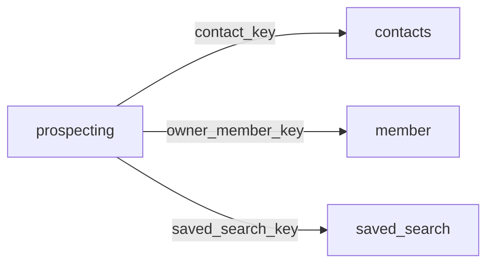

[index](../_index.md) | [lookups](../lookups.md) | [relationships](../relationships.md) | [USAGE.md](../../../USAGE.md)

# `prospecting` (Prospecting)

> Automatic email connecting Contacts and SavedSearch resources to send results matching saved search criteria.

## At a glance

| | |
|---|---|
| **Primary key** | `prospecting_key` |
| **Fields on dd.reso.org** | 31 |
| **Columns in canonical DBML** | 26 (omits 0 satellite drops + 3 `Resource`-typed + 2 `Collection`-typed) |
| **Foreign keys OUT / IN** | 3 / 0 |
| **Review markers** | 0 |
| **Source** | [https://dd.reso.org/DD2.0/Prospecting/](https://dd.reso.org/DD2.0/Prospecting/) |
| **Last revised upstream** | 5/2/2017 |

## Relationship diagram

## Fields

Columns in their original `dd.reso.org` page order. **Definition** is the verbatim RESO DD prose (full text, not truncated). **Purpose (when to use)** is auto-derived from the field's role + datatype + lookup + status and tells you, in one sentence, what to write into this column. The `Flags` column shows: `pk`, `fk -> target.col` (committed FK in `canonical.dbml`), `[REVIEW]` (Phase 2.5 satellite audit flagged for review), `[dropped]` (omitted from the canonical DBML; satellite of the named FK), `[Resource]` / `[Collection]` (no scalar column in DBML; FK companion - see Refs / inverse-1:N below).

| Field | DBML name | Type | Lookup | Definition | Purpose (when to use) | Flags |
|---|---|---|---|---|---|---|
| `ActiveYN` | `active_yn` | Boolean |  | If set to True, the given automated email is active. False records may be disabled or waiting activation. | Nullable boolean flag (true / false / null = unknown). |  |
| `BccEmailList` | `bcc_email_list` | String |  | A comma-separated list of email addresses that are the blind carbon copy (Bcc) address that the automated emails are being sent to. | Free-form text, up to 1024 characters. |  |
| `BccMeYN` | `bcc_me_yn` | Boolean |  | When set to True, the automated mail is also sent as a blind carbon copy (Bcc) to the member who created the automated email. | Nullable boolean flag (true / false / null = unknown). |  |
| `CcEmailList` | `cc_email_list` | String |  | A comma-separated list of email addresses that are the carbon copy (Cc) address that the automated emails are being sent to. | Free-form text, up to 1024 characters. |  |
| `ClientActivatedYN` | `client_activated_yn` | Boolean |  | If set to True, the client has clicked through to accept automatic emails. Recipient acceptance is an important part of CAN-SPAM and other automated bulk email regulations. | Nullable boolean flag (true / false / null = unknown). |  |
| `ConciergeNotificationsYN` | `concierge_notifications_yn` | Boolean |  | If set to True, notifications are to be sent to the member when the auto email is in Concierge mode. | Nullable boolean flag (true / false / null = unknown). |  |
| `ConciergeYN` | `concierge_yn` | Boolean |  | When set to True, the automated mail is in Concierge mode and is to be approved by the member before being sent to the client. | Nullable boolean flag (true / false / null = unknown). |  |
| `Contact` | `contact` | Resource |  | The prospecting Contact record. | Logical reference to another resource; not stored as a scalar column in DBML. Look at the sibling `*Key` / `*Id` field on this resource for where the actual FK value lives. | `[Resource]` |
| `ContactKey` | `contact_key` | String |  | This is the foreign key relating to the Contacts Resource. A unique identifier for this record from the immediate source. This is a string that can include a Uniform Resource Identifier (URI) or other forms. This is the local key of the system. When records are received from other systems, a local key is commonly applied. If conveying the original keys from the source or originating systems, see SourceSystemKey and OriginatingSystemKey variants. | Foreign key -> `contacts.contact_key`. Set this to the `contacts`'s `contact_key` to link this row to its parent `contacts`. | `-> contacts.contact_key` |
| `DailySchedule` | `daily_schedule` | varchar (multi) | [`daily_schedule`](../lookups.md#daily_schedule) | When Daily is selected as the ScheduleType, a list of days of the week and AM or PM options. | Pick one or more of 15 values from the lookup (closed list). |  |
| `DisplayTemplateID` | `display_template_id` | String |  | The system ID of the display that has been related or set as the default to this saved search. | Free-form text, up to 25 characters. |  |
| `HistoryTransactional` | `history_transactional` | Collection |  | The history of the Prospecting record. | Inverse 1:N collection; the FK is declared on the child resource, not here. | `[Collection]` |
| `Language` | `language` | enum | [`languages`](../lookups.md#languages) | The language that will be used in the given automated email. | Pick exactly one of 190 values from the lookup (closed list). |  |
| `LastNewChangedTimestamp` | `last_new_changed_timestamp` | Timestamp |  | The timestamp of when the prospector last found new or modified listings for an automated email. | ISO-8601 timestamp (UTC). |  |
| `LastViewedTimestamp` | `last_viewed_timestamp` | Timestamp |  | A timestamp of when the automated email was last viewed by the client in the portal. | ISO-8601 timestamp (UTC). |  |
| `Media` | `media` | Collection |  | The media related to the Prospecting record. | Inverse 1:N collection; the FK is declared on the child resource, not here. | `[Collection]` |
| `MessageNew` | `message_new` | String |  | The body of the automated email message when the first email is sent for the prospecting campaign. | Free-form text, up to 4000 characters. |  |
| `MessageRevise` | `message_revise` | String |  | The body of the automated email message to be used when the criteria or settings of an automated email has been modified. | Free-form text, up to 4000 characters. |  |
| `MessageUpdate` | `message_update` | String |  | The body of the automated email message for subsequent email messages after the first email is sent. If a first email option isn't used, this field is used for all emails, including the first. | Free-form text, up to 4000 characters. |  |
| `ModificationTimestamp` | `modification_timestamp` | Timestamp |  | The date/time the Prospecting record was last modified. | ISO-8601 timestamp (UTC). |  |
| `NextSendTimestamp` | `next_send_timestamp` | Timestamp |  | A timestamp of when the automated email is schedule to next send. | ISO-8601 timestamp (UTC). |  |
| `OwnerMember` | `owner_member` | Resource |  | The member who owns the Prospecting record. | Logical reference to another resource; not stored as a scalar column in DBML. Look at the sibling `*Key` / `*Id` field on this resource for where the actual FK value lives. | `[Resource]` |
| `OwnerMemberID` | `owner_member_id` | String |  | The local, well-known identifier for the member owning the contact. | Free-form text, up to 25 characters. |  |
| `OwnerMemberKey` | `owner_member_key` | String |  | The unique identifier (key) of the member owning the contact. This is a foreign key relating to the Member Resource's MemberKey. | Foreign key -> `member.member_key`. Set this to the `member`'s `member_key` to link this row to its parent `member`. | `-> member.member_key` |
| `ProspectingKey` | `prospecting_key` | String |  | A unique identifier for this record from the immediate source. This is a string that can include a Uniform Resource Identifier (URI) or other forms. This is the local key of the system. When records are received from other systems, a local key is commonly applied. If conveying the original keys from the source or originating systems, see SourceSystemKey and OriginatingSystemKey variants. | Unique key for this resource. Use as the FK target whenever another resource references `prospecting`. | `pk` |
| `ReasonActiveOrDisabled` | `reason_active_or_disabled` | enum | [`reason_active_or_disabled`](../lookups.md#reason_active_or_disabled) | A list of reasons the automated email was set to inactive or set back to active (e.g., Agent Disabled, Over Limit, No Listings Found, Reactivated, Client Disabled). | Pick exactly one of 16 values from the lookup (closed list). |  |
| `SavedSearch` | `saved_search` | Resource |  | The saved search associated with the Prospecting record. | Logical reference to another resource; not stored as a scalar column in DBML. Look at the sibling `*Key` / `*Id` field on this resource for where the actual FK value lives. | `[Resource]` |
| `SavedSearchKey` | `saved_search_key` | String |  | This is the foreign key relating to the SavedSearch Resource. A unique identifier for this record from the immediate source. This is a string that can include a Uniform Resource Identifier (URI) or other forms. This is the local key of the system. When records are received from other systems, a local key is commonly applied. If conveying the original keys from the source or originating systems, see SourceSystemKey and OriginatingSystemKey variants. | Foreign key -> `saved_search.saved_search_key`. Set this to the `saved_search`'s `saved_search_key` to link this row to its parent `saved_search`. | `-> saved_search.saved_search_key` |
| `ScheduleType` | `schedule_type` | enum | [`schedule_type`](../lookups.md#schedule_type) | A selection of the type of schedule that the automated email will be sent (i.e., Daily, Monthly or ASAP). | Pick exactly one of 3 values from the lookup (closed list). |  |
| `Subject` | `subject` | String |  | The subject line of the automated email being sent. | Free-form text, up to 255 characters. |  |
| `ToEmailList` | `to_email_list` | String |  | A comma-separated list of email addresses that are the "To" address the automated emails are being sent to. | Free-form text, up to 1024 characters. |  |

## Foreign keys OUT (this resource references)

- `prospecting.contact_key` -> `contacts.contact_key` (medium)
- `prospecting.owner_member_key` -> `member.member_key` (high)
- `prospecting.saved_search_key` -> `saved_search.saved_search_key` (high)

## Foreign keys IN (other resources reference this)

*(none committed)*

