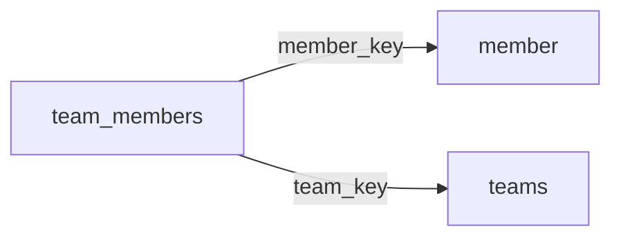

[index](../_index.md) | [lookups](../lookups.md) | [relationships](../relationships.md) | [USAGE.md](../../../USAGE.md)

# `team_members` (TeamMembers)

> Fields tying Member records to related Teams records.

## At a glance

| | |
|---|---|
| **Primary key** | `team_member_key` |
| **Fields on dd.reso.org** | 21 |
| **Columns in canonical DBML** | 15 (omits 2 satellite drops + 3 `Resource`-typed + 1 `Collection`-typed) |
| **Foreign keys OUT / IN** | 2 / 0 |
| **Review markers** | 0 |
| **Source** | [https://dd.reso.org/DD2.0/TeamMembers/](https://dd.reso.org/DD2.0/TeamMembers/) |
| **Last revised upstream** | 9/24/2015 |

## Relationship diagram

## Fields

Columns in their original `dd.reso.org` page order. **Definition** is the verbatim RESO DD prose (full text, not truncated). **Purpose (when to use)** is auto-derived from the field's role + datatype + lookup + status and tells you, in one sentence, what to write into this column. The `Flags` column shows: `pk`, `fk -> target.col` (committed FK in `canonical.dbml`), `[REVIEW]` (Phase 2.5 satellite audit flagged for review), `[dropped]` (omitted from the canonical DBML; satellite of the named FK), `[Resource]` / `[Collection]` (no scalar column in DBML; FK companion - see Refs / inverse-1:N below).

| Field | DBML name | Type | Lookup | Definition | Purpose (when to use) | Flags |
|---|---|---|---|---|---|---|
| `HistoryTransactional` | `history_transactional` | Collection |  | The history of the TeamMembers record. | Inverse 1:N: read as 'all `history_transactional` rows that point at this `team_members` row'. Not stored as a column; the FK lives on the child side. | `[Collection]` |
| `Member` | `member` | Resource |  | The member belonging to the TeamMembers record. | Logical reference to another resource; not stored as a scalar column in DBML. Look at the sibling `*Key` / `*Id` field on this resource for where the actual FK value lives. | `[Resource]` |
| `MemberKey` | `member_key` | String |  | A system unique identifier. Specifically, the foreign key relating to the Member Resource's MemberKey. | Foreign key -> `member.member_key`. Set this to the `member`'s `member_key` to link this row to its parent `member`. | `-> member.member_key` |
| `MemberLoginId` | `member_login_id` | String |  | The ID used to log on to the MLS system. | Do not write. Phase-2.5 satellite of `MemberKey`; the same value lives on the parent resource and is reachable via the `MemberKey` FK. | `[dropped: satellite of member_key]` |
| `MemberMlsId` | `member_mls_id` | String |  | The local, well-known identifier for the member. This value may not be unique, specifically in the case of aggregation systems, and it should be the identifier from the original system. | Do not write. Phase-2.5 satellite of `MemberKey`; the same value lives on the parent resource and is reachable via the `MemberKey` FK. | `[dropped: satellite of member_key]` |
| `ModificationTimestamp` | `modification_timestamp` | Timestamp |  | The date/time the roster (member or office) record was last modified. | ISO-8601 timestamp (UTC). |  |
| `OriginalEntryTimestamp` | `original_entry_timestamp` | Timestamp |  | Date/time the roster (member or office) record was originally input into the source system. | ISO-8601 timestamp (UTC). |  |
| `OriginatingSystem` | `originating_system` | Resource |  | The originating system of the TeamMembers record. | Logical reference to another resource; not stored as a scalar column in DBML. Look at the sibling `*Key` / `*Id` field on this resource for where the actual FK value lives. | `[Resource]` |
| `OriginatingSystemID` | `originating_system_id` | String |  | The RESO Unique Organization Identifier (UOI) OrganizationUniqueId of the originating record provider. The originating system is the system with authoritative control over the record (e.g., the name of the MLS where the team member was input). In cases where the originating system was not where the record originated (the authoritative system), see the Originating System fields. | Free-form text, up to 25 characters. |  |
| `OriginatingSystemKey` | `originating_system_key` | String |  | The system key, a unique record identifier, from the originating system. The originating system is the system with authoritative control over the record (e.g., the MLS where the team member was input). There may be cases where the source system (how the record is received) is not the originating system. See Source System Key for more information. | Free-form text, up to 255 characters. |  |
| `OriginatingSystemName` | `originating_system_name` | String |  | The name of the originating record provider, most commonly the name of the MLS. The place where the team member is originally input. The legal name of the company. | Free-form text, up to 255 characters. |  |
| `SourceSystem` | `source_system` | Resource |  | The source system of the TeamMembers record. | Logical reference to another resource; not stored as a scalar column in DBML. Look at the sibling `*Key` / `*Id` field on this resource for where the actual FK value lives. | `[Resource]` |
| `SourceSystemID` | `source_system_id` | String |  | The RESO Unique Organization Identifier (UOI) OrganizationUniqueId of the source record provider. The source system is the system from which the record was directly received. In cases where the source system was not where the record originated (the authoritative system), see the Originating System fields. | Free-form text, up to 25 characters. |  |
| `SourceSystemKey` | `source_system_key` | String |  | The system key, a unique record identifier, from the source system. The source system is the system from which the record was directly received. In cases where the source system was not where the record originated (the authoritative system), see the Originating System fields. | Free-form text, up to 255 characters. |  |
| `SourceSystemName` | `source_system_name` | String |  | The name of the team member record provider. The system from which the record was directly received. The legal name of the company. | Free-form text, up to 255 characters. |  |
| `TeamImpersonationLevel` | `team_impersonation_level` | enum | [`team_impersonation_level`](../lookups.md#team_impersonation_level) | The level of impersonation the member is allowed within the team (i.e., Impersonate (to work as the team), On Behalf (to show the team name but also show the member's info), None (don't allow this member to appear as part of team)). | Free-form string; the lookup is jurisdiction-defined (no closed value list). |  |
| `TeamKey` | `team_key` | String |  | A system unique identifier. Specifically, a foreign key referencing the Teams Resource's primary key. | Foreign key -> `teams.team_key`. Set this to the `teams`'s `team_key` to link this row to its parent `teams`. | `-> teams.team_key` |
| `TeamMemberKey` | `team_member_key` | String |  | A system unique identifier. Specifically, the local key to the TeamMembers resource. | Unique key for this resource. Use as the FK target whenever another resource references `team_members`. | `pk` |
| `TeamMemberNationalAssociationId` | `team_member_national_association_id` | String |  | The national association ID of the member (e.g., in the U.S., this is an M1 or NRDS number). | Free-form text, up to 25 characters. |  |
| `TeamMemberStateLicense` | `team_member_state_license` | String |  | The license of the member. Multiple licenses should be separated with a comma and space. | Free-form text, up to 50 characters. |  |
| `TeamMemberType` | `team_member_type` | enum | [`team_member_type`](../lookups.md#team_member_type) | The role of the member within the team (e.g., Team Lead, Showing Agent, Buyer Agent). | Pick exactly one of 10 values from the lookup (closed list). |  |

## Foreign keys OUT (this resource references)

- `team_members.member_key` -> `member.member_key` (high)
- `team_members.team_key` -> `teams.team_key` (medium)

## Foreign keys IN (other resources reference this)

*(none committed)*

## Inverse 1:N (collection-typed companions)

- `history_transactional` -> `history_transactional` (many `history_transactional` per `team_members`)

## Phase 2.5 satellite audit

Recommendations from `raw/satellites.csv`. `drop_from_host` rows are not present in the canonical DBML; `review` rows are kept but flagged; `keep_both` rows are silently kept.

| Column | FK | Recommendation | Notes |
|---|---|---|---|
| `member_login_id` | `member_key` -> `member.member_login_id` | `drop_from_host` | id_suffix_threshold_0.7 |
| `member_mls_id` | `member_key` -> `member.member_mls_id` | `drop_from_host` | id_suffix_threshold_0.7 |
| `team_impersonation_level` | `team_key` -> `teams.?` | `keep_both` | no_child_match |
| `team_member_key` | `team_key` -> `teams.?` | `keep_both` | no_child_match |
| `team_member_state_license` | `team_key` -> `teams.?` | `keep_both` | no_child_match |
| `team_member_type` | `team_key` -> `teams.?` | `keep_both` | no_child_match |

