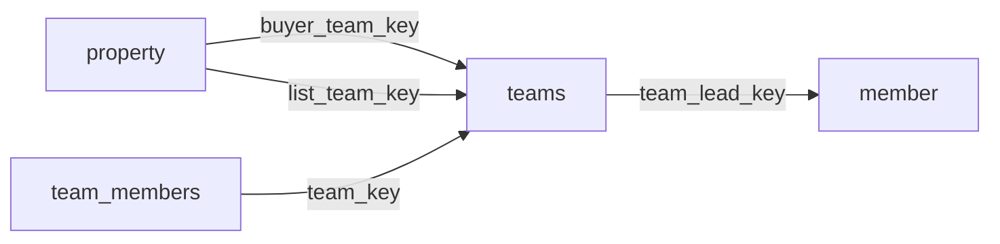

[index](../_index.md) | [lookups](../lookups.md) | [relationships](../relationships.md) | [USAGE.md](../../../USAGE.md)

# `teams` (Teams)

> Name and other information about teams of members who work together.

## At a glance

| | |
|---|---|
| **Primary key** | `team_key` |
| **Fields on dd.reso.org** | 45 |
| **Columns in canonical DBML** | 39 (omits 0 satellite drops + 3 `Resource`-typed + 3 `Collection`-typed) |
| **Foreign keys OUT / IN** | 1 / 3 |
| **Review markers** | 0 |
| **Source** | [https://dd.reso.org/DD2.0/Teams/](https://dd.reso.org/DD2.0/Teams/) |
| **Last revised upstream** | 9/24/2015 |

## Relationship diagram

## Fields

Columns in their original `dd.reso.org` page order. **Definition** is the verbatim RESO DD prose (full text, not truncated). **Purpose (when to use)** is auto-derived from the field's role + datatype + lookup + status and tells you, in one sentence, what to write into this column. The `Flags` column shows: `pk`, `fk -> target.col` (committed FK in `canonical.dbml`), `[REVIEW]` (Phase 2.5 satellite audit flagged for review), `[dropped]` (omitted from the canonical DBML; satellite of the named FK), `[Resource]` / `[Collection]` (no scalar column in DBML; FK companion - see Refs / inverse-1:N below).

| Field | DBML name | Type | Lookup | Definition | Purpose (when to use) | Flags |
|---|---|---|---|---|---|---|
| `HistoryTransactional` | `history_transactional` | Collection |  | The history of the Teams record. | Inverse 1:N: read as 'all `history_transactional` rows that point at this `teams` row'. Not stored as a column; the FK lives on the child side. | `[Collection]` |
| `Media` | `media` | Collection |  | The media associated with the Teams record. | Inverse 1:N: read as 'all `media` rows that point at this `teams` row'. Not stored as a column; the FK lives on the child side. | `[Collection]` |
| `ModificationTimestamp` | `modification_timestamp` | Timestamp |  | The date/time the roster (team or office) record was last modified. | ISO-8601 timestamp (UTC). |  |
| `OriginalEntryTimestamp` | `original_entry_timestamp` | Timestamp |  | The date/time the roster (team or office) record was originally input into the source system. | ISO-8601 timestamp (UTC). |  |
| `OriginatingSystem` | `originating_system` | Resource |  | The originating system of the Teams record. | Logical reference to another resource; not stored as a scalar column in DBML. Look at the sibling `*Key` / `*Id` field on this resource for where the actual FK value lives. | `[Resource]` |
| `OriginatingSystemID` | `originating_system_id` | String |  | The RESO Unique Organization Identifier's (UOI) OrganizationUniqueId of the originating record provider. The originating system is the system with authoritative control over the record (e.g., the name of the MLS where the team was input). In cases where the originating system was not where the record originated (the authoritative system), see the Originating System fields. | Free-form text, up to 25 characters. |  |
| `OriginatingSystemKey` | `originating_system_key` | String |  | The system key, a unique record identifier, from the originating system. The originating system is the system with authoritative control over the record (e.g., the MLS where the team was input). There may be cases where the source system (how the record is received) is not the originating system. See Source System Key for more information. | Free-form text, up to 255 characters. |  |
| `OriginatingSystemName` | `originating_system_name` | String |  | The name of the originating record provider, most commonly the name of the MLS. The place where the team is originally input. The legal name of the company. | Free-form text, up to 255 characters. |  |
| `SocialMediaType` | `social_media_type` | enum | [`social_media_type`](../lookups.md#social_media_type) | A list of types of sites or social media that the team Uniform Resource Locator (URL) or ID is referring to (e.g., website, blog, Facebook, Twitter, LinkedIn, Instagram). | Pick exactly one of 17 values from the lookup (closed list). |  |
| `SourceSystem` | `source_system` | Resource |  | The source system of the Teams record. | Logical reference to another resource; not stored as a scalar column in DBML. Look at the sibling `*Key` / `*Id` field on this resource for where the actual FK value lives. | `[Resource]` |
| `SourceSystemID` | `source_system_id` | String |  | The RESO Unique Organization Identifier's (UOI) OrganizationUniqueId of the source record provider. The source system is the system from which the record was directly received. In cases where the source system was not where the record originated (the authoritative system), see the Originating System fields. | Free-form text, up to 25 characters. |  |
| `SourceSystemKey` | `source_system_key` | String |  | The system key, a unique record identifier, from the source system. The source system is the system from which the record was directly received. In cases where the source system was not where the record originated (the authoritative system), see the Originating System fields. | Free-form text, up to 255 characters. |  |
| `SourceSystemName` | `source_system_name` | String |  | The name of the team record provider. The system from which the record was directly received. The legal name of the company. | Free-form text, up to 255 characters. |  |
| `TeamAddress1` | `team_address1` | String |  | The street number, direction, name and suffix of the team. | Free-form text, up to 50 characters. |  |
| `TeamAddress2` | `team_address2` | String |  | The unit/suite number of the team. | Free-form text, up to 50 characters. |  |
| `TeamCarrierRoute` | `team_carrier_route` | String |  | The group of addresses to which the U.S. Postal Service (USPS) assigns the same code to aid in mail delivery. For the USPS, these codes are 9 digits: 5 numbers for the ZIP Code, one letter for the carrier route type, and 3 numbers for the carrier route number. | Free-form text, up to 9 characters. |  |
| `TeamCity` | `team_city` | String |  | The city of the team. | Free-form text, up to 50 characters. |  |
| `TeamCountry` | `team_country` | enum | [`country`](../lookups.md#country) | The country abbreviation in a postal address. | Pick exactly one of 246 values from the lookup (closed list). |  |
| `TeamCountyOrParish` | `team_county_or_parish` | enum | [`county_or_parish`](../lookups.md#county_or_parish) | The county or parish in which the team is addressed. | Free-form string; the lookup is jurisdiction-defined (no closed value list). |  |
| `TeamDescription` | `team_description` | String |  | A description or marketing information about the team. | Free-form text, up to 1024 characters. |  |
| `TeamDirectPhone` | `team_direct_phone` | String |  | North American 10-digit phone numbers should be in the format of ###-###-#### (separated by hyphens). Other conventions should use the common local standard. International numbers should be preceded by a plus symbol. | Free-form text, up to 16 characters. |  |
| `TeamEmail` | `team_email` | String |  | The email address of the team. | Free-form text, up to 80 characters. |  |
| `TeamFax` | `team_fax` | String |  | North American 10-digit phone numbers should be in the format of ###-###-#### (separated by hyphens). Other conventions should use the common local standard. International numbers should be preceded by a plus symbol. | Free-form text, up to 16 characters. |  |
| `TeamKey` | `team_key` | String |  | A system unique identifier. Specifically, in aggregation systems, the TeamKey is the system unique identifier from the system where the record was retrieved. | Unique key for this resource. Use as the FK target whenever another resource references `teams`. | `pk` |
| `TeamLead` | `team_lead` | Resource |  | The team lead for the given team. | Logical reference to another resource; not stored as a scalar column in DBML. Look at the sibling `*Key` / `*Id` field on this resource for where the actual FK value lives. | `[Resource]` |
| `TeamLeadKey` | `team_lead_key` | String |  | The unique system identifier of the team's lead member. | Foreign key -> `member.member_key`. Set this to the `member`'s `member_key` to link this row to its parent `member`. | `-> member.member_key` |
| `TeamLeadLoginId` | `team_lead_login_id` | String |  | The ID used to log on to the MLS system. | Free-form text, up to 25 characters. |  |
| `TeamLeadMlsId` | `team_lead_mls_id` | String |  | The local, well-known identifier for the team lead. This value may not be unique, specifically in the case of aggregation systems, and it should be the identifier from the original system. | Free-form text, up to 25 characters. |  |
| `TeamLeadNationalAssociationId` | `team_lead_national_association_id` | String |  | The national association ID of the team lead (i.e., NRDS number in the U.S.). | Free-form text, up to 25 characters. |  |
| `TeamLeadStateLicense` | `team_lead_state_license` | String |  | The license of the team lead. Multiple licenses should be separated with a comma and space. | Free-form text, up to 50 characters. |  |
| `TeamLeadStateLicenseState` | `team_lead_state_license_state` | enum | [`state_or_province`](../lookups.md#state_or_province) | The state in which the team lead is licensed. | Pick exactly one of 65 values from the lookup (closed list). |  |
| `TeamMobilePhone` | `team_mobile_phone` | String |  | North American 10-digit phone numbers should be in the format of ###-###-#### (separated by hyphens). Other conventions should use the common local standard. International numbers should be preceded by a plus symbol. | Free-form text, up to 16 characters. |  |
| `TeamName` | `team_name` | String |  | The name under which the team operates. If a business, this may be a DBA (doing business as). | Free-form text, up to 50 characters. |  |
| `TeamOfficePhone` | `team_office_phone` | String |  | North American 10-digit phone numbers should be in the format of ###-###-#### (separated by hyphens). Other conventions should use the common local standard. International numbers should be preceded by a plus symbol. | Free-form text, up to 16 characters. |  |
| `TeamOfficePhoneExt` | `team_office_phone_ext` | String |  | The extension of the given phone number, if applicable. | Free-form text, up to 10 characters. |  |
| `TeamPostalCode` | `team_postal_code` | String |  | The postal code of the team. | Free-form text, up to 10 characters. |  |
| `TeamPostalCodePlus4` | `team_postal_code_plus4` | String |  | The four-digit extension of the U.S. Zip Code. | Free-form text, up to 4 characters. |  |
| `TeamPreferredPhone` | `team_preferred_phone` | String |  | North American 10-digit phone numbers should be in the format of ###-###-#### (separated by hyphens). Other conventions should use the common local standard. International numbers should be preceded by a plus symbol. | Free-form text, up to 16 characters. |  |
| `TeamPreferredPhoneExt` | `team_preferred_phone_ext` | String |  | The extension of the given phone number, if applicable. | Free-form text, up to 10 characters. |  |
| `TeamStateOrProvince` | `team_state_or_province` | enum | [`state_or_province`](../lookups.md#state_or_province) | The state or province in which the team is addressed. | Pick exactly one of 65 values from the lookup (closed list). |  |
| `TeamStatus` | `team_status` | enum | [`team_status`](../lookups.md#team_status) | Determines whether the account is active, inactive or under disciplinary action. | Pick exactly one of 2 values from the lookup (closed list). |  |
| `TeamTollFreePhone` | `team_toll_free_phone` | String |  | North American 10-digit phone numbers should be in the format of ###-###-#### (separated by hyphens). Other conventions should use the common local standard. International numbers should be preceded by a plus symbol. | Free-form text, up to 16 characters. |  |
| `TeamVoiceMail` | `team_voice_mail` | String |  | North American 10-digit phone numbers should be in the format of ###-###-#### (separated by hyphens). Other conventions should use the common local standard. International numbers should be preceded by a plus symbol. | Free-form text, up to 16 characters. |  |
| `TeamVoiceMailExt` | `team_voice_mail_ext` | String |  | The extension of the given phone number, if applicable. | Free-form text, up to 10 characters. |  |
| `TeamsSocialMedia` | `teams_social_media` | Collection |  | A collection of the types of social media fields available for this team. The collection includes the type of system and other details pertinent about social media | Inverse 1:N: read as 'all `social_media` rows that point at this `teams` row'. Not stored as a column; the FK lives on the child side. | `[Collection]` |

## Foreign keys OUT (this resource references)

- `teams.team_lead_key` -> `member.member_key` (medium)

## Foreign keys IN (other resources reference this)

- `property.buyer_team_key` -> `teams.team_key` (medium)
- `property.list_team_key` -> `teams.team_key` (medium)
- `team_members.team_key` -> `teams.team_key` (medium)

## Inverse 1:N (collection-typed companions)

- `history_transactional` -> `history_transactional` (many `history_transactional` per `teams`)
- `media` -> `media` (many `media` per `teams`)
- `teams_social_media` -> `social_media` (many `social_media` per `teams`)

