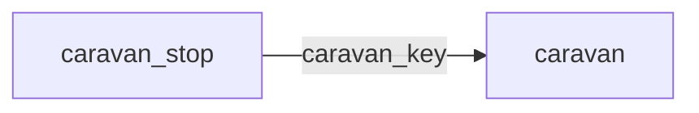

[index](../_index.md) | [lookups](../lookups.md) | [relationships](../relationships.md) | [USAGE.md](../../../USAGE.md)

# `caravan` (Caravan)

> Fields and lookups for the date, time, location and other particulars about caravan events.

## At a glance

| | |
|---|---|
| **Primary key** | `caravan_key` |
| **Fields on dd.reso.org** | 33 |
| **Columns in canonical DBML** | 33 (omits 0 satellite drops + 0 `Resource`-typed + 0 `Collection`-typed) |
| **Foreign keys OUT / IN** | 0 / 1 |
| **Review markers** | 0 |
| **Source** | [https://dd.reso.org/DD2.0/Caravan/](https://dd.reso.org/DD2.0/Caravan/) |
| **Last revised upstream** | 2/3/2021 |

## Relationship diagram

## Fields

Columns in their original `dd.reso.org` page order. The `flags` column shows: `pk`, `fk -> target.col` (committed FK), `[REVIEW]` (Phase 2.5 satellite audit flagged for review), `[dropped]` (omitted from the canonical DBML; satellite of the named FK), `[Resource]` / `[Collection]` (no scalar column in DBML; FK companion - see Refs/inverse-1:N below).

| Field | DBML name | Type | Lookup | Description | Flags |
|---|---|---|---|---|---|
| `CancellationPolicyUrl` | `cancellation_policy_url` | String |  | The Uniform Resource Locator (aka, URL or link) to the cancellation policy of the tour organizer. |  |
| `CaravanAllowedClassNames` | `caravan_allowed_class_names` | varchar (multi) | [`caravan_allowed_class_names`](../lookups.md#caravan_allowed_class_names) | A comma-separated list of the classes allowed by the tour's host. |  |
| `CaravanAllowedStatuses` | `caravan_allowed_statuses` | varchar (multi) | [`caravan_allowed_statuses`](../lookups.md#caravan_allowed_statuses) | A comma-separated list of the listing statuses allowed by the tour's host. |  |
| `CaravanAreaDescription` | `caravan_area_description` | String |  | A textual description of the geographic or locally known areas that all properties to be included in the tour must be located. |  |
| `CaravanBlackoutDates` | `caravan_blackout_dates` | String |  | A comma-separated list of the dates when a reoccurring tour will not take place (e.g., holidays, weekends, etc.). |  |
| `CaravanDate` | `caravan_date` | Date |  | The date of the organized tour. |  |
| `CaravanDaysRecurring` | `caravan_days_recurring` | String |  | Used with unbound timeframes (e.g., second Tuesday of month). |  |
| `CaravanEndTime` | `caravan_end_time` | Timestamp |  | The end time of the organized tour. |  |
| `CaravanInputDeadlineDescription` | `caravan_input_deadline_description` | String |  | A textual description of the deadline to add a stop (property or open house) to the tour. |  |
| `CaravanInputDeadlineTimestamp` | `caravan_input_deadline_timestamp` | Timestamp |  | A date/time of the deadline to add a stop (property or open house) to the tour. |  |
| `CaravanKey` | `caravan_key` | String |  | A system unique identifier. | `pk` |
| `CaravanName` | `caravan_name` | String |  | The name or short description of the tour. |  |
| `CaravanOrganizerContactInfo` | `caravan_organizer_contact_info` | String |  | Contact information for the tour organizer, such as phone or email. |  |
| `CaravanOrganizerKey` | `caravan_organizer_key` | String |  | A system unique identifier for the entity hosting the tour. |  |
| `CaravanOrganizerMlsId` | `caravan_organizer_mls_id` | String |  | The local, well-known identifier for the entity hosting the tour. |  |
| `CaravanOrganizerName` | `caravan_organizer_name` | String |  | The name of the entity hosting the tour. |  |
| `CaravanOrganizerResourceName` | `caravan_organizer_resource_name` | enum | [`caravan_resource_name`](../lookups.md#caravan_resource_name) | The resource or table of the record to which the CaravanOrganizerKey or MlsId refers (i.e., Office, Association, etc.). |  |
| `CaravanPolicyUrl` | `caravan_policy_url` | String |  | The Uniform Resource Locator (aka, URL or link) to the general tour policies of the tour organizer. |  |
| `CaravanRemarks` | `caravan_remarks` | String |  | The detailed description, directions, policy or other details about the tour. |  |
| `CaravanStartLocation` | `caravan_start_location` | String |  | A description or address of the location where the tour begins. |  |
| `CaravanStartLocationGiveaways` | `caravan_start_location_giveaways` | String |  | A description of prizes, drawings, etc., that will be given at the tour start location. |  |
| `CaravanStartLocationRefreshments` | `caravan_start_location_refreshments` | String |  | A description of the refreshments that will be served at the tour start location. |  |
| `CaravanStartTime` | `caravan_start_time` | Timestamp |  | The start time of the organized tour. |  |
| `CaravanStatus` | `caravan_status` | enum | [`caravan_status`](../lookups.md#caravan_status) | Status of the organized tour (e.g., Active, Cancelled, Ended, etc.). |  |
| `CaravanType` | `caravan_type` | enum | [`caravan_type`](../lookups.md#caravan_type) | The type of organized tour (e.g., AOR, Broker, Other, etc.). |  |
| `ModificationTimestamp` | `modification_timestamp` | Timestamp |  | The date/time the Caravan record was last modified. |  |
| `OriginalEntryTimestamp` | `original_entry_timestamp` | Timestamp |  | The date/time the Caravan record was originally input into the source system. |  |
| `OriginatingSystemId` | `originating_system_id` | String |  | The RESO UOI's OrganizationUniqueId of the originating record provider. |  |
| `OriginatingSystemKey` | `originating_system_key` | String |  | The system key, a unique record identifier, from the originating system. |  |
| `OriginatingSystemName` | `originating_system_name` | String |  | The name of the originating record provider. |  |
| `SourceSystemId` | `source_system_id` | String |  | The RESO UOI's OrganizationUniqueId of the source record provider. |  |
| `SourceSystemKey` | `source_system_key` | String |  | The system key, a unique record identifier, from the source system. |  |
| `SourceSystemName` | `source_system_name` | String |  | The name of the CaravanStop record provider. |  |

## Foreign keys OUT (this resource references)

*(none committed)*

## Foreign keys IN (other resources reference this)

- `caravan_stop.caravan_key` -> `caravan.caravan_key` (high)

