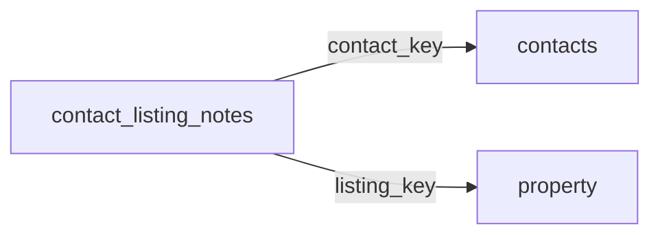

[index](../_index.md) | [lookups](../lookups.md) | [relationships](../relationships.md) | [USAGE.md](../../../USAGE.md)

# `contact_listing_notes` (ContactListingNotes)

> Notes about a given listing from interactions between the contact and member within a consumer portal.

## At a glance

| | |
|---|---|
| **Primary key** | `contact_listing_notes_key` |
| **Fields on dd.reso.org** | 10 |
| **Columns in canonical DBML** | 7 (omits 0 satellite drops + 2 `Resource`-typed + 1 `Collection`-typed) |
| **Foreign keys OUT / IN** | 2 / 0 |
| **Review markers** | 0 |
| **Source** | [https://dd.reso.org/DD2.0/ContactListingNotes/](https://dd.reso.org/DD2.0/ContactListingNotes/) |
| **Last revised upstream** | 5/24/2017 |

## Relationship diagram

## Fields

Columns in their original `dd.reso.org` page order. The `flags` column shows: `pk`, `fk -> target.col` (committed FK), `[REVIEW]` (Phase 2.5 satellite audit flagged for review), `[dropped]` (omitted from the canonical DBML; satellite of the named FK), `[Resource]` / `[Collection]` (no scalar column in DBML; FK companion - see Refs/inverse-1:N below).

| Field | DBML name | Type | Lookup | Description | Flags |
|---|---|---|---|---|---|
| `Contact` | `contact` | Resource |  | The contact associated with the ContactListingNotes record. | `[Resource]` |
| `ContactKey` | `contact_key` | String |  | The key of the corresponding contact record. | `-> contacts.contact_key` |
| `ContactListingNotesKey` | `contact_listing_notes_key` | String |  | A system unique identifier. | `pk` |
| `HistoryTransactional` | `history_transactional` | Collection |  | The history of the ContactListingNotes record. | `[Collection]` |
| `Listing` | `listing` | Resource |  | The listing for the ContactListings record. | `[Resource]` |
| `ListingId` | `listing_id` | String |  | The ID for the corresponding listing record. |  |
| `ListingKey` | `listing_key` | String |  | The key of the corresponding listing record. | `-> property.listing_key` |
| `ModificationTimestamp` | `modification_timestamp` | Timestamp |  | The date/time a note was written. |  |
| `NoteContents` | `note_contents` | String |  | The contents of a note. |  |
| `NotedBy` | `noted_by` | enum | [`noted_by`](../lookups.md#noted_by) | The individual who wrote a note (i.e., Agent or Contact). |  |

## Foreign keys OUT (this resource references)

- `contact_listing_notes.contact_key` -> `contacts.contact_key` (medium)
- `contact_listing_notes.listing_key` -> `property.listing_key` (medium)

## Foreign keys IN (other resources reference this)

*(none committed)*

## Inverse 1:N (collection-typed companions)

- `history_transactional` -> `history_transactional` (many `history_transactional` per `contact_listing_notes`)

