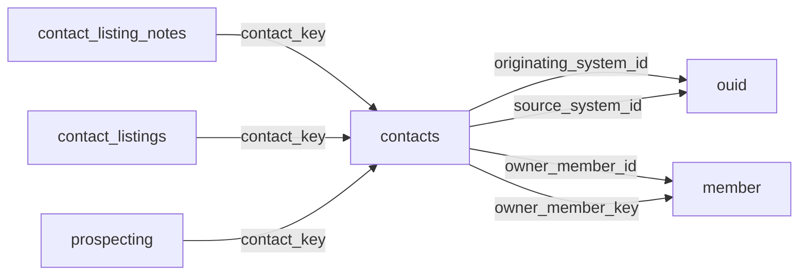

[index](../_index.md) | [lookups](../lookups.md) | [relationships](../relationships.md) | [USAGE.md](../../../USAGE.md)

# `contacts` (Contacts)

> Information on client and other contacts of the member.

## At a glance

| | |
|---|---|
| **Primary key** | `contact_key` |
| **Fields on dd.reso.org** | 91 |
| **Columns in canonical DBML** | 84 (omits 0 satellite drops + 3 `Resource`-typed + 4 `Collection`-typed) |
| **Foreign keys OUT / IN** | 4 / 3 |
| **Review markers** | 0 |
| **Source** | [https://dd.reso.org/DD2.0/Contacts/](https://dd.reso.org/DD2.0/Contacts/) |
| **Last revised upstream** | 9/24/2015 |

## Relationship diagram

## Fields

Columns in their original `dd.reso.org` page order. The `flags` column shows: `pk`, `fk -> target.col` (committed FK), `[REVIEW]` (Phase 2.5 satellite audit flagged for review), `[dropped]` (omitted from the canonical DBML; satellite of the named FK), `[Resource]` / `[Collection]` (no scalar column in DBML; FK companion - see Refs/inverse-1:N below).

| Field | DBML name | Type | Lookup | Description | Flags |
|---|---|---|---|---|---|
| `Anniversary` | `anniversary` | Date |  | The month, day and year of the contact's wedding anniversary. |  |
| `AssistantEmail` | `assistant_email` | String |  | The email address of the contact's assistant. |  |
| `AssistantName` | `assistant_name` | String |  | The name of the contact's assistant. |  |
| `AssistantPhone` | `assistant_phone` | String |  | The phone number of the contact's assistant. |  |
| `AssistantPhoneExt` | `assistant_phone_ext` | String |  | The phone number extension of the contact's assistant. |  |
| `Birthdate` | `birthdate` | Date |  | The month, day and year of the contact's birthday. |  |
| `BusinessFax` | `business_fax` | String |  | North American 10-digit phone numbers should be in the format of ###-###-#### (separated by hyphens). |  |
| `Children` | `children` | String |  | A list of the names of the contact's children in a comma-separated list. |  |
| `Company` | `company` | String |  | The contact's company or employer. |  |
| `ContactKey` | `contact_key` | String |  | A system unique identifier. | `pk` |
| `ContactLoginId` | `contact_login_id` | String |  | The local, well-known identifier for the contact. |  |
| `ContactPassword` | `contact_password` | String |  | A client password that the member wishes to share with other systems. |  |
| `ContactStatus` | `contact_status` | enum | [`contact_status`](../lookups.md#contact_status) | The status of the contact (i.e., Active, Inactive, On Vacation, Deleted, etc.). |  |
| `ContactType` | `contact_type` | varchar (multi) | [`contact_type`](../lookups.md#contact_type) | The type of contact (i.e., Business, Friend, Family, Prospect, Ready to Buy, etc.). |  |
| `ContactsOtherPhone` | `contacts_other_phone` | Collection |  | A collection of the types of other phone fields available for Contacts. | `[Collection]` |
| `ContactsSocialMedia` | `contacts_social_media` | Collection |  | A collection of the types of social media fields available for Contacts. | `[Collection]` |
| `Department` | `department` | String |  | The department in which the contact works. |  |
| `DirectPhone` | `direct_phone` | String |  | North American 10-digit phone numbers should be in the format of ###-###-#### (separated by hyphens). |  |
| `Email` | `email` | String |  | The preferred email address of the contact. |  |
| `Email2` | `email2` | String |  | The secondary email address of the contact. |  |
| `Email3` | `email3` | String |  | The tertiary email address of the contact. |  |
| `FirstName` | `first_name` | String |  | The first name of the contact. |  |
| `FullName` | `full_name` | String |  | The first, middle and last name of the contact or an alternate full name. |  |
| `HistoryTransactional` | `history_transactional` | Collection |  | The history of the contact's record. | `[Collection]` |
| `HomeAddress1` | `home_address1` | String |  | The street number, direction, name and suffix of the contact's home. |  |
| `HomeAddress2` | `home_address2` | String |  | The unit/suite number of the contact's home. |  |
| `HomeCarrierRoute` | `home_carrier_route` | String |  | The group of addresses to which the U.S. |  |
| `HomeCity` | `home_city` | String |  | The city of the contact's home. |  |
| `HomeCountry` | `home_country` | enum | [`country`](../lookups.md#country) | The country abbreviation in a postal address. |  |
| `HomeCountyOrParish` | `home_county_or_parish` | enum | [`county_or_parish`](../lookups.md#county_or_parish) | The county or parish in which the contact's home is addressed. |  |
| `HomeFax` | `home_fax` | String |  | North American 10-digit phone numbers should be in the format of ###-###-#### (separated by hyphens). |  |
| `HomePhone` | `home_phone` | String |  | North American 10-digit phone numbers should be in the format of ###-###-#### (separated by hyphens). |  |
| `HomePostalCode` | `home_postal_code` | String |  | The postal code of the contact's home. |  |
| `HomePostalCodePlus4` | `home_postal_code_plus4` | String |  | The four-digit extension of the U.S. |  |
| `HomeStateOrProvince` | `home_state_or_province` | enum | [`state_or_province`](../lookups.md#state_or_province) | The state or province in which the contact's home is addressed. |  |
| `JobTitle` | `job_title` | String |  | The title or position of the contact within their organization. |  |
| `Language` | `language` | varchar (multi) | [`languages`](../lookups.md#languages) | The languages spoken by the contact. |  |
| `LastName` | `last_name` | String |  | The last name of the contact. |  |
| `LeadSource` | `lead_source` | String |  | The source or person that provided the contact. |  |
| `Media` | `media` | Collection |  | The media for the contact's record. | `[Collection]` |
| `MiddleName` | `middle_name` | String |  | The middle name of the contact. |  |
| `MobilePhone` | `mobile_phone` | String |  | North American 10-digit phone numbers should be in the format of ###-###-#### (separated by hyphens). |  |
| `ModificationTimestamp` | `modification_timestamp` | Timestamp |  | The date/time the Contact record was last modified. |  |
| `NamePrefix` | `name_prefix` | String |  | The prefix to the name (e.g., Dr., Mr., Ms.). |  |
| `NameSuffix` | `name_suffix` | String |  | The suffix to the surname (e.g., Esq., Jr., III). |  |
| `Nickname` | `nickname` | String |  | An alternate name used by the contact, usually as a substitute for the first name. |  |
| `Notes` | `notes` | String |  | The recorded notes about the client. |  |
| `OfficePhone` | `office_phone` | String |  | North American 10-digit phone numbers should be in the format of ###-###-#### (separated by hyphens). |  |
| `OfficePhoneExt` | `office_phone_ext` | String |  | The extension of the given phone number (if applicable). |  |
| `OriginalEntryTimestamp` | `original_entry_timestamp` | Timestamp |  | The date/time the contact record was originally input into the source system. |  |
| `OriginatingSystem` | `originating_system` | Resource |  | The originating system of the contact's record. | `[Resource]` |
| `OriginatingSystemContactKey` | `originating_system_contact_key` | String |  | The system key, a unique record identifier, from the originating system. |  |
| `OriginatingSystemID` | `originating_system_id` | String |  | The OUID Resource's OrganizationUniqueId of the originating record provider. | `-> ouid.organization_unique_id_key` |
| `OriginatingSystemName` | `originating_system_name` | String |  | The name of the originating record provider, most commonly the name of the MLS. |  |
| `OtherAddress1` | `other_address1` | String |  | The other street number, direction, name and suffix of the contact. |  |
| `OtherAddress2` | `other_address2` | String |  | The other unit/suite number of the contact. |  |
| `OtherCarrierRoute` | `other_carrier_route` | String |  | The group of addresses to which the U.S. |  |
| `OtherCity` | `other_city` | String |  | The other city of the contact. |  |
| `OtherCountry` | `other_country` | enum | [`country`](../lookups.md#country) | The other country abbreviation in a postal address. |  |
| `OtherCountyOrParish` | `other_county_or_parish` | enum | [`county_or_parish`](../lookups.md#county_or_parish) | The other county or parish in which the contact is addressed. |  |
| `OtherPhoneType` | `other_phone_type` | enum | [`other_phone_type`](../lookups.md#other_phone_type) | A list of phone types (e.g., Home, Mobile, Second) that do not already exist in the given phone fields or if a second type of phone field is needed. |  |
| `OtherPostalCode` | `other_postal_code` | String |  | The other postal code of the contact. |  |
| `OtherPostalCodePlus4` | `other_postal_code_plus4` | String |  | The other four-digit extension of the U.S. |  |
| `OtherStateOrProvince` | `other_state_or_province` | enum | [`state_or_province`](../lookups.md#state_or_province) | The other state or province in which the contact is addressed. |  |
| `OwnerMember` | `owner_member` | Resource |  | The member who owns the contact's record. | `[Resource]` |
| `OwnerMemberID` | `owner_member_id` | String |  | The local, well-known identifier for the member in charge of the contact. | `-> member.member_key` |
| `OwnerMemberKey` | `owner_member_key` | String |  | The unique identifier (key) of the member owning the contact. | `-> member.member_key` |
| `Pager` | `pager` | String |  | North American 10-digit phone numbers should be in the format of ###-###-#### (separated by hyphens). |  |
| `PhoneTTYTDD` | `phone_ttytdd` | String |  | North American 10-digit phone numbers should be in the format of ###-###-#### (separated by hyphens). |  |
| `PreferredAddress` | `preferred_address` | enum | [`preferred_address`](../lookups.md#preferred_address) | A list of the address options (i.e., Home, Work and Other) used to determine the address preferred by the client. |  |
| `PreferredPhone` | `preferred_phone` | enum | [`preferred_phone`](../lookups.md#preferred_phone) | A list of the phone options (e.g., Office, Mobile, Direct, Voicemail) used to determine the phone preferred by the client. |  |
| `ReferredBy` | `referred_by` | String |  | The name of the person who referred the contact. |  |
| `ReverseProspectingEnabledYN` | `reverse_prospecting_enabled_yn` | Boolean |  | Reverse prospecting, a system that allows listing agents to see the agent/member whose client has a search criteria that found the agent's listing, has been enabled for the given client's saved searches. |  |
| `SocialMediaType` | `social_media_type` | enum | [`social_media_type`](../lookups.md#social_media_type) | A list of social media platforms (e.g., Facebook, LinkedIn, Instagram) associated with the ContactsSocialMedia field. |  |
| `SourceSystem` | `source_system` | Resource |  | The source system of the contact's record. | `[Resource]` |
| `SourceSystemContactKey` | `source_system_contact_key` | String |  | The system key, a unique record identifier, from the source system. |  |
| `SourceSystemID` | `source_system_id` | String |  | The OUID Resource's OrganizationUniqueId of the source record provider. | `-> ouid.organization_unique_id_key` |
| `SourceSystemName` | `source_system_name` | String |  | The name of the immediate record provider. |  |
| `SpousePartnerName` | `spouse_partner_name` | String |  | The contact's spouse or partner. |  |
| `TollFreePhone` | `toll_free_phone` | String |  | North American 10-digit phone numbers should be in the format of ###-###-#### (separated by hyphens). |  |
| `VoiceMail` | `voice_mail` | String |  | North American 10-digit phone numbers should be in the format of ###-###-#### (separated by hyphens). |  |
| `VoiceMailExt` | `voice_mail_ext` | String |  | The extension of the given phone number (if applicable). |  |
| `WorkAddress1` | `work_address1` | String |  | The street number, direction, name and suffix of the contact's work. |  |
| `WorkAddress2` | `work_address2` | String |  | The unit/suite number of the contact's work. |  |
| `WorkCarrierRoute` | `work_carrier_route` | String |  | The group of addresses to which the U.S. |  |
| `WorkCity` | `work_city` | String |  | The city of the contact's work. |  |
| `WorkCountry` | `work_country` | enum | [`country`](../lookups.md#country) | The country abbreviation in a postal address. |  |
| `WorkCountyOrParish` | `work_county_or_parish` | enum | [`county_or_parish`](../lookups.md#county_or_parish) | The county or parish in which the contact's work is addressed. |  |
| `WorkPostalCode` | `work_postal_code` | String |  | The postal code of the contact's work. |  |
| `WorkPostalCodePlus4` | `work_postal_code_plus4` | String |  | The four-digit extension of a U.S. |  |
| `WorkStateOrProvince` | `work_state_or_province` | enum | [`state_or_province`](../lookups.md#state_or_province) | The state or province in which the contact's work is addressed. |  |

## Foreign keys OUT (this resource references)

- `contacts.originating_system_id` -> `ouid.organization_unique_id_key` (medium)
- `contacts.owner_member_id` -> `member.member_key` (medium)
- `contacts.owner_member_key` -> `member.member_key` (high)
- `contacts.source_system_id` -> `ouid.organization_unique_id_key` (medium)

## Foreign keys IN (other resources reference this)

- `contact_listing_notes.contact_key` -> `contacts.contact_key` (medium)
- `contact_listings.contact_key` -> `contacts.contact_key` (medium)
- `prospecting.contact_key` -> `contacts.contact_key` (medium)

## Inverse 1:N (collection-typed companions)

- `contacts_other_phone` -> `other_phone` (many `other_phone` per `contacts`)
- `contacts_social_media` -> `social_media` (many `social_media` per `contacts`)
- `history_transactional` -> `history_transactional` (many `history_transactional` per `contacts`)
- `media` -> `media` (many `media` per `contacts`)

## Phase 2.5 satellite audit

Recommendations from `raw/satellites.csv`. `drop_from_host` rows are not present in the canonical DBML; `review` rows are kept but flagged; `keep_both` rows are silently kept.

| Column | FK | Recommendation | Notes |
|---|---|---|---|
| `originating_system_contact_key` | `originating_system_id` -> `ouid.?` | `keep_both` | no_child_match |
| `originating_system_name` | `originating_system_id` -> `ouid.?` | `keep_both` | no_child_match |
| `source_system_contact_key` | `source_system_id` -> `ouid.?` | `keep_both` | no_child_match |
| `source_system_name` | `source_system_id` -> `ouid.?` | `keep_both` | no_child_match |

