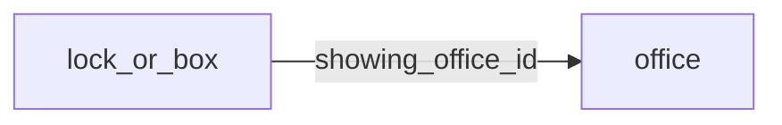

[index](../_index.md) | [lookups](../lookups.md) | [relationships](../relationships.md) | [USAGE.md](../../../USAGE.md)

# `lock_or_box` (LockOrBox)

> Lockbox, smart lock and showing agent information.

## At a glance

| | |
|---|---|
| **Primary key** | `lock_or_box_key` |
| **Fields on dd.reso.org** | 44 |
| **Columns in canonical DBML** | 39 (omits 0 satellite drops + 4 `Resource`-typed + 1 `Collection`-typed) |
| **Foreign keys OUT / IN** | 1 / 0 |
| **Review markers** | 0 |
| **Source** | [https://dd.reso.org/DD2.0/LockOrBox/](https://dd.reso.org/DD2.0/LockOrBox/) |
| **Last revised upstream** | 7/25/2019 |

## Relationship diagram

## Fields

Columns in their original `dd.reso.org` page order. The `flags` column shows: `pk`, `fk -> target.col` (committed FK), `[REVIEW]` (Phase 2.5 satellite audit flagged for review), `[dropped]` (omitted from the canonical DBML; satellite of the named FK), `[Resource]` / `[Collection]` (no scalar column in DBML; FK companion - see Refs/inverse-1:N below).

| Field | DBML name | Type | Lookup | Description | Flags |
|---|---|---|---|---|---|
| `HistoryTransactional` | `history_transactional` | Collection |  | This history for the LockOrBox record. | `[Collection]` |
| `KeyOrCredentialId` | `key_or_credential_id` | String |  | The local, well-known identifier for a given lockbox/smartlock system key or credential. |  |
| `ListAgentFullName` | `list_agent_full_name` | String |  | The first, middle and last name of the listing agent. |  |
| `ListingAddress1` | `listing_address1` | String |  | The street number, direction, name and suffix of the property where the lockbox/smart lock is located. |  |
| `ListingAddress2` | `listing_address2` | String |  | The unit/suite number of the property where the lockbox/smart lock is located. |  |
| `ListingCity` | `listing_city` | String |  | The city of the property where the lockbox/smart lock is located. |  |
| `ListingCountry` | `listing_country` | enum | [`country`](../lookups.md#country) | The country of the property where the lockbox/smart lock is located. |  |
| `ListingId` | `listing_id` | String |  | The well-known identifier for the listing where the lockbox/smart lock is located. |  |
| `ListingKey` | `listing_key` | String |  | A unique identifier for this record from the immediate source. |  |
| `ListingLatitude` | `listing_latitude` | Number |  | The latitude of the property where the lockbox/smart lock is located. |  |
| `ListingLongitude` | `listing_longitude` | Number |  | The longitude of the property where the lockbox/smart lock is located. |  |
| `ListingPostalCode` | `listing_postal_code` | String |  | The postal code of the property where the lockbox/smart lock is located. |  |
| `ListingPostalCodePlus4` | `listing_postal_code_plus4` | String |  | The four-digit U.S. |  |
| `ListingStateOrProvince` | `listing_state_or_province` | enum | [`state_or_province`](../lookups.md#state_or_province) | The state or province of the property where the lockbox/smart lock is located. |  |
| `ListingTimeZone` | `listing_time_zone` | enum | [`iana_time_zone_values`](../lookups.md#iana_time_zone_values) | The standard name of the time zone of the property where the lockbox/smart lock is located, as provided by the IANA tz database. |  |
| `LockOrBoxAccessTimestamp` | `lock_or_box_access_timestamp` | Timestamp |  | The transactional timestamp automatically recorded by the lockbox/smart lock system representing the date/time the lockbox or lock was last accessed. |  |
| `LockOrBoxAccessType` | `lock_or_box_access_type` | varchar (multi) | [`lock_or_box_access_type`](../lookups.md#lock_or_box_access_type) | The method of access for the lockbox or smart lock. |  |
| `LockOrBoxId` | `lock_or_box_id` | String |  | The local, well-known identifier for a given lockbox/smartlock system. |  |
| `LockOrBoxInstalledTimestamp` | `lock_or_box_installed_timestamp` | Timestamp |  | The transactional timestamp automatically recorded by the lockbox/smart lock system representing the date/time the lockbox or lock was last installed at a property. |  |
| `LockOrBoxKey` | `lock_or_box_key` | String |  | A unique identifier for this record from the immediate source. | `pk` |
| `LockOrBoxOriginatingSystemId` | `lock_or_box_originating_system_id` | String |  | The RESO Unique Organization Identifier (UOI) OrganizationUniqueId of the originating record provider. |  |
| `LockOrBoxOriginatingSystemKey` | `lock_or_box_originating_system_key` | String |  | The name of the originating record provider. |  |
| `LockOrBoxOriginatingSystemName` | `lock_or_box_originating_system_name` | String |  | The system key, a unique record identifier, from the originating system. |  |
| `LockOrBoxSourceSystemId` | `lock_or_box_source_system_id` | String |  | The RESO Unique Organization Identifier (UOI) OrganizationUniqueId of the source record provider. |  |
| `LockOrBoxSourceSystemKey` | `lock_or_box_source_system_key` | String |  | The name of the immediate record provider. |  |
| `LockOrBoxSourceSystemName` | `lock_or_box_source_system_name` | String |  | The system key, a unique record identifier, from the source system. |  |
| `ModificationTimestamp` | `modification_timestamp` | Timestamp |  | The date/time the LockOrBox record was last modified. |  |
| `Notes` | `notes` | String |  | Notes or feedback about the property or showing. |  |
| `OriginatingSystem` | `originating_system` | Resource |  | The originating system of the LockOrBox record. | `[Resource]` |
| `ShowingAgent` | `showing_agent` | Resource |  | The office contact for showings of the property. | `[Resource]` |
| `ShowingAgentAOR` | `showing_agent_aor` | enum | [`aor`](../lookups.md#aor) | The showing contact's board or association of REALTORS®. |  |
| `ShowingAgentEmail` | `showing_agent_email` | String |  | The email address of the contact for showings of the property. |  |
| `ShowingAgentFirstName` | `showing_agent_first_name` | String |  | The first name of the contact for showings of the property. |  |
| `ShowingAgentFullName` | `showing_agent_full_name` | String |  | The first, middle and last name of the contact for showings of the property. |  |
| `ShowingAgentId` | `showing_agent_id` | String |  | The local, well-known lockbox/smartlock system identifier of the showing contact. |  |
| `ShowingAgentLastName` | `showing_agent_last_name` | String |  | The last name of the contact for showings of the property. |  |
| `ShowingAgentMlsId` | `showing_agent_mls_id` | String |  | The local, well-known MLS identifier of the showing contact. |  |
| `ShowingAgentPhone` | `showing_agent_phone` | String |  | The North American 10-digit phone numbers should be in the format of ###-###-#### (separated by hyphens). |  |
| `ShowingAgentPhoneExt` | `showing_agent_phone_ext` | String |  | The phone number extension of the contact for showings of the property. |  |
| `ShowingOffice` | `showing_office` | Resource |  | The agent contact for showings of the property. | `[Resource]` |
| `ShowingOfficeId` | `showing_office_id` | String |  | The local, well-known lockbox/smart lock system identifier of the showing office. | `-> office.office_key` |
| `ShowingOfficeName` | `showing_office_name` | String |  | The legal name of the brokerage/company showing the property. |  |
| `ShowingOfficePhone` | `showing_office_phone` | String |  | The North American 10-digit phone numbers should be in the format of ###-###-#### (separated by hyphens). |  |
| `SourceSystem` | `source_system` | Resource |  | The source system of the LockOrBox record. | `[Resource]` |

## Foreign keys OUT (this resource references)

- `lock_or_box.showing_office_id` -> `office.office_key` (medium)

## Foreign keys IN (other resources reference this)

*(none committed)*

## Inverse 1:N (collection-typed companions)

- `history_transactional` -> `history_transactional` (many `history_transactional` per `lock_or_box`)

