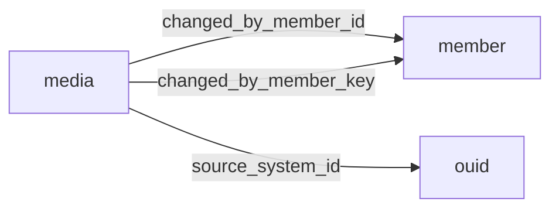

[index](../_index.md) | [lookups](../lookups.md) | [relationships](../relationships.md) | [USAGE.md](../../../USAGE.md)

# `media` (Media)

> Photos, virtual tours, documents, supplements and other media related to listings.

## At a glance

| | |
|---|---|
| **Primary key** | `media_key` |
| **Fields on dd.reso.org** | 41 |
| **Columns in canonical DBML** | 37 (omits 0 satellite drops + 3 `Resource`-typed + 1 `Collection`-typed) |
| **Foreign keys OUT / IN** | 3 / 0 |
| **Review markers** | 0 |
| **Source** | [https://dd.reso.org/DD2.0/Media/](https://dd.reso.org/DD2.0/Media/) |
| **Last revised upstream** | 8/27/2015 |

## Relationship diagram

## Fields

Columns in their original `dd.reso.org` page order. The `flags` column shows: `pk`, `fk -> target.col` (committed FK), `[REVIEW]` (Phase 2.5 satellite audit flagged for review), `[dropped]` (omitted from the canonical DBML; satellite of the named FK), `[Resource]` / `[Collection]` (no scalar column in DBML; FK companion - see Refs/inverse-1:N below).

| Field | DBML name | Type | Lookup | Description | Flags |
|---|---|---|---|---|---|
| `ChangedByMember` | `changed_by_member` | Resource |  | The member who changed the Media record. | `[Resource]` |
| `ChangedByMemberID` | `changed_by_member_id` | String |  | The ID of the user, agent, member, etc., that uploaded the media this record refers to. | `-> member.member_key` |
| `ChangedByMemberKey` | `changed_by_member_key` | String |  | The primary key of the member who uploaded the media this record refers to. | `-> member.member_key` |
| `ClassName` | `class_name` | enum | [`class_name`](../lookups.md#class_name) | The class or table of the listing or other record of the media (e.g., Residential, Lease, Agent, Office, Contact). |  |
| `HistoryTransactional` | `history_transactional` | Collection |  | The history of the Media record. | `[Collection]` |
| `ImageHeight` | `image_height` | Number |  | The height of the image expressed in pixels. |  |
| `ImageOf` | `image_of` | enum | [`image_of`](../lookups.md#image_of) | When the media is an image, a list of possible matches such as kitchen, bathroom, front of structure, etc. |  |
| `ImageSizeDescription` | `image_size_description` | enum | [`image_size_description`](../lookups.md#image_size_description) | A text description of the size of the image (i.e., Small, Thumbnail, Medium, Large, X-Large). |  |
| `ImageWidth` | `image_width` | Number |  | The width of the image expressed in pixels. |  |
| `LongDescription` | `long_description` | String |  | The full robust description of the object. |  |
| `MediaAlteration` | `media_alteration` | varchar (multi) | [`media_alteration`](../lookups.md#media_alteration) | Photos may be enhanced, altered or even created by manual or computer drafting. |  |
| `MediaCategory` | `media_category` | enum | [`media_category`](../lookups.md#media_category) | A category describing photos, documents, videos, unbranded virtual tours, branded virtual tours, floor plans, logos and other forms of media. |  |
| `MediaHTML` | `media_html` | String |  | The JavaScript or other method to embed a video, image, virtual tour or other media. |  |
| `MediaKey` | `media_key` | String |  | A unique identifier for this record from the immediate source. | `pk` |
| `MediaModificationTimestamp` | `media_modification_timestamp` | Timestamp |  | A timestamp that is updated when a change to the object has been made, which may differ from a change to the Media Resource. |  |
| `MediaObjectID` | `media_object_id` | String |  | The ID of the image, supplement or other object specified by the given media record. |  |
| `MediaStatus` | `media_status` | enum | [`media_status`](../lookups.md#media_status) | The status of the media item referenced by this record (i.e., updated, deleted, etc.). |  |
| `MediaType` | `media_type` | enum | [`media_type`](../lookups.md#media_type) | Media types as defined by the Internet Assigned Numbers Authority (IANA), http://www.iana.org/assignments/media-types/index.html. |  |
| `MediaURL` | `media_url` | String |  | The Uniform Resource Identifier (URI) to the media file referenced by this record. |  |
| `ModificationTimestamp` | `modification_timestamp` | Timestamp |  | The transactional timestamp automatically recorded by the MLS system representing the date/time the Media record was last modified. |  |
| `Order` | `order` | Number |  | Only a positive integer, including zero. |  |
| `OriginatingSystem` | `originating_system` | Resource |  | The originating system of the Media record. | `[Resource]` |
| `OriginatingSystemID` | `originating_system_id` | String |  | The RESO Unique Organization Identifier's OrganizationUniqueId of the originating record provider. |  |
| `OriginatingSystemMediaKey` | `originating_system_media_key` | String |  | The system key, a unique record identifier, from the originating system. |  |
| `OriginatingSystemName` | `originating_system_name` | String |  | The name of the originating record provider, most commonly the name of the MLS. |  |
| `OriginatingSystemResourceRecordId` | `originating_system_resource_record_id` | String |  | The originating system's well-known identifier of the related record from the source resource. |  |
| `OriginatingSystemResourceRecordKey` | `originating_system_resource_record_key` | String |  | The originating system's primary key of the related record from the source resource (e.g., ListingKey, AgentKey, OfficeKey, TeamKey). |  |
| `OriginatingSystemResourceRecordSystemId` | `originating_system_resource_record_system_id` | String |  | The system ID of the resource record from the originating system is used when the resource record is originated from a different system than the media. |  |
| `Permission` | `permission` | varchar (multi) | [`permission`](../lookups.md#permission) | The permission-level of the media (i.e., Public, Private, IDX, VOW, Office Only, Firm Only, Agent Only). |  |
| `PreferredPhotoYN` | `preferred_photo_yn` | Boolean |  | A flag indicating whether or not the media record in question is the preferred photo. |  |
| `ResourceName` | `resource_name` | enum | [`resource_name`](../lookups.md#resource_name) | The resource or table of the listing or other record the media relates to (i.e., Property, Member, Office, etc.). |  |
| `ResourceRecordID` | `resource_record_id` | String |  | The well-known identifier of the related record from the source resource. |  |
| `ResourceRecordKey` | `resource_record_key` | String |  | The primary key of the related record from the source resource (e.g., ListingKey, AgentKey, OfficeKey, TeamKey). |  |
| `ShortDescription` | `short_description` | String |  | The short text given to summarize the object, commonly used as the short description displayed under a photo. |  |
| `SourceSystem` | `source_system` | Resource |  | The source system of the Media record. | `[Resource]` |
| `SourceSystemID` | `source_system_id` | String |  | The OUID Resource's OrganizationUniqueId of the source record provider. | `-> ouid.organization_unique_id_key` |
| `SourceSystemMediaKey` | `source_system_media_key` | String |  | The system key, a unique record identifier, from the source system. |  |
| `SourceSystemName` | `source_system_name` | String |  | The name of the immediate record provider. |  |
| `SourceSystemResourceRecordId` | `source_system_resource_record_id` | String |  | The source system's well-known identifier of the related record from the source resource. |  |
| `SourceSystemResourceRecordKey` | `source_system_resource_record_key` | String |  | The source system's primary key of the related record from the source resource (e.g., ListingKey, AgentKey, OfficeKey, TeamKey). |  |
| `SourceSystemResourceRecordSystemId` | `source_system_resource_record_system_id` | String |  | The system ID of the resource record from the source system is used when the resource record is sourced from a different system than the media. |  |

## Foreign keys OUT (this resource references)

- `media.changed_by_member_id` -> `member.member_key` (medium)
- `media.changed_by_member_key` -> `member.member_key` (high)
- `media.source_system_id` -> `ouid.organization_unique_id_key` (medium)

## Foreign keys IN (other resources reference this)

*(none committed)*

## Inverse 1:N (collection-typed companions)

- `history_transactional` -> `history_transactional` (many `history_transactional` per `media`)

## Polymorphic FKs

- `resource_record_key` - target resolved at runtime; evidence: prose:P5:"foreign key from the resource selected in the ResourceName field"

## Phase 2.5 satellite audit

Recommendations from `raw/satellites.csv`. `drop_from_host` rows are not present in the canonical DBML; `review` rows are kept but flagged; `keep_both` rows are silently kept.

| Column | FK | Recommendation | Notes |
|---|---|---|---|
| `source_system_media_key` | `source_system_id` -> `ouid.?` | `keep_both` | no_child_match |
| `source_system_name` | `source_system_id` -> `ouid.?` | `keep_both` | no_child_match |
| `source_system_resource_record_id` | `source_system_id` -> `ouid.?` | `keep_both` | no_child_match |
| `source_system_resource_record_key` | `source_system_id` -> `ouid.?` | `keep_both` | no_child_match |
| `source_system_resource_record_system_id` | `source_system_id` -> `ouid.?` | `keep_both` | no_child_match |

