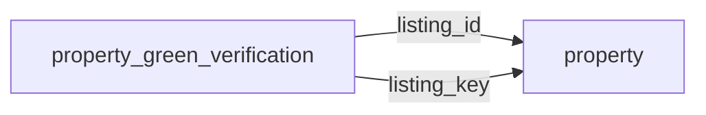

[index](../_index.md) | [lookups](../lookups.md) | [relationships](../relationships.md) | [USAGE.md](../../../USAGE.md)

# `property_green_verification` (PropertyGreenVerification)

> Multiple performance ratings applied to a property listing.

## At a glance

| | |
|---|---|
| **Primary key** | `green_building_verification_key` *(override; RESO uses `GreenBuildingVerificationKey`)* |
| **Fields on dd.reso.org** | 15 |
| **Columns in canonical DBML** | 13 (omits 0 satellite drops + 1 `Resource`-typed + 1 `Collection`-typed) |
| **Foreign keys OUT / IN** | 2 / 0 |
| **Review markers** | 0 |
| **Source** | [https://dd.reso.org/DD2.0/PropertyGreenVerification/](https://dd.reso.org/DD2.0/PropertyGreenVerification/) |
| **Last revised upstream** | 5/24/2017 |

## Relationship diagram

## Fields

Columns in their original `dd.reso.org` page order. The `flags` column shows: `pk`, `fk -> target.col` (committed FK), `[REVIEW]` (Phase 2.5 satellite audit flagged for review), `[dropped]` (omitted from the canonical DBML; satellite of the named FK), `[Resource]` / `[Collection]` (no scalar column in DBML; FK companion - see Refs/inverse-1:N below).

| Field | DBML name | Type | Lookup | Description | Flags |
|---|---|---|---|---|---|
| `GreenBuildingVerificationKey` | `green_building_verification_key` | String |  | A unique identifier for this record. | `pk` |
| `GreenBuildingVerificationType` | `green_building_verification_type` | enum | [`green_building_verification_type`](../lookups.md#green_building_verification_type) | The name of the verification or certification awarded to a new or pre-existing residential or commercial structure (e.g., LEED, ENERGY STAR, ICC-700). |  |
| `GreenVerificationBody` | `green_verification_body` | String |  | The name of the body or group providing the verification/certification/rating named in the GreenBuildingVerificationType field. |  |
| `GreenVerificationMetric` | `green_verification_metric` | Number |  | A final score indicating the performance of energy efficiency design and measures in the home as tested by a third-party rater. |  |
| `GreenVerificationRating` | `green_verification_rating` | String |  | Many verifications or certifications have a rating system that provides an indication of the structure's level of energy efficiency. |  |
| `GreenVerificationSource` | `green_verification_source` | enum | [`green_verification_source`](../lookups.md#green_verification_source) | The source of the green data. |  |
| `GreenVerificationStatus` | `green_verification_status` | enum | [`green_verification_status`](../lookups.md#green_verification_status) | Many verification programs include a multistep process that may begin with plans and specs, involve testing and/or submission of building specifications along the way, and include a final verification step. |  |
| `GreenVerificationURL` | `green_verification_url` | String |  | Provides a link to the specific property's high-performance rating or scoring details directly from and hosted by the sponsoring body of the program. |  |
| `GreenVerificationVersion` | `green_verification_version` | String |  | The version of the green certification or verification that was awarded. |  |
| `GreenVerificationYear` | `green_verification_year` | Number |  | The year the green certification or verification was awarded. |  |
| `HistoryTransactional` | `history_transactional` | Collection |  | The history of the PropertyGreenVerification record. | `[Collection]` |
| `Listing` | `listing` | Resource |  | The listing associated with the PropertyGreenVerification record. | `[Resource]` |
| `ListingId` | `listing_id` | String |  | This is the foreign ID relating to the property. | `-> property.listing_key` |
| `ListingKey` | `listing_key` | String |  | This is the foreign key relating to the property. | `-> property.listing_key` |
| `ModificationTimestamp` | `modification_timestamp` | Timestamp |  | The date/time the PropertyGreenVerification record was last modified. |  |

## Foreign keys OUT (this resource references)

- `property_green_verification.listing_id` -> `property.listing_key` (medium)
- `property_green_verification.listing_key` -> `property.listing_key` (medium)

## Foreign keys IN (other resources reference this)

*(none committed)*

## Inverse 1:N (collection-typed companions)

- `history_transactional` -> `history_transactional` (many `history_transactional` per `property_green_verification`)

## Phase 2.5 satellite audit

Recommendations from `raw/satellites.csv`. `drop_from_host` rows are not present in the canonical DBML; `review` rows are kept but flagged; `keep_both` rows are silently kept.

| Column | FK | Recommendation | Notes |
|---|---|---|---|
| `listing_id` | `listing_key` -> `property.?` | `keep_both` | no_child_match |

