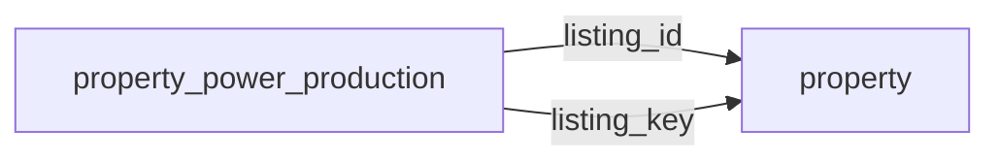

[index](../_index.md) | [lookups](../lookups.md) | [relationships](../relationships.md) | [USAGE.md](../../../USAGE.md)

# `property_power_production` (PropertyPowerProduction)

> Different means of producing power on a property, such as solar and wind systems.

## At a glance

| | |
|---|---|
| **Primary key** | `power_production_key` *(override; RESO uses `PowerProductionKey`)* |
| **Fields on dd.reso.org** | 12 |
| **Columns in canonical DBML** | 10 (omits 0 satellite drops + 1 `Resource`-typed + 1 `Collection`-typed) |
| **Foreign keys OUT / IN** | 2 / 0 |
| **Review markers** | 0 |
| **Source** | [https://dd.reso.org/DD2.0/PropertyPowerProduction/](https://dd.reso.org/DD2.0/PropertyPowerProduction/) |
| **Last revised upstream** | 6/30/2022 |

## Relationship diagram

## Fields

Columns in their original `dd.reso.org` page order. The `flags` column shows: `pk`, `fk -> target.col` (committed FK), `[REVIEW]` (Phase 2.5 satellite audit flagged for review), `[dropped]` (omitted from the canonical DBML; satellite of the named FK), `[Resource]` / `[Collection]` (no scalar column in DBML; FK companion - see Refs/inverse-1:N below).

| Field | DBML name | Type | Lookup | Description | Flags |
|---|---|---|---|---|---|
| `HistoryTransactional` | `history_transactional` | Collection |  | The history of the PropertyPowerProduction record. | `[Collection]` |
| `Listing` | `listing` | Resource |  | The listing associated with the PropertyPowerProduction record. | `[Resource]` |
| `ListingId` | `listing_id` | String |  | This is the foreign ID relating to the Property Resource; the well-known identifier for the listing. | `-> property.listing_key` |
| `ListingKey` | `listing_key` | String |  | This is the foreign key relating to the Property Resource; the unique identifier for this record from the immediate source. | `-> property.listing_key` |
| `ModificationTimestamp` | `modification_timestamp` | Timestamp |  | The date/time the PropertyPowerProduction record was last modified. |  |
| `PowerProductionAnnual` | `power_production_annual` | Number |  | The most important metric of a renewables system is the amount of power it produces per year. |  |
| `PowerProductionAnnualStatus` | `power_production_annual_status` | enum | [`power_production_annual_status`](../lookups.md#power_production_annual_status) | The most important metric of a renewables system is the amount of power it produces per year. |  |
| `PowerProductionKey` | `power_production_key` | String |  | A unique identifier for this record. | `pk` |
| `PowerProductionOwnership` | `power_production_ownership` | enum | [`power_production_ownership`](../lookups.md#power_production_ownership) | The ownership of the power production system (e.g., Seller Owned or Third-Party Owned). |  |
| `PowerProductionSize` | `power_production_size` | Number |  | The "capacity" of a renewables system. |  |
| `PowerProductionType` | `power_production_type` | enum | [`power_production_type`](../lookups.md#power_production_type) | A list of the type of power production systems available on the property. |  |
| `PowerProductionYearInstall` | `power_production_year_install` | Number |  | The year a renewables system was installed. |  |

## Foreign keys OUT (this resource references)

- `property_power_production.listing_id` -> `property.listing_key` (medium)
- `property_power_production.listing_key` -> `property.listing_key` (medium)

## Foreign keys IN (other resources reference this)

*(none committed)*

## Inverse 1:N (collection-typed companions)

- `history_transactional` -> `history_transactional` (many `history_transactional` per `property_power_production`)

## Phase 2.5 satellite audit

Recommendations from `raw/satellites.csv`. `drop_from_host` rows are not present in the canonical DBML; `review` rows are kept but flagged; `keep_both` rows are silently kept.

| Column | FK | Recommendation | Notes |
|---|---|---|---|
| `listing_id` | `listing_key` -> `property.?` | `keep_both` | no_child_match |

