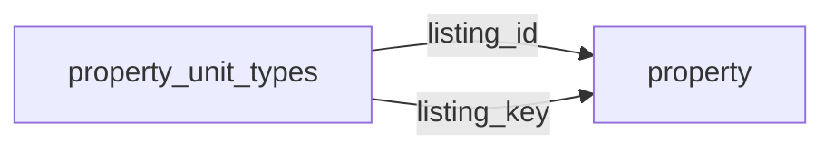

[index](../_index.md) | [lookups](../lookups.md) | [relationships](../relationships.md) | [USAGE.md](../../../USAGE.md)

# `property_unit_types` (PropertyUnitTypes)

> Unit type details for residential income and multifamily properties.

## At a glance

| | |
|---|---|
| **Primary key** | `unit_type_key` *(override; RESO uses `UnitTypeKey`)* |
| **Fields on dd.reso.org** | 17 |
| **Columns in canonical DBML** | 15 (omits 0 satellite drops + 1 `Resource`-typed + 1 `Collection`-typed) |
| **Foreign keys OUT / IN** | 2 / 0 |
| **Review markers** | 0 |
| **Source** | [https://dd.reso.org/DD2.0/PropertyUnitTypes/](https://dd.reso.org/DD2.0/PropertyUnitTypes/) |
| **Last revised upstream** | 5/24/2017 |

## Relationship diagram

## Fields

Columns in their original `dd.reso.org` page order. The `flags` column shows: `pk`, `fk -> target.col` (committed FK), `[REVIEW]` (Phase 2.5 satellite audit flagged for review), `[dropped]` (omitted from the canonical DBML; satellite of the named FK), `[Resource]` / `[Collection]` (no scalar column in DBML; FK companion - see Refs/inverse-1:N below).

| Field | DBML name | Type | Lookup | Description | Flags |
|---|---|---|---|---|---|
| `HistoryTransactional` | `history_transactional` | Collection |  | The history of the PropertyUnitTypes record. | `[Collection]` |
| `Listing` | `listing` | Resource |  | The listing associated with the PropertyUnitTypes record. | `[Resource]` |
| `ListingId` | `listing_id` | String |  | The foreign ID relating to the Property Resource; the well-known identifier for the listing. | `-> property.listing_key` |
| `ListingKey` | `listing_key` | String |  | The foreign key relating to the Property Resource; a unique identifier for this record from the immediate source; a string that can include a Uniform Resource Identifier (URI) or other forms. | `-> property.listing_key` |
| `ModificationTimestamp` | `modification_timestamp` | Timestamp |  | The date/time the PropertyUnitTypes record was last modified. |  |
| `UnitTypeActualRent` | `unit_type_actual_rent` | Number |  | The actual rent per month being collected for a given type of unit. |  |
| `UnitTypeBathsTotal` | `unit_type_baths_total` | Number |  | The total number of baths for a given type of unit. |  |
| `UnitTypeBedsTotal` | `unit_type_beds_total` | Number |  | The total number of bedrooms for a given type of unit. |  |
| `UnitTypeDescription` | `unit_type_description` | String |  | A textual description of a given type of unit. |  |
| `UnitTypeFurnished` | `unit_type_furnished` | enum | [`furnished`](../lookups.md#furnished) | The level of furnishing for a given type of unit (i.e., Furnished, Partial or Unfurnished). |  |
| `UnitTypeGarageAttachedYN` | `unit_type_garage_attached_yn` | Boolean |  | Answers whether or not the given type of unit has an attached garage. |  |
| `UnitTypeGarageSpaces` | `unit_type_garage_spaces` | Number |  | The number of garage spaces included with the given type of unit. |  |
| `UnitTypeKey` | `unit_type_key` | String |  | A unique identifier for this record. | `pk` |
| `UnitTypeProForma` | `unit_type_pro_forma` | Number |  | The pro forma rent or the expected rental income from the given type of unit. |  |
| `UnitTypeTotalRent` | `unit_type_total_rent` | Number |  | The total actual rent is the sum of all rent being collected for all units of the given type. |  |
| `UnitTypeType` | `unit_type_type` | enum | [`unit_type_type`](../lookups.md#unit_type_type) | A list of possible unit types (e.g., 1 Bedroom, 2 Bedroom, 3 Bedroom, Studio, Loft). |  |
| `UnitTypeUnitsTotal` | `unit_type_units_total` | Number |  | The total number of units of the given type. |  |

## Foreign keys OUT (this resource references)

- `property_unit_types.listing_id` -> `property.listing_key` (medium)
- `property_unit_types.listing_key` -> `property.listing_key` (medium)

## Foreign keys IN (other resources reference this)

*(none committed)*

## Inverse 1:N (collection-typed companions)

- `history_transactional` -> `history_transactional` (many `history_transactional` per `property_unit_types`)

## Phase 2.5 satellite audit

Recommendations from `raw/satellites.csv`. `drop_from_host` rows are not present in the canonical DBML; `review` rows are kept but flagged; `keep_both` rows are silently kept.

| Column | FK | Recommendation | Notes |
|---|---|---|---|
| `listing_id` | `listing_key` -> `property.?` | `keep_both` | no_child_match |

