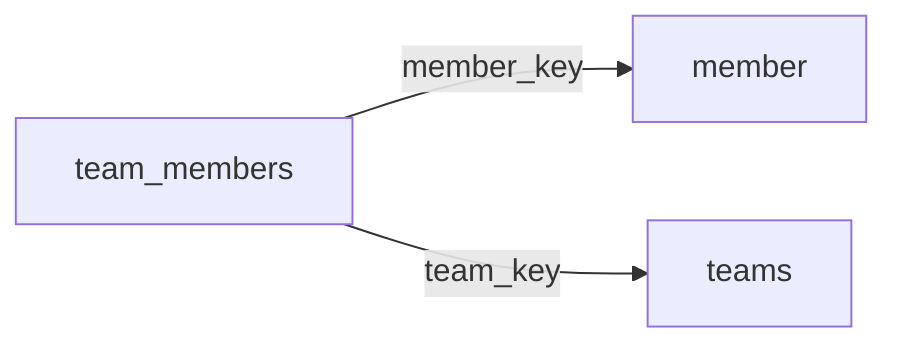

[index](../_index.md) | [lookups](../lookups.md) | [relationships](../relationships.md) | [USAGE.md](../../../USAGE.md)

# `team_members` (TeamMembers)

> Fields tying Member records to related Teams records.

## At a glance

| | |
|---|---|
| **Primary key** | `team_member_key` |
| **Fields on dd.reso.org** | 21 |
| **Columns in canonical DBML** | 15 (omits 2 satellite drops + 3 `Resource`-typed + 1 `Collection`-typed) |
| **Foreign keys OUT / IN** | 2 / 0 |
| **Review markers** | 0 |
| **Source** | [https://dd.reso.org/DD2.0/TeamMembers/](https://dd.reso.org/DD2.0/TeamMembers/) |
| **Last revised upstream** | 9/24/2015 |

## Relationship diagram

## Fields

Columns in their original `dd.reso.org` page order. The `flags` column shows: `pk`, `fk -> target.col` (committed FK), `[REVIEW]` (Phase 2.5 satellite audit flagged for review), `[dropped]` (omitted from the canonical DBML; satellite of the named FK), `[Resource]` / `[Collection]` (no scalar column in DBML; FK companion - see Refs/inverse-1:N below).

| Field | DBML name | Type | Lookup | Description | Flags |
|---|---|---|---|---|---|
| `HistoryTransactional` | `history_transactional` | Collection |  | The history of the TeamMembers record. | `[Collection]` |
| `Member` | `member` | Resource |  | The member belonging to the TeamMembers record. | `[Resource]` |
| `MemberKey` | `member_key` | String |  | A system unique identifier. | `-> member.member_key` |
| `MemberLoginId` | `member_login_id` | String |  | The ID used to log on to the MLS system. | `[dropped: satellite of member_key]` |
| `MemberMlsId` | `member_mls_id` | String |  | The local, well-known identifier for the member. | `[dropped: satellite of member_key]` |
| `ModificationTimestamp` | `modification_timestamp` | Timestamp |  | The date/time the roster (member or office) record was last modified. |  |
| `OriginalEntryTimestamp` | `original_entry_timestamp` | Timestamp |  | Date/time the roster (member or office) record was originally input into the source system. |  |
| `OriginatingSystem` | `originating_system` | Resource |  | The originating system of the TeamMembers record. | `[Resource]` |
| `OriginatingSystemID` | `originating_system_id` | String |  | The RESO Unique Organization Identifier (UOI) OrganizationUniqueId of the originating record provider. |  |
| `OriginatingSystemKey` | `originating_system_key` | String |  | The system key, a unique record identifier, from the originating system. |  |
| `OriginatingSystemName` | `originating_system_name` | String |  | The name of the originating record provider, most commonly the name of the MLS. |  |
| `SourceSystem` | `source_system` | Resource |  | The source system of the TeamMembers record. | `[Resource]` |
| `SourceSystemID` | `source_system_id` | String |  | The RESO Unique Organization Identifier (UOI) OrganizationUniqueId of the source record provider. |  |
| `SourceSystemKey` | `source_system_key` | String |  | The system key, a unique record identifier, from the source system. |  |
| `SourceSystemName` | `source_system_name` | String |  | The name of the team member record provider. |  |
| `TeamImpersonationLevel` | `team_impersonation_level` | enum | [`team_impersonation_level`](../lookups.md#team_impersonation_level) | The level of impersonation the member is allowed within the team (i.e., Impersonate (to work as the team), On Behalf (to show the team name but also show the member's info), None (don't allow this member to appear as part of team)). |  |
| `TeamKey` | `team_key` | String |  | A system unique identifier. | `-> teams.team_key` |
| `TeamMemberKey` | `team_member_key` | String |  | A system unique identifier. | `pk` |
| `TeamMemberNationalAssociationId` | `team_member_national_association_id` | String |  | The national association ID of the member (e.g., in the U.S., this is an M1 or NRDS number). |  |
| `TeamMemberStateLicense` | `team_member_state_license` | String |  | The license of the member. |  |
| `TeamMemberType` | `team_member_type` | enum | [`team_member_type`](../lookups.md#team_member_type) | The role of the member within the team (e.g., Team Lead, Showing Agent, Buyer Agent). |  |

## Foreign keys OUT (this resource references)

- `team_members.member_key` -> `member.member_key` (high)
- `team_members.team_key` -> `teams.team_key` (medium)

## Foreign keys IN (other resources reference this)

*(none committed)*

## Inverse 1:N (collection-typed companions)

- `history_transactional` -> `history_transactional` (many `history_transactional` per `team_members`)

## Phase 2.5 satellite audit

Recommendations from `raw/satellites.csv`. `drop_from_host` rows are not present in the canonical DBML; `review` rows are kept but flagged; `keep_both` rows are silently kept.

| Column | FK | Recommendation | Notes |
|---|---|---|---|
| `member_login_id` | `member_key` -> `member.member_login_id` | `drop_from_host` | id_suffix_threshold_0.7 |
| `member_mls_id` | `member_key` -> `member.member_mls_id` | `drop_from_host` | id_suffix_threshold_0.7 |
| `team_impersonation_level` | `team_key` -> `teams.?` | `keep_both` | no_child_match |
| `team_member_key` | `team_key` -> `teams.?` | `keep_both` | no_child_match |
| `team_member_state_license` | `team_key` -> `teams.?` | `keep_both` | no_child_match |
| `team_member_type` | `team_key` -> `teams.?` | `keep_both` | no_child_match |

